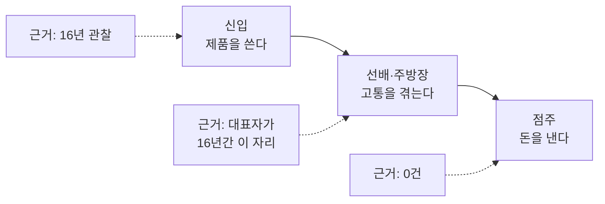

# 01. MVP 기획서 — 매장수첩

| | |
|---|---|
| 작성일 | **2026-09-03** |
| 상태 | **초안 (⚠️ 검토 필요)** — 확정 아님 |
| 기준 커밋 | `master` / **`282c0a9`** (2026-09-04) — 저장소 HEAD |
| 행 번호 기준 | 본문의 행 번호·문구 인용은 **`4a9192d`에서 뽑았다.** 그 뒤 코드를 건드린 커밋은 `282c0a9`(*문서가 찾아낸 코드 버그 3건 수정*) 하나이고, 바뀐 파일은 `src/lib/types.ts` · `src/components/NowPanel.tsx` · `RecipeSearch.tsx` · `RosterView.tsx` · `ShootBoard.tsx` · `src/lib/copyText.ts`(신규) · `data/seed.json` **7개뿐**이다(`git diff --stat 4a9192d HEAD`). 이 7개는 import가 한 줄씩 늘어 **행 번호가 몇 줄 밀려 있다.** 내용이 바뀐 서술은 §6.3.1·§12 #13에서 갱신했다. 나머지 파일은 `4a9192d`와 같다 |
| 대상 독자 | 심사위원 · 개발자 (같이 읽는 문서) |
| 제품명 | **매장수첩.** 코드상 표기는 다르다 (아래 §0.3) |

---

## 0. 이 문서를 읽는 방법

### 0.1 이 문서는 설계서가 아니라 역설계 기록이다

정상 순서라면 기획서가 코드보다 먼저다. 이 프로젝트는 **코드가 먼저 나왔다.**
따라서 이 문서는 "앞으로 이렇게 만들겠다"가 아니라 **"이미 만들어진 것이 무엇이고, 무엇이 아직 아닌가"**를 정리한 것이다.
이 사실을 숨기지 않는 것이 결정 사항이다. → 근거: `docs/08_DECISION_LOG.md` D-001

D-001 원문의 핵심: 코드의 지위는 **"가설 검증용 프로브"**이며 제품 확정이 아니다. 코드가 존재한다는 사실을 "문제가 검증되었다"는 증거로 쓰지 않는다.

**이 문서 단독으로는 화면도 DB도 재구성할 수 없다.** 필드 목록·화면 레이아웃·실행 명령이 여기에는 없다. 개발자는 아래 자매 문서를 함께 봐야 한다.

### 0.1.1 산출물 지도

| 문서 | 여기서 다루는 것 | 이 문서가 다루지 않는 것 |
|---|---|---|
| `docs/deliverables/02_화면설계서.md` | 화면별 상세 — 레이아웃·조작·상태 전이 | 이 문서에는 화면 목록(§6.5)만 있고 레이아웃이 없다 |
| `docs/deliverables/03_ERD.md` | 데이터 모델 — `types.ts` 타입 전수, 필드, DDL 초안 | 이 문서에는 타입명·필드명 목록이 없다 |
| `docs/deliverables/10-A_개인정보_데이터_전수조사.md` | 개인정보 항목 전수조사 | 이 문서 §11.1은 요약이다 |

⚠️ **자매 문서의 기준 커밋이 갈려 있다.** 행 번호를 대조할 때 주의할 것.

| 문서 | 기재된 기준 커밋 | 비고 |
|---|---|---|
| `02_화면설계서.md:7` | `282c0a9` | 이 문서와 같다. 행 번호는 `4a9192d`에서 뽑았다는 단서까지 헤더에 있다 |
| `03_ERD.md:8` | `282c0a9` | 이 문서와 같다 (2026-09-04 갱신) |
| `10-A_개인정보_데이터_전수조사.md:9` | ⚠️ `93307a4` | **갱신 안 됨.** 그 커밋에는 `mediaProbe.ts`·`api/media`·`public/media/`가 아직 없고 PrepTask도 10개다 |

`93307a4`로 적힌 문서는 **인용한 파일이 그 커밋에 실재하는지 확인이 필요하다.** → 01·02·03은 `282c0a9`로 통일했고, `10-A`는 이 작업 범위 밖이라 그대로 두었다. ❓ 확인 필요 (`10-A` 헤더도 함께 갱신할지)

### 0.2 상태 표기 규칙

이 프로젝트는 별도의 단계별 검증 프레임워크를 돌리고 있고, 그 표기를 그대로 쓴다.

| 표기 | 뜻 | 이 문서에서의 취급 |
|---|---|---|
| ✅ **CONFIRMED** | 독립적으로 확인됨. 코드·데이터·외부 근거로 재현 가능 | 사실로 서술한다 |
| 🔬 **PROVISIONAL** | 근거는 있으나 **한 사람의 관찰**이다. 독립 검증 없음 | "관찰"이라고 명시한다 |
| ❓ **OPEN** | 근거 0. 아직 답이 없다 | 빈칸임을 밝힌다 |
| ⛔ **BLOCKER** | 미해결이고, 이것 때문에 다음 단계로 못 간다 | §9에 모아둔다 |
| ⚠️ **SUPERSEDED** | 뒤집힌 결정 | 뒤집힌 이유까지 적는다 |
| ❓ **확인 필요** | 이 문서를 쓰는 시점에 사용자 답변이 없다 | 추측으로 채우지 않는다 |

**등급을 올려 적는 것을 금지한다.** 특히 §3의 Buyer 항목과 §8의 가설은 실측 데이터가 0건이다.

### 0.3 제품명은 아직 코드에 반영되지 않았다

| 위치 | 실제 값 | 근거 |
|---|---|---|
| 브라우저 title | `매장수첩` | `src/app/layout.tsx` |
| 패키지명 | `store-note` | `package.json` |
| "매장수첩" 표기 | 시연용 단일 파일과 그 README뿐 | `presentation/매장수첩.html`, `presentation/README.md` |

→ 명칭 확정은 미완. 발표 자료와 코드의 표기가 다르다. ❓ 확인 필요

---

## 1. 한 줄 정의

> **개인 카페·베이커리의 주방 기준(체크리스트·레시피·프렙)을 사람 머릿속에서 꺼내 태블릿 화면에 올려두고, 종이로는 불가능한 리드타임 계산을 대신하는 모바일 웹.**

기술 스택은 Next.js 15 / React 19 단일 앱이다. 런타임 의존성은 **3개뿐**이다(`next`, `react`, `react-dom` — `package.json` 실측). 외부 UI·차트 라이브러리, Supabase, AI SDK는 **설치되어 있지 않다.**

---

## 2. 해결하는 문제

### 2.1 문제 정의 문장이 현재 **두 개** 있다 — 이 문서에서 하나를 상위로 정한다

| | 문장 | 출처 | 범위 |
|---|---|---|---|
| **(A)** | **주방의 모든 기준이 사람 머릿속에 있다.** 신입 교육이 힘든 건 증상 하나일 뿐이다. 프렙 양은 김대리만 알고 발주 수량은 사장님만 알아서, 그 사람이 쉬면 주방이 흔들린다. 이직률이 높다는 게 이 문제를 치명적으로 만든다. | `CLAUDE.md` (프로젝트 최상위 정의) | 넓다 |
| **(B)** | **주방 신입**은 첫 출근 후 며칠 동안 **선배에게 그때그때 물어보는 방식**으로 일을 배우지만, 선배가 바쁠 때 물어보기 어렵고 순서·기준값을 반복해 잊는다. 그 결과 **선배는 자기 업무가 밀리고, 신입은 위생·안전 항목을 빠뜨린다.** | `docs/01_문제정의.md` (STEP 1 산출물, 🔬 PROVISIONAL) | 좁다 |

**이 기획서는 (A)를 상위 정의로 채택한다.** 이유는 코드가 (A)를 따라가고 있기 때문이다:

- 프렙 리스트(`src/app/prep/[slug]/page.tsx`), 레시피(`src/app/r/`), 주기 점검, 근무표(`src/app/roster/page.tsx`)는 **신입 교육 기능이 아니다.** "기준이 누구 머릿속에 있는가"를 다루는 화면이다.
- 매일 열리는 화면(프렙·레시피)은 신입이 없는 날에도 열린다.

(B)는 (A)의 **하위 증상 하나**로 재배치한다. STEP 1 산출물 문장을 폐기하는 것은 아니다.
→ ❓ 확인 필요: 사용자가 이 재배치에 동의하는지. 동의하면 `docs/01_문제정의.md`의 상태 표기를 갱신해야 한다.

### 2.2 문제의 근거 — 강도가 항목마다 다르다

| 근거 | 내용 | 상태 |
|---|---|---|
| 대표자 경력 | 호스피탈리티 **16년 이상**. 베이커리·브런치 카페·레스토랑에서 **셰프·주방장(헤드)** = 신입을 **가르치는 쪽**에 16년 | 🔬 PROVISIONAL (근거는 강하나 **한 사람의 관찰**) |
| 오픈 멤버 경험 | **5곳** — 백지에서 주방 기준을 세워본 것이 다섯 번 | 🔬 PROVISIONAL |
| 타겟 업종 일치 | 타겟(개인 카페·베이커리) = 대표자 실제 근무 업종 | ✅ CONFIRMED (D-006) |
| 실증 매장 | 즉시 실증 가능한 매장 **1~2곳** | 🔬 PROVISIONAL — 구두 확인 단계. 참여 확인서·계약 문서는 저장소에 없다 ❓ 확인 필요 |
| 매장 측정 데이터 | **0건** | ❓ OPEN |
| 독립 검증(타인 인터뷰·관찰) | **0건** | ❓ OPEN |

근거 출처: `docs/08_DECISION_LOG.md` D-006, `docs/00_PROJECT_CURRENT.md`

**중요한 정정 이력:** 이 프로젝트 문서들은 한때 근거를 "본인 경험 n=1"로 적고 "Gate 1은 앞으로도 CONFIRMED가 될 수 없다"고 선언했다. **그 전제가 사실과 달랐고, D-006에서 전부 정정됐다.** 다만 **등급은 올리지 않았다** — 16년이어도 여전히 한 사람의 관찰이고, 독립 검증은 0이다.

### 2.3 문제 정의에서 하면 안 되는 비약

> 대표자 경력이 16년이라는 사실은 **§3의 Buyer 항목(점주가 왜 돈을 내는가)을 조금도 풀지 않는다.**

이 경고는 `CLAUDE.md`, `docs/00_PROJECT_CURRENT.md`, `docs/00_아이디어_원문.md`, `docs/01_문제정의.md`, D-006, D-008 — **여섯 문서에 중복 기재**되어 있다. 이 기획서가 그 칸을 채운 것처럼 쓰면 프로젝트 문서 전체와 충돌한다.

---

## 3. 타겟 사용자와 구매 결정자 — 이 프로젝트의 핵심 비대칭

### 3.1 세 자리가 서로 다른 사람이다

| 구분 | 대상 | 결제 결정권 | 근거 강도 | 상태 |
|---|---|---|---|---|
| **Primary User** (쓰는 사람) | 주방 신입 (첫 출근 ~ 첫 2주) | **없음** | 대표자 16년 관찰 | 🔬 PROVISIONAL |
| **함께 고통받는 사람** | 신입을 가르치면서 자기 일도 해야 하는 선배·주방장 | 보통 없음 | **대표자가 16년간 이 자리에 있었다** | 🔬 PROVISIONAL (근거 가장 강함) |
| **Buyer** (돈 내는 사람) | 점주 또는 매니저 | **있음** | **없음** | ⛔ **OPEN — 근거 0** |

출처: `docs/01_문제정의.md` 1절, D-006

### 3.2 리스크: 근거가 가장 강한 자리와 돈이 나오는 자리가 다르다



- 대표자는 위 표의 **가운데 칸**에 16년 있었다. **오른쪽 칸에는 없었다.**
- D-006 원문: **"셰프·주방장은 예산 집행자가 아니다."**
- 즉 **문제 관찰은 강하고, 지불 의사 근거는 0이다.** 이 둘을 섞어 쓰면 안 된다.

### 3.3 유일한 간접 근거가 하나 있으나, 근거로 등재하지 않기로 결정했다

대표자는 인맥 요청으로 이직했고 **오픈 멤버로 5곳** 참여했다 = 점주들이 *주방 기준을 세워줄 사람*에게 이미 돈을 낸 이력이 있다.

**그런데 이것을 지불 의사 근거로 등재하지 않는다.** 이유(D-006 원문 취지):
1. 그 지불은 **인건비**였고, "기준 수립분"만 분리해 계산할 수 없다
2. **인건비 지불 의사 ≠ 소프트웨어 구독 지불 의사**

→ 발표 서사(왜 당신이 이걸 만드는가)로는 쓴다. **근거 표에는 넣지 않는다.**

### 3.4 코드는 이미 Buyer 쪽으로 이동했다 (근거 확보와 혼동하지 말 것)

`docs/01_문제정의.md`는 "현재 코드는 신입 화면에만 공을 들이고 있다"고 적었다. **지금은 사실이 아니다.**
2026-09-04 기준 점주·관리자가 여는 화면은 **아홉 개**다.

| 화면 | 경로 | 언제 생겼나 |
|---|---|---|
| 근무표 작성·발송 | `/roster` | 이전 |
| 촬영 진행 보드 | `/shoot` | 이전 |
| 레시피 직접 추가 | `/r/new` | 이전 |
| **출퇴근 · 근태** | `/attendance` | **2026-09-04** |
| **근로계약서** 🔒 | `/contracts` | **2026-09-04** |
| **매출** 🔒 | `/sales` | **2026-09-04** |
| **원가** 🔒 | `/cost` | **2026-09-04** |
| **발주** | `/order` | **2026-09-04** |
| **거래처·단가** 🔒 | `/vendors` | **2026-09-04** |

### 3.4-A ★ 2026-09-04 — 화면이 처음으로 **점주가 결정하는 숫자**를 보여준다

이전 세 화면(근무표·촬영·레시피 추가)은 **점주가 쓰지만 점주의 의사결정 숫자는 아니었다.**
근무표를 짜는 것은 관리 업무이고, 촬영 보드는 콘텐츠 작업이다.

새 여섯 화면은 다르다. **원가율 · 인건비율 · 객단가 · 오늘 남은 돈** — 점주가 실제로 보고
가격과 인원을 정하는 값이다. 그리고 그 값이 **새 데이터 입력 없이** 나온다:

```
근무표(계획) ─┐
              ├→ 출퇴근(실제) ─ 차이 = 근태 ─┐
근로계약서(시급)┘                            ├→ 인건비 ─┐
                                                        ├→ 매출 − 재료비 − 인건비
거래처(단가) → 레시피 재료 → 원가 → 재료비 ────────────┘   = 오늘 남은 돈
            └ 프렙의 발주 항목 → 발주 체크
```

**§9의 Blocker B4("점주가 왜 돈을 내는가")를 코드가 처음으로 정면에서 건드린 지점이다.**

### 3.4-B ⛔ 그런데 B4는 하나도 안 풀렸다 — 이 절이 §3에서 가장 중요하다

**위 3.4-A를 지불 의사 근거로 쓰면 안 된다.** 세 가지가 여전히 그대로다.

| | |
|---|---|
| **화면을 만든 것 ≠ 돈을 낸다는 근거** | §3.1 표의 Buyer 행은 여전히 **⛔ OPEN — 근거 0건**이다. 점주에게 이 화면을 보여주고 "월 얼마면 쓰시겠습니까"를 물어본 적이 **0회**다 |
| **더 나쁜 함정이 하나 생겼다** | 이제 화면이 그럴듯한 숫자를 보여주므로 **"점주가 좋아할 것이다"라는 확신이 근거 없이 커진다.** 이건 D-006이 경고한 것과 같은 종류의 혼동이다 — 관찰이 강해도 지불 의사는 별개다 |
| **매장 검증은 0이다** | `CLAUDE.md`가 계속 경고한 대로다: *"매 턴 기능이 늘어나는 중인데 아직 실제 매장에 넣어본 적이 없다."* 이번에 기능이 **7개** 늘었고 매장 투입은 **여전히 0곳**이다 |

**발표에서 말할 수 있는 것과 말하면 안 되는 것**

| 🚫 말하면 안 됨 | ✅ 말할 수 있음 |
|---|---|
| "점주가 원하는 기능입니다" | "점주가 결정할 때 보는 숫자를 화면에 올렸습니다" |
| "원가 관리 솔루션입니다" | "레시피에 단가를 붙이면 메뉴별 재료비가 나옵니다" |
| "인건비를 관리합니다" | "출퇴근 기록으로 인건비를 가늠해 봅니다" |

→ 발표 문구 대조표: `09_이용약관.md` 부록 B-2

**Buyer가 쓸 화면은 아홉 개가 됐다. Buyer 근거는 여전히 0이다.** 이 두 문장을 붙여서 읽어야 한다.

### 3.5 기기 전제

| 순위 | 기기 | 이유 | 상태 |
|---|---|---|---|
| 1 | **매장 공용 태블릿** | 매장에 이미 깔려 있다. 젖은 손·위생 규정 때문에 개인폰이 불리 | ✅ CONFIRMED (사용자 확인) |
| 2 | 개인 폰 (카톡 링크) | 보조 수단. 체크리스트 `/p/{slug}`가 이쪽 | ✅ CONFIRMED |
| — | 네이티브 앱 | **안 만든다** (§7) | ✅ CONFIRMED |

태블릿 전제가 코드에 반영된 지점: 교육 모드만 `h-dvh` 고정 3단 레이아웃 + 큰 글씨(`src/components/TrainingMode.tsx`), 체크박스를 의도적으로 크게(`h-7 w-7` / 프렙은 `h-8 w-8`, 주석: "장갑 낀 손도 누르기 쉽게"), 확대·축소를 막지 않음(`src/app/globals.css`), 주소창 없는 키오스크 대비 화면 내 뒤로가기(`src/components/BackButton.tsx`).

---

## 4. 핵심 가치와 경쟁 대체재

### 4.1 경쟁자는 소프트웨어가 아니다

> **경쟁자는 벽에 붙은 코팅 체크리스트다.** — `CLAUDE.md`, `README.md`

이 인식이 범위 판단의 기준이다. 코팅 종이는 **무료·즉시·오프라인·고장 없음**이다. 그래서 *체크리스트를 화면으로 준다*는 것 자체는 **새 가치가 0이다.** 새로 얹는 것은 딱 셋이다.

### 4.2 핵심 가치 3가지 — 근거와 구현 상태

| # | 가치 | 코팅 종이와의 차이 | 구현 상태 (실측) | 근거 파일 |
|---|---|---|---|---|
| **1** | **사진·영상** | 종이에는 시연이 안 들어간다. 주방 교육은 읽기가 아니라 **시연·모방**이다. 기준이 사람마다 다른 이유는 매뉴얼이 없어서가 아니라 **각자 머릿속 시연이 달라서**다 | ⚠️ **배관만 완성. 콘텐츠 사실상 0건** (§4.4) | `src/components/MediaSlot.tsx`, `src/lib/mediaProbe.ts` |
| **2** | **수정 비용 0** | 코팅지는 고치려면 다시 뽑아 붙여야 한다. 프렙 수량은 매일 바뀌므로 종이로는 애초에 불가능 | ⚠️ **부분.** 점주용 편집 화면 없음 → 내용 수정은 `data/seed.json` 직접 편집. 예외로 레시피만 `/r/new`로 추가 가능(브라우저 저장) | `src/lib/repo.ts`(읽기만), `src/components/RecipeForm.tsx` |
| **3** | **기록** | 종이는 누가 봤는지 모른다 | ⚠️ **로컬에서만 동작.** 배포 환경에서는 무동작 (⛔ B2) | `src/app/api/log/route.ts` |

### 4.3 코드에는 네 번째 가치가 있다 — **계산**

`CLAUDE.md`의 3가지 목록에는 없지만, `docs/day-flow.md`의 결론과 `src/lib/types.ts` 주석, `src/components/PrepView.tsx` 헤더 주석은 **"종이가 못 하는 계산"**을 제품의 존재 이유로 명시한다.

| 계산 | 무엇을 대신하는가 | 구현 |
|---|---|---|
| 리드타임 시각 계산 | "지금 걸면 → 내일 07:43부터 사용 가능 (16시간)" | `PrepView.tsx` `readyAt()` |
| 발주 도착일 계산 | "오늘 주문 → 9/9(수) 도착 (주말 배송 없음)" — **토·일을 배송일로 세지 않는다** | `PrepView.tsx` `arrivesIn()` |
| 배수 환산 | 식빵 1배합 6개 → 1.5배 = 9개, 재료 g까지 환산 | `src/lib/scale.ts` (프렙·레시피가 공유하므로 숫자가 갈리지 않는다) |

→ **기획서 판단: 핵심 가치는 3개가 아니라 4개로 쓰는 것이 코드와 맞는다.** 다만 `CLAUDE.md`의 공식 목록은 아직 3개다. ❓ 확인 필요 (확정하면 `CLAUDE.md`도 갱신)

### 4.4 가치 1(사진·영상)의 실제 상태 — 발표에 직접 걸린다

"영상이 본체, 글은 자막이다"가 이 제품의 핵심 주장인데, **그것을 화면으로 보여줄 수 없다.**

| 실측 항목 | 값 |
|---|---|
| 사진·영상이 붙을 수 있는 항목 수 | **91개** (포지션 스텝 26 + 레시피 스텝 32 + 프렙 **33** = 36 − 묶음 머리 3) (숫자 정본: [21_화면명세.md §1-b](21_화면명세.md)) |
| `public/media/`의 실제 파일 | **`촬영목록.md` 하나뿐** (2026-09-10 실측) |
| 한때 있던 PNG 두 개 | 각 70바이트 1×1 투명 픽셀이었고 **2026-09-04 `528a75b`(발표 전 보안 조치)에서 지웠다.** 즉 **사진·영상 콘텐츠는 0건이다** |
| 실사 촬영본 | **0건** |
| `/shoot` 진행률 | **1/57** (그 1개도 투명 픽셀) |

여기서 나오는 구체적 문제: `MediaSlot.tsx`는 좋은 예·나쁜 예가 둘 다 있으면 `aspect-[4/3]` 2열 그리드로 **늘려서** 그린다. 즉 1×1 투명 픽셀이 **초록 테두리 빈 박스 + 빨간 테두리 빈 박스**로 커져서 뜨고, "이렇게" / "이러면 안 됨" 캡션까지 붙는다. 파일이 아예 없으면 `hasAny()`가 막아 아무것도 안 그리는데, **지금 상태가 그보다 나쁘게 보인다.**

→ **시연 전 조치: 이 두 파일을 지운다.** 단 **추적 파일이므로 삭제 후 커밋이 필요하고, 히스토리에는 남는다** — 저장소를 열어보는 심사위원에게는 보인다. 또는 우선 4개(§6.2)를 실사로 채운다. 배관은 완성돼 있어 파일만 넣으면 붙는다.

### 4.5 죽은 필드 — 문서가 안내하는 방식이 코드와 다르다

`src/lib/types.ts`의 `goodImage` / `badImage` / `videoUrl` **세 필드를 읽는 컴포넌트가 하나도 없다.** (grep 결과 등장하는 곳은 타입 정의와 `RecipeForm.tsx`가 `null`로 채워 넣는 곳뿐)

실제 동작은 **파일명 규약**이다: `MediaSlot base={id}` → `GET /api/media`로 `public/media/` 목록을 받아 `{id}-good.jpg` / `{id}-bad.jpg` / `{id}.mp4`를 찾는다.

이 때문에 생긴 세 가지 사실:

| 사실 | 근거 |
|---|---|
| `data/seed.json`의 `goodImage` 3건(`t-open-1`, `t-open-3`, `t-close-5` → `/photos/*.svg`)은 **화면에 절대 나오지 않는다** | seed 실측 + grep |
| `public/photos/`의 SVG 8개는 **전부 미사용** (버거집 시절 회색 플레이스홀더 잔재) | `ls public/photos/` + grep |
| 루트 `README.md`의 "유튜브 일부공개 링크를 `videoUrl`에 붙이면 된다"는 **현재 코드에서 동작하지 않는다.** `MediaSlot`은 `<video src>`로 로컬 파일만 재생한다 | `MediaSlot.tsx` |

→ 정리 필요: 죽은 필드를 지울지, 파일명 규약 쪽을 버리고 필드를 살릴지 결정해야 한다. ❓ 확인 필요 (필드 수준 서술은 `docs/deliverables/03_ERD.md`에 반영됨)

### 4.6 대체재 비교표

| 항목 | 벽에 붙인 코팅 체크리스트 | 매장수첩 (현재 구현 기준) |
|---|---|---|
| 비용 | 무료 | ❓ 미정 (⛔ B4) |
| 준비 시간 | 인쇄·코팅 | 시드 JSON 작성 (사람이 직접) |
| 시연·기준 이미지 | 불가 | 가능 — **단 콘텐츠 0건** |
| 내용 수정 | 다시 뽑아 붙임 | 레시피만 화면에서 추가 / 나머지는 JSON 편집 |
| 매일 바뀌는 수량 | **불가능** | 배수 계산 |
| 리드타임 계산 | **불가능** | **가능 (동작 확인)** |
| 되돌릴 수 없는 항목 구분 | 불가 (전부 같은 글씨) | `recoverable` 한 칸으로 경고 분리 |
| 누가 봤는지 기록 | 불가 | 로컬에서만 가능 (⛔ B2) |
| 정전·기기 고장 | 영향 없음 | **영향 있음** |
| 교대 인계 | 종이는 한 장이라 공유됨 | ⚠️ **기기별 저장이라 인계 안 됨** (§6.5) |

마지막 두 줄은 종이가 우리보다 나은 지점이다. 숨기지 않는다.

---

## 5. 리드타임 3축과 recoverable — 이 제품이 종이를 이기는 지점

### 5.1 리드타임의 정의

> **오늘 착수해야 나중에 쓸 수 있게 되는 것. 빠뜨려도 오늘은 아무 일도 안 일어난다.**
> — `docs/day-flow.md`

**오늘은 아무 일도 안 일어나고 내일 아침에 터진다.** 그래서 신입이 스스로 알 방법이 없고, 어제 뭘 걸어놨는지 기억에 의존하므로 종이로는 못 잡는다.

### 5.2 3축

| 축 | 코드값 (`LeadTimeKind`) | 시간 단위 | 놓치면 | seed 실측 |
|---|---|---|---|---|
| **A. 시간이 흘러야 완성** | `"time"` | 시간 ~ 하루 | 내일 아침 터짐 | **4건** |
| **B. 외부에서 들어와야 함(발주)** | `"order"` | 1~4일 | 며칠 뒤 터짐 | **2건** |
| **C. 주기적으로 갈아줘야 함** | `"cycle"` | 주 ~ 개월 | 서서히 나빠지다 고장 | **13건** |

근거: `src/lib/types.ts` `LeadTimeKind`, `data/seed.json` 집계 (총 30개 프렙 항목) (숫자 정본: [21_화면명세.md §1-b](21_화면명세.md))

`docs/day-flow.md` 기준으로 B축·C축은 v1 목록에서 **통째로 빠져 있었다.** 3축으로 재작성한 것이 데이터 모델 v2다.

⚠️ **다만 `PrepTask.kind`를 읽는 화면은 하나도 없다.** `src/` 전체 grep에서 `kind`의 출현은 `types.ts`의 정의뿐이고, `NowPanel.tsx:20`의 `f.kind`는 `PrepTask`가 아니라 `ShiftFocus`다. **화면의 실제 구분은 `recoverable`(경고 세기)과 `leadTimeHours`/`leadTimeDays`의 유무(리드타임 문장 종류)로 이뤄진다** — A축은 `leadTimeHours`가 채워진 항목, B축은 `leadTimeDays`가 채워진 항목, C축은 둘 다 `null`인 항목으로 화면에서 갈린다(`PrepView.tsx:352`, `:368`).

→ **3축 개념은 유효하다.** seed 19건에 `kind`가 빠짐없이 채워져 있고, 제품 논리(무엇을 왜 미리 걸어두는가)의 뼈대다. **다만 "화면이 3축으로 갈라진다"고 말하면 사실과 다르다.** 필드 수준 서술과 `kind`/`trigger_type` 중복 문제는 `docs/deliverables/03_ERD.md` 3-8절·11절.

### 5.3 recoverable — 3축보다 이 한 칸이 상위 판단이다

`src/lib/types.ts` 원문 주석:

> **★ 이 프로젝트에서 가장 중요한 한 칸.**
> `true` — 깜빡해도 쿠팡 등으로 메울 수 있다. 손해는 돈이다.
> `false` — 어떤 방법으로도 못 되돌린다. 시간을 되돌려야 하니까.
> `false`인 항목만이 이 제품이 종이를 확실히 이기는 지점이다.
> **전부 빨간 불로 띄우면 사람은 무시한다.** 이 칸으로 경고 세기를 나눈다.

논리 사슬:

1. 경쟁자는 무료·즉시·오프라인인 코팅 종이다 → 확실히 이기는 지점이 하나는 있어야 한다
2. 종이가 못 하는 것은 **계산**이다
3. 그런데 전부 경고하면 사람은 전부 무시한다 → **경고를 나눌 기준**이 필요하다
4. 그 기준은 "얼마나 아픈가"가 아니라 **"돈으로 되돌릴 수 있나"**다
5. 그래서 `recoverable: false` 항목만 빨간 불이고, **그 항목들이 제품의 존재 이유 전부다**

**중요한 정정 이력:** 원래 문서는 "금요일에 발주를 놓치면 복구 불가"로 적었으나 **틀렸다.** 쿠팡 주 7일 배송 확인(사용자, 2026-08-30)으로 B축 대부분은 돈으로 메울 수 있음이 확인됐다. 그래서 **발주 알림은 "사고 방지"가 아니라 "비용 절감" 기능**이고, 점주에게 파는 논리가 달라진다. ← 이것도 B4에 걸리는 지점이다.

### 5.4 축과 recoverable은 1:1이 아니다 — 단순화하면 코드와 어긋난다

`data/seed.json` 실측(2026-09-10). `recoverable: false`는 **30개 중 8개**다. (숫자 정본: [21_화면명세.md §1-b](21_화면명세.md))

| id | 항목 | 축 | recoverable | quantityVaries | 리드타임 | 트리거 |
|---|---|---|---|---|---|---|
| `p-1` | 내일용 콜드브루 걸기 | A(time) | **false** | **true** | 16시간 | 매일 14:00 |
| `p-2` | 내일용 반죽 제조 후 냉장 | A(time) | **false** | **true** | 15시간 | 매일 14:00 |
| `p-3` | 르방 갱신 | A(time) | **false** | false | 24시간 | 매일 14:00 |
| `p-6` | **원두 발주** | **B(order)** | **false** | **true** | 4일 | 조건: 재고 3일치 이하 |
| `c-9` | 후드·덕트 청소 | **C(cycle)** | **false** | false | — | 90일마다 |
| (나머지 14개) | 시럽 제조(`p-4`), 우유·식자재 발주(`p-5`), 정수 필터, 보건증 등 | A/B/C 혼재 | true | `p-4`·`p-5`만 true | — | — |

**`p-6`이 반례다.** B축(발주)인데 `recoverable: false`다 — 거래 로스터리 원두는 쿠팡으로 대체 불가라는 판단이다.
→ **경고의 기준은 축이 아니라 `recoverable` 한 칸이다.** "A축=위험, B축=안전"으로 단순화하면 코드와 어긋난다.

**`quantityVaries` 는 `afternoon` 목록에 몰려 있다.** `cycle` 목록은 전부 false다. 정확한 개수는 시드가 자주 바뀌므로 여기 안 적는다 — (숫자 정본: [21_화면명세.md §1-b](21_화면명세.md))
`src/lib/types.ts:141` 주석이 이 칸의 용도를 직접 적는다: **"매일 수량이 달라지는 항목인지 — 종이로 못 하는 이유"**.
§4.6 비교표의 "매일 바뀌는 수량" 행과 §7.1의 "수량이 매일 바뀌어 종이로 못 한다"가 걸려 있는 칸이 이것이다. → **주장의 근거는 30개 전체가 아니라 오후 프렙 9건 + 마감 준비 1건이다.** 발표에서 범위를 넓혀 말하면 코드와 어긋난다.

### 5.5 코드가 이 판단을 그대로 구현한다 (동작 확인됨)

| 구현 | 파일 |
|---|---|
| `irreversibleTasks()` — `!recoverable`만 필터 | `src/lib/repo.ts:82` |
| 홈 프렙 카드에 "까먹지 말 것 N개" 빨간 글씨 | `src/app/page.tsx` |
| 프렙 상단 "까먹지 말고 해야 할 것 N개" 요약 + "오늘 안 하면 내일 아침에 되돌릴 방법이 없습니다" | `src/components/PrepView.tsx` |
| 항목 테두리를 `recoverable`로 분기 (빨강 / 회색) | `PrepView.tsx` |
| "안 하면 —" 문장도 색을 분기 | `PrepView.tsx` |
| `readyAt()` — "지금 걸면 → 내일 07:43부터 사용 가능". `daysApart()`로 월말(8/31→9/1) 처리 | `PrepView.tsx:63` |
| `arrivesIn()` — 발주 도착일에서 **토·일을 배송일로 세지 않고** "(주말 배송 없음)" 표기 | `PrepView.tsx:87` |
| `Trigger` 4분기 — `daily` / `weekday` / `condition` / `cycle`. 4종 모두 seed에서 실제 사용 | `src/lib/types.ts`, seed 실측 (daily 3 / weekday 1 / condition 2 / cycle 13) |
| **"수량 매일 다름" amber 배지** — `quantityVaries`가 true인 항목에만 | `PrepView.tsx:329` (해당 5건, §5.4) |
| **`recipeSlug`로 레시피를 끌어와 프렙 항목 안에서 배수 환산** — "오늘 몇 배?" 5버튼 + 1배합 수량 환산 + 재료별 g 환산 + `/r/{slug}` 링크 | `PrepView.tsx:270`(조회), `402~465`(렌더). **2026-09-10 기준 30개 중 8개** — 콜드브루·반죽·르방·청·냉침차·밀크티·시럽·크림폼 |

`arrivesIn()`의 주말 처리 이유가 코드 주석에 있다: 그걸 안 하면 "9/6(일) 도착"처럼 실제로 오지 않는 날짜를 알려주게 되고, **그러면 금요일 발주의 무게가 화면에서 사라진다.**

### 5.6 그러나 C축(주기)은 아직 "주기 관리"가 아니다 — ⚠️ 알려진 결함

`trigger`에 `everyDays`(7~365)가 있고 화면에 "4개월마다" 라벨까지 뜬다. 그런데 **마지막 수행일을 어디에도 저장하지 않는다.**

```
// src/components/PrepView.tsx:133
const storageKey = `prep:${list.slug}:${todayKey()}`;
```

키에 **날짜가 박혀 있어서, 120일 주기 정수 필터 체크가 매일 0으로 리셋된다.** 어제 했는지, 4개월 전에 했는지 화면이 알 방법이 없다.

→ **발표에서 주기 점검 13개를 "관리된다"고 말하면 사실과 다르다.** 항목을 보여주는 것은 되지만, 주기 추적을 시사해서는 안 된다.
→ 수정 방향: 주기 항목은 날짜 키가 아니라 `lastDoneAt`을 저장해야 한다. 현재 미구현.

### 5.7 부수 결함: "지금 걸면" 시각이 갱신되지 않는다

`PrepView`는 마운트 시 `setNow(new Date())`를 한 번만 하고 **갱신 타이머가 없다.** (60초 타이머는 `src/components/NowPanel.tsx:36`에만 있다) 화면을 열어둔 채 두면 값이 굳는다. 시연 중 창을 켜놓고 설명하다 넘어가면 시각이 과거로 남는다.

---

## 6. 기능 범위 (Scope) — MUST / SHOULD / LATER

등급의 출처는 `docs/08_DECISION_LOG.md` **D-008**이다. D-008은 "9/18 마감이 모든 우선순위를 정한다"는 결정이고 ✅ CONFIRMED다. 아래 표에 **실측 구현 상태**를 붙였다.

### 6.1 MUST — 발표 전 반드시

| # | 항목 | 등급 근거 | 구현 상태 (2026-09-03 실측) | 근거 |
|---|---|---|---|---|
| M1 | 데이터 모델 정리 + 시드를 카페·베이커리로 교체 | 화면에 그릴·튀김이 뜨면 서사가 깨진다 | ✅ **완료** — `types.ts` v2(2026-08-31), seed는 `○○ 베이커리 카페` / 오픈조·마감조·제빵 / 아메리카노·라떼·콜드브루·식빵 | `src/lib/types.ts`, `data/seed.json` |
| M2 | **프렙 리스트 화면 (리드타임 D-day 경고)** | **시연의 핵심 장면** | ✅ **동작** — `/prep/afternoon`, `/prep/cycle`. 단 §5.6 주기 리셋 결함 있음 | `src/components/PrepView.tsx` |
| M3 | 레시피 화면 + 배수 계산 | 종이로 안 되는 것이 눈에 보이는 장면 | ✅ **동작** — `/r`(검색), `/r/{slug}`(상세·배수 0.5~3배) | `src/components/RecipeSearch.tsx`, `RecipeDetail.tsx`, `src/lib/scale.ts` |
| M4 | 시연용 제한 배포 (noindex + robots.txt) | 심사위원이 QR·링크로 열어봐야 한다 | ⛔ **미착수** — §6.6 | D-007 |

### 6.1-A ⚠️ 계획 밖에서 들어온 기능 — 운영 기능 7종 (2026-09-04)

**정직하게 적어둔다: 이 7개는 D-008의 MUST/SHOULD/LATER 어디에도 없었다.**
작업 중 사용자 요청으로 들어왔고, 그래서 §6의 등급 체계 밖에 있다.

| 기능 | 화면 | 구현 상태 | 새로 만든 데이터 |
|---|---|---|---|
| 출퇴근·근태 | `/attendance` | ✅ 동작 | 출퇴근 시각·휴게 (근무표에 붙는다) |
| 근로계약서 | `/contracts` 🔒 | ✅ 동작 | 계약 조건 (직원에 붙는다) |
| 매출 | `/sales` 🔒 | ✅ 동작 | 일 매출·건수·재료비 3칸 |
| 원가 | `/cost` 🔒 | ✅ 동작 | **없음** — 레시피 × 거래처 단가의 계산 결과 |
| 발주 | `/order` | ✅ 동작 | 주문함/들어옴 2칸 (프렙의 발주 항목에 붙는다) |
| 거래처 | `/vendors` 🔒 | ✅ 동작 | 거래처·품목 단가 |
| 사장님 잠금 | 전 화면 | ⚠️ **가리개다. 접근 통제가 아니다** | 잠금번호 요약값 |

**왜 이걸 §6 등급 밖에 두는가** — 등급을 사후에 붙이면 "계획대로 했다"로 읽힌다.
계획 밖 요청이었고, **그 판단이 맞았는지는 아직 모른다.** 다만 §3.4-A가 말한 대로
B4를 건드리는 방향이라는 점은 사실이다.

**이 7개를 평가할 기준 (D-008의 정신을 그대로 적용)**

| 질문 | 답 |
|---|---|
| 9/18 시연에 쓸 장면이 늘었나 | ✅ 늘었다. **"매출 − 재료비 − 인건비 = 오늘 남은 돈"** 한 장면이 가장 강하다 |
| **"매일 열리는 이유"가 늘었나** (`CLAUDE.md`의 경계 기준) | 🟠 **부분.** 아래 표 |
| 콘텐츠 만드는 부담이 늘었나 | ⚠️ **늘었다.** 거래처 단가를 채우지 않으면 원가 화면이 빈칸이다 |
| 검증 부담이 늘었나 | ⚠️ **늘었다.** 매장 투입 시 확인할 것이 7개 늘었는데 투입은 0곳이다 |

**"매일 열리는 이유"를 늘렸는가 — 화면별로 갈린다**

| 화면 | 여는 빈도 | 판정 |
|---|---|---|
| **출퇴근** | **하루 2번 이상** (출근·퇴근) | ✅ **프렙보다 강한 훅일 수 있다.** 안 찍으면 인건비가 안 나와서 사장님도 챙기게 된다 |
| **발주** | 매일 아침 1번 | ✅ 강하다. 특히 "주문했는데 안 들어온 것" |
| **매출** | 매일 마감 1번 | ✅ 강하다 |
| 원가 | 가격 정할 때 | 🟠 가끔 |
| 거래처 | 처음 한 번 + 단가 바뀔 때 | 🔴 드물다 (그런데 이걸 안 채우면 원가가 안 나온다) |
| 근로계약서 | 입사·만료 때 | 🔴 드물다 |

→ **7개 중 3개가 매일 열린다.** 그중 출퇴근은 **직원이** 여는 화면이라
   §3.1의 Primary User 쪽 훅도 된다.

⚠️ **단가·시급 입력이 새 병목이다.** 이건 `CLAUDE.md`가 콘텐츠에 대해 경고한 것과
같은 구조다 — *"전 메뉴 다 넣으려다 콘텐츠 만들다 죽는다."*
거래처 화면이 "레시피에는 있는데 단가가 없는 재료"를 먼저 띄우는 이유가 그것이다.

---

### 6.2 SHOULD — 하면 발표가 강해지는 것

| # | 항목 | 구현 상태 | 근거 |
|---|---|---|---|
| S1 | 실증 매장 투입 + 현장 사진·영상 확보 | ⛔ **미착수.** 실사 촬영본 0건 (§4.4) | `public/media/` |
| S2 | 촬영 모드 | ⚠️ **다르게 구현됨.** `/shoot`은 "무엇을 찍어야 하는가"를 보여주고 **파일명을 클립보드로 복사**해주는 보드다. `CLAUDE.md`가 적어둔 `<input type="file" accept="video/*" capture>` 방식은 **코드 전체에 0건**(grep: `type="file"`, `capture`, `getUserMedia` 모두 미검출). 파일은 사람이 `public/media/`에 직접 넣어야 한다 | `src/components/ShootBoard.tsx` |

`/shoot`의 우선 4개는 `src/app/shoot/page.tsx:14`에 하드코딩되어 있고, **4개 모두 seed에 실존함을 확인**했다.

| id | 항목 |
|---|---|
| `t-open-5` | 추출 테스트 합격 기준 |
| `s-lt-2` | 스팀 밀크 온도·거품 |
| `t-bake-1` | 르방·발효 완료 판단 |
| `p-1` | 콜드브루 거는 장면 |

`public/media/촬영목록.md`가 "이 4개만 있어도 발표는 됩니다"라고 적어둔 그것이다. **배관은 완성돼 있으니 파일만 넣으면 붙는다.**

### 6.3 LATER — 발표 후

| 항목 | D-008 등급 | 실제 구현 상태 |
|---|---|---|
| 점주용 편집 화면 | LATER (D-002·D-005로 금지) | ⚠️ **레시피만 부분 구현** — `/r/new` 폼이 있다 (브라우저 저장) |
| AI 초안 | LATER (금지) | ⛔ 없음. `.env.example`에 주석으로만 예정 기재 |
| **PIN 잠금** | D-008은 LATER → ⚠️ **이 문서가 "배포 전 필수"로 올린다** (§6.6·§10.3) | 🟠 **부분 구현 (2026-09-04). 등급이 아니라 성격이 바뀐 항목이다.** `src/lib/ownerGate.ts` + `OwnerGate.tsx`가 생겼고 **매출·원가·거래처·계약서·출퇴근(인건비)** 다섯 곳이 잠긴다. **그러나 ⓐ 접근 통제가 아니라 가리개다** — PIN 검사가 브라우저 안에서 돌고 데이터는 localStorage에 그대로 있다(주석이 스스로 그렇게 적어놨다). **ⓑ 이 항목의 원래 대상인 `/r` 계열과 `/roster`는 안 잠겼다.** 즉 "레시피=매장 PIN" 약속(`src/app/r/page.tsx:38-40`)은 **아직 안 지켜졌다.** → §10.3 #11, `06` V-19·V-20 |
| Supabase (서버 DB) | LATER | ⛔ **미설치.** 의존성 3개뿐 |
| 근무 스케줄 자동 전환 | LATER | ⚠️ **이미 구현됨** — `NowPanel`이 현재 시각으로 근무조를 찾아 그 조의 화면 링크를 홈 최상단에 띄운다(60초 갱신). 상세는 §6.3.1 |

**PIN 등급을 올린 이유.** D-008 목록에서는 LATER지만, ⓐ `/r` 화면이 이미 사용자에게 "배포 전에 붙입니다"라고 **약속**했고 ⓑ 링크만 알면 레시피(영업비밀)와 `/roster`(개인정보 5종 — §11.1)가 열리며 ⓒ 자매 문서 두 곳이 이미 배포 전 항목으로 분류하고 있다(`02_화면설계서.md` 11절 #11, `03_ERD.md` 10-5절 #1). **셋이 같은 등급을 가리키므로 이 문서가 LATER를 유지하면 문서끼리 어긋난다.** 그래서 §6.6 D-007 조건 표와 §10.3 합본에 PIN을 넣었다. 단 **배포를 하지 않으면 이 항목도 발동하지 않는다** — D-007이 선행이다.

> **⚠️ 2026-09-07 갱신 — 위 문단은 "PIN이 아예 없다"를 전제로 쓰였고, 그 전제는 2026-09-04에 깨졌다.**
> 등급 논쟁(LATER냐 배포 전 필수냐)은 **끝났다.** 잠금은 만들어졌으므로 남은 질문은 두 개다.
> **ⓐ 이걸 뭐라고 부를 것인가** — 접근 통제가 아니라 가리개다. 심사·약관·처리방침에서 "보안"이라 쓰면 거짓이 된다.
> **ⓑ 원래 대상이 아직 안 잠겼다** — `/r` 계열(영업비밀)과 `/roster`(개인정보 5종). `/roster` 잠금 여부는 `06` V-20에서 미결이다.
> → `00_진행표.md` 정합성 #1은 이 갱신으로 해소한다.

#### 6.3.1 `ShiftFocus` 4분기 — 어느 조가 어느 화면으로 가는가

`src/lib/types.ts:169~176`의 유니온이다. 조마다 `focus: ShiftFocus[]`를 배열로 갖는다.

| `kind` | 이동 경로 | 근거 |
|---|---|---|
| `training` | **`/t/{slug}` — 교육 모드** (한 장씩, 진도 안 남김) | `NowPanel.tsx:20~30` `focusHref()` |
| `checklist` | **`/p/{slug}` — 체크리스트** (매일 쓰는 것, 그날 날짜로 저장) | 〃 |
| `prep` | `/prep/{slug}` | 〃 |
| `recipes` | `/r` (slug 없음) | 〃 |

seed 실측 — 4개 조가 네 분기를 모두 쓴다.

| 조 | 시간 | focus |
|---|---|---|
| 제빵 | 05:00~13:00 | `training`(bakery-morning) + `recipes` |
| 오픈조 | 07:30~15:30 | `checklist`(cafe-open) + `prep`(afternoon) |
| 미들 | 11:00~19:00 | `recipes` |
| 마감조 | 14:30~22:30 | `prep`(afternoon) + `checklist`(cafe-close) |

문서에 빠져 있던 두 분기도 적어둔다.

- **동시 근무조는 카드를 여러 장 그린다.** `active`를 `map`으로 전부 렌더하고 첫 장만 주황색, 나머지는 "같은 시간대"로 표시한다(`NowPanel.tsx:80~`). **오픈조(07:30~15:30)와 미들(11:00~19:00)이 실제로 겹친다** — 11:00~15:30에는 카드가 2장이다. 겹칠 때의 정렬은 **시작 시각 내림차순**이라 방금 출근한 조가 위에 온다(`282c0a9`에서 추가).
- **근무 시간이 아니면** `active.length === 0` 분기로 "지금 HH:MM · 근무 시간이 아닙니다 / 다음은 OO조 · HH:MM"을 띄운다(`NowPanel.tsx:57~78`). 시연 시각이 근무 시간 밖이면 이 화면이 나온다.

✅ **해결됨 (`282c0a9`).** 이전 초안은 "`position` 분기가 숙련자인 오픈조·마감조까지 교육 모드(`/t/`)로 보낸다"를 ❓ 확인 필요로 남겨두었다. 그 지적대로 `kind`가 `training`/`checklist` 둘로 갈렸고, seed의 오픈조·마감조는 `checklist`(→`/p/`)로, 제빵은 `training`(→`/t/`)으로 바뀌었다. **라벨(`오픈 체크리스트`)과 목적지가 이제 일치한다.** (§12 #13)

### 6.4 ⚠️ 범위 이탈 — D-008 목록에 없는데 구현된 것

문서만 읽으면 틀리게 되는 지점이다. 숨기지 않는다.

| 기능 | 문서상 등급 | 실제 |
|---|---|---|
| **근무표 작성·발송** `/roster` | **목록에 없음** | 구현됨. 직원 이름·이메일·전화 저장, 주 단위 표, `mailto:` bcc로 명단+근무표 발송 (앱이 대신 보내지는 않는다 — 메일 앱을 열어준다) |
| **근무 스케줄 → 화면 자동 선택** `NowPanel` | LATER | 구현됨 |
| **촬영 진행 보드** `/shoot` | SHOULD("촬영 모드") | 다른 방식으로 구현됨 (§6.2) |
| **레시피 추가 폼** `/r/new` | 편집 화면은 금지(D-002) | 구현됨. D-002가 금지한 "점주용 편집 화면"과의 경계가 문서에 정리되어 있지 않다 ❓ 확인 필요 |

또한 `CLAUDE.md`의 화면 표에는 `/prep/[slug]`, `/r`, `/r/new`, `/r/my`, `/shoot`, `/roster`, `/api/media`가 **빠져 있다.** 실제로는 전부 동작한다.

### 6.5 구현 인벤토리 — 전체 엔드포인트 (실측: 전부 HTTP 200)

| 경로 | 화면 | 저장 | 상태 |
|---|---|---|---|
| `/` | 오늘 (홈) — NowPanel + 프렙 + 근무표 + 포지션 + 촬영 + 레시피 | — | 동작 |
| `/t/[slug]` | 교육 모드 (태블릿, 한 장씩, critical 게이트) | **sessionStorage** `sop:run:{slug}` | 동작 |
| `/p/[slug]` | 체크리스트 (개인 폰, 스크롤) | localStorage `sop:{slug}:{날짜}` | 동작 |
| `/prep/[slug]` | 프렙 리스트 (리드타임·recoverable). **배수 환산은 `recipeSlug`가 있는 2건에만** (`p-1`·`p-2` — §5.5) | localStorage `prep:{slug}:{날짜}` | 동작 (§5.6 결함) |
| `/r` | 레시피 찾기 (이름·분류 검색) | **읽기** localStorage `sop:recipes` — 시드 레시피와 합쳐서 보여준다 (`RecipeSearch.tsx:22,25`) | 동작 |
| `/r/[slug]` | 레시피 상세 + 배수 | 배수는 메모리만 | 동작 |
| `/r/new` | 레시피 추가 폼 | **쓰기** localStorage `sop:recipes` | 동작 |
| `/r/my?id=` | 직접 추가한 레시피 + **"이 레시피 삭제"** | **파괴적 쓰기** — `sop:recipes`를 덮어쓴다 | 동작 |
| `/shoot` | 촬영 진행 보드 (91개 항목, **그 자리에서 촬영·교체·삭제**) + **찍을 목록 만들기(AI)** | — | 동작 |
| `/roster` | 근무표 (직원 CRUD, 주 단위, mailto bcc) | localStorage `sop:roster` | 동작 |
| `POST /api/log` | 이벤트 기록 → `data/events.jsonl` | 서버 파일 | 동작 (로컬만) |
| `GET /api/media` | `public/media/` 파일 목록 | — | 동작 |
| `/app.html` | 서버 없이 도는 단일 파일 시연본 (§6.5.2) | 자체 키 | 동작. ⛔ **noindex 없음 — §6.6** |

#### 6.5.1 클라이언트 쓰기 경로는 3종이다

서버 쓰기 경로는 `/api/log` 하나뿐이지만(§6.7), 브라우저 안에는 셋이 있다.

| 쓰기 | 경로 | 되돌리기 |
|---|---|---|
| 레시피 추가 | `/r/new` → `addLocalRecipe` (`src/lib/localRecipes.ts:37`) | — |
| **레시피 삭제** | `/r/my?id=` → `window.confirm` 1회 후 `removeLocalRecipe` (`LocalRecipeView.tsx:48~54`, `localRecipes.ts:42`) | ⛔ **없다.** 휴지통·되돌리기·내보내기 강제가 전부 없고, **그 레시피의 유일한 사본이 브라우저 저장소다.** 필터 후 즉시 `saveLocalRecipes`로 덮어쓴다 |
| 백업용 복사 | `/r`의 "백업용으로 복사하기" (클립보드 수동) | 사용자가 붙여넣기를 해야만 남는다 |

→ 확인창 한 번이 유일한 방어다. §12 #6(D-002 편집 화면 경계)은 **추가만이 아니라 삭제까지 포함해서** 판단해야 한다.

#### 6.5.2 단일 파일 시연본은 **세 파일 · 두 형태**다

| 파일 | 크기 | md5 | 실체 |
|---|---|---|---|
| `presentation/매장수첩.html` | 76,749 | `85716f76…` | **완전한 문서.** doctype·`<html lang="ko">`·`<head>`·charset·viewport·theme-color 있음 |
| `public/app.html` | 76,749 | `85716f76…` | **위와 바이트 단위로 동일**(`/app.html`로 서빙됨) |
| `presentation/app.html` | 76,436 | `05bc82b5…` | doctype·`<head>`·`<meta charset>`·`</body></html>`가 **없다.** `<title>`로 시작해 `</script>`로 끝나는 **본문 조각** |

**내용은 갈라져 있지 않다.** `diff` 결과 차이는 **위 12줄(head 래퍼)뿐**이고, 크기 차 313바이트가 그 래퍼와 정확히 일치한다. `presentation/README.md`가 "`app.html` = 위 파일의 알맹이. Artifact 게시용 (doctype 없음)"이라고 **의도를 이미 적어두었다.** 삭제할 이유는 없다.

→ 실무상 주의는 하나다. **오프라인 백업·시연 대상은 `presentation/매장수첩.html`로 못 박는다.** `presentation/app.html`을 잘못 열면 charset 미지정으로 한글이 깨질 수 있다. 그리고 **원본을 고치면 세 파일을 모두 다시 만들어야 한다** — 자동으로 따라가지 않는다(README 경고).

⚠️ **"인터넷 없이"는 정확하지 않다.** `presentation/매장수첩.html:11~13`이 `fonts.googleapis.com`에서 IBM Plex Sans KR·Mono를 받는다. 42~43행에 `system-ui`·`Malgun Gothic` 대체가 있어 **열리기는 하지만 오프라인에서는 서체가 달라진다.** → 외부 폰트 의존 1건은 `04_라이선스감사` 대상이다.

**저장은 전부 브라우저 안이다.** 서버에 남는 것은 `/api/log` 이벤트 한 줄뿐이고 그것도 로컬 파일이다. 여기서 나오는 실질 제약:

| # | 제약 | 왜 중요한가 |
|---|---|---|
| 1 | **교대 인계가 안 된다** | 오픈조가 태블릿에서 체크한 오후 프렙을 마감조가 다른 기기로 열면 0/5다. **리드타임이 이 제품의 핵심 주장인데 "어제 콜드브루를 걸었나"를 기기 밖에서 확인할 방법이 없다.** 종이를 이긴다고 내세우는 바로 그 지점이 기기 하나에 갇혀 있다 |
| 2 | 점주가 신입 진도를 볼 수 없다 | 체크는 신입 폰의 localStorage에만 쌓인다. `/p/` 링크를 보내도 결과가 돌아오지 않는다 |
| 3 | 직접 추가한 레시피는 기기와 함께 사라진다 | 방어책은 "백업용으로 복사하기"(클립보드 수동 복사)뿐 (`RecipeSearch.tsx`) |
| 4 | 근무표 전체가 태블릿 한 대에 있다 | 직원 명단(이름·이메일·전화)과 배정이 `sop:roster` 하나에. 기기 초기화 = 전부 유실 |
| 5 | 저장 실패가 조용하다 | 사파리 사생활 보호 모드·저장공간 초과 시 모든 접근이 try/catch로 삼켜진다. 앱은 정상으로 보이는데 아무것도 저장되지 않는다. 실패 메시지를 띄우는 곳은 레시피 추가 한 곳뿐 |

### 6.6 배포 상태 — ⛔ 미착수

D-008 MUST 4번(시연용 제한 배포)은 **결정만 되어 있고 작업이 착수되지 않았다.**

| 조건 (D-007) | 실측 |
|---|---|
| `noindex` | ✅ **해소 (2026-09-04).** `src/app/layout.tsx:10`에 `robots: { index: false, follow: false }` — **전역**이다. 이전의 "6곳만" 서술은 무효 |
| `robots.txt` | ✅ **해소.** `public/robots.txt` 실재 — `User-agent: *` / `Disallow: /` |
| `/app.html` | ✅ **해소.** `public/app.html`을 **삭제**했다(`528a75b`). 정적 파일이라 `metadata.robots`로 덮을 수 없어 삭제가 유일한 수단이었다. 시연용 단일 파일은 `presentation/`에만 있고 그 폴더는 서빙되지 않는다 |
| **매장 PIN 잠금** | 🟠 **부분.** 잠금은 생겼지만 **가리개이고**(§6.3), **`/r` 계열·`/roster`는 안 잠겼다.** D-007 원문에 없는 조건을 이 문서가 추가한 것이며, 지금 배포하면 링크만 알아도 레시피(영업비밀)와 근무표(개인정보 5종)가 열린다 → §6.3·§10.3 |
| 배포 자체 | ⛔ **안 됨.** `vercel.json` 없음, 호스팅 0곳, localhost 전용. ⚠️ **단 `git remote`는 생겼다** — `github.com/JJ0829/store-note` **비공개**. 이건 백업이지 배포가 아니다 (이전 판의 "git remote 없음"은 무효) |
| og:url | ⚠️ `.env.local`이 `http://localhost:3000`이라 카카오톡 미리보기가 **localhost를 가리킨다** |

**⚠️ 문서 충돌이 있다 — 배포 여부는 임의로 판단하지 않는다.**

| 문서 | D-007 상태 |
|---|---|
| `docs/08_DECISION_LOG.md` | ✅ **CONFIRMED** (제한 배포 승인) |
| `CLAUDE.md` 상단 경고 블록 | ❓ **OPEN. 임의로 배포하지 말 것** |

두 문서가 반대로 적혀 있다. → ❓ **확인 필요 (최우선).** 어느 쪽이 현재 의사인지 사용자가 정해야 배포 작업을 시작할 수 있다.

### 6.7 없는 것 (전수 확인)

| 항목 | 근거 |
|---|---|
| 사용자 인증·로그인 | 코드 0건 |
| 결제 | 코드 0건 |
| 서버 DB 동기화 | 의존성에 없음. `repo.ts`는 `fs.readFileSync` |
| 데이터 **쓰기** 경로 (서버) | `repo.ts`에 write 함수가 하나도 없다. 점주가 내용을 고치려면 JSON 직접 편집. (클라이언트 쓰기는 3종 있다 — §6.5.1) |
| **`/api/log` 입력 검증·본문 크기 제한·레이트리밋** | ⛔ **전부 없다 — 무검증 append.** `src/app/api/log/route.ts`는 JSON 파싱 실패만 400으로 막고, 그 뒤 `const record = { ...body, at: ... }`를 그대로 `fs.appendFile`로 `data/events.jsonl`에 붙인다. `event` 이름 화이트리스트·본문 크기 제한·인증이 없다. **§8.5가 유일한 지표 원본으로 지목한 그 파일이다** |
| 자동화 테스트 | 테스트 파일 0개. jest/vitest/playwright 의존성 0 |
| CI | `.github/` 디렉터리 자체가 없다 |
| `npm run lint` | 스크립트는 있으나 `eslint` 미설치 → 실행 불가 |
| `not-found.tsx` / `error.tsx` | 없음 → 404·에러는 Next 기본 화면 |
| **비동기 확인 구조** (신입이 따라 한 걸 찍어 올리고 선배가 나중에 확인) | 없음. §8.4 참조 — 이게 핵심 가설을 가장 직접적으로 공격하는 기능이다 |

---

## 7. MVP에서 하지 않는 것 — 근거와 함께

| 안 하는 것 | 근거 | 출처 |
|---|---|---|
| **네이티브 앱** | 신입이 첫날 앱을 설치할 확률보다 링크를 누를 확률이 훨씬 높다. 모바일 웹 + 필요하면 나중에 PWA | `CLAUDE.md`, `README.md` |
| **프랜차이즈 타겟** | 본사가 사진 매뉴얼을 이미 만들어준다 — **해결된 문제**다. 본사 판매 채널은 영업 사이클이 길어 지금은 아님 | `CLAUDE.md` |
| **영상 자체 업로드** | 유튜브 "일부공개"로 올려 URL만 붙인다. "자체 업로드는 만들지 마세요. 시간만 많이 듭니다" (⚠️ 단 현재 코드는 로컬 파일 재생이고 유튜브 임베드가 없다 — §4.5) | `README.md` |
| **점주용 편집 화면** | Gate 1·4 통과 전 금지. 검증되지 않은 가정 위에 5~7일을 쓰는 일 | D-002, D-005, D-008 |
| **AI 텍스트 초안** | 같은 이유로 보류. 그리고 방향 자체를 바꿨다 — **"AI의 역할은 텍스트 초안이 아니라 촬영 목록 생성"** | D-002, `CLAUDE.md` |
| **발주(오더) 기능을 따로 만드는 것** | **오더는 프렙의 상류다.** 프렙 수량이 정해지면 발주가 따라 나온다. 쿠팡 확인(주 7일 배송) 이후 우선순위를 올릴 이유가 더 없어졌다 | `CLAUDE.md`, `docs/day-flow.md` |
| **급여·외부 스케줄 시스템 연동** | 초기에 제외. (지금의 "근무표"는 직원 근무 스케줄이고 외부 시스템 연동과는 다른 것이므로 모순 아님) | `CLAUDE.md` |
| **전 메뉴 레시피 입력** | "신입이 첫 주에 만드는 메뉴 3~5개만. **전 메뉴 다 넣으려다 콘텐츠 만들다 죽는다**" — 현재 seed 레시피 10개 전부 `forNewbie: true`(실측 2026-09-10) | `CLAUDE.md` |
| **레시피 공개 링크** | 영업비밀이다. 체크리스트가 새도 상관없지만 레시피가 새면 사고다. **체크리스트=공개 링크 / 레시피=매장 PIN**으로 분리. "회원가입 없이"라는 MVP 전제가 레시피 쪽에서는 깨진다 (⚠️ PIN 미구현 — §6.3) | `CLAUDE.md` |
| **일반 공개·홍보·사용자 모집** | 심사 시연 목적에 한해서만 배포를 해제한다 | D-007 |
| **신입 자기보고 단독 측정** | baseline이 없어 "줄었다"를 판정할 수 없고, 과소보고 편향이 크다. **세는 주체는 선배여야 한다** | D-003, `docs/01_문제정의.md` |
| **초기 매장 2~3곳까지 콘텐츠 자동화** | 직접 만들어 준다. AI 초안이 현장에서 쓸 만한지부터 확인해야 자동화할 가치가 생긴다 | `README.md` |
| **코드 존재를 검증 증거로 쓰는 것** | 코드는 프로브다 | D-001 |

### 7.1 판단 기준 — 기능 추가 요청이 올 때

> **매 턴 기능이 늘어나는 중인데 아직 실제 매장에 넣어본 적이 없다.**
> 기능 추가 요청이 와도, 그게 **"매일 열리는 이유"를 늘리는지** 한 번 따져볼 것. — `CLAUDE.md`

이 기준으로 정렬한 결과가 아래다.

| 화면 | 열리는 빈도 | 판단 |
|---|---|---|
| **프렙** | 매일 아침·오후 | **가장 강한 데일리 훅.** 수량이 매일 바뀌어 종이로 못 한다 |
| **레시피** | 매일 | 메뉴 30개는 벽에 못 붙인다 → 태블릿이 종이를 확실히 이긴다 |
| 근무표 | 주 1회 | 보조 |
| 체크리스트·교육 모드 | **신입이 올 때만 (월 1회)** | 이것만 있으면 점주가 존재를 잊는다 ← 레시피·프렙을 만든 이유 |

---

## 8. 검증 대상 가설과 성공 판정 기준

### 8.1 가설 목록

출처: `docs/00_아이디어_원문.md`

| # | 가설 | 상태 |
|---|---|---|
| H1 | 신입은 첫 며칠 동안 선배에게 반복적으로 같은 것을 묻는다 | 🔬 PROVISIONAL (가르치는 쪽의 16년 관찰) |
| H2 | 그 질문의 상당수는 "순서"와 "기준값"(온도·시간)에 관한 것이다 | 🔬 PROVISIONAL |
| H3 | 체크리스트가 있으면 질문 횟수가 줄어든다 | ❓ **OPEN — 현재 구현으로 측정 불가** |
| H4 | 신입은 앱 설치는 안 해도 카톡 링크는 누른다 | ⚠️ SUPERSEDED — 1순위 기기가 매장 태블릿으로 바뀜 |
| H5 | 종이 코팅지·벽 부착물보다 화면을 더 본다 | ❓ **OPEN — 가장 중요한 미검증 가설. 여기서 지면 제품이 성립하지 않는다** |
| H6 | 점주가 이 문제에 돈을 낼 의사가 있다 | ⛔ **근거 0** |
| H7 | 리드타임 항목은 종이로 못 잡는다 | 🔬 PROVISIONAL — **현재 제품 논리의 핵심** |

### 8.2 1차 검증 대상 가설 (한 문장)

> **"신입이 체크리스트만 봐도 선배가 붙어서 알려주는 시간이 줄어든다."** — `README.md:5` (원문 그대로)

⚠️ **두 문서의 가설 문장이 다르다.** `CLAUDE.md:200`은 **"체크리스트+영상만 봐도"**로 적는다. 하필 **`영상`이 늘어난 쪽**인데, 실사 촬영본은 0건이다(§4.4). 어느 문장을 1차 가설로 쓸지 정해야 한다. → §11 #11, §12 #14

여기에 `CLAUDE.md`가 덧붙이는 단서가 중요하다: 선배가 붙어 있는 시간은 **가르치는 시간 + 지켜보는 시간**이고, **보통 뒤엣것이 더 길다.**

### 8.3 성공 판정 기준 — 설계는 있으나 임계값이 비어 있다

D-003으로 측정 설계가 바뀌었다. **완료 후 자기보고 4지선다 단독 측정을 폐기하고, 선배가 세는 before/after 비교로 대체**했다.

| 항목 | 내용 | 상태 |
|---|---|---|
| 대상 | 실제 주방 1곳, 신입 3~5명 | 🔬 계획 |
| Day 1~2 | 체크리스트 **없이** 근무. **선배가** 질문 횟수를 세어 기록 → **baseline** | 🔬 계획 |
| Day 3~4 | 체크리스트 링크 전달 후 근무. 같은 방식으로 기록 | 🔬 계획 |
| 1차 지표 | 질문 횟수의 변화 | 🔬 계획 |
| 2차 지표 | 링크 열람률 / 끝까지 체크한 비율 / `critical` 항목 누락 여부 | 🔬 **수집 경로는 생겼다 (2026-09-10).** `check` 이벤트가 `critical`·`doneCount`·`total` 을 함께 남기므로 완주율과 `critical` 누락을 셀 수 있다. **다만 "열람률" 의 분모(발송 수)는 여전히 없다** — 링크를 몇 명에게 보냈는지 앱이 모른다 |
| **판정 기준** | **몇 % 감소를 성공으로 볼지 아직 정하지 않았다** | ❓ **OPEN** |

→ ❓ **확인 필요: 성공 임계값.** 이 칸이 비어 있으면 데이터가 나와도 "성공"을 선언할 수 없다. 발표 전에 정하는 편이 안전하다.

세는 주체는 **신입이 아니라 선배**다 (자기보고 과소보고 편향).

### 8.4 현재 측정이 불가능한 이유 — 다섯 가지 중 둘은 2026-09-10 에 풀렸다

| # | 이유 | 근거 |
|---|---|---|
| **1** | **baseline이 없다** (⛔ B1) | 코드는 여전히 완료 후 자기보고만 수집한다 (`TrainingMode.tsx` `survey`, `ChecklistView.tsx` `survey`). "줄었다"를 판정할 비교 대상이 없다 |
| **2** | **배포 환경에서 지표가 0건이 된다** (⛔ B2) | `src/app/api/log/route.ts`는 `fs.appendFile`이다. 코드 주석이 직접 인정한다: "Vercel처럼 파일 쓰기가 막힌 환경에서는 조용히 무시되므로". **실패해도 `{ok:true}`를 반환**하므로 클라이언트는 성공으로 안다 |
| ~~**3**~~ | ~~**교육 모드 이벤트를 설문과 이을 키가 없다**~~ | ✅ **해소 2026-09-10.** 원인은 `log()` 가 컴포넌트 4개에 복사돼 있었고 그중 교육 모드만 `getSessionId()` 를 안 붙인 것이었다. 함수를 `src/lib/metrics.ts` 하나로 모으고, 설문에 `runId` 를 실었다(끝낼 때 `save(null)` 로 `run` 을 비우므로 `lastRunId` 로 따로 붙든다). **브라우저 실측: `training_complete` 와 `survey` 가 같은 `runId`·`sessionId` 로 찍힌다.** 복사본이 다시 생기면 `tests/metrics.test.ts` 가 잡는다 |
| **4** | **기기별 저장이라 결과가 돌아오지 않는다** | §6.5 제약 2 |
| ~~**5**~~ | ~~**체크리스트에 체크 이벤트가 없다 + `survey` 가 완주자 한정이다**~~ | ✅ **해소 2026-09-10.** `check` 이벤트 신설 — `critical`·`doneCount`·`total` 을 함께 남겨서 완주율과 `critical` 누락, 중도 이탈 지점을 셀 수 있다. 설문은 `finished` 대신 **하나라도 체크하면** 뜨고, `finished`·`doneCount`·`total` 을 페이로드에 실어 완주자와 이탈자를 나눈다. ⚠️ **남은 것: "열람률" 의 분모** — `view` 는 마운트마다 찍히고 링크를 몇 명에게 보냈는지 앱이 모른다. 비율은 여전히 안 나온다 |

그리고 이 가설을 가장 직접적으로 공격하는 기능 — **"신입이 따라 한 걸 찍어 올리고 선배가 나중에 확인"하는 비동기 구조 — 는 미구현이다.** (`/shoot`은 점주가 무엇을 더 찍어야 하는지 보는 보드이고, 신입이 결과물을 올리는 화면이 아니다)

### 8.5 현재 쌓인 데이터의 성격 — **실사용 0건**

`data/events.jsonl` 실측: **58줄, 10종 이벤트, 2026-08-30 ~ 2026-09-03.**

| event | 건수 | 문서 지표표 기재 |
|---|---|---|
| `view` | 6 | ✅ |
| `survey` | 4 | ✅ |
| `training_start` | 5 | ✅ |
| `critical_confirm` | 13 | ✅ |
| `training_complete` | 3 | ✅ |
| `prep_view` | 12 | ❌ **문서에 없음** |
| `prep_scale` | 9 | ❌ **문서에 없음** |
| `prep_check` | 2 | ❌ **문서에 없음** |
| `recipe_view` | 3 | ❌ **문서에 없음** |
| `recipe_scale` | 1 | ❌ **문서에 없음** |

**전부 로컬 개발 중 본인 조작 기록이다.** slug에 교체 전 버거집 잔재(`grill-day1`, `fryer-day1`)가 현재 seed(`cafe-open` 등)와 섞여 있다. **실사용 데이터는 0건이다.**

→ **이 파일을 "수집된 지표"로 제시하면 안 된다.** Q&A에서 출처를 물으면 무너진다.

한 가지 성과는 있다. **`prep_check`가 `recoverable` 값을 함께 남긴다**(`PrepView.tsx`). "되돌릴 수 없는 항목을 실제로 체크했는가"를 셀 수 있으므로 **H7의 직접 지표**가 된다. 문서 지표표에 등재되어 있지 않으므로 추가해야 한다.

### 8.6 지표 정의 (갱신본) — 10종

| event | 뜻 | sessionId | 발생 위치 |
|---|---|---|---|
| `view` | 체크리스트 링크를 열었다 | 있음 | `ChecklistView.tsx` |
| `training_start` | 태블릿 교육 시작 (`totalTasks`) | **없음** | `TrainingMode.tsx` |
| `critical_confirm` | 필수 항목 확인을 눌렀다 (`taskId`) | **없음** | `TrainingMode.tsx` |
| `training_complete` | 교육 완료 (`durationSec`, `confirmedCount`) | **없음** | `TrainingMode.tsx` |
| `survey` | "선배에게 몇 번 물어봤나" (`askedSenior`) | 화면에 따라 다름 | `TrainingMode.tsx` / `ChecklistView.tsx` |
| `prep_view` | 프렙 목록 열람 | 있음 | `PrepView.tsx` |
| `prep_check` | 프렙 항목 체크 (**`recoverable` 동반**) | 있음 | `PrepView.tsx` |
| `prep_scale` | 배수 버튼 사용 (`scale`) | 있음 | `PrepView.tsx` |
| `recipe_view` | 레시피 열람 | 있음 | `RecipeDetail.tsx` |
| `recipe_scale` | 레시피 배수 사용 | 있음 | `RecipeDetail.tsx` |

⚠️ **표에 없는 것이 더 중요하다: `prep_check`에 대응하는 체크리스트 이벤트가 없다.** 프렙 화면은 항목을 체크할 때마다 `prep_check`를 남기는데(`PrepView.tsx:168`), 같은 동작을 하는 `/p/[slug]` 체크리스트는 아무것도 남기지 않는다(§8.4 #5). 10종 목록에 `check`가 없는 이유가 이것이다.

`askedSenior` 값 도메인: `0번` / `1~2번` / `3~5번` / `6번 이상` (두 화면에 각각 하드코딩).
`scale` 값 도메인: `0.5, 1, 1.5, 2, 3` (`src/lib/scale.ts`).

---

## 9. 미해결 Blocker와 각각의 영향

출처: `docs/00_PROJECT_CURRENT.md` Blocker 표 + 코드 실측.

| # | 내용 | 무엇을 막는가 | 현재 상태 |
|---|---|---|---|
| **B1** | 가설에 **baseline이 없어** 효과를 측정할 수 없다 | **핵심 가설(H3·H5) 검증 자체.** "선배가 붙는 시간이 줄었다"를 판정할 수 없다 | ⛔ **미해결.** 실증 매장 1~2곳 확보로 경로는 생겼다. 코드는 여전히 완료 후 자기보고만 수집 |
| **B2** | `/api/log`가 **파일 append**라 배포 환경에서 무동작 | **지표 0건 → 검증 인프라 전체.** 단 심사 시연 목적에는 무관(D-007이 선결 조건으로 두지 않았다) | ⛔ **미해결.** D-002가 "이벤트 저장 부분만은 예외로 먼저 손대도 된다"고 허용해 둔 상태 |
| **B3** | 타인 근거 없음 | 문제 정의의 강도 | ⚠️ **완화됨.** D-006으로 16년 현업 관찰로 재평가. **단 독립 검증은 여전히 0** |
| **B4** | **Buyer(점주)가 왜 돈을 내는지 미정의** | **Gate 4 진입 불가 = 사업모델(STEP 5) 전체.** 가격·과금 단위·구독 여부를 아무것도 못 정한다 | ⛔ **최우선 미해결. 변동 없음.** 유일한 경로 = **점주에게 직접 금액을 묻기**(문서상 "점주 5명"). Q&A에서 반드시 찔린다 |
| **B5** | 배포 금지와 심사 발표 시연이 충돌 | 라이브 시연 불가 | ⚠️ **결정으로는 해소**(D-007 제한 배포). **작업은 미착수**이고, `CLAUDE.md`는 아직 OPEN으로 적고 있다 (§6.6 문서 충돌) |

### 9.1 이 기획서가 채우지 못한 칸

| 칸 | 왜 못 채웠는가 |
|---|---|
| 가격 / 과금 단위 / 구독 여부 | B4 미해결. 근거 없이 숫자를 쓰면 Q&A에서 무너진다 |
| 성공 판정 임계값 (몇 % 감소) | 사용자가 아직 정하지 않았다 (§8.3) |
| 시장 규모 / 경쟁 소프트웨어 분석 | ✅ **채워졌다 (2026-09-11)** → [23_시장_경쟁_지역연계.md](23_시장_경쟁_지역연계.md). 소프트웨어 경쟁자 11곳 실명 · 시장 규모는 정부 통계 · 구미/경북 연계 근거. **단 B4 는 그대로 미해결이다** |
| 실증 매장의 정체·계약 상태 | 저장소에 확인서·매장 정보가 없다. 문서에 "구두 약속 → 참여 확인서로 바꿔야 한다"고만 적혀 있다 |

---

## 10. 발표(2026-09-18) 관점의 범위 확정

D-008 원문의 경고를 먼저 적는다: **"발표가 검증을 대체하지 않는다."** B4는 심사 통과와 별개의 문제다.

### 10.1 시연에 쓸 수 있는 것 (동작 확인됨)

| # | 장면 | 근거 |
|---|---|---|
| 1 | **프렙 리드타임 계산** — "지금 걸면 → 내일 07:43부터 사용 가능", 금요일 발주에 "(주말 배송 없음)" | `/prep/afternoon` |
| 2 | **되돌릴 수 없는 것만 빨간 불** — 30개 중 8개만 경고. "전부 빨간 불로 띄우면 사람은 무시한다"는 설계 논리를 화면으로 보여줄 수 있다 | `PrepView.tsx` |
| 3 | **배수 계산** — 식빵 1배합 6개 → 1.5배 9개, 재료 g까지 환산. 프렙·레시피가 `scale.ts` 한 곳을 공유해 숫자가 갈리지 않는다 | `/r/shokupan` |
| 3-b | **리드타임과 배수가 한 화면에 같이 보인다** — `p-2`(내일용 반죽) 항목 안에서 "지금 걸면 → 내일 몇 시" 경고와 "오늘 몇 배?" 환산이 동시에 뜬다. `recipeSlug`로 레시피를 끌어온 것(§5.5). **2026-09-10 에 8건으로 늘었다** — 콜드브루·반죽·르방·청·냉침차·밀크티·시럽·크림폼. 바에서 만드는 부재료에 전부 레시피가 붙었다 | `/prep/afternoon` |
| 4 | **교육 모드 critical 게이트** — `[읽었습니다]`를 누르지 않으면 `[다음]`이 `disabled`. 키보드 →도 막힌다 | `TrainingMode.tsx:111` |
| 5 | **현재 시각 → 근무조 → 첫 화면** — 시연 시각에 따라 조가 달라지는 것이 오히려 좋은 장면 | `NowPanel.tsx` |
| 6 | 근무표 작성 → 메일 앱 열림 (**보내기는 누르지 않는다**) / 카톡용 복사 | `/roster` |
| 7 | `presentation/매장수첩.html` — 서버 없이 더블클릭. **오프라인 백업은 이 파일로 못 박는다.** 같은 시연본 사본이 셋 있고 `presentation/app.html`은 head 없는 조각이라 열면 한글이 깨질 수 있다(§6.5.2). ✅ **2026-09-07 — 외부 폰트를 제거했다(V-12).** 외부 요청 0건이므로 **"인터넷 없이 열린다"고 말해도 참이다** | `presentation/README.md`, `매장수첩.html:11~13,42~43` |

### 10.2 시연에 못 쓰는 것 — 말하지 않을 것

| # | 못 쓰는 것 | 이유 |
|---|---|---|
| 1 | **사진·영상 시연** | 촬영본 0건. **"영상이 본체"라는 핵심 주장을 화면으로 보여줄 수 없다** (§4.4) |
| 2 | **여러 기기 시연** | 태블릿에서 체크하고 폰에서 확인하는 흐름이 성립하지 않는다. 심사위원이 QR로 열면 빈 상태를 본다 |
| 3 | **QR·링크 배포** | ✅ **해소 진행 중** — remote 생김(`origin` = `github.com/JJ0829/store-note` (**비공개**)), robots.txt `Disallow: /` 있음, `og:url` 은 `NEXT_PUBLIC_SITE_URL` 자리를 만들어뒀다. 남은 것은 Vercel 배포뿐 → [배포.md](../배포.md) |
| 4 | **지표 시연** | 배포 환경에서 `/api/log` 무동작. 로컬 58건은 본인 클릭 (§8.5) |
| 5 | **PIN 잠금 / 영업비밀 보호** | "레시피가 새면 사고다"라는 주장을 화면으로 뒷받침할 수 없다. `noindex` 메타뿐이고 **프렙 화면과 `/app.html`에는 그마저 없다.** 특히 `/app.html`은 seed 전문(식빵 재료 g·%, 프렙 30건)이 박힌 정적 파일이다 (§6.6) |
| 6 | **주기 점검을 "관리된다"고 말하기** | 마지막 수행일 저장이 없고 매일 리셋된다 (§5.6) |
| 7 | **매장 실사용 데이터** | 0건. 시드 매장명이 `○○ 베이커리 카페`인 가상 데이터다. **"만들었습니다"와 "쓰고 있습니다"의 차이는 아직 앞쪽이다** |

### 10.3 배포 전 조치 — **합본 정본**

> **이 표가 배포 전 조치의 정본이다.**
>
> ### 📌 2026-09-04 — 목록이 다섯 문서로 흩어졌다. 여기서 다시 합친다
>
> `00_진행표.md`의 정합성 점검 **#5**가 이 문제다. 원래 세 곳이었는데 다섯 곳이 됐다.
>
> | 문서 | 무엇을 두는가 |
> |---|---|
> | **여기 (§10.3)** | **정본.** 모든 조치가 번호를 갖는다 |
> | `02_화면설계서.md` 11절 | 화면 관점 *상태*만 (조치는 여기를 가리킨다) |
> | `03_ERD.md` 10-5절 | 데이터·개인정보 관점 상태만 |
> | `06_보안설계.md` §7-1·§7-1-A | 보안 취약점 ID(V-xx)별 조치. **아래 (다)에 번호를 매핑했다** |
> | `09_이용약관.md` 부록 B-1 | 약관 조항이 요구하는 코드 수정. **아래 (다)에 매핑** |
>
> ⚠️ **실제로 같은 조치가 두 번 들어간 것을 확인했다** —
> `09` B-1 #12(출퇴근·계약 백업) = `06` §7-1-A #15. **(다) 표에서 하나로 묶었다.**
> 순서는 **비용순이 아니라 게이트순**이다. (가)는 배포 여부와 무관하게 필요하고, (나)는 **D-007이 "배포한다"로 확정될 때만** 발동한다. D-007은 아직 문서끼리 반대로 적혀 있다(§6.6) — **확정 전에는 (나)를 착수하지 않는다.**

#### (가) 시연만 할 때에도 필요한 것 — 배포 여부와 무관

| 순 | 조치 | 비용 | 안 하면 | 출처 |
|---|---|---|---|---|
| 1 | `.next` 삭제 후 재시작 | 1분 | **앱이 안 뜰 수 있다.** 중단된 빌드 잔해가 남으면 여러 경로가 500이 된다 (실측 재현: 삭제 후 13경로 전부 200) | §10.1 |
| ~~2~~ | ~~`public/media/`의 1×1 PNG 2개 삭제~~ | ✅ **완료 (`528a75b`, 2026-09-04).** 히스토리에는 남는다 | — | §4.4 · `02` 11절 #7 |
| 3 | 시연에 쓸 파일을 `presentation/매장수첩.html` 하나로 못 박기 | ✅ **부분 완료** — `public/app.html`을 삭제해 사본이 3개 → 2개가 됐다(#8). 남은 둘 중 `presentation/app.html`은 charset 미지정이라 한글이 깨질 수 있다 — **시연에는 `매장수첩.html`을 쓴다** | §6.5.2 |
| 4 | `data/events.jsonl` 백업 (폴더 밖으로 복사) | 1분 | **`.gitignore` 대상이라 날리면 복구 불가**다. 유일한 이벤트 원본이고 **워크트리·체크아웃마다 다르다** — 건수를 문서에 박지 않는다 | §8.5 |
| ~~5~~ | ~~루트 `README.md`의 낡은 안내 정정~~ | ✅ **완료 (2026-09-10).** 통째로 다시 썼다 — 제품명·경로·슬러그·의존성·아직 안 된 것. 옛 버전은 버거집 슬러그(`grill-day1`)를 안내하고 있었다 | §11 |
| 6 | 촬영 우선 4개(§6.2)만 실사 확보 | 반나절 | 핵심 가치 1(사진·영상)을 화면으로 못 보여준다 | §4.4 · `02` 11절 #7 |

#### (나) 링크로 배포한다면 — **D-007 확정이 선행**

| 순 | 조치 | 비용 | 안 하면 | 출처 |
|---|---|---|---|---|
| 7 | **D-007 배포 여부 확정** | 사용자 결정 | 아래 전부가 착수 불가. 결정 로그는 CONFIRMED, `CLAUDE.md`는 OPEN이다 | §6.6 · §12 #1 |
| 8 | ~~**`public/app.html`을 `public/` 밖으로 빼기**~~ | ✅ **완료 (`528a75b`).** 빼는 대신 **삭제**했다 — `src/` 어디서도 참조하지 않아 아무것도 깨지지 않았다. **정적 파일은 `robots`로 덮을 수 없어서 파일을 없애는 것이 유일한 확실한 수단이었다** | `06` V-05 |
| 9 | ~~**noindex 4곳 추가**~~ | ✅ **완료 (`528a75b`).** 4곳이 아니라 **`layout.tsx:10`에 전역** `robots: { index:false, follow:false }`를 넣었다 — 라우트가 늘어날 때마다 빼먹지 않으려고 | `06` V-09 |
| 10 | ~~**`robots.txt` 신설**~~ | ✅ **완료 (`528a75b`).** 경로를 열거하지 않고 `Disallow: /` 한 줄로 했다 — 열거하면 숨기려던 경로를 광고하는 셈이 된다 | `06` V-09 |
| ~~11~~ | **매장 PIN 잠금** | ✅ **구현 완료 (2026-09-07).** `StoreGate` 가 `/r` · `/r/[slug]` · `/r/new` · `/r/my` · `/prep` 다섯 곳에 붙었고 `/roster` 는 `OwnerGate` 로 잠겼다(#18). ✅ **2026-09-10 (`fb1389a`) 로 이 항목은 끝났다.** `ServerStoreGate` 가 **서버에서** 쿠키를 보고 없으면 레시피를 아예 안 그리므로 페이지 소스에도 없다 — 여기 적혀 있던 *"그래도 접근 통제가 아니라 가림막이다"* 는 **매장 PIN 에는 더 이상 해당하지 않는다.** 게이트는 `/r` 계열 넷 + `/prep` 계열 둘 + `/shoot` 에 붙어 있다. ⚠️ **단 `STORE_PIN` 을 넣었을 때만이고, 사장님 PIN 쪽은 그대로 가림막이다**(→ §10.3 #21). 아래는 당시 기록: 🟠 **성격이 바뀌었다.** 잠금을 만들었지만 **접근 통제가 아니라 가리개다**(브라우저 안에서 검사. **저장값은 평문이 아니라 FNV-1a 계열 단방향 요약값이지만**, 데이터 자체가 localStorage에 그대로 있어 우회는 그대로 된다 — `03_ERD.md` `sop:ownerPin` 행). 그리고 **잠근 곳이 다르다** — 매출·원가·거래처·계약서는 잠겼고 **`/r` 계열과 `/roster`는 안 잠겼다.** 즉 이 항목의 원래 대상은 그대로 남았다 | `06` **V-19 · V-20** |
| 12 | ~~**메일 본문에서 이메일·전화 열 제거**~~ | ✅ **완료 (`528a75b`).** `includeContacts` 옵션으로 분리하고 **기본값을 `false`**로 했다. 화면의 허위 BCC 안내도 체크박스로 교체했다. **테스트로 기본값을 고정**했다 — 실수로 뒤집히면 전 직원 연락처가 유출되므로 | `06` V-03 |
| 13 | `og:url` / `NEXT_PUBLIC_SITE_URL`을 실제 주소로 | 5분 | 🟠 **코드 쪽은 됐다** — `layout.tsx` 가 값이 있을 때만 `metadataBase` 를 건다(값이 없으면 og 자체를 안 만든다. **`localhost` 를 가리킨 적은 없다**). **남은 것은 배포 후 Vercel 에 값을 넣고 재배포하는 것뿐** → [배포.md](../배포.md) §3 | §6.6 |
| 14 | 보관 기간·삭제 요청 처리 정하기 | ❓ 미정 | 개인정보처리방침의 빈칸이 남는다. 코드로도 미구현 | `03` 10-5절 #4·#6 · `10_개인정보처리방침.md` |


#### (다) 2026-09-04 운영 기능 7종이 만든 조치 — **다른 문서의 번호를 여기로 모았다**

> 이 표가 `06_보안설계.md` §7-1-A와 `09_이용약관.md` 부록 B-1의 **합본**이다.
> 두 문서에 같은 조치가 다른 번호로 들어간 것을 여기서 하나로 묶었다.

| 순 | 조치 | 게이트 | 안 하면 | 다른 문서 번호 |
|---|---|---|---|---|
| ~~**15**~~ | ~~V-12 폰트~~ → ✅ **이행 완료 (2026-09-07)** | ~~발표 전~~ | **(가) 링크 제거.** 두 단일 파일 모두 외부 폰트를 안 쓴다 → **외부 네트워크 요청 0건.** "표가 깨진다"는 우려는 실측상 과대평가였다(숫자 열 폭 불변) | `06` V-12 |
| ~~16~~ | ✅ **완료 (2026-09-07).** `/backup` — CSV(엑셀 보관·제출용) + JSON(되돌리기용). v2 로 주기 점검, **v3(2026-09-10) 로 매출·거래처 단가·설정·내 레시피·발주까지.** ★ v2 까지는 앱이 저장하는 11덩이 중 5덩이만 담고 있었다 — 화면은 "백업했습니다"라고 말하고 있었다. `tests/backup.test.ts` 가 이제 `src/lib` 의 키와 백업 목록을 맞춰본다 | ~~배포 전~~ | **근로기준법 제42조가 3년 보존을 요구하는 정보인데 백업 수단이 0이다.** 브라우저 데이터를 지우면 복구 불가 | `06` §7-1-A #15 = `09` B-1 #12 **(중복이었다)** |
| ~~17~~ | ✅ **완료 (2026-09-10, `081a0ba`).** 잠금 화면에 `번호를 잊으셨나요?` | ~~배포 전~~ | 잊으면 브라우저 데이터 삭제가 유일한 방법이고, 그러면 #16의 데이터가 사라진다. **가용성 결함이 법정 의무 위반으로 이어진다** | `06` §7-1-A #14 = `09` B-1 #13 |
| ~~18~~ | ✅ **결정·구현 완료 (2026-09-07).** `/roster` 는 `OwnerGate` 로 잠근다 | ~~배포 전 결정~~ | 매출은 잠기는데 **직원 이름·연락처는 안 잠긴다.** 보호 우선순위가 뒤집혀 있다 (#11과 같은 뿌리) | `06` V-20 · §7-1-A #13 = `09` B-1 #14 |
| 19 | **출퇴근 기록 삭제 경로** (직원 단위 / 기간 단위) | 방침 공개 전 | 개인정보 삭제 요구에 응할 수단이 없다. **단 #20과 함께 판단해야 한다** | `06` §7-1-A #15 = `09` B-1 #15 · `10` 7-3 #11 |
| 20 | **보존 대상 분리 저장 + 퇴사일 필드 + 기간 경과 파기** | 방침 공개 전 | 근로기준법(3년 보존)과 개인정보보호법(지체 없이 파기)이 부딪친다. 법 제21조 제3항은 **분리 보관**을 요구하는데 지금은 매출·거래처와 같은 저장소에 나란히 있다 | `06` V-22 · `10` **3-5장** |
| 21 | 급여·매입 단가를 서버로 옮기고 RLS 적용 | Supabase 시점 | 잠금은 화면만 가린다. `sop:contracts`를 직접 읽으면 전 직원 시급이 평문으로 보인다 | `06` V-19 |
| 22 | 상시 근로자 수 산정 안내 (화면) | 배포 전 | **단순 인원수가 아니라 법정 산정 방법이 있는데 화면이 안 알려준다.** 잘못 고르면 인건비가 실제보다 적게 나오고, 그 숫자로 급여를 주면 임금 미지급이 된다 | `09` B-1 #16 · `09` 제10조 ⑦-3 |
| 23 | `removeVendor()`에서 `orderLinks` 정리 | 이후 | 거래처를 지우면 발주-거래처 연결이 고아로 남아 조용히 풀린다 | `06` V-23 |

**(다)에서 발표 전은 #15 하나뿐이다.** 나머지는 배포/방침 게이트다.

> ### ⚠️ #16 · #17 · #20 은 함께 봐야 한다
>
> 세 개가 같은 데이터(출퇴근·근로계약)를 두고 서로 반대 방향으로 당긴다.
>
> - #19는 **지우는** 기능을 요구하고 (개인정보보호법 제21조)
> - #16·#20은 **보존하는** 장치를 요구한다 (근로기준법 제42조)
> - #17을 안 하면 **원치 않게 전부 지워진다** (잠금번호를 잊으면)
>
> **따라서 #19만 먼저 만들면 안 된다.** #16(백업) → #20(분리·퇴사일) → #19(삭제) 순서다.
> 상세: `10_개인정보처리방침.md` **3-5장**.

**이 표에 일부러 넣지 않은 것과 이유**

| 항목 | 왜 안 넣었나 |
|---|---|
| `/api/log` 서버화(⛔ B2) | D-007이 선결 조건으로 두지 않았다. 시연 목적에는 무관하고, 고치려면 저장소 자체를 바꿔야 한다 (§9) |
| 서버 DB 이관 · 점주용 편집 화면 · AI | LATER. 배포와 무관하다 (§6.3) |
| 주기 점검 `lastDoneAt` 저장 | 결함이지만 배포 전 필수는 아니다. **말하지 않으면 되는 항목**이다 (§10.2 #6) |
| ~~자동화 테스트~~ | ✅ **생겼다.** `node --test` 로 돈다 (2026-09-04 당시 **187개**, 현재 값은 `npm run check`)(외부 러너 0개 — 라이선스 감사를 무효화하지 않으려고 Node 내장을 골랐다). `08_테스트자동화.md` 참조 |
| CI · 린트 | 여전히 0건. `npm run lint`는 eslint 미설치로 **실행하면 멈춘다** (§6.7). 배포 전에 만들 근거가 없다 |

---

## 11. 참고 — 이 문서를 쓰면서 확인된 문서·코드 불일치

기획서를 문서만 보고 쓰면 틀리게 되는 항목들이다. 정정 대상 목록으로 남긴다.

| # | 문서 기재 | 실측 |
|---|---|---|
| 1 | `CLAUDE.md` "시드 데이터는 아직 버거집이다" | **이미 카페·베이커리로 교체됨.** 남은 잔재는 `public/photos/`의 미사용 SVG 8개뿐 |
| 2 | `CLAUDE.md` 화면 표 (4개) | 실제 엔드포인트 12개 + `/app.html` (§6.5) |
| 3 | `CLAUDE.md`·`README.md` 지표표 (5종) | 실제 10종. 5종 미기재 (§8.5) |
| 4 | `README.md` "사진·영상 — 완료", `00_PROJECT_CURRENT.md` "유튜브 임베드" | 표시 코드는 있으나 **콘텐츠 0건**. 유튜브 임베드는 **코드에 없다** (로컬 파일 재생만) |
| 5 | `README.md` "`imageUrl`을 …" / "`videoUrl`에 유튜브 링크를" | `imageUrl`은 v2에서 제거됐고, `videoUrl`은 읽는 코드가 없다 (§4.5) |
| 6 | `README.md` `/t/grill-day1`, `/p/grill-day1` | 실제 slug는 `cafe-open` / `cafe-close` / `bakery-morning` |
| 7 | `README.md` SQL 초안 (테이블 5개) | 데이터 모델 v2 이전 것. `recipe`, `ingredient`, `prep_list`, `prep_task`, `shift`, `staff`, `assign` **7개가 빠져 있다.** ERD 근거로 쓸 수 없다 → **`03_ERD.md`가 `types.ts`에서 새로 뽑아 반영됨** (`README.md` SQL 초안 쪽은 여전히 낡은 상태) |
| 8 | `00_PROJECT_CURRENT.md` "`src/app/api/view/` 빈 디렉터리 잔존" | **이미 없다.** 현재 `src/app/api/`는 `log`, `media` 둘 |
| 9 | `presentation/README.md` "데이터는 `seed.json`을 복사해 넣은 것" | **필드명·계층·id가 다르게 손으로 다시 짜여 있다.** 한쪽을 고쳐도 다른 쪽이 따라가지 않는다 (README 경고 자체는 맞다) |
| 10 | 커밋 제목 "근무표 달력 보기" (`46a7815`) | **달력은 단일 파일 HTML에만 있다.** `RosterView.tsx`는 주 단위 표뿐이고 src 전체에 "달력"·"calendar" 문자열 0건 |
| 11 | **1차 가설 문장이 두 문서에서 다르다** | `README.md:5` = "신입이 **체크리스트만** 봐도…", `CLAUDE.md:200` = "신입이 **체크리스트+영상만** 봐도…". **`영상`이 늘어난 쪽인데 실사 촬영본은 0건**이다(§4.4). 어느 문장이 1차 가설인지 정해야 한다 (§8.2, §12 #14) |
| 12 | `presentation/README.md` 파일 표 (2개) | **실제 사본은 3개다.** `public/app.html`이 `매장수첩.html`과 바이트 단위로 동일한데 README에 없다. 원본을 고칠 때 빠뜨리기 쉽다 (§6.5.2) |

### 11.1 개인정보 — 배포 전 필수 항목

근무표가 저장하는 개인정보는 **5종**이다. 이름·이메일·전화번호만이 아니다.

| # | 항목 | 근거 |
|---|---|---|
| 1 | **소속(`section`)** — 제빵 / 바 / 홀 / 주방 | `src/lib/roster.ts:14` (`Staff` 타입 주석) |
| 2 | 이름 | `Staff` |
| 3 | 이메일 | `Staff` |
| 4 | 전화번호 | `Staff` |
| 5 | **개인별 날짜별 근무·휴무 배정 이력** | `roster.ts:21~22` `Assign = Record<staffId, Record<"YYYY-MM-DD", 조이름>>`. 빈 문자열이 휴무다 |

`Staff` 타입은 `{ id, section, name, email, phone }` 5개 필드다. **소속과 근무 이력이 문서에서 빠져 있었다.**

| 완화 장치 (구현 확인) | 남은 문제 |
|---|---|
| 메일 수신자를 **bcc**로 넣는다 — 직원끼리 서로의 주소가 안 보이게 (`RosterView.tsx`) | ⚠️ **메일 본문에 두 블록이 평문으로 들어간다** (`roster.ts:125~` `buildEmailBody`): `[ 직원 명단 ]`에 **섹션·이름·이메일·전화번호** 표, `[ 이번 주 근무 ]`에 **직원별 날짜별 근무/휴무**. 그리고 그것이 **전원에게 발송된다.** **bcc로 가린 것이 본문에서 다시 드러날 뿐 아니라, 누가 언제 쉬는지까지 전원이 갖게 된다** |
| 발송을 대행하지 않는다 — `mailto:`로 사용자 메일 앱을 열 뿐이다 → 서버에 개인정보가 남지 않는다 | 배포 + 서버 연결 시점부터 수집·처리가 된다 |
| `sessionId`는 랜덤 문자열이고 이름·이메일과 잇는 코드가 없다 (grep 확인) | `sop:sid`는 만료가 없어 영구 기록된다 |
| `/roster`에 `noindex` | ⛔ **PIN 없음.** 주소를 아는 누구나 열 수 있다 |

→ `10_개인정보처리방침.md`는 선택이 아니라 **배포 전 필수**다. 첫 지적 대상은 **메일 본문의 평문 명단(섹션·이름·이메일·전화번호)과 개인별 근무·휴무 이력이 전원에게 발송된다**는 점이다.
→ 항목 전수는 `docs/deliverables/10-A_개인정보_데이터_전수조사.md`에 있다. 이 절은 요약이다.

---

## 12. ❓ 확인 필요 목록 (사용자 답변 대기)

우선순위 순.

| # | 질문 | 막고 있는 것 |
|---|---|---|
| 1 | **D-007 배포 여부** — 결정 로그는 CONFIRMED, `CLAUDE.md`는 OPEN이다. 어느 쪽이 현재 의사인가 | MUST 4번 전체 (§6.6) |
| 2 | **성공 판정 임계값** — 질문 횟수 몇 % 감소를 성공으로 볼 것인가 | 가설 검증의 결론 (§8.3) |
| 3 | **문제 정의 (A)/(B) 중 상위 채택** — 이 문서는 (A)를 채택했다. 동의하는가 | `docs/01_문제정의.md` 갱신 (§2.1) |
| 4 | **핵심 가치 3개 vs 4개** — "계산"을 네 번째로 올릴 것인가 | 발표 슬라이드 구성 (§4.3) |
| 5 | **제품명 확정** — "매장수첩"로 갈 것인가. 그러면 `layout.tsx` title과 `package.json` name도 바꿀 것인가 | 발표 자료와 코드 표기 일치 (§0.3) |
| 6 | **레시피 추가 폼(`/r/new`)이 D-002가 금지한 "편집 화면"에 해당하는가.** ⚠️ **추가뿐 아니라 삭제까지 포함해서 판단해야 한다** — `/r/my?id=`에 "이 레시피 삭제"가 있고, 확인창 1회 외에 되돌리기가 없으며 그 레시피의 유일한 사본이 브라우저 저장소다 (§6.5.1) | 범위 경계 (§6.4) |
| 7 | **거래처별 발주 요일 + 마감 시각 + 입고 소요일** — 리드타임 B축의 핵심 입력값. 현재 시드는 우유 1일·원두 4일로 넣어둔 **초안**이다 | 프렙 데이터의 신뢰도 |
| 8 | **쿠팡으로도 못 메우는 품목이 무엇인지** — `recoverable` 판정의 근거 | 경고 분리의 정확도 (§5.4) |
| 9 | **교대 시간·인원 / 추출 테스트 발동 조건** — `docs/day-flow.md` 대기 항목 | 시드 확정 |
| 10 | **"가장 답답했던 구체적 장면 한 가지"** — `docs/00_아이디어_원문.md` 필수 4항목 중 유일하게 비어 있는 칸. **발표 오프닝과 시드의 원본**이 될 항목 | 발표 서사 |
| 11 | **레시피 수치가 업계 표준값인지 매장 실측값인지** — 문서상 아직 업계 표준값이며 발표 전 매장 기준으로 덮어써야 한다고 되어 있다 | 시연의 진실성 |
| 12 | **죽은 필드 처리** — `goodImage`/`badImage`/`videoUrl`(읽는 코드 0곳)과 **`PrepTask.kind`**(읽는 화면 0곳, §5.2). 지울 것인가, 살릴 것인가. 현황은 `03_ERD.md` 3-8절·11절에 반영됨. 남은 것은 **결정**이다 | 데이터 모델 확정 (§4.5·§5.2) |
| ~~13~~ | ✅ **해결됨 (`282c0a9`).** `ShiftFocus`가 `training`/`checklist`로 갈렸고 오픈조·마감조는 체크리스트(`/p/`)로 간다. 라벨과 목적지가 일치한다 | — (§6.3.1) |
| 14 | **1차 가설 문장 확정** — `README.md`("체크리스트만")와 `CLAUDE.md`("체크리스트+영상만")가 다르다. **촬영본이 0건이므로 "영상"을 넣으면 검증 불가 항목이 늘어난다** | 가설 검증 설계 (§8.2, §11 #11) |

---

## 갱신 이력

| 날짜 | 내용 |
|---|---|
| **2026-09-07** | **정합성 #1(PIN 등급 표기) 해소 + §6.6 실측 재확인.** (1) **§6.3 PIN 행**을 「⛔ 없음·인증 코드 0건」 → **「🟠 부분 구현·가리개」**로 정정. 2026-09-04에 `ownerGate.ts`가 생겼는데 이 표만 안 따라왔다 (2) **§6.3 이유 문단에 갱신 박스 추가** — 등급 논쟁은 끝났고 남은 질문은 **명칭(가리개를 보안이라 부르지 말 것)**과 **원래 대상(`/r`·`/roster`)이 아직 안 잠긴 것** 둘이다 (3) **§10.3 #11의 「평문 저장」은 오기** — `sop:ownerPin`은 FNV-1a 단방향 요약값이다(`03_ERD.md`가 이미 「평문 아님」으로 적고 있어 두 문서가 어긋나 있었다). 우회 가능하다는 결론은 그대로 (4) **§6.6 배포 상태 표 4행 정정** — `noindex` 전역 적용·`robots.txt` 실재·`public/app.html` 삭제됨·`git remote` 생김(비공개, 배포 아님). 이전 판 서술은 전부 2026-09-04 이전 상태였다 |
| **2026-09-04 (2차)** | **운영 기능 7종 반영.** (1) **§3.4** Buyer 화면 3개 → **9개** (2) **§3.4-A 신설** — 화면이 처음으로 점주가 결정하는 숫자(원가율·인건비율·남은 돈)를 보여준다. **B4를 코드가 처음 정면에서 건드린 지점** (3) **★ §3.4-B 신설** — 그런데 **B4는 하나도 안 풀렸다.** 화면을 만든 것은 지불 의사 근거가 아니고, 오히려 **그럴듯한 숫자 때문에 근거 없는 확신이 커지는 함정**이 생겼다. 발표에서 말할 수 있는 것/안 되는 것을 표로 나눴다 (4) **§6.1-A 신설** — 이 7개는 **D-008의 MUST/SHOULD/LATER 어디에도 없었다.** 등급을 사후에 붙이면 "계획대로 했다"로 읽히므로 등급 체계 밖에 두었다. "매일 열리는 이유"를 늘렸는지 화면별로 판정 — **7개 중 3개(출퇴근·발주·매출)가 매일 열린다.** 새 병목은 단가·시급 입력 (5) **§10.3에 (다) 신설 — 정합성 #5 해소.** `06` §7-1-A와 `09` 부록 B-1의 조치를 여기로 모으고 **중복 1건**(출퇴근 백업)을 묶었다. #8·#9·#10·#12를 **이행 완료**로, #11(PIN)을 **성격 변경**으로 표기 (6) "일부러 넣지 않은 것"에서 자동화 테스트를 **생겼다(187개)**로 정정 |
| 2026-09-04 (2차) | 검증 지적 1건 반영. **§5.2의 `PrepView.tsx:293`·`:309` → `:352`·`:368`** — "화면 분기를 리드타임이 대신한다"의 근거로 든 두 줄이 리드타임과 무관했다(HEAD `282c0a9` 기준 `:293`=체크박스 원 `<span`, `:309`=체크 아이콘 SVG의 `strokeLinecap="round"`). 실제 분기는 `:352` `{task.leadTimeHours !== null && (`와 `:368` `{task.leadTimeDays !== null && (`다. **주장 자체(`kind`를 읽는 화면 0곳, 분기는 `recoverable`·리드타임 유무)는 코드로 재확인됐다** — 틀린 것은 근거 위치뿐이다 |
| 2026-09-03 | 초안 작성. 12개 확인 필요 항목 등재. (헤더에 기준 커밋을 `93307a4`로 적었으나 오기였다 — 아래 참조) |
| 2026-09-04 | **실측 기준을 `4a9192d`로 갱신.** 초안 작성 중 커밋 3개(`a408b88`·`46a7815`·`4a9192d`)가 추가됐고, 이 문서가 근거로 인용한 `MediaSlot.tsx`·`mediaProbe.ts`·`api/media`·`/shoot`·`public/media/`·`presentation/`은 **`93307a4`에 존재하지 않는다**(`git ls-tree` 확인). 헤더가 대조 불가능한 커밋을 가리키고 있었다 |
| 2026-09-04 | 지적 14건 반영. 주요 정정: §4.4 1×1 PNG "git 미추적" → **커밋에 포함됨**(§10.3 조치 비용도 정정) / §8.3·§8.4 체크리스트 **체크 이벤트 0건**, `survey` 완주자 한정 / §5.4·§5.5 `quantityVaries`(5/19)·`recipeSlug`(2/19) 추가 / §6.3.1 `ShiftFocus` 3분기 신설 / §6.5.1 클라이언트 쓰기 3종(삭제 포함) / §6.5.2 시연본 사본 3개 / §6.6·§10.3 **`/app.html` noindex 누락** 추가 / §6.7 `/api/log` 무검증 append / §8.2 가설 인용 원문 정정 / §11.1 개인정보 **5종**으로 정정 / §0.1.1 산출물 지도 신설 |
| 2026-09-04 | **세 문서(01·02·03) 모순 5건 정리.** (1) **PIN 등급 통일** — D-008의 LATER를 **배포 전 필수**로 올리고 §6.6 D-007 조건 표에 행 추가. 근거는 화면 문구(`r/page.tsx:38-40`)의 약속 + 02·03이 이미 배포 전 항목으로 분류 (2) `public/app.html` 서술을 02 11절과 등급 일치 (3) §5.2에 **`PrepTask.kind`를 읽는 화면이 0곳**이고 실제 구분은 `recoverable`·리드타임 유무라는 사실 추가 (3축 개념은 유지) (4) **§10.3을 배포 전 조치의 정본으로 재작성** — (가)시연/(나)배포 두 묶음 + 일부러 뺀 항목. 02 11절·03 10-5절이 여기를 가리킨다 (5) 기준 커밋을 **`282c0a9`**로 통일하고 행 번호 기준(`4a9192d`)을 헤더에 분리 명시. 이에 따라 §6.3.1을 **`ShiftFocus` 4분기**(`training`/`checklist`/`prep`/`recipes`)로 갱신하고 §12 #13을 해결 처리 |
| 2026-09-04 | 지적 14건 재검증 — **14건 모두 코드로 확인했고 이미 반영돼 있었다.** 검증 중 새로 나온 2건을 정정: (1) 헤더에 **저장소 HEAD `92d17c1`** 행 추가 — 지적 당시 HEAD였던 `4a9192d` 뒤에 산출물 문서 커밋이 하나 더 붙었다. 코드는 안 바뀌었으므로 기준 코드는 `4a9192d` 유지 (2) §0.1.1의 "위 세 문서는 `93307a4`로 적고 있다"가 **틀렸다** — `02_화면설계서.md`는 이미 `4a9192d`다. 문서별 표로 교체 |
