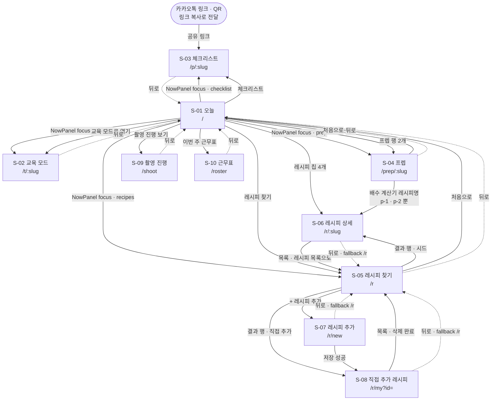
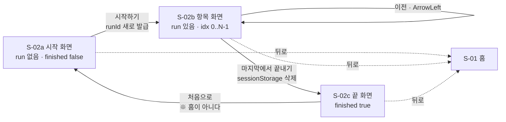

# 화면 설계서 — 매장수첩

| | |
|---|---|
| **작성일** | 2026-09-03 (2026-09-04 점검 지적 14건 반영 — 13절) |
| **상태** | ⚠️ **초안 (역설계 기록)** — 확정 아님 |
| **기준 커밋** | `282c0a9` (master, HEAD) |
| **행 번호 기준** | 이 문서의 행 번호는 **`4a9192d`에서 뽑았다.** 그 뒤 코드를 건드린 커밋은 `282c0a9`(*문서가 찾아낸 코드 버그 3건 수정*) 하나이고, 바뀐 파일은 `src/lib/types.ts` · `NowPanel.tsx` · `RecipeSearch.tsx` · `RosterView.tsx` · `ShootBoard.tsx` · `src/lib/copyText.ts`(신규) · `data/seed.json` **7개뿐**이다. 이 7개는 import가 한 줄씩 늘어 **행 번호가 몇 줄 밀려 있다.** 내용이 바뀐 서술(3-4절 focus 목적지 · C-01 · S-10 문구 · 8-4절 · 9-2·9-3절)은 갱신했다. 나머지 파일은 `4a9192d`와 같다. 참고로 `/shoot`·`/api/media`·`MediaSlot`·`mediaProbe.ts`는 `46a7815`에서, `presentation/`은 그 앞 `a408b88`에서, `public/media/`의 사진 2개는 `4a9192d`에서 들어왔다 |
| **대상 제품** | 개인 카페·베이커리 주방 기준 관리 웹. 제품명 "매장수첩"는 가칭·미확정 |
| **작성 방식** | 코드를 먼저 만들고 문서를 나중에 쓴 프로젝트다. 이 문서는 설계 지시서가 아니라 **`src/` 실측 기록**이다. 근거: `docs/08_DECISION_LOG.md` D-001 |
| **필드 정의·관계** | 이 문서에 데이터 모델 전문을 싣지 않는다. `Step`·`Position`·`Recipe`·`PrepTask`·`Shift`의 필드 목록·타입·null 허용 여부는 **[`docs/deliverables/03_ERD.md`](03_ERD.md)**에 있다. 여기서는 4절 각 화면 끝에 **"읽는 필드"** 한 줄로만 적었다 |

> **읽는 방법**
> 각 항목 뒤에 근거 파일과 행 번호를 달았다. 코드에 없는 화면·필드·조작은 쓰지 않았다.
> 코드에 없는 것은 **"미구현"**으로 명시했고, 코드로 확인할 수 없었던 것은 **❓ 확인 필요**를 달았다.
> 단, **5절 텍스트 와이어프레임의 문구는 배치 확인용 예시**이며 seed 실제 문자열과 다를 수 있다. 각 프레임 머리에 표시했다.
> ✅ **2026-09-06에 `매장수첩`으로 확정됐다.** 앱 `<title>`(`src/app/layout.tsx:5`)·`presentation/` 파일명·문서가 전부 같은 이름을 쓴다. 패키지명은 `store-note`(`package.json`)다.
>
> 이전에는 셋이 서로 달랐다 — 앱은 `주방 체크리스트`, 문서는 `프렙노트(가칭)`, 패키지는 `kitchen-sop`.

---

## 0. 한 장 요약

- React 화면은 **10개**, API는 **2개**다. 전부 `npm run dev`에서 200으로 응답한다.
- ~~그 밖에 **정적 파일 `/app.html`이 하나 더 열린다.**~~ → ✅ **해소됨 (2026-09-04).** `public/app.html`을 **삭제**했다(`528a75b`). 그 파일은 앱 전체 + 레시피 DATA가 평문으로 들어 있고 robots 메타가 0건인 채 루트에서 200으로 응답했다. 지금 단일 파일은 `presentation/`에만 있고 그 폴더는 서빙되지 않는다. 함께 `public/robots.txt` 신설 + `layout.tsx:10` 전역 `noindex`. — 2절 X-01 · 11절 #12 · `06_보안설계.md` V-05
- **전역 내비게이션이 없다.** 탭바·햄버거·사이드바가 하나도 없다. 화면 간 이동은 홈(`/`)의 링크와 각 화면의 `BackButton`뿐이다.
- 기기 1순위는 **매장 공용 태블릿**. 다만 반응형은 브레이크포인트가 아니라 **고정 `max-w` + 여백**으로만 처리한다.
- **교육 모드만** 태블릿 전제로 크게 짰다(`h-dvh` 3단 고정). 나머지는 폰 폭(560~900px) 기준 스크롤 목록이다.
- 다크모드는 **`prefers-color-scheme` 단방향**만 지원한다. 화면 안에 토글이 없다.
- 발표용 **단일 파일 HTML**(`presentation/매장수첩.html`)은 Next 앱과 **양방향으로 갈라져 있다.** 8절에 차이표를 뒀다.

---

## 1. IA (정보 구조)

실제 라우트 트리다. 괄호 안은 진입 수단.

```
매장수첩 (전역 내비게이션 없음 — 홈이 유일한 허브)
│
├── / ······································· S-01 오늘 (홈, 매장 태블릿 첫 화면)
│   │   └─ [블록] NowPanel ················· C-01 지금 시각 → 근무조 → 갈 화면
│   │
│   ├── /t/{shareSlug} ····················· S-02 교육 모드 (첫날, 한 장씩)
│   │       ├─ S-02a 시작 화면
│   │       ├─ S-02b 항목 화면 (1..N)
│   │       └─ S-02c 끝 화면 + 설문
│   │
│   ├── /p/{shareSlug} ····················· S-03 체크리스트 (개인 폰, 스크롤)
│   │                                        (카카오톡 공유 링크로도 진입)
│   │
│   ├── /prep/{slug} ······················· S-04 프렙 리스트 (리드타임·되돌림 판정)
│   │
│   ├── /roster ···························· S-10 근무표 (작성·발송)
│   │
│   ├── /shoot ····························· S-09 촬영 진행 (무엇을 더 찍어야 하나)
│   │
│   └── /r ································· S-05 레시피 찾기
│           ├── /r/{slug} ················· S-06 레시피 상세 (시드)
│           ├── /r/new ···················· S-07 레시피 추가 (폼)
│           └── /r/my?id={id} ············· S-08 직접 추가 레시피 상세
│
├── (전용 404 화면 없음) ··················· S-11 Next 기본 404. **미구현**
│
├── [정적 파일 — 화면 아님. 링크로 이어져 있지 않지만 URL로 열린다]
│   ├── /app.html ························· X-01 단일 HTML 사본 전체(앱 전량 + 레시피 DATA).
│   │                                        ~~`public/app.html`~~ 삭제됨 (528a75b)
│   ├── /media/촬영목록.md ················ 촬영 안내 문서
│   └── /photos/*.svg ····················· 버거집 시절 플레이스홀더 8개(미사용)
│
└── [API — 화면 아님]
    ├── POST /api/log ····················· A-01 이벤트 1줄 append
    └── GET  /api/media ··················· A-02 public/media/ 파일명 목록
```

**✅ ~~`/app.html`은 라우트가 아니지만 공개 경로다~~ — 해소됨 (2026-09-04).**

`public/app.html`은 배포 시 `https://{도메인}/app.html`에서 **200으로 응답했다.** 완결된 앱 사본이고 레시피 DATA가 JS 리터럴로 박혀 있었으며 robots 메타가 0건이었다.

→ **파일을 삭제했다** (`528a75b`). `src/` 어디서도 참조하지 않아 아무것도 깨지지 않았다.

> **교훈을 남겨둔다:** 정적 파일은 Next의 `metadata.robots`가 닿지 않는다. `public/`에 무엇을 두는지가 곧 공개 범위다. `robots.txt`도 그때 함께 신설했다.

**구조상 특징 4개 (전부 실측)**

| # | 사실 | 근거 |
|---|---|---|
| 1 | 레시피만 2단 하위(목록 → 상세/추가/내것)를 갖는다. 나머지는 홈 바로 아래 1단 | 라우트 트리 |
| 2 | **교육 모드 인덱스 화면이 없다.** 포지션 목록은 홈에만 있다 | `src/app/t/` 하위에 `page.tsx`가 `[slug]`뿐 |
| 3 | `/r/new`·`/r/my`는 `/r`에서만 들어간다. 홈에 링크가 없다 | `src/app/page.tsx` 전량에 `/r/new` 없음 |
| 4 | `/p/{slug}`(체크리스트)로 들어가는 경로는 **둘**이다 — 홈 포지션 카드, 그리고 **NowPanel의 `checklist` focus**(`282c0a9`에서 신설. 시드의 오픈조·마감조가 이쪽이다) | `src/components/NowPanel.tsx:19-30`, `data/seed.json` shifts |

---

## 2. 화면 목록

| 화면ID | 경로 | 목적 | 주 사용자 | 진입 경로 | 렌더 |
|---|---|---|---|---|---|
| **S-01** | `/` | 지금 이 시간에 뭘 해야 하는지 + 전체 목록 | 사장·주방장 (공용 태블릿) | 태블릿 첫 화면 / 각 화면의 `뒤로`·`처음으로` | 서버 컴포넌트 |
| **S-02** | `/t/[slug]` | 첫날 교육. 한 항목씩 넘겨 보여주고 필수항목은 확인받는다 | 신입 + 옆에 선 선배 | S-01 포지션 카드 `교육 모드로 열기` / NowPanel `training` focus | 정적 3경로 + 클라이언트 |
| **S-03** | `/p/[slug]` | 일하다가 혼자 확인. 체크로 진행률 남긴다 | 신입 (개인 폰) | S-01 포지션 카드 `체크리스트` / 카카오톡 공유 링크 / NowPanel `checklist` focus | 정적 3경로 + 클라이언트 |
| **S-04** | `/prep/[slug]` | 오늘 해야 내일 쓸 수 있는 것. 되돌릴 수 없는 것만 경고 | 오픈조·마감조·제빵 (태블릿) | S-01 프렙 행 3개 / NowPanel `prep` focus | 정적 3경로 + 클라이언트 |
| **S-05** | `/r` | 이름으로 레시피 찾기 | 전 직원 (태블릿) | S-01 `레시피 찾기` / NowPanel `recipes` focus | 서버 + 클라이언트 |
| **S-06** | `/r/[slug]` | 레시피 1건 + 배수 환산 | 전 직원 | S-05 결과 행 / S-01 레시피 칩 / S-04 배수 계산기의 레시피명 | 정적 4경로 |
| **S-07** | `/r/new` | 매장 메뉴를 직접 추가 | 사장·주방장 | S-05 `+ 레시피 추가`, 빈 결과의 `"…" 레시피 추가하기` | 정적 + 클라이언트 |
| **S-08** | `/r/my?id=` | 직접 추가한 레시피 상세 + 삭제 | 사장·주방장 | S-05 `직접 추가` 행 / S-07 저장 직후 | 정적 + `Suspense` |
| **S-09** | `/shoot` | 무엇을 더 찍어야 하는지. 파일명 복사 | 사장·주방장 | S-01 `촬영 진행 보기` | 서버 + 클라이언트 |
| **S-10** | `/roster` | 근무표 작성 → 메일/카톡 발송 | 사장·매니저 | S-01 `이번 주 근무표` | 서버 + 클라이언트 |
| **S-12** | `/attendance` | 출퇴근을 찍고, 근무표(계획)와 비교해 지각·연장·법정휴게 미달을 본다 | **직원 본인** (오늘 탭) + 사장 (이번 주 탭) | S-01 `출퇴근 · 근태` | 서버 + 클라이언트. **잠금 없음** (직원이 찍어야 한다) — 대신 시급·인건비 열만 가린다 |
| **S-13** | `/contracts` | 근로계약 조건 기록 + 법정 점검 (서면 교부·최저임금·주휴·보존 만기) | 사장 | S-01 `근로계약서` | 서버 + 클라이언트. **🔒 화면 전체 잠금** |
| **S-14** | `/sales` | 마감에 세 칸 넣고 "오늘 남은 돈"을 본다 | 사장 | S-01 `매출` | 서버 + 클라이언트. **🔒 화면 전체 잠금** |
| **S-15** | `/cost` | 메뉴별 재료비·원가율. 목표 원가율에서 판매가 역산 | 사장 | S-01 `원가` / S-14 캡션 링크 | 서버 + 클라이언트. **🔒 화면 전체 잠금** |
| **S-16** | `/order` | 주문 마감까지 남은 시간, 안 들어온 것, 주문함/들어옴 체크 | 오픈조·사장 | S-01 `발주` | 서버 + 클라이언트. **잠금 없음** (아침에 직원이 확인한다. 단가는 이 화면에 없다) |
| **S-17** | `/vendors` | 거래처·담당자·마감시각·배송요일 + **품목 단가** | 사장 | S-01 `거래처` / S-15·S-16 캡션 링크 | 서버 + 클라이언트. **🔒 화면 전체 잠금** |
| **S-11** | (없는 slug) | 오류 안내 | — | 잘못된 URL | **미구현** — `not-found.tsx`·`error.tsx`·`loading.tsx` 전부 없음. Next 기본 화면이 뜬다 |
| ~~**X-01**~~ | ~~`/app.html`~~ | **해소됨 (2026-09-04).** 발표용 단일 HTML 사본이 `public/`에 있어 주소만 알면 **레시피 전량이 열렸다.** 파일을 삭제했다 — 지금은 `presentation/` 에만 있고 그 폴더는 서빙되지 않는다 | — | — | **파일 없음** (`ls public/app.html` → No such file). 함께 `robots.txt` 신설 + `layout.tsx:10`에 전역 `noindex` |

**공통 컴포넌트**

| ID | 파일 | 쓰이는 화면 |
|---|---|---|
| C-01 | `src/components/NowPanel.tsx` | S-01 안에만 |
| C-02 | `src/components/MediaSlot.tsx` | S-02, S-03, S-04, S-06(=S-08) |
| C-03 | `src/components/BackButton.tsx` | S-02 ~ S-10 (S-01 제외) + **S-12 ~ S-17** — 새 화면은 `Screen`(C-05)이 내부에서 부른다(`ui.tsx:52`) |
| C-04 | `src/components/CopyLinkButton.tsx` | S-01만 |
| **C-05** | `src/components/ui.tsx` | S-12 ~ S-17. `Screen`·`Card`·`Row`·`Chip`·`NumField`·`Empty`·`Caveat` + `INPUT`/`BTN` 클래스 상수 |
| **C-06** | `src/components/OwnerGate.tsx` | S-13·S-14·S-15·S-17은 **화면 전체** 감싸기 / S-12는 `useOwnerOpen()` + `InlineUnlock`으로 **부분 가리기** / S-01은 `OwnerLockButton` |

> ### ★ C-05를 왜 만들었나 — 화면이 6개 늘어서다
>
> 그전까지는 화면마다 클래스 문자열을 그대로 적었고, `inputBase` 상수가
> `RecipeForm.tsx`와 `RosterView.tsx`에 **똑같이 두 번** 있었다.
> 화면이 6개 더 늘면 그 복사가 8벌이 된다. 한 군데만 고치면 화면끼리 미묘하게
> 달라지고, **주방 태블릿은 젖은 손으로 누르므로 버튼·입력칸 높이가 화면마다
> 다르면 바로 오조작이 된다.**
>
> ⚠️ **기존 화면(S-01 ~ S-10)은 C-05로 옮기지 않았다.** 지금은 규약이 두 벌이다.
> → 11절 미구현 목록

### 2-1. 화면별 메타데이터 실측 (브라우저 탭 제목 · 색인) — 발표 전 정리 필요

`title`은 브라우저 탭·검색 결과·카카오톡 미리보기에 그대로 나오는 값이다. 루트 기본값은 `layout.tsx:5-6`의 `title: "매장수첩"` / `description: "포지션별로 오늘 할 일을 순서대로 확인하세요."`이고, **10개 화면 중 8개가 이를 덮어쓴다.**

| 화면 | `title` | `description` | `robots noindex` | `openGraph` | 근거 |
|---|---|---|---|---|---|
| S-01 `/` | **루트 상속** `매장수첩` | 루트 상속 | **없음** | 없음 | `src/app/page.tsx`에 `metadata` export 부재 |
| S-02 `/t/[slug]` | `{position.name} 교육 · {store.name}` (없는 slug면 `교육 자료를 찾을 수 없습니다`) | 루트 상속 | **없음** | 없음 | `t/[slug]/page.tsx:19-20` (`generateMetadata`) |
| S-03 `/p/[slug]` | `{position.name} {position.subtitle}` (없는 slug면 `체크리스트를 찾을 수 없습니다`) | `{store.name} · 총 {n}개 항목. 순서대로 따라 하시면 됩니다.` | **없음** | **있음** (title·description·url·type) | `p/[slug]/page.tsx:20`, `:23-24`, `:30-39` |
| S-04 `/prep/[slug]` | **루트 상속** `매장수첩` | 루트 상속 | **없음** | 없음 | `prep/[slug]/page.tsx` 전량에 `metadata`·`generateMetadata` 부재 |
| S-05 `/r` | `레시피` | 루트 상속 | 있음 | 없음 | `r/page.tsx:10-11` |
| S-06 `/r/[slug]` | `{recipe.name}` (없으면 `레시피`) | 루트 상속 | 있음 | 없음 | `r/[slug]/page.tsx:21-22` |
| S-07 `/r/new` | `레시피 추가` | 루트 상속 | 있음 | 없음 | `r/new/page.tsx:6-7` |
| S-08 `/r/my` | `레시피` | 루트 상속 | 있음 | 없음 | `r/my/page.tsx:6-8` |
| S-09 `/shoot` | `촬영 진행` | 루트 상속 | 있음 | 없음 | `shoot/page.tsx:6-7` |
| S-10 `/roster` | `근무표` | 루트 상속 | 있음 | 없음 | `roster/page.tsx:6-7` |
| S-12 `/attendance` | `출퇴근` | 루트 상속 | 있음 | 없음 | `attendance/page.tsx:5-8` |
| S-13 `/contracts` | `근로계약서` | 루트 상속 | 있음 | 없음 | `contracts/page.tsx:5-8` |
| S-14 `/sales` | `매출` | 루트 상속 | 있음 | 없음 | `sales/page.tsx:5-8` |
| S-15 `/cost` | `원가` | 루트 상속 | 있음 | 없음 | `cost/page.tsx:5-8` |
| S-16 `/order` | `발주` | 루트 상속 | 있음 | 없음 | `order/page.tsx:5-8` |
| S-17 `/vendors` | `거래처` | 루트 상속 | 있음 | 없음 | `vendors/page.tsx:5-8` |
| ~~**X-01 `/app.html`**~~ | — | — | **해소됨 — 파일 삭제** | — | 없음 |
| `robots.txt` | — | — | **있음 (2026-09-04 신설)** `User-agent: * / Disallow: /` | — | `public/robots.txt` |
| **루트 `layout.tsx`** | — | — | **전역 `noindex, nofollow` (2026-09-04 추가)** | — | `layout.tsx:10` |

**여기서 읽어야 할 것 3개**

1. **루트 `title`이 실제로 노출되는 화면은 S-01과 S-04뿐이다.** 나머지 14개는 각자 덮어쓴다. 즉 루트 제목 `매장수첩`이 그대로 보이는 곳은 홈과 프렙이다. **2026-09-06 이전에는 이 자리에 옛 이름 `주방 체크리스트`가 떴다**(9-3절 #5에서 지적한 것).
2. ~~색인 대상이 다섯이다~~ → **2026-09-04에 해소됐다.** `layout.tsx:10`에 전역 `robots: { index: false, follow: false }`를 넣어 **모든 라우트가 noindex**가 되었고, `public/robots.txt`를 신설해 `Disallow: /`로 정적 파일(`/media/촬영목록.md` 포함)까지 막았다.
3. ~~`/app.html`에 레시피가 평문으로 있다~~ → **해소됨. 파일을 삭제했다.** 발표용 단일 HTML은 `presentation/`에만 두고, 그 폴더는 웹으로 서빙되지 않는다.
4. **⚠️ 다만 `robots.txt`와 `noindex`는 "검색 노출"만 막는다.** 주소를 아는 사람은 그대로 열 수 있다. **S-12(출퇴근)와 S-16(발주)에는 잠금이 없고, S-10(근무표 — 직원 이름·연락처)에도 잠금이 없다.** 진짜 접근 통제는 서버를 붙일 때 생긴다. → `06_보안설계.md`

S-03만 `openGraph`를 채우는 것은 카카오톡 미리보기 때문이고, 이 화면은 링크가 새도 되는 화면이라는 판단이 뒤에 있다.

---

## 3. 화면 흐름도

실제로 이동 가능한 경로만 그렸다. 실선은 링크·버튼, 점선은 `BackButton`이다.



### 3-1. S-02 교육 모드의 내부 상태 이동

`run`(sessionStorage)과 `finished`(메모리) 두 값의 조합으로 세 화면이 갈린다.



**주의 — 다시 만들 때 반드시 그대로 지킬 것:** 끝 화면의 `처음으로`는 `setFinished(false)` + `setAsked(null)`만 실행한다(`src/components/TrainingMode.tsx:238-247`). 홈으로 나가지 않고 **같은 포지션의 시작 화면으로 되돌아간다.** 공용 태블릿에서 다음 신입이 바로 다시 시작하게 하려는 설계다. 홈으로 나가려면 `BackButton`을 쓴다.

### 3-2. 막다른 곳 / 진입 경로가 하나뿐인 화면

| 화면 | 진입 경로 | 리스크 |
|---|---|---|
| S-07 `/r/new` | S-05뿐 | 홈에서 두 번 눌러야 도달 |
| S-08 `/r/my` | S-05의 로컬 행, S-07 저장 직후뿐 | 링크를 잃으면 재도달 불가 |
| ~~S-03 `/p/{slug}`~~ | S-01 포지션 카드 + **NowPanel `checklist` focus** + 카카오톡 공유 링크 | ✅ **해소됨 (`282c0a9`).** 이전 초안은 "근무조 focus가 여기로 안 보낸다"고 적었으나, 시드의 오픈조·마감조 focus가 `checklist`라 `/p/{slug}`로 온다(3-4절). **이 표의 대상이 아니다** |
| S-02 인덱스 | 없음 | 포지션을 고르려면 홈으로 나가야 한다 |

### 3-3. `BackButton` 동작 규약

`src/components/BackButton.tsx:17-21`

```
window.history.length > 1  →  router.back()
그렇지 않으면              →  router.push(fallback)
```

`fallback` 기본값은 `/`. 레시피 계열(S-06·S-07·S-08)만 `/r`을 넘긴다.
만든 이유가 주석에 있다(`:8-9`) — **"매장 태블릿에는 브라우저 주소창이 없는 경우가 많다(전체화면 키오스크). 화면 안에 뒤로 가기가 없으면 갇힌다."**

### 3-4. NowPanel의 focus 목적지 (S-01 → 다른 화면의 실제 분기)

`src/components/NowPanel.tsx:19-30`

| `ShiftFocus.kind` | 목적지 | seed 실측 |
|---|---|---|
| `training` | `/t/{slug}` (**교육 모드** — 한 장씩, 진도 안 남김) | 1건 (제빵) |
| `checklist` | `/p/{slug}` (**체크리스트** — 그날 날짜로 저장) | 2건 (오픈조·마감조) |
| `prep` | `/prep/{slug}` | 2건 |
| `recipes` | `/r` 고정 (`slug` 없음) | 2건 |

✅ **해결됨 (`282c0a9`).** 이전 초안은 "오픈조 focus[0] 라벨이 `오픈 체크리스트`인데 목적지가 `/t/cafe-open`(교육 모드)"을 ❓ 확인 필요로 남겼다. 그 지적대로 `kind`가 `training`/`checklist` 둘로 갈렸고, 시드의 오픈조·마감조가 `checklist`로 바뀌었다. **라벨과 목적지가 일치한다.**

---

## 4. 화면별 상세

각 화면은 **목적 / 구성요소 / 조작과 결과 / 상태 / 저장** 순으로 적었다.

---

### S-01 · 오늘 (홈) — `/`

**목적** 매장 태블릿을 켠 사람이 메뉴를 뒤지지 않게, 맨 위에 "지금 시간에 뭘 해야 하는가"를 두고 그 아래 전체 목록을 둔다.

> 순서를 반대로 하면(목록 먼저) 사람이 매번 찾아야 해서 안 쓰게 된다. — `src/app/page.tsx:18-19` 주석

**구성요소** (위 → 아래, `src/app/page.tsx`)

| # | 요소 | 내용 | 행 |
|---|---|---|---|
| 1 | 매장명 | `store.name` (시드: `○○ 베이커리 카페`) | 30 |
| 2 | h1 | `오늘` | 31 |
| 3 | **NowPanel** | C-01. 아래 별도 항목 | 34 |
| 4 | 프렙 섹션 | 제목 + `오늘 해야 내일 쓸 수 있는 것들입니다.` + 행 2개 | 37-75 |
| 5 | 근무표 섹션 | 제목 + `누가 언제 나오는지 정하고, 직원들에게 보냅니다.` + 행 1개 | 78-92 |
| 6 | 포지션별 체크리스트 | 카드 3개 | 95-144 |
| 7 | 촬영 섹션 | 제목 + `사진·영상이 붙은 항목만 화면에 보입니다.` + 행 1개 | 147-159 |
| 8 | 레시피 섹션 | 검은 큰 버튼 + 레시피 칩 4개 | 162-199 |

- **프렙 행**: `{목록명}` / `{n}개` + 되돌릴 수 없는 항목이 있으면 빨간 글씨 `까먹지 말 것 {N}개`. N은 `irreversibleTasks()`가 세며(`src/lib/repo.ts:82`), 시드 실측(2026-09-10)은 `오후 프렙 5개 · 까먹지 말 것 7개`, `마감 준비 3개`, `주기 점검 13개 · 까먹지 말 것 1개`. **개수는 `repo.countedTasks()` 가 센다** — 묶음 머리와 옵션은 빼므로 `list.tasks.length` 와 다르다. (숫자 정본: [21_화면명세.md §1-b](21_화면명세.md))
- **포지션 카드**: `{이름} {부제}` / `{n}개 항목 · 꼭 지키기 {m}개` / 주황 버튼 `교육 모드로 열기`(우측에 작은 글씨 `태블릿 · 한 장씩`) / 아래 줄에 `체크리스트` 링크 — **경로 문자열 `/p/{shareSlug}`를 화면에 그대로 노출한다**(`:135`. 카톡에 붙일 주소를 눈으로 확인시키는 용도) + `링크 복사` 버튼.
- **레시피 칩**: `{이름}` + `1배합 {yield}` — 시드 실측 4개(아메리카노 1잔 / 카페라떼 1잔 / 콜드브루 2000ml / 식빵 6개).

**사용자 조작과 결과**

| 조작 | 결과 |
|---|---|
| 프렙 행 탭 | S-04로 이동 (`/prep/afternoon` · `/prep/evening` · `/prep/cycle`) |
| `이번 주 근무표` 탭 | S-10 |
| `교육 모드로 열기` 탭 | S-02 (`/t/{shareSlug}`) |
| `체크리스트` 탭 | S-03 (`/p/{shareSlug}`) |
| `링크 복사` 탭 | `navigator.clipboard`로 **절대 URL** 복사, 버튼 문구가 1.5초간 `복사됨`으로 바뀐다. 실패 시(권한 없음·http) `window.prompt`로 주소를 띄워 직접 복사하게 한다 — `src/components/CopyLinkButton.tsx:8-18` |
| `촬영 진행 보기` 탭 | S-09 |
| `레시피 찾기` 탭 / 칩 탭 | S-05 / S-06 |

**상태**

| 상태 | 화면 |
|---|---|
| 초기(서버 렌더) | NowPanel 자리에 `h-[132px]` 회색 펄스 블록. 그 외 전부 즉시 완성 |
| 진행 | 서버 컴포넌트라 자체 상태가 없다. NowPanel만 60초마다 갱신 |
| 완료 | 없음 (홈에 완료 개념이 없다) |
| 빈 상태 | **미구현.** 포지션·프렙·레시피가 0개인 경우의 문구가 없다. 방어가 세 군데 빠져 있다 — ① `listPositions()`는 `?? []`조차 없어(`src/lib/repo.ts:36-38`) `positions` 키가 없으면 런타임 에러다 ② `getStore()`도 무방비다(`:32-34`). `store` 키가 없으면 `store.name`에서 죽는다 ③ **`shifts`가 0개면 NowPanel이 런타임 에러다.** `listShifts()`는 `?? []`가 있어 빈 배열이 그대로 내려가고(`:90-92`), NowPanel의 폴백이 `?? shifts[0]` → `undefined`가 되어 `upcoming.name`에서 TypeError가 난다(`NowPanel.tsx:58-61`, `:69`). 홈 전체가 죽는다 |
| 오류 | **미구현.** `error.tsx` 없음. 위 세 경우 모두 Next 기본 오류 화면이 뜬다 |

**저장되는 것** 없음. `BackButton`도 없다(홈이라 불필요).

**읽는 필드** `Store.name` + `Position.id/shareSlug/name/subtitle/sections`(→ `Section.steps` → `Step.critical`. 개수 계산은 `repo.ts:44-53`) + `PrepList.id/slug/name/tasks`(→ `PrepTask.recoverable`) + `Recipe.id/slug/name/yield.amount/yield.unit` + `Shift[]`(NowPanel에 통째로 전달) — `src/app/page.tsx:22-26`, `:30`, `:43-73`, `:103-142`, `:184-198`.

---

### C-01 · NowPanel (S-01 안의 블록) — `src/components/NowPanel.tsx`

**목적** 근무 스케줄을 "부가 기능"이 아니라 **어느 화면을 먼저 띄울지 고르는 기준**으로 쓴다(`:8-12` 주석).

**구성요소와 상태** — 상태가 넷이다(넷째는 셋째의 폴백 분기).

| 상태 | 조건 | 화면 |
|---|---|---|
| **초기** | 서버 렌더 / 마운트 전 (`now === null`) | `h-[132px]` 회색 펄스 자리만. 서버는 시각을 모른다 (`:40-45`) |
| **근무 중** | `start <= 지금 < end`인 조가 1개 이상 | 해당 조 **전부**를 카드로. 첫 카드만 주황 강조 + `지금 HH:MM · 근무 중`, 나머지는 `같은 시간대`. 각 카드에 조 이름·`시작 ~ 종료`·note·focus 버튼들. **정렬은 시작 시각 내림차순** — 방금 출근한 조가 위에 온다(`282c0a9`. 이전에는 시드 배열 순서라 07:30에 제빵(05:00)이 먼저 떴다) |
| **근무 시간 아님 — 다음 조 있음** | 근무 중인 조 0개 + 시작 시각이 지금보다 늦은 조가 1개 이상 | `지금 HH:MM · 근무 시간이 아닙니다` + `다음은 {조 이름} · {시작시각}` |
| **근무 시간 아님 — 오늘 남은 조가 없음** | 근무 중인 조 0개 + 시작 시각이 지금보다 늦은 조도 0개 | 같은 화면인데 **`shifts[0]`(seed 배열의 첫 항목)으로 폴백한다**(`:58-61`의 `?? shifts[0]`). **시간순 "다음 조"가 아니라 배열 순서 첫 항목이다.** 시드에서는 22:30~자정에 이 분기를 타고, 배열 첫 항목이 마침 제빵 05:00이라 결과가 우연히 맞다. 조 순서를 바꾸면 틀린 조를 안내한다. `shifts`가 0개면 `undefined`가 되어 `upcoming.name`에서 TypeError (S-01 빈 상태 칸 참조) |

**갱신** 마운트 시 `new Date()`, 이후 **60초 간격 `setInterval`** (`:33-38`). 하루 종일 켜두는 태블릿 전제.

**실측된 시간대 겹침** — 시드 근무조가 서로 겹친다.

| 조 | 시간 | focus[0] |
|---|---|---|
| 제빵 | 05:00 ~ 13:00 | `제빵 순서 보기` → `/t/bakery-morning` (`training`) |
| 오픈조 | 07:30 ~ 15:30 | `오픈 체크리스트` → `/p/cafe-open` (`checklist`) |
| 미들 | 11:00 ~ 19:00 | `레시피 찾기` → `/r` |
| 마감조 | 14:30 ~ 22:30 | `오후 프렙 (내일 것 걸기)` → `/prep/afternoon` (focus[1] `마감 준비 (19시부터)` → `/prep/evening`, focus[2] `마감 체크리스트` → `/p/cafe-close`) |

→ 12:00에는 **제빵·오픈조·미들 3개 카드**가 동시에 뜬다(정렬은 미들 → 오픈조 → 제빵 순, 주황은 미들). `22:30 ~ 05:00`만 "근무 시간이 아닙니다"다.

**알려진 한계** `toMinutes()`는 `"HH:MM"`을 분으로 바꿔 단순 비교한다(`:14-17`). **자정을 넘기는 조를 처리하지 못한다.** 시드 4개는 모두 같은 날 안에서 끝나므로 드러나지 않는다. 심야 조를 추가하면 그 조는 영구히 "근무 중"이 되지 않는다.

**저장되는 것** 없음.

**읽는 필드** `Shift.id/name/start/end/note/focus` + `ShiftFocus.kind/slug/label` — `src/components/NowPanel.tsx:19-30`(`kind`로 링크 분기. 4분기), `:47-61`, `:69`, `:77-120`. ⚠️ `282c0a9` 이후 이 파일은 행 번호가 몇 줄 밀렸다.

---

### S-02 · 교육 모드 — `/t/[slug]`

**목적** 첫날 교육. 한 항목씩 크게 보여주고, 위생·안전 항목은 읽었다는 확인을 받은 뒤에만 넘긴다.

**기기 전제** 이 앱에서 **유일하게 태블릿 전용으로 짠 화면**이다. `README.md:24`가 "매장 공용 태블릿 (가로)"로 명시한다. `h-dvh` 고정 3단(헤더 / 본문 / 푸터)이고 본문만 스크롤한다.

#### S-02a 시작 화면 (`run` 없음)

| 요소 | 내용 | 근거 |
|---|---|---|
| 좌상단 | `BackButton` (`absolute left-5 top-5`) | `:162-164` |
| 매장명 | `text-base` 회색 | `:165` |
| 포지션명 | `text-4xl lg:text-5xl` | `:166` |
| 부제 | `text-xl` | `:167-169` |
| 안내문 | `position.summary`, `max-w-xl text-lg` | `:171-173` |
| 분량 | `총 {n}개 항목 · 약 {m}분` — `m = max(5, round(n × 0.7))`. 9항목이면 **6분** | `:60`, `:175-177` |
| 주 버튼 | 주황 `시작하기`, `px-16 py-6 text-2xl` (계산 높이 약 80px) | `:179-185` |
| 하단 안내 | `다 보고 나면 처음 화면으로 돌아갑니다. 다음 사람은 여기서 다시 시작하면 됩니다.` | `:187-190` |

#### S-02b 항목 화면

```
헤더(shrink-0) : BackButton | {포지션명} {섹션명} | {i+1} / {total} | 진행바(h-2, 주황)
본문(flex-1, overflow-y-auto, max-w-3xl 중앙)
      ├ [꼭 지키기] 빨간 배지 (critical일 때만)
      ├ 제목  text-3xl lg:text-4xl
      ├ 설명  text-lg lg:text-xl
      ├ [선배 한마디] 회색 박스 (tip 있을 때만)
      ├ [읽었습니다] 빨간 버튼 (critical일 때만) → 누르면 [확인했습니다] 초록 + disabled
      └ MediaSlot (파일 없으면 아무것도 안 그림)
푸터(shrink-0) : [이전] | 안내 문구 | [다음 / 끝내기]
```

**필수항목 게이트** — 이 화면의 핵심 규칙.

```ts
const canGoNext = !needsConfirm || isConfirmed;   // TrainingMode.tsx:111
```

`critical: true` 항목에서는 `읽었습니다`를 누르기 전까지 `다음`이 `disabled`이고, **키보드 `ArrowRight`도 막힌다**(`:151`). 푸터 안내 문구도 `위의 [읽었습니다]를 눌러야 넘어갑니다`로 바뀐다(`:340-343`).

**조작과 결과**

| 조작 | 결과 |
|---|---|
| `시작하기` | 새 `runId` 발급 + `idx: 0` + `startedAt: Date.now()` + `confirmed: []` → sessionStorage 저장 → `training_start` 로그 |
| `다음` / `ArrowRight` | `idx + 1`. 마지막이면 `training_complete`(`durationSec`, `confirmedCount`) 로그 → `finished: true` → **sessionStorage 삭제** |
| `이전` / `ArrowLeft` | `idx - 1`. `idx === 0`이면 버튼 `disabled`. **되돌아간 critical 항목의 확인은 유지된다**(`confirmed[]`에 남아 있음) |
| `읽었습니다` | `confirmed[]`에 항목 id 추가 → `critical_confirm` 로그. 버튼이 초록 `확인했습니다` + `disabled` |
| 설문 4버튼 | `survey` 로그(`askedSenior`, `mode: "training"`) → 자리에 `답변 감사합니다.` 표시 |
| `처음으로` | **S-02a로 되돌아간다. 홈이 아니다** (3-1절 참조) |
| `뒤로` | S-01 (세 화면 모두에 있다) |

**상태**

| 상태 | 조건 | 화면 |
|---|---|---|
| 초기 | `run` 없음, `finished` false | S-02a |
| 진행 | `run` 있음 | S-02b |
| 완료 | `finished` true | S-02c `수고하셨습니다` + `{포지션명} 교육을 모두 마쳤습니다.` + 설문 |
| 빈 상태 | 항목 0개 | **미구현.** `total === 0`이면 `시작하기`를 눌러도 `task`가 `undefined`가 되고 `:253`의 조기 반환(`if (!task \|\| !run) return null;`)으로 **빈 화면**이 된다. 시드는 8~9개라 드러나지 않는다 |
| 오류 | 없는 slug | `notFound()` → Next 기본 404 (`src/app/t/[slug]/page.tsx:30`) |
| 새로고침 | 진행 중 | sessionStorage에서 복원되어 같은 항목에서 계속 (`:69-76`) |

**저장되는 것**

| 키 | 저장소 | 값 |
|---|---|---|
| `sop:run:{shareSlug}` | **sessionStorage** | `{ runId, idx, startedAt, confirmed[] }` |

**왜 sessionStorage인가** — `:11-14` 주석: 공용 기기라서 localStorage에 남기면 앞사람 진도가 다음 사람에게 그대로 보인다. `시작하기`마다 새 `runId`, 완료하면 `removeItem`, 탭을 닫으면 소멸한다. 이 앱의 저장소 6종 중 **유일한 sessionStorage**다.

**보내는 로그** `training_start`(`totalTasks`) / `critical_confirm`(`taskId`) / `training_complete`(`durationSec`, `confirmedCount`) / `survey`(`askedSenior`, `mode`)
→ **⚠️ 이 화면의 `log()`에는 `getSessionId()` 호출이 없다**(`:30-41`을 다른 3개 컴포넌트와 비교). 그래서 교육 모드 이벤트 4종에 `sessionId`가 없고 `runId`만 있다. 그런데 `survey`에는 `runId`도 싣지 않는다(`:219-223`) → **`training_complete`와 `survey`를 이을 키가 `positionSlug` + 시각 근접성뿐이다.** 발표 지표를 뽑을 때 걸린다. 다시 만들 때는 `survey`에 `runId`를 넣는 편이 낫다.

**코드와 주석이 어긋난 곳** `:281`에 `{/* 본문: 가로 화면이면 사진 | 설명, 세로면 위아래로 */}`라고 적혀 있으나, 실제 마크업은 `flex-col` 하나뿐이고 방향을 바꾸는 반응형 클래스가 없다(`:285`). **가로/세로 분기는 미구현.**

**읽는 필드** `Store.name`(props로 받음) + `Position.shareSlug/name/subtitle/summary/sections` + `Section.title` + `Step.id/title/desc/tip/critical` — `src/components/TrainingMode.tsx:52-58`(섹션을 평탄화하며 `Section.title`을 `sectionTitle`로 얹는다), `:165-190`, `:288-323`. `Step.goodImage`/`badImage`/`videoUrl`은 **읽지 않는다**(미디어는 `Step.id` 파일명 규약으로 붙는다 — C-02).

---

### S-03 · 체크리스트 — `/p/[slug]`

**목적** 개인 폰으로 일하다가 혼자 확인. 스크롤 목록 하나로 전체를 본다.

**구성요소** (`src/components/ChecklistView.tsx`)

| # | 요소 | 내용 | 행 |
|---|---|---|---|
| 1 | sticky 헤더 | `BackButton` \| 매장명 + `{포지션명} {부제}` \| `{done}/{total}` \| 진행바(h-1.5) | 113-144 |
| 2 | 안내 박스 | `position.summary`, 주황 배경 | 147-151 |
| 3 | 섹션 반복 | 섹션 제목 + note(있으면 옆에 작게) | 154-163 |
| 4 | 항목 카드 | 아래 표 | 166-244 |
| 5 | 완료 설문 | 다 체크했을 때만 | 250-285 |
| 6 | 푸터 | `체크 전부 지우기` + `체크 상태는 이 휴대폰에만 저장되며 날짜가 바뀌면 초기화됩니다.` | 287-298 |

**항목 카드 구조**

```
┌──────────────────────────────────────────┐
│ ( ○ )  [꼭 지키기]                        │  ← 원형 체크박스 h-7 w-7 (28px)
│   28px  항목 제목 (체크하면 line-through)  │     "장갑 낀 손도 누르기 쉽게 크게" :187
│         설명 text-[13px]                  │
│         ┌ 선배 한마디 ─────────────────┐  │
│         └──────────────────────────────┘  │
├─ (버튼 밖) MediaSlot ────────────────────┤  ← 버튼 안에 미디어를 넣지 않기 위해 분리 :238
└──────────────────────────────────────────┘
```

카드 테두리 분기(`:172-179`): 체크됨 → 회색 + `opacity-55` / 미체크 & `critical` → 빨간 테두리 / 그 외 → 회색.
`꼭 지키기` 배지는 **critical이고 아직 체크하지 않았을 때만** 보인다(`:213`).

**조작과 결과**

| 조작 | 결과 |
|---|---|
| 항목 카드 어디든 탭 | 체크 토글. 즉시 localStorage 저장. `aria-pressed` 갱신 |
| 설문 4버튼 | `survey` 로그(`askedSenior`. `mode` 없음 = 체크리스트) → `답변 감사합니다. 내일 다시 접속하면 체크리스트가 초기화됩니다.` |
| `체크 전부 지우기` | `done` 비우고 `localStorage.removeItem`. **확인 대화상자 없다** |
| `뒤로` | S-01 (링크로 바로 들어왔으면 `/`로 push) |

**상태**

| 상태 | 조건 | 화면 |
|---|---|---|
| 초기 | `hydrated` false | 진행률 `0/{total}`로 먼저 그려진 뒤 저장값으로 교체 |
| 진행 | `0 < done < total` | 진행바 주황, 체크된 카드는 흐려짐 |
| 완료 | `done === total && total > 0` | 하단에 주황 설문 섹션이 **나타난다** (`finished` 게이트, `:108`) |
| 빈 상태 | 항목 0개 | **미구현.** `total === 0`이면 `finished`가 false로 고정되고 섹션 목록이 빈 채 헤더만 남는다 |
| 오류 | 없는 slug | `notFound()` (`src/app/p/[slug]/page.tsx:50`) |
| 저장 실패 | 사파리 사생활 보호 모드 등 | **조용히 무시.** 화면은 정상으로 보이지만 아무것도 저장되지 않는다 (`:88-90`) |
| 날짜 변경 | 자정 통과 | 키가 바뀌어 자동 초기화 |

**저장되는 것**

| 키 | 저장소 | 값 | 초기화 |
|---|---|---|---|
| `sop:{shareSlug}:{YYYY-MM-DD}` | localStorage | 체크한 Step id의 `string[]` | 날짜가 바뀌면 새 키 → 자동 |
| `sop:sid` | localStorage | 기기 단위 랜덤 문자열. 실패 시 리터럴 `"no-storage"` | 없음 (영구) |

**보내는 로그** 마운트 시 `view` 1회(`positionSlug`) / `survey`.

**메타데이터** 이 화면만 `openGraph`를 채운다(`src/app/p/[slug]/page.tsx:26-39`). 절대 URL이 필요해 `NEXT_PUBLIC_SITE_URL`을 읽고, 없으면 `http://localhost:3000`으로 폴백한다 — **배포 시 이 환경변수를 바꾸지 않으면 카카오톡 미리보기가 localhost를 가리킨다.**

**읽는 필드** `Store.name`(props) + `Position.shareSlug/name/subtitle/summary/sections` + `Section.id/title/note` + `Step.id/title/desc/tip/critical` — `src/components/ChecklistView.tsx:56-62`, `:113-163`, `:166-244`. S-02와 읽는 필드가 거의 같고, 섹션 `note`를 쓰는 쪽은 여기다. `Step.goodImage`/`badImage`/`videoUrl`은 읽지 않는다.

---

### S-04 · 프렙 리스트 — `/prep/[slug]`

**목적** 오늘 해야 내일 쓸 수 있는 것. **종이가 못 한다고 보고 넣은 계산 셋**을 화면에 올린다(설계 의도다. 매장에서 비교 측정한 적은 없다 — 12절 #12).

> 1) 오늘 걸면 몇 시에 쓸 수 있는지 계산해준다 2) 되돌릴 수 있는 것과 없는 것을 구분한다 3) 수량이 매일 바뀌는 항목은 배수를 눌러 그 자리에서 환산한다 — `src/components/PrepView.tsx:13-16` 주석

이 앱에서 기능이 가장 많은 화면이다.

**구성요소**

| # | 요소 | 내용 | 행 |
|---|---|---|---|
| 1 | sticky 헤더 | `BackButton` \| 매장명 + 목록명 \| `{done}/{total}` \| 진행바 | 200-226 |
| 2 | **되돌릴 수 없는 것 요약 박스** | 아래 표 | 229-256 |
| 3 | 목록 note | 요약 박스와 **무관하게 항상** 표시 (`:258-259` 주석: 주기 점검처럼 되돌릴 수 없는 항목이 없는 목록에서도 필요) | 260-264 |
| 4 | 항목 카드 반복 | 아래 | 267-470 |
| 5 | 푸터 | `처음으로` 링크 + `체크 상태는 이 기기에만 저장되며 날짜가 바뀌면 초기화됩니다.` | 472-482 |

**요약 박스 2상태** (`recoverable === false`인 미완료 항목 수로 판정)

| 조건 | 색 | 문구 |
|---|---|---|
| `irreversibleLeft > 0` | 빨강 | **`까먹지 말고 해야 할 것 {N}개`** + `빨간 테두리로 표시된 것들입니다. 오늘 안 하면 내일 아침에 되돌릴 방법이 없습니다.` |
| `irreversibleLeft === 0` | 초록 | `오늘 꼭 해야 할 건 다 했습니다` |
| `irreversible.length === 0` | — | 박스 자체가 렌더되지 않는다 |

**항목 카드 구조**

```
┌═══════════════════════════════════════════════════┐  ← recoverable:false → 빨간 테두리(border-2)
║ ( ○ )  [꼭 지키기][매일 14:00][수량 매일 다름]      ║     recoverable:true  → 회색
║  32px  항목 제목 text-[16px] bold                  ║     체크 시 회색 + opacity-55
║        설명 text-[13px]                            ║
║        ┌ 지금 걸면 → 내일 07:43부터 사용 가능 (16시간) ┐ ║  ← leadTimeHours 있을 때
║        └────────────────────────────────────────┘  ║
║        ┌ 오늘 주문 → 9/9(수) 도착 (주말 배송 없음)   ┐ ║  ← leadTimeDays 있을 때
║        └────────────────────────────────────────┘  ║
║        안 하면 — {consequence}                      ║  ← recoverable이면 회색, 아니면 빨간 굵은 글씨
╠─ (버튼 밖) MediaSlot ─────────────────────────────╣
╠─ 배수 계산기 (recipeSlug가 실존 레시피와 매칭될 때만) ─╣
║   오늘 몇 배?                                       ║
║   [0.5배][1배][1.5배][2배][3배]                     ║
║   {레시피명 링크} · 1배합 = 2000ml → 3000ml         ║
║   재료 이름 …………………………………… 환산 수량         ║
└═══════════════════════════════════════════════════┘
```

**뱃지 줄 3종** (`:319-334`) — `꼭 지키기`(critical) / 트리거 라벨(항상) / `수량 매일 다름`(quantityVaries).

**트리거 라벨 4분기** (`triggerLabel`, `:105-120`) — seed에서 4종 전부 쓰인다.

| `trigger.type` | 표시 | seed 건수 |
|---|---|---|
| `daily` | `매일 {at}` | 3 |
| `weekday` | 요일명을 `·`로 이어 `월·화·수·목·금 15:00` | 1 |
| `condition` | `when` 문장 그대로 | 2 |
| `cycle` | `≥365 → 1년마다` / `≥30 → {N}개월마다` / 그 외 `{N}일마다` | 13 |

**리드타임 계산 2종 — 종이로는 못 하는 계산이라고 보고 넣은 부분. 매장 검증 전이다**

| 함수 | 하는 일 | 근거 |
|---|---|---|
| `readyAt(hours)` | 지금 + hours를 `오늘/내일/모레/M/D` + `HH:MM`으로. 월말(8/31→9/1)은 `daysApart()`가 자정 기준으로 세서 정확하다 | `:56-78` |
| `arrivesIn(days)` | 발주 도착일. **토·일을 배송일로 세지 않고**, 주말을 건너뛰면 `(주말 배송 없음)`을 붙인다 | `:87-103` |

주석에 이유가 있다(`:84-85`): *"이걸 안 하면 '9/6(일) 도착'처럼 실제로 오지 않는 날짜를 알려주게 되고, 그러면 금요일 발주의 무게가 화면에서 사라진다."*

**서버/클라이언트 2단 렌더** — 서버는 시각을 모르므로 먼저 `{n}시간 뒤부터` / `영업일 {n}일 뒤`로 그리고, 마운트 후 실제 시각으로 교체한다(`:352-383`). 주석(`:349-351`): *"안 그러면 첫 화면에 제일 중요한 문장이 비어 보인다."*

**배수 계산기 노출 조건** `task.recipeSlug`가 실존 레시피와 매칭될 때만(`:270-271`, `:405`). 시드에서는 **`p-1 → cold-brew`, `p-2 → shokupan` 2건뿐**이다. 매칭 실패는 조용히 넘어간다(`Map.get()` → `undefined`).

**조작과 결과**

| 조작 | 결과 |
|---|---|
| 항목 카드 탭 | 체크 토글 + localStorage 저장. **체크할 때만** `prep_check` 로그(`recoverable` 값 포함) |
| 배수 버튼 | 해당 항목의 환산값 즉시 갱신 + `prep_scale` 로그 |
| 레시피명 링크 | S-06 |
| `처음으로` | S-01 |
| `뒤로` | S-01 |

**상태**

| 상태 | 화면 |
|---|---|
| 초기 | 리드타임 줄이 `16시간 뒤부터` 형태 → 마운트 후 `내일 07:43부터`로 교체. 진행률 `0/{total}` → 저장값 |
| 진행 | 요약 박스 빨강, 남은 개수 감소 |
| 완료 | 요약 박스 초록 `오늘 꼭 해야 할 건 다 했습니다`. **설문은 없다** (S-03과 다르다) |
| 빈 상태 | **미구현.** `tasks` 0개면 요약 박스도 항목 목록도 사라지고 헤더 + note만 남는다 |
| 오류 | 없는 slug → `notFound()` |

**저장되는 것**

| 대상 | 키 | 저장소 |
|---|---|---|
| 체크 | `prep:{slug}:{YYYY-MM-DD}` | localStorage |
| 세션 id | `sop:sid` | localStorage |
| **배수 선택** | — | **`useState`(메모리)만. 새로고침하면 전부 1배로 돌아간다** (`:135`) |

**⚠️ 알려진 결함 2개 (다시 만들 때 고칠 것)**

1. **주기 점검이 매일 리셋된다.** 저장 키에 날짜가 박혀 있어(`:133`) 120일 주기 정수 필터를 체크해도 다음 날 0으로 돌아간다. **마지막 수행일을 어디에도 저장하지 않는다.** 화면에 `4개월마다` 라벨은 뜨지만 주기 추적은 되지 않는다 — "주기 관리 기능"으로 설명하면 사실과 다르다.
2. **"지금 걸면" 시각이 갱신되지 않는다.** `readyAt()`은 호출 시점의 `new Date()`를 쓰는데 이 화면에는 갱신 타이머가 없다(60초 타이머는 NowPanel에만 있다). 화면을 켜둔 채 두면 값이 굳는다.

**읽는 필드** `Store.name`(props) + `PrepList.slug/name/note/tasks` + `PrepTask.id/title/desc/trigger/leadTimeHours/leadTimeDays/recoverable/consequence/quantityVaries/critical/recipeSlug` + `Trigger.type/at/days/everyDays/when` + (배수 계산기에서) `Recipe.slug/name/yield.amount/yield.unit/ingredients` + `Ingredient.name/amount/unit/note` — `src/components/PrepView.tsx:105-120`(트리거 라벨), `:200-226`(헤더), `:229-264`(요약 박스·note), `:267-470`(항목 카드·배수 계산기).
**읽지 않는 필드** `PrepTask.kind`(유니온 `LeadTimeKind`)를 읽는 코드가 이 화면에도, 다른 어느 화면에도 없다. 화면 분기는 전부 `trigger`·`leadTimeHours`·`leadTimeDays`가 대신한다(C-02 아래 참조). `goodImage`/`badImage`/`videoUrl`도 읽지 않는다.

---

### S-05 · 레시피 찾기 — `/r`

**목적** 주방에서 스크롤로 훑을 시간이 없다. 두세 글자 치면 나와야 한다(`src/components/RecipeSearch.tsx:11` 주석).

**구성요소** (`src/app/r/page.tsx` + `src/components/RecipeSearch.tsx`)

| # | 요소 | 내용 |
|---|---|---|
| 1 | 헤더 | `BackButton` \| 매장명 + h1 `레시피` \| `처음으로` 링크(→`/`) |
| 2 | 검색 입력 | `type="search"`, `placeholder="메뉴 이름 (예: 라떼)"`, `py-3.5 text-[16px]`, 포커스 시 주황 테두리 |
| 3 | 추가 버튼 | 주황 `+ 레시피 추가` → S-07 |
| 4 | 분류 칩 | `전체 {n}` + 시드·로컬에서 뽑은 분류들 |
| 5 | 결과 목록 | 행 반복 |
| 6 | 로컬 안내 | 직접 추가분이 1개 이상일 때만 |
| 7 | PIN 안내 | `레시피는 매장 자산입니다. 이 화면은 검색에 노출되지 않게 막아두었고, 매장 PIN 잠금은 배포 전에 붙입니다.` |

**검색 규칙** `이름` 또는 `분류`에 부분 일치, 대소문자 무시(`:32-39`). 대상 목록은 **시드 레시피 + 이 기기 localStorage 레시피**를 단순 concat한다(`:25`). id 충돌 검사는 없다.

**분류 칩의 특이 구조** 칩을 누르면 별도 필터 상태를 두지 않고 **검색어 자체를 그 분류 문자열로 바꾼다**(`:92`). 그래서 칩 선택 상태는 `q === c`로 판정한다. 다시 만들 때 이 단순화를 유지할지 결정할 것 — 분류명이 다른 메뉴명에 부분 포함되면 함께 걸린다.

**결과 행** `{이름}` + `첫 주` 배지(`forNewbie`) + `직접 추가` 배지(`id`가 `my-`로 시작) / 아래 줄 `{분류} · 1배합 {n}{단위} · 재료 {m}개`.
링크 분기(`:41-44`): 시드 → `/r/{slug}`, 로컬 → `/r/my?id={id}`.

**조작과 결과**

| 조작 | 결과 |
|---|---|
| 검색어 입력 | 즉시 필터 (디바운스 없음) |
| 분류 칩 | 검색어를 그 분류로 교체 |
| `전체 {n}` 칩 | 검색어 비우기 |
| 결과 행 탭 | S-06 또는 S-08 |
| `+ 레시피 추가` | S-07 |
| `백업용으로 복사하기` | 로컬 레시피 JSON을 클립보드로 + `alert`. 실패 시 `window.prompt` |

**상태**

| 상태 | 화면 |
|---|---|
| 초기 | 검색어 빈 문자열 → 전체 목록. 로컬 레시피는 마운트 후에 합쳐진다(`useEffect`) |
| 진행 | 결과 목록 필터링 |
| 빈 상태 (**구현됨**) | `"{검색어}" 에 해당하는 레시피가 없습니다.` + `"{검색어}" 레시피 추가하기` 버튼. 빈 상태가 구현된 세 화면(S-05·S-08·S-10) 중 하나이며, **검색어를 되받아 추가 버튼까지 주는 것은 여기뿐이다** |
| 완료 | 없음 |
| 오류 | 없음 |

**저장되는 것** 이 화면 자체는 저장하지 않는다. `sop:recipes`를 **읽는다.**

**미구현 — PIN 잠금 (배포 전 필수)** `CLAUDE.md`가 "체크리스트=공개 링크, 레시피=매장 PIN"으로 나눈다고 적었으나, `src/` 전체에 인증 코드가 0건이다. 이 화면의 보호 수단은 `robots noindex` 하나뿐이고, 화면에 그 사실을 문구로 적어두었다 — **즉 사용자에게 "배포 전에 붙입니다"라고 약속한 상태다.** 그래서 이 항목은 LATER가 아니라 **배포 전 필수**로 잡혀 있다(11절 #11 · `01_MVP기획서.md` §10.3 (나) 11번).

**✅ ~~그런데 noindex도 레시피를 다 덮지 못한다~~ — 해소됨 (2026-09-04).** 같은 레시피 데이터가 `/app.html`에도 들어 있었고 그 파일에는 noindex조차 없었다. **파일을 삭제**하고 `layout.tsx:10`에 전역 `noindex` + `public/robots.txt`를 넣어 `/r` 계열에만 적용됐던 원칙이 이제 전체에 적용된다.

> ⚠️ **다만 noindex는 검색 노출만 막는다.** 주소를 아는 사람은 그대로 열 수 있고, **레시피 화면(`/r`)에는 아직 잠금이 없다.** 그게 11절 #11이다.

**읽는 필드** `Store.name` + `Recipe.id/slug/name/category/yield.amount/yield.unit/ingredients(개수만)/forNewbie` — `src/app/r/page.tsx:15`, `:24`, `src/components/RecipeSearch.tsx:25`(시드 + localStorage 합침), `:28`(분류 칩), `:32-44`(이름·분류 부분 일치, 링크 분기), `:122-143`(결과 행). `Recipe.sections`는 이 화면에서 읽지 않는다.

---

### S-06 · 레시피 상세 — `/r/[slug]`

**목적** 메뉴 30개는 벽에 못 붙인다. 그리고 "1배합=6개인데 9개 필요"를 매번 암산하게 두면 실수가 난다(`src/components/RecipeDetail.tsx:13-14` 주석).

**구성요소**

| # | 요소 | 내용 |
|---|---|---|
| 1 | sticky 헤더 | `BackButton fallback="/r"` \| `{매장명} · {분류}` + 레시피명 \| `목록` 링크 |
| 2 | 배수 박스 | 주황. `몇 배로 만드나요?` + 5버튼 + `{n}{단위} → {환산}{단위} 나옵니다` |
| 3 | 재료 표 | 이름(+note) \| 오른쪽 환산 수량 |
| 4 | 배수 안내 | `scale !== 1`일 때만: `{n}배로 계산된 값입니다. 퍼센트는 배수와 상관없이 그대로입니다.` |
| 5 | 만드는 순서 | 섹션별 `<ol>`. 번호 원 + `꼭 지키기` 배지 + 제목 + 설명 + `선배 한마디` + MediaSlot |
| 6 | 푸터 | `레시피 목록으로` |

**배수** `SCALES = [0.5, 1, 1.5, 2, 3]` (`src/lib/scale.ts:8`). 환산은 `scaled()` 한 곳에서만 계산한다 — 주석(`:4-5`): *"두 군데서 숫자가 다르게 나오면 주방에서는 바로 신뢰를 잃으므로 한 곳에 둔다."* 정수면 그대로, 아니면 소수 1자리(`:11-14`).

**시각적 규칙** `scale !== 1`이면 재료 수량 글자가 주황으로 바뀐다(`:130-135`). 배합률 note(`60%`, `1:10`)는 **곱하지 않는다** — 그래서 기준값이 된다(`:124` 주석).

**조작과 결과**

| 조작 | 결과 |
|---|---|
| 배수 버튼 | 산출량·재료 수량 즉시 재계산 + `recipe_scale` 로그 |
| `목록` / `레시피 목록으로` | S-05 |
| `뒤로` | history.back(), 없으면 `/r` |

**상태**

| 상태 | 화면 |
|---|---|
| 초기 | `scale = 1`. 마운트 시 `recipe_view` 로그 |
| 진행 | 배수 반영 |
| 완료 | 없음 (완료 개념 없는 참조 화면) |
| 빈 상태 | `sections`가 빈 배열이면 "만드는 순서" 섹션이 통째로 사라진다. S-07이 순서 없이도 저장을 허용하므로 **실제로 발생한다.** 안내 문구는 없다 |
| 오류 | 없는 slug → `notFound()` |

**저장되는 것** 배수는 **저장하지 않는다**(`useState`). 새로고침하면 1배. `sop:sid`만 읽고/만든다.

**읽는 필드** `Store.name`(props) + `Recipe.slug/name/category/yield.amount/yield.unit/ingredients/sections` + `Ingredient.name/amount/unit/note` + `Section.id/title/note/steps` + `Step.id/title/desc/tip/critical` — `src/components/RecipeDetail.tsx:54-66`(헤더), `:90-107`(배수 박스), `:116-137`(재료 표), `:150-203`(만드는 순서). `Recipe.id`·`forNewbie`는 읽지 않는다(S-05 목록에서만 쓴다).

---

### S-07 · 레시피 추가 — `/r/new`

**목적** 주방에서 서서 입력한다는 전제. 입력칸을 크게, 필수를 최소로 한다.

> 재료 이름/양/단위만 채워도 저장된다 — 만드는 순서는 나중에 채워도 된다. (완벽하게 채우라고 하면 아무도 안 채운다) — `src/components/RecipeForm.tsx:13-14` 주석

**구성요소**

| # | 요소 | 세부 | 필수 |
|---|---|---|---|
| 1 | 헤더 | `BackButton fallback="/r"` + h1 `레시피 추가` | — |
| 2 | 메뉴 이름 | `placeholder="예: 바닐라라떼"` | ✅ |
| 3 | 분류 | 버튼 그룹 = 시드 분류 + `브런치` + `기타`(중복 제거) | 기본값 = 첫 분류 |
| 4 | 산출량 | `1배합에 몇 개 나오나요?` + 설명 `이 값이 있어야 "9개 필요하면 1.5배"가 계산됩니다.` + 숫자 입력 + 단위 select | 기본 `1` `개` |
| 5 | 첫 주 체크박스 | `신입이 첫 주에 만드는 메뉴` | 기본 false |
| 6 | 재료 행 반복 | 이름 / 양 / 단위 select / 메모(`예: 60%`) + 행 삭제 `×`(2행 이상일 때만) | 양이 있는 행 1개 이상 ✅ |
| 7 | `+ 재료 추가` | 점선 버튼 | — |
| 8 | 순서 행 반복 | 번호 + 제목 + 설명 textarea(rows=2) + 삭제 `×` | 비워도 됨 |
| 9 | `+ 순서 추가` | 점선 버튼 | — |
| 10 | 오류 문구 | 빨간 박스 | — |
| 11 | **하단 고정 저장 바** | `fixed inset-x-0 bottom-0` + backdrop-blur. 주황 `저장` | — |

**단위 목록** `["g", "ml", "개", "잔", "스쿱", "장"]` (`:23`). 산출 단위와 재료 단위가 같은 목록을 쓴다.

**저장 조건** `canSave = 이름 있음 && 양이 있는 재료 1행 이상` (`:40-42`). 미충족이면 버튼 `disabled` + `메뉴 이름과 재료 한 줄은 있어야 저장됩니다.`

**저장 동작** (`:51-106`)

```
1. 양이 없는 재료 행은 버린다
2. id = "my-" + 랜덤 8자,  slug = id (같은 값)
3. 제목이 있는 순서만 남겨 sections 1개로 감싼다. 없으면 sections: []
4. Step의 goodImage/badImage/videoUrl은 전부 null로 채운다  ← 어차피 읽는 코드가 없다
5. localStorage `sop:recipes` 배열에 push
6. 실패하면 "저장에 실패했습니다. 브라우저 저장 공간을 확인해주세요."
7. 성공하면 router.push(`/r/my?id={id}`)
```

**⚠️ 함정** 저장된 레시피는 `slug`를 갖지만, `/r/{slug}`는 **빌드 시점 정적 경로만 존재**하므로 404다. 로컬 레시피는 언제나 `/r/my?id=`로만 열린다.

**상태**

| 상태 | 화면 |
|---|---|
| 초기 | 재료 1행 + 순서 1행, 저장 `disabled` + 안내 문구 |
| 진행 | 조건 충족 시 저장 버튼 활성 + 안내 문구 사라짐 |
| 완료 | S-08로 이동 |
| 빈 상태 | 해당 없음 (입력 폼) |
| 오류 | 재료 0건 → `재료를 하나 이상 넣어주세요. 양이 있어야 배수 계산이 됩니다.` / 저장 실패 → 위 문구. **이 앱에서 저장 실패를 사용자에게 알리는 유일한 화면이다** |

**저장되는 것** `sop:recipes` (localStorage, `Recipe[]` 전체 배열).

**입력 크기 규약** 모든 입력이 `text-[16px]`(`:26`). iOS Safari가 16px 미만 입력에 자동 확대를 걸기 때문이다.

**읽는 필드** 시드에서 읽는 것은 **`Recipe.category` 하나뿐**이다. `/r/new` 페이지가 시드 레시피의 분류를 중복 제거해 버튼 목록으로 넘긴다(`src/app/r/new/page.tsx:12-13` → `RecipeForm.tsx:28`에서 props로 받아 `:32`에서 `categories[0] ?? "음료"`를 기본값으로 쓴다). 나머지 값은 전부 사용자 입력이고, 저장할 때 `Recipe`·`Ingredient`·`Section`·`Step` 형태로 조립한다(`:51-106`). `Store.name`도 읽지 않는다 — 이 화면에는 매장명이 안 나온다.

---

### S-08 · 직접 추가 레시피 — `/r/my?id={id}`

**목적** 로컬 레시피 상세. **S-06(`RecipeDetail`)을 그대로 재사용**하고 삭제 버튼만 아래에 덧붙인다.

**구성요소** `RecipeDetail`(S-06 전부) + 하단 `이 레시피 삭제` 빨간 테두리 버튼. 붙이는 방식이 `-mt-16`으로 S-06 푸터에 겹쳐 올리는 것이다(`src/components/LocalRecipeView.tsx:44`).

**조작과 결과**

| 조작 | 결과 |
|---|---|
| S-06의 모든 조작 | 동일 |
| `이 레시피 삭제` | `window.confirm("{이름} 레시피를 삭제할까요?")` → 승인 시 `sop:recipes`에서 제거 → `router.push("/r")` |

**상태**

| 상태 | 화면 |
|---|---|
| 초기 | `loaded` false → `null` 렌더 (아무것도 안 보임) |
| 정상 | S-06과 동일 + 삭제 버튼 |
| 빈 상태 / 오류 (**구현됨**) | `id`가 없거나 못 찾으면 `레시피를 찾을 수 없습니다.` + `직접 추가한 레시피는 추가한 기기에만 저장됩니다. 다른 태블릿이나 폰에서는 보이지 않습니다.` + `레시피 목록으로` 링크. **HTTP는 200이다** — 404가 아니라 클라이언트 안내 화면 |

`useSearchParams`를 쓰므로 페이지가 `<Suspense fallback={null}>`로 감싸져 있다(`src/app/r/my/page.tsx:19`).

**읽는 필드** 시드에서는 `Store.name`만 읽는다(`src/app/r/my/page.tsx:20`). 레시피 본체는 시드가 아니라 localStorage `sop:recipes`에서 꺼낸 `Recipe` 1건이고(`LocalRecipeView.tsx:12-19`), 그 뒤로는 S-06과 같은 필드를 그대로 쓴다. 이 화면이 직접 읽는 것은 `Recipe.id`(삭제)와 `Recipe.name`(확인 문구)뿐이다(`:48-49`).

---

### S-09 · 촬영 진행 — `/shoot`

**목적** 다른 화면은 사진·영상이 없으면 아무것도 안 보여준다(그래야 시연이 깨끗하다). 대신 **"무엇을 더 찍어야 하는가"는 이 화면에서만 본다**(`src/components/ShootBoard.tsx:10-13` 주석).

**구성요소**

| # | 요소 | 내용 |
|---|---|---|
| 1 | 헤더 | `BackButton` \| 매장명 + h1 `촬영 진행` \| `{done}/{total}` |
| 2 | 진행바 | 주황 |
| 3 | `넣는 방법` 박스 | 3단계 `<ol>` + `좋은 예 하나만 있어도 화면에 붙습니다. 나쁜 예는 없으면 안 보이고, 그래도 됩니다.` |
| 4 | `먼저 찍을 것` 섹션 | 주황 배경. `기준이 사람마다 가장 갈리는 항목입니다. 이것만 있어도 발표는 됩니다.` |
| 5 | 그룹 섹션 반복 | 그룹명 = `{컨테이너명} · 포지션\|레시피\|프렙` |

**항목 집계** (`src/app/shoot/page.tsx`) 2026-09-10 기준 **88개**. ⚠️ 여기에는 **묶음 머리 3개가 섞여 있다**(할 일이 아니라 이름표) — 전체 점검에서 확인된 미해결 건이다. (숫자 정본: [21_화면명세.md §1-b](21_화면명세.md))

**우선순위 4개** — `PRIORITY`는 데이터 모델에 없고 `shoot/page.tsx:14-19`에 하드코딩된 `Record<string,string>`이다. 4개 id 전부 `data/seed.json`에 실존함을 확인했다.

| id | 라벨 | 소속 |
|---|---|---|
| `t-open-5` | 추출 테스트 합격 기준 | 오픈조 포지션 |
| `s-lt-2` | 스팀 밀크 온도·거품 | 카페라떼 레시피 |
| `t-bake-1` | 르방·발효 완료 판단 | 제빵 포지션 |
| `p-1` | 콜드브루 거는 장면 | 오후 프렙 |

**행 구조**

```
┌─────────────────────────────────────────────────────────────┐
│ [먼저] 항목 제목                꼭 지키기                     │
│ t-open-5  ← 항목 id, monospace  │ [✓ 좋은 예][＋ 나쁜 예][＋ 영상] │
└─────────────────────────────────────────────────────────────┘
       세로 배치(기본) → sm: 이상에서 우측 300px 고정 3칸
```

3칸 각각의 상태: 파일이 들어왔으면 초록 테두리 + `✓`, 없으면 점선 회색 + `＋`.

**조작과 결과**

| 조작 | 결과 |
|---|---|
| 3칸 중 하나 탭 | **넣어야 할 파일명을 클립보드로 복사한다.** 실패 시 `window.prompt("이 이름으로 저장하세요", name)`. 이동·업로드는 없다 |
| `뒤로` | S-01 |

**진행률 기준** `좋은 예 또는 영상`이 들어온 항목 수(`:98-101`). 주석(`:96-97`): *"나쁜 예까지 다 채우라고 하면 시작을 못 한다."*

**상태**

| 상태 | 화면 |
|---|---|
| 초기 | `media` 빈 Map → 전 칸 점선, 진행률 `0/57` |
| 진행 | `/api/media` 응답 후 들어온 파일이 초록으로 바뀐다 |
| 완료 | 별도 화면 없음. 진행바가 100%가 될 뿐 |
| 빈 상태 | 파일 0건이 곧 초기 상태다. 안내는 `넣는 방법` 박스가 대신한다 |
| 오류 | `/api/media` 실패 → `catch`로 빈 Set. **오류 표시 없음** (`src/lib/mediaProbe.ts:38`) |

**저장되는 것** 없음.

**읽는 필드** `Store.name` + `Position.name/sections` + `Recipe.name/sections` + `Section.steps` + `Step.id/title/critical` + `PrepList.name/tasks` + `PrepTask.id/title/critical` — `src/app/shoot/page.tsx:24-56`에서 셋을 하나의 `ShootItem[]`(`id`·`title`·`group`·`critical`·`priority`)으로 평탄화하고, `ShootBoard.tsx:55-67`이 그것만 읽는다. `priority`는 시드 필드가 아니라 `shoot/page.tsx:14-19`의 하드코딩 표다.

**⚠️ 미구현 — 촬영 모드가 없다.** `CLAUDE.md`는 `<input type="file" accept="video/*" capture>`로 폰 카메라를 여는 방식을 적었으나, `src/`와 `presentation/` 전부 합쳐 **`<input type="file">`과 `capture` 속성이 0건이다.** `getUserMedia`도 없다. 이 화면은 "무엇을 찍어야 하는지 보여주고 파일명을 복사해주는 보드"이며, 파일은 사람이 `public/media/` 폴더에 직접 넣어야 한다.

---

### S-10 · 근무표 — `/roster`

**목적** 누가 언제 나오는지 정하고 직원들에게 보낸다. 발송은 **메일 앱을 열어주는 방식**이고 우리가 대신 보내지 않는다.

> 보내는 사람이 내용을 눈으로 확인하고 본인 계정으로 보내야, 직원이 받았을 때 누가 보낸 건지 분명하고 답장도 사장님에게 간다. — `src/components/RosterView.tsx:23-25` 주석

**구성요소**

| # | 요소 | 내용 |
|---|---|---|
| 1 | 헤더 | `BackButton` \| 매장명 + h1 `근무표` \| `저장됨` 배지(1.2초) |
| 2 | 주 이동 바 | `‹ 지난주` \| `{M/D(요일)} ~ {M/D(요일)}` \| `다음주 ›` |
| 3 | 직원 추가 | 섹션 빠른 버튼 4개(`제빵/바/홀/주방`) + 섹션·이름·이메일·전화 입력 + `추가` |
| 4 | 직원 명단 표 | 섹션 / 이름 / 이메일 / 전화번호. 캡션에 `메일에 이 표가 그대로 들어갑니다` |
| 5 | 근무표 표 | 직원 열 `sticky left-0` + 7일 열. 각 칸이 `<select>` |
| 6 | 보내기 | 설명 + `메일로 보내기 ({N}명)` + `복사 (카톡용)` |
| 7 | 저장 위치 안내 | `직원 명단과 근무표는 이 기기에만 저장됩니다. …` |

**직원 추가 규칙** 이름만 필수(`:61`). 추가 후 이름·이메일·전화는 비우고 **섹션은 남긴다** — 주석(`:78`): *"같은 섹션 사람을 연달아 넣는 경우가 많다."*

**근무표 표** 각 칸 `<select>`의 옵션 = `휴무`(값 `""`) + `data/seed.json` shifts의 조 이름 4개 + 시작 시각. 일요일 헤더는 빨강, 토요일은 파랑(`:300-308`).

**발송 2종**

| 버튼 | 동작 |
|---|---|
| `메일로 보내기 ({N}명)` | `mailto:?bcc=…&subject=…&body=…`로 **메일 앱을 열어준다.** 앱이 대신 보내지 않는다. 받는 사람은 전원 **숨은참조(bcc)** — 직원끼리 주소가 안 보이게(`:103-107`) |
| `복사 (카톡용)` | 같은 본문을 클립보드로 + `alert`. 실패 시 `window.prompt`. `282c0a9`에서 이 두 줄이 `src/lib/copyText.ts`의 공용 `copyText()`로 빠졌다(`RecipeSearch`·`ShootBoard`와 공유). 화면 동작은 같다 |

**메일 본문 구조** (`src/lib/roster.ts:125-171`) 두 덩어리다.
1. `[ 직원 명단 ]` — 섹션 / 이름 / 이메일 / 전화번호
2. `[ 이번 주 근무 ]` — 섹션별로 묶어서 `M/D(요일) 조이름` 7개를 `/`로 이어 붙임

HTML 표는 메일 앱마다 깨지므로 **한글 폭을 2로 세어 공백으로 칸을 맞춘다**(`pad()`, `:109-113`).

**조작과 결과**

| 조작 | 결과 |
|---|---|
| 섹션 빠른 버튼 | 섹션 입력칸 채움 |
| `추가` | 직원 1명 추가 + 즉시 localStorage 저장 + `저장됨` 1.2초 |
| 근무 칸 select 변경 | `assign[staffId][YYYY-MM-DD] = 조 이름` 저장 |
| 행 끝 `×` | `window.confirm("{이름} 님을 명단에서 뺄까요?")` → 승인 시 직원 + 그 직원 배정 전체 삭제 |
| `‹ 지난주` / `다음주 ›` | **표시만 바꾼다.** 배정은 날짜 키로 저장되므로 주마다 별개다 |
| `메일로 보내기` | 메일 앱 열림. 이메일 입력된 직원이 0명이면 `disabled` + `이메일이 입력된 직원이 없습니다. 아래 복사를 눌러 단톡방에 붙여넣으세요.` (`282c0a9`에서 문구 교체) |

**상태**

| 상태 | 화면 |
|---|---|
| 초기 | `monday === null` → `h-40` 회색 펄스 블록. 마운트 후 실제 표 |
| **빈 상태 (구현됨)** | 직원 0명 → `직원을 추가하면 근무표가 만들어집니다.` 그리고 직원 명단 표·근무표 표·보내기 섹션이 **전부 렌더되지 않는다** |
| 진행 | 표 편집 + `저장됨` 배지 점멸 |
| 완료 | 없음 |
| 오류 | 저장 실패는 `saveRoster()`가 `false`를 반환하지만 **호출부가 반환값을 무시한다**(`:55`) → 사용자에게 알리지 않는다 |

**저장되는 것**

| 키 | 저장소 | 값 |
|---|---|---|
| `sop:roster` | localStorage | `{ staff: Staff[], assign: Assign }` |

`Assign`은 `assign[staffId][YYYY-MM-DD] = 조 이름 문자열`이다. **조 id가 아니라 이름을 저장한다** — 시드에서 조 이름을 고치면 기존 배정이 전부 고아가 된다. 그리고 `loadRoster()`에 구버전 `role` 필드를 `section`으로 읽어주는 마이그레이션이 있다(`src/lib/roster.ts:43-50`).

**개인정보 주의 (배포 전 필수 검토)** 이 화면이 이 앱에서 **개인정보를 다루는 유일한 화면**이다. 직원 이름·이메일·전화번호를 저장하고, **메일 본문 `[ 직원 명단 ]`에 전원의 이메일·전화번호가 평문으로 들어간다**(`src/lib/roster.ts:129-147`). 수신자를 bcc로 가린 조치가 본문에서 다시 드러난다. `282c0a9`에서 **보내기 버튼 아래에 amber 경고문이 붙었다** — "받는 사람은 숨은참조로 넣지만, 메일 본문의 명단에는 전 직원의 이메일과 전화번호가 그대로 들어갑니다"라고 화면이 직접 말한다. **경고는 붙었지만 데이터는 그대로 나간다** — 본문에서 이메일·전화 열을 빼는 조치(`roster.ts:136-148`)는 아직 미착수다(`01_MVP기획서.md` §10.3 (나) 12번). 완화 장치는 둘 — 발송을 대행하지 않아 서버에 개인정보가 남지 않는다, `robots noindex`가 걸려 있다. **다만 PIN 잠금이 없어 주소를 아는 누구나 열 수 있다.**

**읽는 필드** 시드에서 읽는 것은 `Store.name` + `Shift.id/name/start` **셋뿐**이다(`src/app/roster/page.tsx:11`, `RosterView.tsx:344-350`의 근무 칸 `<option>`). `Shift.end`·`note`·`focus`는 이 화면에서 읽지 않는다. 나머지(직원 명단·배정)는 시드가 아니라 localStorage `sop:roster`의 `Staff.id/section/name/email/phone`와 `Assign`이다.

---

### C-02 · MediaSlot (4개 화면 공유) — `src/components/MediaSlot.tsx`

**목적** 한 항목의 사진·영상. **데이터에 경로를 적지 않는다** — 그러면 촬영해 올 때마다 JSON을 고쳐야 하고 결국 아무도 안 채운다(`src/lib/mediaProbe.ts:4-6` 주석).

**파일명 규약** `public/media/`에 아래 이름으로 넣으면 붙는다.

| 슬롯 | 파일명 | 허용 확장자 |
|---|---|---|
| 좋은 예 | `{항목id}-good.{ext}` | `jpg` `jpeg` `png` `webp` |
| 나쁜 예 | `{항목id}-bad.{ext}` | 동일 |
| 영상 | `{항목id}.{ext}` | `mp4` `mov` `webm` |

즉 **미디어의 조회 키는 `Step.id` / `PrepTask.id` 그 자체다.** 그래서 모든 id 의 **전역 유일성이 필수 제약**이다(컨테이너별 유일로는 파일이 충돌한다). 실측 확인(2026-09-10): Step 58 + PrepTask 30 = **88개 전부 유일**. (숫자 정본: [21_화면명세.md §1-b](21_화면명세.md))

**렌더 규칙**

| 조건 | 화면 |
|---|---|
| 아무 파일도 없음 | **아무것도 그리지 않는다** (`:30`). 주석(`:14-16`): *"빈 칸이 잔뜩 뜨면 미완성으로 보이고, 시연에서 그게 제일 눈에 걸린다"* |
| 좋은 예만 / 나쁜 예만 | 단독. `max-h-72` |
| 둘 다 있음 | `grid-cols-2` 2열, 각 `aspect-[4/3]`. 초록/빨간 테두리 + 캡션 `이렇게` / `이러면 안 됨` |
| 영상 있음 | 위 아래에 `<video controls preload="metadata" playsInline>` |

**요청 최적화** 폴더 목록을 `/api/media`에서 **모듈 전역에 딱 한 번만** 받아 모든 컴포넌트가 공유한다(`mediaProbe.ts:31-40`, `manifest ??=`는 `:35`). 주석에 이유가 있다(`:8-10`): *"항목 48개 × 확장자 11개로 요청이 500개 넘게 나가서 개발 서버가 멈췄다."* 새로 넣은 뒤 다시 읽게 하는 `forget()`이 export되어 있으나 **호출하는 코드가 없다**(S-09 안내문이 "새로고침하라"로 대체) — 사실상 dead export.

**현재 콘텐츠 실측 (발표에 직접 걸림)**

`public/media/`의 실물은 다음 3개다.

| 파일 | 크기 | 상태 |
|---|---|---|
| ~~`t-open-5-good.png`~~ | — | ⛔ **없다.** 투명 픽셀 2개는 2026-09-04 `528a75b`(발표 전 보안 조치)에서 지워졌다. 지금 `public/media/` 에는 `촬영목록.md` 하나뿐이고 **실사는 0장**이다 |
| `촬영목록.md` | 4,963바이트 | 문서. `/api/media`가 `.md`를 걸러내므로 목록에 안 들어간다 |

**실질 촬영본은 0건이다.** 그리고 위 2개는 `t-open-5` 한 항목에 good/bad가 **둘 다** 있는 상태이므로, `pair.length === 2` 분기를 타서 `aspect-[4/3]` 2열 그리드로 늘어난다 → **초록 테두리 빈 박스 + 빨간 테두리 빈 박스에 `이렇게`/`이러면 안 됨` 캡션까지 붙어서 뜬다.** 파일이 아예 없으면 `hasAny()`가 막아 아무것도 안 그리는데, 지금 상태는 그보다 나쁘게 보인다. **시연 전 이 두 파일을 지우는 편이 낫다.** S-09 진행률은 `1/57`이다.

**읽는 필드** 시드 필드를 **하나도 읽지 않는다.** 받는 것은 `base` 문자열(= `Step.id` 또는 `PrepTask.id`) 하나뿐이고, 나머지는 `/api/media`가 돌려준 파일명 목록에서 찾는다(`MediaSlot.tsx:19-30`, `mediaProbe.ts:55-62`).

**⚠️ 데이터 모델과 어긋난 지점 (다시 만들 때 결정할 것)** `src/lib/types.ts`에 **읽는 코드가 0곳인 필드가 다섯이다.**

| 필드 | 정의 | 실제 |
|---|---|---|
| `Step.goodImage` / `badImage` / `videoUrl` | `types.ts:27-32` | 출현은 타입 정의와 `RecipeForm.tsx:92-94`(항상 `null`로 채워 넣는 곳)뿐. `PrepTask`에도 같은 세 필드가 있다(`types.ts:144-146`) |
| **`PrepTask.kind`** (유니온 `LeadTimeKind = "time" \| "order" \| "cycle"`) | `types.ts:95`, `:118` | **읽는 화면이 없다.** `grep -rn "kind" src/`의 결과는 타입 정의 2곳과 `NowPanel.tsx:20`뿐인데, 그 `kind`는 `ShiftFocus.kind`(`types.ts:170-172`)로 **이름만 같은 다른 필드**다. 시드에는 `time` 4 · `order` 2 · `cycle` 13으로 전부 채워져 있어 화면에 쓰이는 것처럼 보이지만, 화면 분기는 전부 `trigger`(뱃지 라벨)와 `leadTimeHours`/`leadTimeDays`(리드타임 줄)가 대신하고 있다 — **중복이라 사실상 대체됐다** |
| **`Store.slug`** | `types.ts:192` (시드 값 `our-cafe`) | `src/` 전체에서 참조 0건. 화면이 읽는 `Store` 필드는 `name` 하나뿐이다 |

`data/seed.json`에 `goodImage` 3건(`/photos/handwash.svg` 등)이 남아 있지만 **화면에 절대 나오지 않는다.** `public/photos/`의 SVG 8개도 전부 미사용(버거집 시절 플레이스홀더)이다. → 필드를 살릴지, 파일명 규약으로 통일하고 필드를 지울지 결정이 필요하다. `kind`와 `Store.slug`는 지울지 살릴지가 더 단순한 판단이다. ❓ 확인 필요.

---

### A-01 / A-02 · API (화면 아님, 화면 동작에 영향)

| ID | 엔드포인트 | 동작 | 실패 처리 |
|---|---|---|---|
| A-01 | `POST /api/log` | body JSON + 서버 생성 `at`(ISO)을 `data/events.jsonl`에 1줄 append | 잘못된 JSON은 400. **파일 쓰기 실패는 조용히 무시하고 `{ok:true}`를 준다** (`src/app/api/log/route.ts:28-30`) |
| A-02 | `GET /api/media` | `public/media/` 목록에서 dotfile과 `.md`를 뺀 파일명 배열. 폴더가 없으면 `{files:[]}` | `catch` → 빈 목록 |

**화면이 보내는 이벤트 10종** — `CLAUDE.md`·`README.md`의 지표 표에는 5종만 적혀 있으나 실제로는 10종이 기록된다.

| event | `sessionId` | 고유 필드 | 보내는 화면 |
|---|---|---|---|
| `view` | O | `positionSlug` | S-03 |
| `survey` | 화면에 따라 다름 | `positionSlug`, `askedSenior`, `mode?` | S-02c / S-03 |
| `training_start` | **X** | `positionSlug`, `runId`, `totalTasks` | S-02 |
| `critical_confirm` | **X** | `positionSlug`, `runId`, `taskId` | S-02b |
| `training_complete` | **X** | `positionSlug`, `runId`, `durationSec`, `confirmedCount` | S-02b→c |
| `prep_view` | O | `prepSlug` | S-04 |
| `prep_check` | O | `prepSlug`, `taskId`, **`recoverable`** | S-04 |
| `prep_scale` | O | `prepSlug`, `taskId`, `scale` | S-04 |
| `recipe_view` | O | `recipeSlug` | S-06 / S-08 |
| `recipe_scale` | O | `recipeSlug`, `scale` | S-06 / S-08 |

`askedSenior` 값은 `"0번"` `"1~2번"` `"3~5번"` `"6번 이상"` 4개 리터럴이고, **두 화면에 각각 하드코딩**돼 있다(`ChecklistView.tsx:261`, `TrainingMode.tsx:213`). 다시 만들 때 한 곳으로 뺄 것.

**⚠️ 배포하면 지표가 0건이 된다.** A-01은 서버 파일 append다. 코드 주석이 직접 인정한다 — "Vercel처럼 파일 쓰기가 막힌 환경에서는 조용히 무시되므로". 실패해도 `{ok:true}`이므로 클라이언트는 성공으로 안다. 현재 `data/events.jsonl`에 쌓인 것은 전부 개발 중 본인 조작이며 버거집 시절 slug(`grill-day1` 등)가 섞여 있다 — **실사용 데이터로 제시하면 안 된다.**

---

### S-12 · 출퇴근 · 근태 — `/attendance`

**목적** 근무표는 **계획**이다. 여기가 **실제**다. 둘을 나란히 두면 근태는 따로 계산할 게 없다 — 뺄셈이다.

```
근무표 assign[staffId][날짜] = "오픈조"   ← 계획
punch  [staffId][날짜] = 07:28 ~ 15:40   ← 실제
차이   = 지각 / 결근 / 연장
```

**탭을 둘로 나눈 이유** (`src/components/AttendanceView.tsx:32-34` 주석)

| 탭 | 누가 본다 | 설계 원칙 |
|---|---|---|
| **오늘** | 직원 본인 | **버튼이 두 개여야 한다.** 그 이상이면 안 찍는다 |
| **이번 주** | 사장 | 시간·지각·연장·인건비가 여기 모인다 |

**구성요소 — 오늘 탭**

| # | 요소 | 내용 |
|---|---|---|
| 1 | 안내 | `지금 HH:MM · 버튼을 누르면 그 시각으로 찍힙니다` |
| 2 | 직원 카드 | **오늘 근무표에 잡힌 사람이 위로 온다** (`sort`로 정렬) |
| 3 | 상태 배지 | 정상 / 지각 / 결근 / 근무중 / 휴무 — 색으로 구분 |
| 4 | **큰 버튼 2개** | `출근` / `퇴근`. 퇴근은 출근 전에는 비활성 |
| 5 | 시각 수정 | 출근·퇴근·휴게(분). 잘못 찍었을 때 사장이 고친다 |
| 6 | 지각 안내 | `근무표(제빵 05:00)보다 15시간 1분 늦게 찍혔습니다` |
| 7 | 실근로 | `실근로 9시간 · 연장 1시간` |
| 8 | 법정휴게 경고 | 근로기준법 제54조 미달 시 |

> ### ★ 발견하고 고친 표시 버그
> 처음에는 상태 배지에 지각 분수를 붙여 **`근무중 901분`**이 떴다.
> 제빵조는 05:00 시작인데 20:01에 찍었으니 지각 901분이 맞지만,
> **배지에 붙으면 "901분 일했다"로 읽힌다.** 지각을 배지에서 떼어 6번 줄로 옮겼다.

**구성요소 — 이번 주 탭**

| # | 요소 | 내용 |
|---|---|---|
| 1 | 주 이동 | `‹ 지난주` / `8/31(월) ~ 9/6(일)` / `다음주 ›` |
| 2 | 표 | 직원 × 7일. 셀은 `7.5`(시간) / `결` / `중` / `·`(휴무). **지각한 날은 빨강** |
| 3 | 근로 열 | 주간 실근로 + 연장 |
| 4 | 🔒 **인건비 열** | 주간 추정액 + 주휴수당. **잠금이 걸려 있으면 이 열이 사라진다** |
| 5 | 합계 카드 | 총 근로시간 / 연장 / 인건비 추정 |
| 6 | 경고 | 시급 없는 직원이 있으면 "합계가 실제보다 적습니다" |
| 7 | 고정 주의문 | **"급여 대장으로 쓰지 마세요"** + 5인 미만/이상 어느 기준으로 계산했는지 |

**저장** `sop:punch` (localStorage). 시급은 `sop:contracts`에서, 5인 여부는 `sop:settings`에서 읽는다.

> ### ⚠️ 이 화면만 잠금 방식이 다르다
> 다른 사장님 화면은 통째로 잠그는데, **여기는 직원이 직접 찍어야 하므로 잠글 수 없다.**
> 그래서 `useOwnerOpen()` + `InlineUnlock`으로 **시급·인건비 열만** 가린다.
> 근태(근로시간)는 잠금과 무관하게 보인다.

---

### S-13 · 근로계약서 — `/contracts` 🔒

**목적** 계약서를 **보관하지 않는다. 조건과 의무만 추적한다.**

**★ 주민등록번호 칸을 만들지 않았다.** 개인정보보호법 제24조의2가 암호화 저장을 요구하는데
localStorage로는 못 맞춘다. 칸을 만들어 두면 사장님이 채우고, 그 순간 위반이 된다.
근거를 `src/lib/contracts.ts:1-24` 주석과 화면 하단 고정 안내문 양쪽에 남겼다.

**구성요소**

| # | 요소 | 내용 |
|---|---|---|
| 1 | **사업장 설정** | 최저임금 시급(기본 10,320원 · 2026년 적용액) / **5인 미만 ↔ 5인 이상** |
| 2 | 계약 없는 직원 | 빨간 카드. `+ 이름` 버튼으로 즉시 생성. "안 주면 500만원 이하 벌금" |
| 3 | 직원별 카드 | 시급·주 시간·계약기간 요약 + `확인 N건` / `이상 없음` 배지 |
| 4 | **법정 점검 목록** | 항목마다 근거 조항을 함께 — 아래 표 |
| 5 | 펼친 입력부 | 계약 시작·종료일(date) / 시급 / 주 소정근로시간 / 근로시간대 / 근무요일 칩 |
| 6 | 체크박스 2개 | **"서면으로 만들어 한 부를 줬습니다"** / "4대보험에 가입했습니다" |
| 7 | 보존 만기 | `원본 계약서는 2029년 3월 2일까지 보관해야 합니다 (제42조 · 3년)` |

**법정 점검 (`checkContract()`)**

| 판정 | 조건 | 근거 |
|---|---|---|
| 🔴 danger | 서면 교부 안 함 | 근로기준법 제17조 · 500만원 이하 벌금 |
| 🔴 danger | 시급 < 설정한 최저임금 (단, 시급 0은 "미입력"이라 경고 안 함) | 최저임금법 제6조 |
| 🟠 warn | 계약 시작일 비어 있음 / 기간 2년 초과 / 만료 30일 이내 | 제17조 · 기간제법 제4조 |
| ⓘ info | 주 15시간 이상 → 주휴수당 발생 / 미만 → 없음 / 4대보험 미표시 | 제55조 · 제18조 제3항 |

**저장** `sop:contracts` + `sop:settings`. **한 직원에게 계약이 여러 개면 시작일이 가장 늦은 것이 현재 계약.**

---

### S-14 · 매출 — `/sales` 🔒

**목적** 매출만 보여주는 화면은 만들 이유가 없다 — 포스기가 이미 안다.
쓸모는 **빼기** 하나다: `매출 − 재료비 − 인건비 = 오늘 남은 돈`.

**★ 인건비는 안 물어본다.** 출퇴근 기록 × 계약서 시급에서 그냥 나온다.
마감 입력이 **세 칸**(매출·건수·재료비)을 넘으면 셋째 날부터 안 쓴다는 판단이다.

**구성요소**

| # | 요소 | 내용 |
|---|---|---|
| 1 | 탭 | `하루` / `이번 주` |
| 2 | 날짜 이동 | `‹ 어제` / date 입력 / `내일 ›`. **오늘 이후로는 못 넘어간다** |
| 3 | 마감 입력 | 총매출 / 결제 건수 / 재료비 — 세 칸 |
| 4 | **결과 카드** | 큰 글씨로 `남은 돈`. 음수면 카드가 빨강, 양수면 초록 |
| 5 | 내역 | 매출 / − 재료비 (n%) / − 인건비 (n%) + 실근로시간 / 객단가 |
| 6 | 경고 | 시급 없는 직원 근무 / 그날 출퇴근 기록 없음 |
| 7 | 메모 | "비, 근처 행사, 기계 고장 등 — 나중에 왜 그랬는지 알려면 필요합니다" |
| 8 | 주간 표 | 날짜별 매출·재료비·인건비·남은 돈. **행을 누르면 그 날 하루 탭으로** |
| 9 | 고정 주의문 | **"남은 돈은 순이익이 아닙니다"** — 임대료·공과금·카드수수료·세금·감가상각 없음 |

> ### ⚠️ 주휴수당은 하루 인건비에 넣지 않는다
> 주휴는 주 단위로 붙는 돈이라 하루에 나눠 넣으면 그날 인건비가 부풀고
> **"남은 돈"이 실제보다 적게 보인다.** 그래서 하루는 `dayLaborCost()`
> (기본급 + 연장 가산만), 주간 집계는 `estimatePay()`(주휴 포함)로 나눠 계산한다.

**저장** `sop:sales`.

---

### S-15 · 원가 — `/cost` 🔒

**목적** 새 데이터를 거의 안 만든다. **레시피 재료 수량 × 거래처 단가**다.
배수 계산 때문에 넣어둔 `ingredient.amount`가 그대로 원가의 재료가 됐다.

**★ 이 화면에서 가장 중요한 건 숫자가 아니라 "몇 개를 못 구했다"다.**
재료 여섯 중 둘의 단가가 없는데 원가율 11%가 뜨면 사장님은 그 숫자로 가격을 정한다.

**구성요소**

| # | 요소 | 내용 |
|---|---|---|
| 0 | 빈 상태 | 단가가 하나도 없으면 목록 대신 **`거래처에서 단가 넣기` 버튼** |
| 1 | 목표 원가율 | 기본 30%. 카페는 보통 30% 안쪽을 본다 |
| 2 | 전체 경고 | `단가를 못 찾은 재료가 N개 있습니다 … 실제보다 낮습니다` |
| 3 | 메뉴 카드 | 1잔·1개당 재료비 + 원가율. **못 구한 게 있으면 원가율을 회색으로 낮춘다** |
| 4 | 판매가 입력 | + `30%로 맞추면 1,700원` 버튼 (100원 단위 올림 — 4,730원짜리 메뉴판은 없다) |
| 5 | 펼친 재료 내역 | 재료별 금액. 못 구한 건 `—` + 이유. **제외 재료는 회색 + `안 셈`** |
| 6 | 합계 | 1배합 / 1잔당 / 팔면 남는 것(재료비만 뺀 값) |
| 7 | 고정 주의문 | 재료비만이고 인건비·임대료·로스가 없다 → S-14 링크 |

**계산이 멈추는 두 지점** (둘 다 테스트로 고정)

| 상황 | 화면 | 왜 |
|---|---|---|
| 단위 계열 불일치 (g ↔ ml) | `단위가 안 맞습니다 (레시피 부피 · 거래처 무게)` | 밀도를 모른다 (밀가루 0.55, 우유 1.03). **틀린 원가율은 빈 칸보다 나쁘다** |
| 단가 없음 | `거래처에 단가가 없습니다` + `missing` 개수 | 0원으로 세면 원가율이 낮게 나온다 |

**저장** `sop:settings.prices` (판매가) · `sop:settings.targetCostRate`. 원가 자체는 저장하지 않는다.

---

### S-16 · 발주 — `/order`

**목적** 발주 목록을 새로 만들지 않는다. **프렙에 이미 `kind:"order"` 항목이 있다.**
여기서 하는 일은 셋뿐 — 거래처 잇기, "주문했다/들어왔다" 남기기, 주문 문구 만들기.

**★ 화면 순서가 곧 아침 순서다.**

| 순서 | 블록 | 왜 이 순서인가 |
|---|---|---|
| 1 | 🔴 **주문했는데 아직 안 들어온 것** | 이걸 모르고 영업을 열면 점심때 재료가 없다. 지난 7일치를 훑는다 |
| 2 | 오늘 주문 마감 | 거래처별 남은 시간 + 도착 예정일. 1시간 이내면 빨강. `전화` / `발주서` |
| 3 | 주문할 것 | 프렙의 발주 항목. `주문함` / `들어옴` 두 칩 + 수량 메모 + 거래처 선택 |

> ### ★ 왜 칸이 두 개인가 — 종이가 못 하는 지점
> 종이 체크리스트는 "주문함"까지만 적는다. 사고는 대개 **주문은 했는데 안 들어온 것**에서
> 난다. 두 칸으로 나누면 그게 다음 날 아침 화면 맨 위에 남는다.
> `들어옴`을 누르면 `주문함`도 자동으로 켜진다 (들어왔으면 주문은 당연히 한 것).

**도착일 계산** (`arrivalOf()`) — 세 단계를 순서대로

1. 마감 시각을 넘겼으면 **주문일이 하루 밀린다**
2. 리드타임(`leadDays`)을 더한다
3. **배송 안 하는 요일은 건너뛴다**

> 예: 금요일 20시에 주문(마감 15시) → 토요일 주문으로 계산 → +1일 = 일요일 →
> 일요일 배송이 없으니 **월요일 도착**. 화면에는 `마감` + `지금 주문하면 9/7(월) 도착`.
> **`docs/day-flow.md`의 "금요일에 주말치까지 주문한다"가 여기서 나온다.**

**저장** `sop:orderLog` (날짜별) · `sop:orderLinks` (항목↔거래처). 잠금 없음 — 단가가 이 화면에 없다.

---

### S-17 · 거래처 — `/vendors` 🔒

**목적** 두 화면의 뿌리다 — 발주(마감·도착일)와 원가(단가).

**★ 화면 맨 위에 "레시피에는 있는데 단가가 없는 재료"를 먼저 띄운다.**
여기를 안 채우면 원가 화면이 전부 "단가가 없습니다"로만 나온다.
사장님이 뭘 채워야 하는지 스스로 찾게 만들면 안 채운다.

**구성요소**

| # | 요소 | 내용 |
|---|---|---|
| 1 | **단가 없는 재료** | 이름별로 `단가 넣기` / `안 셈` 두 버튼 |
| 2 | 제외 재료 | 취소선 + `×`로 되돌리기. **왜 필요한지 설명문 포함** |
| 3 | 거래처 카드 | 접기·펼치기. 요약: `카톡 · 마감 15:00 · 주문 후 1일 · 품목 3개` + `전화` 링크 |
| 4 | 기본 정보 | 업체명 / 전화 / 담당자 / 마감 시각 / 리드타임 |
| 5 | 주문 방법 칩 | 전화 · 카톡 · 앱 · 홈페이지 · 방문 |
| 6 | **배송 요일 칩** | 일~토. "여기서 뺀 요일은 다음 배송일로 밀려서 계산됩니다" |
| 7 | 품목 목록 | 이름(재료명 datalist) / 수량 / 단위(datalist) / 가격 → **단위 1당 단가 즉시 표시** |
| 8 | 삭제 | 거래처 삭제 시 `window.confirm` — "품목 N개를 지웁니다. 그 품목을 쓰는 레시피는 원가가 다시 빈칸이 됩니다" |

> ### ★ `안 셈` 버튼이 왜 있는가
> 아메리카노 레시피에 **`원두 (도징) 18g`과 `추출량 36g`이 둘 다 있다.**
> 추출량은 사는 재료가 아니라 **원두 18g이 나온 결과**다.
> 그런데 1번 블록이 그걸 "단가가 없는 재료"로 세어 **"채우세요"라고 권했다.**
> 채우면 **원두가 두 번 계산된다** (504원 → 1,512원).
> `안 셈`으로 빼면 `settings.excluded`에 들어가고, 원가 화면에서 `안 셈`으로 회색 표시된다.
> 물·정수도 같은 칸이다.
>
> ⚠️ 이건 **레시피 모델의 구조적 문제를 덮는 우회로다.** 근본 해법은
> `Ingredient`에 "구매 대상인가 / 계산 결과인가" 판별 칸을 두는 것. → `03_ERD.md` 3-21절

**저장** `sop:vendors` + `sop:settings.excluded`.

---

## 5. 텍스트 와이어프레임 (태블릿 세로 기준)

**전제** 태블릿 세로 = 폭 약 768~834px. 본문은 `max-w` 컨테이너로 중앙 정렬되므로 **양옆에 여백이 생긴다.** 아래 프레임의 바깥 실선이 태블릿 화면, 안쪽 이중선이 실제 콘텐츠 컨테이너다.

### 5-1. S-01 오늘 (`max-w-[560px]`) — **문구는 배치 확인용 예시(seed 실제값 아님).** 배치·계층만 보라

```
┌────────────────────────────── 태블릿 세로 768px ──────────────────────────────┐
│         ╔══════════════════════ max-w 560px ══════════════════════╗           │
│         ║ ○○ 베이커리 카페                                         ║           │
│         ║ 오늘                                            (2xl)   ║           │
│         ║                                                          ║           │
│         ║ ┌──────────────────────────────────────────────────────┐ ║           │
│         ║ │ 지금 12:04 · 근무 중              ← 주황 강조 카드    │ ║  NowPanel │
│         ║ │ 제빵            05:00 ~ 13:00                        │ ║  (첫 카드) │
│         ║ │ 어제 걸어둔 것 받고, 내일 것 다시 걸어두기            │ ║           │
│         ║ │ ┏━━━━━━━━━━━━━━━━━━━━━━━━━━━━━━━━━━━━━━━━━━━━━━━━┓ │ ║           │
│         ║ │ ┃ 제빵 순서 보기                              › ┃ │ ║  ← 주황     │
│         ║ │ ┗━━━━━━━━━━━━━━━━━━━━━━━━━━━━━━━━━━━━━━━━━━━━━━━━┛ │ ║           │
│         ║ │ ┌──────────────────────────────────────────────┐   │ ║           │
│         ║ │ │ 레시피 찾기                                › │   │ ║  ← 외곽선   │
│         ║ │ └──────────────────────────────────────────────┘   │ ║           │
│         ║ └──────────────────────────────────────────────────────┘ ║           │
│         ║ ┌──────────────────────────────────────────────────────┐ ║           │
│         ║ │ 같은 시간대                                          │ ║  겹치는 조 │
│         ║ │ 오픈조          07:30 ~ 15:30    …                   │ ║  (흰 카드) │
│         ║ └──────────────────────────────────────────────────────┘ ║           │
│         ║                                                          ║           │
│         ║ 프렙                                                     ║           │
│         ║ 오늘 해야 내일 쓸 수 있는 것들입니다.                    ║           │
│         ║ ┌──────────────────────────────────────────────────────┐ ║           │
│         ║ │ 오후 프렙                                          › │ ║           │
│         ║ │ 5개 · 까먹지 말 것 7개          ← 빨간 글씨          │ ║           │
│         ║ └──────────────────────────────────────────────────────┘ ║           │
│         ║ ┌──────────────────────────────────────────────────────┐ ║           │
│         ║ │ 주기 점검                                          › │ ║           │
│         ║ │ 13개 · 까먹지 말 것 1개                              │ ║           │
│         ║ └──────────────────────────────────────────────────────┘ ║           │
│         ║                                                          ║           │
│         ║ 근무표                                                   ║           │
│         ║ 누가 언제 나오는지 정하고, 직원들에게 보냅니다.          ║           │
│         ║ ┌ 이번 주 근무표                                     › ┐ ║           │
│         ║ └──────────────────────────────────────────────────────┘ ║           │
│         ║                                                          ║           │
│         ║ 포지션별 체크리스트                                      ║           │
│         ║ 첫날 교육은 태블릿에서 교육 모드로 보여주고, 그 뒤에      ║           │
│         ║ 혼자 확인할 수 있게 체크리스트 링크를 보내주세요.         ║           │
│         ║ ┌──────────────────────────────────────────────────────┐ ║           │
│         ║ │ 오픈조 첫날 체크리스트                                │ ║           │
│         ║ │ 9개 항목 · 꼭 지키기 4개                             │ ║           │
│         ║ │ ┏━━━━━━━━━━━━━━━━━━━━━━━━━━━━━━━━━━━━━━━━━━━━━━━━┓ │ ║           │
│         ║ │ ┃ 교육 모드로 열기          태블릿 · 한 장씩     ┃ │ ║  ← 주황     │
│         ║ │ ┗━━━━━━━━━━━━━━━━━━━━━━━━━━━━━━━━━━━━━━━━━━━━━━━━┛ │ ║           │
│         ║ │ ┌───────────────────────────────┐ ┌──────────────┐ │ ║           │
│         ║ │ │ 체크리스트   /p/cafe-open     │ │  링크 복사   │ │ ║           │
│         ║ │ └───────────────────────────────┘ └──────────────┘ │ ║           │
│         ║ └──────────────────────────────────────────────────────┘ ║           │
│         ║        ⋮  (마감조 / 제빵 카드 동일 구조)                 ║           │
│         ║                                                          ║           │
│         ║ 촬영 · 레시피 섹션 (동일한 행/칩 패턴)                   ║           │
│         ╚══════════════════════════════════════════════════════════╝           │
└──────────────────────────────────────────────────────────────────────────────┘
```

### 5-2. S-02b 교육 모드 · 항목 화면 (`h-dvh` 3단 고정, 본문 `max-w-3xl` = 768px) — **문구는 배치 확인용 예시(seed 실제값 아님).** 배치·계층만 보라

```
┌────────────────────────────── 태블릿 세로 768px ──────────────────────────────┐
│ ┌───────────────────────── 헤더 (shrink-0, 흰 배경) ─────────────────────────┐ │
│ │ [‹ 뒤로]   오픈조  위생·복장                              5 / 9           │ │
│ │ ████████████████████████████░░░░░░░░░░░░░░░░░░░░░░░░░░░  ← h-2 주황       │ │
│ └───────────────────────────────────────────────────────────────────────────┘ │
│ ┌──────────────── 본문 (flex-1, 여기만 스크롤, 세로 중앙) ───────────────────┐ │
│ │                                                                           │ │
│ │   ┌───────────┐                                                           │ │
│ │   │ 꼭 지키기 │  ← 빨간 배지 (critical일 때만)                            │ │
│ │   └───────────┘                                                           │ │
│ │                                                                           │ │
│ │   추출 테스트 합격 기준                             ← 3xl / lg:4xl        │ │
│ │                                                                           │ │
│ │   원두를 새로 깠을 때는 반드시 추출 테스트를 합니다.  ← lg / lg:xl        │ │
│ │   기준을 벗어나면 그라인더 굵기를 조정하고 다시 뽑습니다.                 │ │
│ │                                                                           │ │
│ │   ┌───────────────────────────────────────────────────────────────────┐   │ │
│ │   │ 선배 한마디  맛이 이상하면 대개 굵기입니다. 먼저 그걸 보세요.     │   │ │
│ │   └───────────────────────────────────────────────────────────────────┘   │ │
│ │                                                                           │ │
│ │   ┏━━━━━━━━━━━━━━━━━┓                                                     │ │
│ │   ┃  읽었습니다     ┃  ← 빨강. 누르면 [확인했습니다] 초록 + disabled      │ │
│ │   ┗━━━━━━━━━━━━━━━━━┛                                                     │ │
│ │                                                                           │ │
│ │   ┌─────────────────────────┐ ┌─────────────────────────┐                 │ │
│ │   │ (좋은 예 사진 4:3)      │ │ (나쁜 예 사진 4:3)      │  ← MediaSlot    │ │
│ │   │  초록 테두리            │ │  빨간 테두리            │    파일 없으면  │ │
│ │   └─────────────────────────┘ └─────────────────────────┘    이 블록 없음 │ │
│ │            이렇게                     이러면 안 됨                        │ │
│ └───────────────────────────────────────────────────────────────────────────┘ │
│ ┌───────────────────────── 푸터 (shrink-0, 흰 배경) ─────────────────────────┐ │
│ │ ┌──────────┐                                        ┏━━━━━━━━━━━━━━━━━┓  │ │
│ │ │  이전    │   위의 [읽었습니다]를 눌러야 넘어갑니다 ┃     다음        ┃  │ │
│ │ └──────────┘   ← canGoNext에 따라 문구 교체          ┗━━━━━━━━━━━━━━━━━┛  │ │
│ │  idx 0이면 disabled                                   미확인이면 회색+disabled│
│ └───────────────────────────────────────────────────────────────────────────┘ │
└──────────────────────────────────────────────────────────────────────────────┘
     키보드/리모컨: → 다음(게이트 통과 시만) · ← 이전
```

> **이 프레임의 게이트는 `critical: true`인 항목에서만 나온다.** 그림에 적힌 제목은 `src/app/shoot/page.tsx:15`의 우선순위 라벨이고, 시드에서 오픈조 5번째에 오는 `t-open-5`는 제목이 `추출 테스트 (원두를 새로 깠을 때만)`이며 **`critical: false`**다. 그 항목에서는 `꼭 지키기` 배지도 `읽었습니다` 버튼도 그려지지 않는다(`TrainingMode.tsx:288-323`). 오픈조에서 게이트가 실제로 걸리는 항목은 `t-open-1`·`t-open-3`·`t-open-6`·`t-open-8` 넷이다.

### 5-3. S-03 체크리스트 (`max-w-[560px]`, sticky 헤더 + `pb-24`) — **문구는 배치 확인용 예시(seed 실제값 아님).** 배치·계층만 보라

```
┌────────────────────────────── 태블릿 세로 768px ──────────────────────────────┐
│         ╔══════════════════════ max-w 560px ══════════════════════╗           │
│  sticky ║ [‹ 뒤로]  ○○ 베이커리 카페                        3/9    ║  ← top-0  │
│    top  ║           오픈조 첫날 체크리스트                          ║   backdrop│
│         ║ ██████████████░░░░░░░░░░░░░░░░░░░░░░░░░░░  ← h-1.5      ║   blur    │
│         ╠══════════════════════════════════════════════════════════╣           │
│         ║ ┌──────────────────────────────────────────────────────┐ ║           │
│         ║ │ 순서대로 하시면 됩니다. 모르면 선배에게 물어보세요.  │ ║  ← 주황박스│
│         ║ └──────────────────────────────────────────────────────┘ ║           │
│         ║                                                          ║           │
│         ║ 위생·복장   출근 직후 5분                                ║  섹션+note│
│         ║ ┌────────────────────────────────────────────────────┐   ║           │
│         ║ │ (✓)  손 씻고 위생 복장 착용        ← 취소선        │   ║  체크됨   │
│         ║ │ 28px  30초 이상, 손톱 사이까지…                    │   ║  회색+55% │
│         ║ └────────────────────────────────────────────────────┘   ║           │
│         ║ ┌════════════════════════════════════════════════════┐   ║           │
│         ║ ║ ( ○ ) [꼭 지키기]                                  ║   ║  빨간 테두리│
│         ║ ║ 28px  냉장·냉동고 온도 확인 후 기록                ║   ║  (critical │
│         ║ ║       냉장 5℃ 이하, 냉동 -18℃ 이하                 ║   ║   & 미체크)│
│         ║ ║       ┌ 선배 한마디  숫자를 적어두면 …          ┐  ║   ║           │
│         ║ ║       └───────────────────────────────────────┘  ║   ║           │
│         ║ ╠────────────────────────────────────────────────────╣   ║           │
│         ║ ║       (MediaSlot — 버튼 밖. pl-[3.75rem] 들여쓰기) ║   ║           │
│         ║ └════════════════════════════════════════════════════┘   ║           │
│         ║        ⋮                                                 ║           │
│         ║ ┌──────────────────────────────────────────────────────┐ ║           │
│         ║ │ 오늘 하루 수고하셨습니다        ← done === total 때만│ ║  완료 게이트│
│         ║ │ 마지막으로 하나만 알려주세요. 오늘 선배에게 몇 번…  │ ║           │
│         ║ │ [ 0번 ][ 1~2번 ][ 3~5번 ][6번 이상]  ← grid-cols-4  │ ║           │
│         ║ └──────────────────────────────────────────────────────┘ ║           │
│         ║ ┌ 체크 전부 지우기 ────────────────────────────────────┐ ║           │
│         ║ └──────────────────────────────────────────────────────┘ ║           │
│         ║   체크 상태는 이 휴대폰에만 저장되며 날짜가 바뀌면 초기화║           │
│         ╚══════════════════════════════════════════════════════════╝           │
└──────────────────────────────────────────────────────────────────────────────┘
```

### 5-4. S-04 프렙 리스트 (`max-w-[720px]`) — **문구는 배치 확인용 예시(seed 실제값 아님).** 배치·계층만 보라

```
┌────────────────────────────── 태블릿 세로 768px ──────────────────────────────┐
│      ╔════════════════════════ max-w 720px ════════════════════════╗          │
│sticky║ [‹ 뒤로]  ○○ 베이커리 카페                            1/6   ║          │
│      ║           오후 프렙                                          ║          │
│      ║ ████████░░░░░░░░░░░░░░░░░░░░░░░░░░░░░░░░░░░░░░░░░░░░        ║          │
│      ╠══════════════════════════════════════════════════════════════╣          │
│      ║ ┌══════════════════════════════════════════════════════════┐ ║          │
│      ║ ║ 까먹지 말고 해야 할 것 4개              ← 빨강 border-2  ║ ║  요약 박스│
│      ║ ║ 빨간 테두리로 표시된 것들입니다. 오늘 안 하면 내일       ║ ║  (미완료  │
│      ║ ║ 아침에 되돌릴 방법이 없습니다.                           ║ ║   >0)     │
│      ║ └══════════════════════════════════════════════════════════┘ ║          │
│      ║  14:00~15:30. 대부분 내일을 위한 일입니다.  ← list.note      ║          │
│      ║                                                              ║          │
│      ║ ┌══════════════════════════════════════════════════════════┐ ║          │
│      ║ ║ ( ○ ) [꼭 지키기][매일 14:00][수량 매일 다름]             ║ ║  빨간    │
│      ║ ║ 32px  내일용 콜드브루 걸기                                ║ ║  border-2│
│      ║ ║       원두 200g : 물 2L, 상온 12시간 후 냉장              ║ ║  (recover│
│      ║ ║       ┌ 지금 걸면 → 내일 06:04부터 사용 가능 (16시간) ┐  ║ ║   able   │
│      ║ ║       └────────────────────────────────────────────┘  ║ ║   false) │
│      ║ ║       안 하면 — 내일 콜드브루 판매 불가  ← 빨간 굵은글씨  ║ ║          │
│      ║ ╠──────────────────────────────────────────────────────────╣ ║          │
│      ║ ║       (MediaSlot)                                        ║ ║          │
│      ║ ╠──────────────────────────────────────────────────────────╣ ║          │
│      ║ ║  오늘 몇 배?                             ← 배수 계산기   ║ ║  recipe  │
│      ║ ║ ┌──────┬──────┬──────┬──────┬──────┐                     ║ ║  Slug가  │
│      ║ ║ │0.5배 │ 1배  │1.5배 │ 2배  │ 3배  │  ← 선택된 것 주황  ║ ║  매칭될  │
│      ║ ║ └──────┴──────┴──────┴──────┴──────┘                     ║ ║  때만    │
│      ║ ║  콜드브루 (1배치) · 1배합 = 2000ml → 3000ml              ║ ║          │
│      ║ ║  원두            1:10                          300g      ║ ║          │
│      ║ ║  물                                           3000ml     ║ ║          │
│      ║ └══════════════════════════════════════════════════════════┘ ║          │
│      ║ ┌──────────────────────────────────────────────────────────┐ ║          │
│      ║ │ ( ○ ) [월·화·수·목·금 15:00]                              │ ║  회색    │
│      ║ │       우유·식자재 발주                                    │ ║  (recover│
│      ║ │       ┌ 오늘 주문 → 9/9(수) 도착 (주말 배송 없음)     ┐  │ ║   able   │
│      ║ │       └────────────────────────────────────────────┘  │ ║   true)  │
│      ║ │       안 하면 — 급하게 마트에서 사와야 한다  ← 회색       │ ║          │
│      ║ └──────────────────────────────────────────────────────────┘ ║          │
│      ║ ┌ 처음으로 ────────────────────────────────────────────────┐ ║          │
│      ║ └──────────────────────────────────────────────────────────┘ ║          │
│      ╚══════════════════════════════════════════════════════════════╝          │
└──────────────────────────────────────────────────────────────────────────────┘
```

### 5-5. S-05 레시피 찾기 / S-06 레시피 상세 (`max-w-[720px]`) — **문구는 배치 확인용 예시(seed 실제값 아님).** 배치·계층만 보라

```
─── S-05 /r ─────────────────────────────  ─── S-06 /r/{slug} ────────────────────────
╔═══════════ max-w 720px ═══════════╗      ╔═══════════ max-w 720px ═══════════╗
║ [‹ 뒤로] ○○ 베이커리 카페  [처음으로]║      ║ [‹뒤로] ○○ 베이커리 카페 · 베이커리 [목록]║ sticky
║          레시피            (2xl)   ║      ║         식빵 (1배합)               ║
║ ┌───────────────────────────────┐  ║      ╠═══════════════════════════════════╣
║ │ 메뉴 이름 (예: 라떼)          │  ║      ║ ┌───────────────────────────────┐ ║
║ └───────────────────────────────┘  ║      ║ │ 몇 배로 만드나요?              │ ║ 주황
║ ┏━━━━━━━━━━━━━━━━━━━━━━━━━━━━━━━┓  ║      ║ │ [0.5배][1배][1.5배][2배][3배] │ ║ 박스
║ ┃      +  레시피 추가           ┃  ║      ║ │ 6개 → 9개 나옵니다             │ ║
║ ┗━━━━━━━━━━━━━━━━━━━━━━━━━━━━━━━┛  ║      ║ └───────────────────────────────┘ ║
║ [전체 5][음료][베이커리]           ║      ║ 재료                              ║
║ ┌───────────────────────────────┐  ║      ║ ┌───────────────────────────────┐ ║
║ │ 아메리카노  [첫 주]         › │  ║      ║ │ 강력분              750g      │ ║ 1배 아니면
║ │ 음료 · 1배합 1잔 · 재료 3개   │  ║      ║ │ 물   60%            450g      │ ║ 주황 숫자
║ └───────────────────────────────┘  ║      ║ └───────────────────────────────┘ ║
║ ┌───────────────────────────────┐  ║      ║ 1.5배로 계산된 값입니다. 퍼센트는 ║
║ │ 바닐라라떼  [직접 추가]     › │  ║      ║ 배수와 상관없이 그대로입니다.     ║
║ │ 음료 · 1배합 1잔 · 재료 4개   │  ║      ║ 만드는 순서                       ║
║ └───────────────────────────────┘  ║      ║ ┌───────────────────────────────┐ ║
║ ┌───────────────────────────────┐  ║      ║ │ (1) [꼭 지키기]               │ ║
║ │ 직접 추가한 레시피 1개는 이   │  ║      ║ │     반죽 · 최종 온도 24℃      │ ║
║ │ 기기에만 저장돼 있습니다.     │  ║      ║ │     ┌ 선배 한마디 … ┐         │ ║
║ │ [백업용으로 복사하기]         │  ║      ║ │     └──────────────┘         │ ║
║ └───────────────────────────────┘  ║      ║ │     (MediaSlot)               │ ║
║ 레시피는 매장 자산입니다. … 매장   ║      ║ └───────────────────────────────┘ ║
║ PIN 잠금은 배포 전에 붙입니다.     ║      ║ ┌ 레시피 목록으로 ──────────────┐ ║
╚════════════════════════════════════╝      ╚═══════════════════════════════════╝
                                              (S-08 = 여기에 [이 레시피 삭제] 추가)
```

### 5-6. S-10 근무표 (`max-w-[900px]`) — 태블릿 세로에서 표가 가로 스크롤된다 — **문구는 배치 확인용 예시(seed 실제값 아님).** 배치·계층만 보라

```
┌────────────────────────────── 태블릿 세로 768px ──────────────────────────────┐
│ ╔═══════════════ max-w 900px (화면보다 넓다 → 좌우 여백 0) ═══════════════╗   │
│ ║ [‹ 뒤로]  ○○ 베이커리 카페                                   저장됨    ║   │
│ ║           근무표                                                        ║   │
│ ║ ┌───────────────────────────────────────────────────────────────────┐   ║   │
│ ║ │ [‹ 지난주]        9/1(월) ~ 9/7(일)              [다음주 ›]      │   ║   │
│ ║ └───────────────────────────────────────────────────────────────────┘   ║   │
│ ║ ┌─ 직원 추가 ───────────────────────────────────────────────────────┐   ║   │
│ ║ │ [제빵][바][홀][주방]   ← 빠른 버튼. 누르면 아래 섹션칸이 채워짐   │   ║   │
│ ║ │ [섹션][이름  ][이메일            ][전화번호  ] ┏ 추가 ┓          │   ║   │
│ ║ └───────────────────────────────────────────────────────────────────┘   ║   │
│ ║ ┌─ 직원 명단   메일에 이 표가 그대로 들어갑니다 ────────────────────┐   ║   │
│ ║ │ 섹션 │ 이름 │ 이메일              │ 전화번호                     │   ║   │
│ ║ │ 제빵 │ 김○○ │ kim@…               │ 010-…                        │   ║   │
│ ║ └───────────────────────────────────────────────────────────────────┘   ║   │
│ ║ ┌─ 근무표 (overflow-x-auto) ────────────────────────────────────────┐   ║   │
│ ║ │ 직원  │9/1(월)│9/2(화)│9/3(수)│9/4(목)│9/5(금)│9/6(토)│9/7(일)│× │→→ │
│ ║ │←sticky│ ┌───┐ │ ┌───┐ │ ┌───┐ │ ┌───┐ │ ┌───┐ │ ┌───┐ │ ┌───┐ │  │   │
│ ║ │ 김○○  │ │제빵│ │ │제빵│ │ │휴무│ │ │제빵│ │ │제빵│ │ │제빵│ │ │휴무│ │× │   │
│ ║ │ 제빵  │ └───┘ │ └───┘ │ └───┘ │ └───┘ │ └───┘ │ └───┘ │ └───┘ │  │   │
│ ║ │       │ 각 칸이 <select> — 휴무 + 시드 근무조 4개                  │   │
│ ║ │       │ 토요일 헤더 파랑 / 일요일 헤더 빨강                        │   │
│ ║ └───────────────────────────────────────────────────────────────────┘   ║   │
│ ║ ┌─ 보내기 ──────────────────────────────────────────────────────────┐   ║   │
│ ║ │ 메일 한 통에 직원 명단과 이번 주 근무표가 함께 들어가고, 전 직원  │   ║   │
│ ║ │ 에게 한꺼번에 나갑니다. … 보내기는 직접 누르셔야 합니다.          │   ║   │
│ ║ │ ┏ 메일로 보내기 (3명) ┓  ┌ 복사 (카톡용) ┐                       │   ║   │
│ ║ │ ┌ amber 경고 ────────────────────────────────────────────────┐   │   ║   │
│ ║ │ │ 보내기 전에 확인하세요. 받는 사람은 숨은참조로 넣지만,      │   │   ║   │
│ ║ │ │ 메일 본문의 명단에는 전 직원의 이메일과 전화번호가 그대로   │   │   ║   │
│ ║ │ │ 들어갑니다. …                                              │   │   ║   │
│ ║ │ └────────────────────────────────────────────────────────────┘   │   ║   │
│ ║ └───────────────────────────────────────────────────────────────────┘   ║   │
│ ║  직원 명단과 근무표는 이 기기에만 저장됩니다. …                        ║   │
│ ╚═════════════════════════════════════════════════════════════════════════╝   │
└──────────────────────────────────────────────────────────────────────────────┘
```

### 5-7. S-09 촬영 진행 (`max-w-[860px]`) — **문구는 배치 확인용 예시(seed 실제값 아님).** 배치·계층만 보라

```
┌────────────────────────────── 태블릿 세로 768px ──────────────────────────────┐
│ ╔═══════════════════════════ max-w 860px ════════════════════════════════╗    │
│ ║ [‹ 뒤로]  ○○ 베이커리 카페                                      1/57  ║    │
│ ║           촬영 진행                                                    ║    │
│ ║ ░░░░░░░░░░░░░░░░░░░░░░░░░░░░░░░░░░░░░░░░░░░░░░░░░░░░░░░░░░░  ← 2%     ║    │
│ ║ ┌─ 넣는 방법 ────────────────────────────────────────────────────────┐ ║    │
│ ║ │ 1. 폰으로 찍습니다. 영상은 30초면 충분하고 편집 안 해도 됩니다     │ ║    │
│ ║ │ 2. 아래에서 파일명을 눌러 복사하고, 그 이름으로 저장합니다         │ ║    │
│ ║ │    (jpg·png·mp4·mov 다 됩니다)                                     │ ║    │
│ ║ │ 3. public/media/ 폴더에 넣고 이 화면을 새로고침합니다              │ ║    │
│ ║ │ 좋은 예 하나만 있어도 화면에 붙습니다. 나쁜 예는 없으면 안 보이고… │ ║    │
│ ║ └────────────────────────────────────────────────────────────────────┘ ║    │
│ ║ 먼저 찍을 것                                                           ║    │
│ ║ 기준이 사람마다 가장 갈리는 항목입니다. 이것만 있어도 발표는 됩니다.   ║    │
│ ║ ┌──────────────────────────────────────────────────────────────────┐   ║    │
│ ║ │ [먼저] 추출 테스트 (원두를…)           │ ┌──────┬──────┬─────┐ │   ║    │
│ ║ │ t-open-5                               │ │✓좋은예│✓나쁜예│＋영상│ │   ║    │
│ ║ │                                        │ └──────┴──────┴─────┘ │   ║    │
│ ║ ├──────────────────────────────────────────────────────────────────┤   ║    │
│ ║ │ [먼저] 스팀 밀크 …                     │ ┌──────┬──────┬─────┐ │   ║    │
│ ║ │ s-lt-2                                 │ │＋좋은예│＋나쁜예│＋영상│ │   ║    │
│ ║ └──────────────────────────────────────────────────────────────────┘   ║    │
│ ║ 오픈조 · 포지션          ← 그룹 9개가 이어짐                          ║    │
│ ╚════════════════════════════════════════════════════════════════════════╝    │
│   칸 탭 = 파일명 클립보드 복사.  초록✓ = 들어옴 / 점선＋ = 없음               │
└──────────────────────────────────────────────────────────────────────────────┘
```

### 5-8. S-07 레시피 추가 (`max-w-[720px]`, 하단 고정 저장 바) — **문구는 배치 확인용 예시(seed 실제값 아님).** 배치·계층만 보라

```
╔══════════════════════════ max-w 720px ══════════════════════════╗
║ [‹ 뒤로]  레시피 추가                                            ║
║ 메뉴 이름 *                                                      ║
║ ┌────────────────────────────────────────────────────────────┐   ║
║ │ 예: 바닐라라떼                                             │   ║  text-[16px]
║ └────────────────────────────────────────────────────────────┘   ║  (iOS 확대 방지)
║ 분류                                                             ║
║ [음료][베이커리][브런치][기타]                                   ║
║ 1배합에 몇 개 나오나요?                                          ║
║ 이 값이 있어야 "9개 필요하면 1.5배"가 계산됩니다.                ║
║ ┌──────────────────────────────────────────┐ ┌──────────────┐   ║
║ │ 1                                        │ │ 개        ▾ │   ║
║ └──────────────────────────────────────────┘ └──────────────┘   ║
║ ☐ 신입이 첫 주에 만드는 메뉴                                     ║
║                                                                  ║
║ 재료 *                                                           ║
║ 배수 계산의 기준입니다. "적당히"는 넣을 수 없습니다.             ║
║ ┌────────────────────────────────────────────────────────────┐   ║
║ │ ┌────────────────────────────────────────┐ ┌───┐           │   ║
║ │ │ 재료 이름                              │ │ × │  ← 2행+   │   ║
║ │ └────────────────────────────────────────┘ └───┘           │   ║
║ │ ┌────────┐ ┌────────┐ ┌────────────────────────────────┐   │   ║
║ │ │ 양     │ │ g   ▾ │ │ 메모 (예: 60%)                 │   │   ║
║ │ └────────┘ └────────┘ └────────────────────────────────┘   │   ║
║ └────────────────────────────────────────────────────────────┘   ║
║ ┌ + 재료 추가 (점선) ────────────────────────────────────────┐   ║
║ └────────────────────────────────────────────────────────────┘   ║
║ 만드는 순서                                                      ║
║ 비워두고 저장해도 됩니다. 나중에 채워도 되고, 영상으로 대신…     ║
║ (1) [무엇을 하나요            ] [×]                              ║
║     [설명 (선택)                          ]  textarea rows=2     ║
║ ┌ + 순서 추가 (점선) ────────────────────────────────────────┐   ║
║ └────────────────────────────────────────────────────────────┘   ║
╚══════════════════════════════════════════════════════════════════╝
┏━━━━━━━━━━━━━━━━ fixed bottom-0, backdrop-blur ━━━━━━━━━━━━━━━━┓
┃ ┏━━━━━━━━━━━━━━━━━━━━━━━ 저 장 ━━━━━━━━━━━━━━━━━━━━━━━━━━━┓ ┃
┃ ┗━━━━━━━━━━━━━━━━━━━━━━━━━━━━━━━━━━━━━━━━━━━━━━━━━━━━━━━━━━┛ ┃
┃   메뉴 이름과 재료 한 줄은 있어야 저장됩니다.  ← disabled일 때만 ┃
┗━━━━━━━━━━━━━━━━━━━━━━━━━━━━━━━━━━━━━━━━━━━━━━━━━━━━━━━━━━━━━━━┛
```

---

## 6. 기기 전제와 반응형 규칙

### 6-1. 왜 태블릿이 1순위인가 (근거: `CLAUDE.md`, `README.md:24`)

| # | 이유 |
|---|---|
| 1 | **매장에 태블릿은 이미 다 깔려 있다** (대표자 현업 관찰. 매장 표본 조사는 아니다 — 12절 #13). 새로 사게 만들 필요가 없다 |
| 2 | 개인폰은 주방에서 **젖은 손·위생 규정** 때문에 불리하다. 폰을 조리대에 놓는 것 자체가 문제다 |
| 3 | 첫날 교육은 선배와 신입이 **같이 본다.** 한 사람 손바닥 크기로는 둘이 못 본다 |
| 4 | 레시피 30개는 벽에 못 붙인다. 여기서는 태블릿이 종이보다 낫다고 보고 설계했다 (매장 비교는 안 해봤다 — 12절 #12) |
| 5 | 카톡 공유 링크(개인 폰)는 **보조 수단**이다 — 그래서 S-03만 폰 기준으로 짰다 |

**네이티브 앱은 안 만든다.** 신입이 첫날 앱을 설치할 확률보다 링크를 누를 확률이 훨씬 높다. PWA 매니페스트·서비스워커도 없다(실측: `public/`에 manifest 없음).

### 6-2. 반응형 구현 방식 — 브레이크포인트를 거의 쓰지 않는다

전 코드에서 `sm:`/`lg:` 조합이 **8곳뿐**이다.

| 파일 | 클래스 | 하는 일 |
|---|---|---|
| `TrainingMode.tsx` | `lg:text-5xl` `lg:text-4xl` `lg:text-xl` `lg:text-lg` | 큰 화면에서 글자를 더 키운다 |
| `TrainingMode.tsx` | `lg:grid-cols-4` | 완료 설문 버튼 2열 → 4열 |
| `ShootBoard.tsx` | `sm:flex-row` `sm:items-center` `sm:w-[300px]` | 촬영 3칸을 넓은 화면에서 오른쪽에 붙인다 |

나머지는 **고정 `max-w` 컨테이너 + `mx-auto`**로만 대응한다. 즉 화면이 넓어져도 레이아웃이 바뀌지 않고 **여백만 늘어난다.**

| 화면 | `max-width` | 태블릿 세로(768px)에서 |
|---|---|---|
| S-01, S-03 | 560px | 좌우 각 104px 여백 |
| S-04, S-05, S-06, S-07, S-08 | 720px | 좌우 각 24px 여백 |
| S-09 | 860px | 여백 0, 폭에 맞춰 축소 |
| S-10 | 900px | 여백 0, 표는 `overflow-x-auto` |
| S-02 본문 | `max-w-3xl` (768px) / 푸터 `max-w-6xl` | 거의 꽉 찬다 |
| 단일 파일 HTML | 760px | — |

**결정 사항으로 남길 것:** 태블릿 세로에서 S-01·S-03은 화면의 73%만 쓴다. 태블릿 1순위를 유지하려면 S-01의 `max-w`를 올리거나 2열 그리드를 넣는 판단이 필요하다. ❓ 확인 필요 — 실기기에서 열어보지 않았다.

### 6-3. 젖은 손·장갑을 고려한 처리

| 처리 | 내용 | 근거 |
|---|---|---|
| **확대/축소를 막지 않는다** | `viewport`에 `maximumScale`·`userScalable`을 넣지 않았다. `globals.css:9`에 이유가 적혀 있다 — "주방에서 젖은 손으로 스크롤하는 상황을 가정" | `src/app/layout.tsx:9-13`, `src/app/globals.css:8-11` |
| **탭 하이라이트 제거** | `-webkit-tap-highlight-color: transparent`. "체크할 때 파란 하이라이트가 번쩍이지 않도록" | `globals.css:19-20` |
| **체크박스를 크게** | S-03은 `h-7 w-7`(28px), S-04는 `h-8 w-8`(32px). 주석: "장갑 낀 손도 누르기 쉽게 크게" | `ChecklistView.tsx:187-191`, `PrepView.tsx:296` |
| **카드 전체가 탭 영역** | 체크박스만이 아니라 항목 카드 전체(`p-4`)가 `<button>`이다. 조준이 필요 없다 | `ChecklistView.tsx:181-186`, `PrepView.tsx:287-292` |
| **입력은 전부 16px** | iOS Safari가 16px 미만 입력에 자동 확대를 건다. 조리대에서 화면이 튀면 안 된다 | `RecipeForm.tsx:26`, `RecipeSearch.tsx:63` |
| **키보드·리모컨 대응** | S-02b에서 `ArrowRight`/`ArrowLeft`. 주석: "태블릿에 키보드나 리모컨을 붙여 쓰는 경우 대비" | `TrainingMode.tsx:147-156` |
| **주소창 없는 키오스크 대응** | 모든 하위 화면에 화면 내 `뒤로` | `BackButton.tsx:8-9` |
| **넓은 표는 가로 스크롤** | S-10의 두 표가 `overflow-x-auto`, 직원 열은 `sticky left-0` | `RosterView.tsx:238`, `:291`, `:295` |

### 6-4. 터치 영역 실측 (코드 값 계산치)

Tailwind 패딩 + 글자 크기로 계산한 높이다. **실기기 측정치는 아니다.** 통상 권고 최소는 44×44px(iOS) / 48×48dp(Android)다.

| 요소 | 클래스 | 계산 높이 | 판정 |
|---|---|---|---|
| S-02 `시작하기` | `px-16 py-6 text-2xl` | 약 80px | ✅ |
| S-02 `다음` / `이전` | `px-12 py-5 text-xl` / `px-8 py-5 text-lg` | 약 68px / 67px | ✅ |
| S-02 `읽었습니다` | `px-8 py-4 text-lg` | 약 59px | ✅ |
| S-02c 설문 버튼 | `py-6 text-xl` | 약 76px | ✅ |
| S-03 / S-04 항목 카드 | `p-4` + 28~32px 원 | 60px 이상 | ✅ |
| S-01 프렙·근무표·촬영 행 | `px-4 py-3.5 text-[15px]` | 약 50px | ✅ |
| S-07 입력칸 | `px-3 py-3 text-[16px]` | 약 48px | ✅ |
| S-07 `저장` | `py-4 text-[16px]` | 약 56px | ✅ |
| S-05 검색 입력 | `py-3.5 text-[16px]` | 약 52px | ✅ |
| S-06 배수 버튼 | `px-3 py-2.5 text-[15px] min-w-[56px]` | 약 43px | ⚠️ 경계 |
| S-10 `추가` | `px-5 py-2.5 text-[15px]` | 약 43px | ⚠️ 경계 |
| S-03 완료 설문 버튼 | `py-2.5 text-[13px]` | 약 40px | ⚠️ 미달 |
| **`BackButton`** | `px-3 py-2 text-[13px]` | **약 36px** | ⚠️ 미달 — 전 화면 공통 |
| **S-04 배수 버튼** | `py-2 text-[13px]` | **약 36px** | ⚠️ 미달 |
| **S-10 근무 칸 select** | `px-1.5 py-2 text-[12px]` | **약 36px** | ⚠️ 미달 — 7×N개가 촘촘히 붙어 있다 |
| **`CopyLinkButton`** | `px-3 py-2 text-xs` | **약 32px** | ⚠️ 미달 |
| **S-05 분류 칩** | `px-3 py-1.5 text-[13px]` | **약 32px** | ⚠️ 미달 |
| **S-09 파일명 칸** | `px-2 py-1.5 text-[11px]` | **약 30px** | ⚠️ 미달 — 3칸이 붙어 있다 |
| S-10 행 삭제 `×` | `px-2 text-[16px]` | 명시 높이 없음 | ⚠️ 미달 |

**규칙으로 정리** 이 앱의 터치 영역은 **"신입이 젖은 손으로 쓰는 화면"과 "사장이 사무적으로 쓰는 화면"이 다르게 짜여 있다.** 전자(S-02·S-03·S-04의 항목 카드)는 넉넉하고, 후자(S-09·S-10)와 보조 컨트롤(`BackButton`·칩·배수 버튼)은 44px에 못 미친다. 다시 만들 때는 **주방 안에서 누르는 것 전부에 최소 44px**을 적용하고, S-04 배수 버튼과 `BackButton`을 우선 키울 것을 권한다.

---

## 7. 다크모드 처리

### 7-1. Next 앱 — `prefers-color-scheme` 단방향뿐

| 항목 | 실측 |
|---|---|
| 구현 방식 | Tailwind v4의 `dark:` 유틸리티. v4 기본 동작이 `prefers-color-scheme: dark` |
| `darkMode` 설정 | **없음.** `grep -rn "darkMode" src/` 0건. `tailwind.config` 파일 자체가 없다(v4 CSS-first) |
| `data-theme` 대응 | **없음.** src 전체에 0건 |
| 화면 내 토글 | **없음.** 미구현 |
| body 기본색 | `globals.css`에서 라이트 `#fafafa`/`#18181b`, 다크 `#09090b`/`#fafafa` |
| `themeColor` | `#18181b` 고정 (`layout.tsx:12`) — 라이트 모드에서도 브라우저 크롬이 어둡게 나온다 |

**팔레트 (Tailwind 기본 스케일)**

| 역할 | 라이트 | 다크 |
|---|---|---|
| 배경 | `zinc-50` | `zinc-950` |
| 카드 | `white` | `zinc-900` |
| 테두리 | `zinc-200` / `zinc-300` | `zinc-800` / `zinc-700` |
| 본문 | `zinc-700` / `zinc-600` | `zinc-200` / `zinc-300` |
| 보조 텍스트 | `zinc-500` | `zinc-400` |
| 강조(주 액션·진행률) | `orange-500` / `orange-600` | 동일 + 텍스트는 `orange-400` |
| 경고(되돌릴 수 없음·critical) | `red-100/200/300`, 글자 `red-700/800` | `red-950`, 테두리 `red-800/900`, 글자 `red-200/300/400` |
| 완료·정상 | `emerald-50/300`, 글자 `emerald-700/800` | `emerald-950/40`, 글자 `emerald-200/300/400` |
| 주황 안내 박스 | `orange-50`, 글자 `orange-900` | `orange-950/40`, 글자 `orange-100` |
| 조건 배지 | `amber-100`, 글자 `amber-800` | `amber-950`, 글자 `amber-200` |

**폰트** `Pretendard` → `Apple SD Gothic Neo` → `Malgun Gothic` → `system-ui` → `sans-serif` (`src/app/globals.css:4-5`). 라이트·다크 공통이다. **웹폰트를 로드하지 않는다** — 기기에 Pretendard가 없으면 시스템 폰트로 떨어지므로 매장 태블릿마다 글자 모양이 다를 수 있다. ❓ 확인 필요 (실기기 미확인).

**다크모드에서 주의할 지점 2개**

1. **`sticky` 헤더 배경이 반투명이다.** `bg-white/95 backdrop-blur` / `dark:bg-zinc-900/95`. 뒤 콘텐츠가 살짝 비친다. S-03·S-04·S-06 공통.
2. **S-10 표의 `sticky left-0` 열 배경이 불투명 `bg-white` / `dark:bg-zinc-900`이다**(`:295`, `:322`). 이 값이 카드 배경과 정확히 같아야 가로 스크롤 시 이음선이 안 보인다. 배경 토큰을 바꿀 때 같이 바꿔야 한다.

### 7-2. 단일 파일 HTML — 3상태 대응 (Next보다 앞서 있다)

`presentation/매장수첩.html:49-82` (기준 파일은 8절 머리 참조. ⚠️ 운영 기능 이식 전 행 번호다)

```
:root                              → 라이트 팔레트 (CSS 변수)
@media (prefers-color-scheme: dark) { :root:not([data-theme="light"]) { … } }
:root[data-theme="dark"]           { … }   ← 강제 지정이 양방향으로 이긴다
```

CSS 변수 팔레트(`--ground` `--surface` `--ink` `--accent` 등)를 쓰고, 강조색이 `--accent: #D9480F`(라이트) / `#F2762F`(다크)다. `@media (prefers-reduced-motion: reduce)` 처리도 있다(`:285`).

**즉 두 버전의 다크모드 구현 수준과 외형이 서로 다르다.** Next는 Tailwind zinc + `orange-500`, HTML은 자체 팔레트 + `#D9480F`. 색을 통일하려면 어느 쪽을 기준으로 삼을지 정해야 한다. ❓ 확인 필요.

---

## 8. 단일 파일 HTML 버전과의 차이표

`presentation/매장수첩.html`은 **서버 없이 더블클릭으로 도는 발표용 버전**이다.

> ### 📌 2026-09-04 갱신 — 사본이 셋에서 **둘**로 줄었고, 줄 수가 두 배 넘게 늘었다
>
> **`public/app.html`을 삭제했다.** 그 파일은 `public/`에 있어 **주소만 알면 레시피 전량이
> 열리는 상태**였다(2-1절 X-01). 지금 단일 HTML은 `presentation/`에만 있고 그 폴더는
> 웹으로 서빙되지 않는다.
>
> 그리고 **운영 기능 7종을 이식해서 파일이 커졌다** — 1,343줄 → **3,148줄** (`wc -l` 기준).

- 사본 **2개**가 있다. 실측 대조 결과는 이렇다.
  - `presentation/매장수첩.html`(178,051B, **3,148줄**) — 더블클릭으로 여는 완성본.
  - `presentation/app.html`(177,738B, **3,136줄**) — 위에서 `<!doctype html>`·`<head>`·`<body>` 래퍼만 빠진 알맹이다. `diff` 차이는 **앞 7줄 + `<title>` 뒤 2줄 + 끝 3줄이 전부**이고(**정확히 313바이트**), 본문은 한 줄도 다르지 않다.
  - ~~`public/app.html`~~ — **삭제됨.**
  - 즉 **HTML 사본끼리는 갈라져 있지 않다.** 8절이 다루는 "갈라짐"은 **Next 앱 ↔ 단일 HTML** 사이의 것이다.
- `presentation/README.md`가 경고한다 — **"원본을 고치면 이 파일도 같이 고쳐야 한다. 자동으로 따라가지 않는다."** 실측 결과 이 경고가 맞다. **단, 갈라진 쪽은 Next 앱 ↔ HTML이고 HTML 사본 3개끼리는 아니다.**

> **📌 이 문서의 `매장수첩.html:NNN` 행 번호는 `presentation/매장수첩.html`(3,148줄) 기준이다.**
> **`presentation/app.html`(3,136줄)을 열면 같은 줄이 −9 위치에 있다.** 래퍼 구조가 그대로라
> **2행 이후 전 구간에서 정확히 +9**라는 규칙은 유지된다.
>
> ⚠️ **다만 아래 8-1 ~ 8-4절의 행 번호는 운영 기능 이식 전(1,343줄) 시점에 뽑은 것이다.**
> 라이브러리 블록이 `CHECK` 상수 뒤에 삽입되었으므로, **그 지점 이후의 인용은 실제와 어긋난다.**
> ❓ **재확인 필요** — 다음 갱신 때 8절 인용 행 번호를 전부 다시 뽑을 것.
> (본문 서술의 내용은 유효하다. 어긋난 것은 행 번호뿐이다.)

### 8-1. 라우팅과 화면 대응

HTML은 해시 라우팅이다. `routes` 객체에 **14개**가 있고(2026-09-04에 7 → 14), 없는 해시는 홈으로 폴백한다(Next는 404).

> 추가된 7개: `#/ops`(운영 허브) · `#/attend` · `#/contracts` · `#/sales` · `#/cost` · `#/order` · `#/vendors`.
> **탭바도 5개 → 6개가 되었다** (`오늘 · 프렙 · 레시피 · 근무표 · 교육 · 운영`).
> 하위 화면 6개는 `OPS_KEYS` 배열로 묶어 **`운영` 탭이 켜진 것으로 표시**한다.
> 375px에서 6칸이 넘치지 않는지 확인했다(가로 오버플로 없음, 라벨 안 잘림).
>
> ### ★ Next 앱에는 `#/ops`에 해당하는 화면이 없다
> Next 앱은 홈(S-01)에 **`사람` / `돈` 두 섹션**으로 6개를 직접 늘어놓는다.
> 단일 HTML은 탭바 칸이 모자라 **허브 화면을 하나 두고 거기서 6개로 갈라진다.**
> 같은 기능인데 진입 구조가 다르다 — 8절이 말하는 "갈라짐"의 새 사례다.

| 화면 | Next 앱 | 단일 HTML |
|---|---|---|
| 오늘(홈) | `/` | `#/` |
| 교육 모드 | `/t/{slug}` | `#/study/{slug}` |
| **교육 모드 인덱스** | **없음** | **`#/study` — 포지션 목록 화면이 있다** (`매장수첩.html:1216-1229`) |
| 체크리스트 | `/p/{slug}` | `#/list/{slug}` |
| 프렙 | `/prep/{slug}` | `#/prep/{slug}` |
| 레시피 목록 | `/r` | `#/recipes` |
| 레시피 상세 | `/r/{slug}` | `#/recipe/{slug}` |
| 레시피 추가 | **`/r/new` 별도 페이지** | **`#/recipes` 안에 인라인 폼으로 펼침** |
| 로컬 레시피 | **`/r/my?id=` 별도 라우트** | **없음 — `#/recipe/{slug}`가 시드·로컬을 함께 찾는다** |
| 근무표 | `/roster` | `#/roster` |
| **촬영 진행** | **`/shoot`** | **없음** |

### 8-2. HTML에만 있는 것 (8개)

| # | 기능 | 근거 |
|---|---|---|
| 1 | **하단 5탭 탭바** — `오늘 / 프렙 / 레시피 / 근무표 / 교육`. SVG 아이콘 + `aria-current="page"`. `#/recipe`는 레시피 탭, `#/list`는 교육 탭으로 매핑 | `매장수첩.html:607-626` |
| 2 | **근무표 월 달력 보기** — `주 / 월` 전환. **기본값이 달력이다**(`store.get("roster:mode", "month")`, 주석: "달력이 기본. 한 달을 보는 게 근무표의 목적이다"). 날짜별 근무자를 섹션 색상 칩으로 최대 3명 + `+N`, 날짜 탭 시 편집 패널. `SEC_COLORS` 6색 순환 | `매장수첩.html:952`, `:959-961` |
| 3 | **월 단위 메일 발송** — 월 보기에서 보내면 본문이 그 달 전체 일자로 나간다 | `매장수첩.html` roster |
| 4 | **회색 촬영 자리 표시(`.ph`)** — 교육 모드와 레시피 순서에 `좋은 예 / 촬영 후 여기` 점선 박스를 **항상** 그린다 | `매장수첩.html:939`, `:1270` |
| 5 | **다크모드 3상태** (7-2절) | `매장수첩.html:49-82` |
| 6 | **자체 디자인 시스템** — CSS 변수 팔레트, IBM Plex Sans KR + Plex Mono(Google Fonts), `--accent: #D9480F`, `font-size: 15px` 기반 | `매장수첩.html:30-101` |
| 7 | `@media (prefers-reduced-motion: reduce)` | `매장수첩.html:294` |
| 8 | **localStorage 폴백** — 막히면 메모리 객체(`mem`)로 물러난다. `file://`로 열었을 때 대비 | `매장수첩.html:506-525` |

**⚠️ 4번이 설계 철학의 정반대다.** Next의 `MediaSlot`은 파일이 없으면 **아무것도 안 그린다**(시연에서 미완성으로 보이지 않게). HTML은 **회색 자리를 항상 그린다**(무엇이 비었는지 드러나게). 같은 제품의 두 버전이 반대 판단을 하고 있다. 어느 쪽을 표준으로 삼을지 결정해야 한다. ❓ 확인 필요.

### 8-3. Next에만 있는 것 (10개)

| # | 기능 | HTML 상태 |
|---|---|---|
| 1 | **S-09 `/shoot` 촬영 진행 화면 전체** | 없음 |
| 2 | **지표 수집** | `fetch`가 한 줄도 없다. `view`·`training_start`·`training_complete`·`durationSec`·`survey` **어느 것도 기록되지 않는다** |
| 3 | **완료 설문** | 교육 모드 끝 화면이 `수고하셨습니다` + `처음으로`뿐. "선배에게 몇 번 물어봤나"가 없다. 체크리스트 설문도 없다 |
| 4 | **실제 사진·영상 표시** | `/api/media`가 없어 미디어를 붙일 방법이 자체적으로 없다(회색 자리표시만) |
| 5 | **sessionStorage + `runId`** | 교육 진도를 `idx` 지역 변수로만 들고 있어 **새로고침하면 처음부터**다 |
| 6 | **키보드 ←/→ 이동** | 없음 |
| 7 | **OG 태그 / robots noindex / 링크 복사 버튼** | 없음 |
| 8 | **레시피 백업 복사** | 없음 |
| 9 | **`체크 전부 지우기`** | 없음 |
| 10 | **교육 모드 `이전` 동작** | HTML은 `이전`을 누를 때 `ok = false`로 리셋하므로 되돌아간 critical 항목에서 `읽었습니다`를 **다시 눌러야 한다.** Next는 `confirmed[]`에 남아 다시 누를 필요가 없다 |

### 8-4. 데이터 형태 차이 — `presentation/README.md`의 "seed.json을 복사해 넣은 것"은 정확하지 않다

| 항목 | `data/seed.json` | `app.html`의 `DATA` |
|---|---|---|
| 포지션 키 | `shareSlug` | `slug` |
| Step id | 있음 (`t-open-1` 등) | **없음** — 체크 키를 `{섹션명}-{인덱스}`로 만든다 |
| 레시피 순서 | `sections[].steps[]` (2단) | `steps[]` (섹션 계층 없음) |
| 레시피 `note` | 없음 | 있음 |
| 프렙 트리거 | `Trigger` 객체 4분기 | **문자열 그대로** (`"매일 14:00"`) |
| 프렙 필드명 | `leadTimeHours` / `leadTimeDays` / `consequence` / `quantityVaries` / `recipeSlug` | `hours` / `days` / `conseq` / `varies` / `recipe` |
| 프렙 id | `p-1` … `c-13` | `p1` … `c13` (하이픈 없음) |
| shift focus kind | `"training"` / `"checklist"` / `"prep"` / `"recipes"` (`282c0a9` 이후 4분기) | `"study"` |
| 프렙 `kind`(time/order/cycle) | 있음 | 없음 |

내용(문장·수치)은 같지만 **형태가 손으로 다시 짜여 있다.** 한쪽을 고치면 다른 쪽이 따라가지 않는다.

### 8-5. localStorage 키도 서로 다르다 — 데이터가 섞이지 않는다

| 용도 | Next | HTML |
|---|---|---|
| 체크리스트 | `sop:{slug}:{날짜}` | `list:{slug}:{날짜}` |
| 프렙 | `prep:{slug}:{날짜}` | `prep:{slug}:{날짜}` (**같음**) |
| 교육 진도 | `sop:run:{slug}` (sessionStorage) | 저장 안 함 |
| 로컬 레시피 | `sop:recipes` | `recipes:mine` |
| 근무표 | `sop:roster` | `roster` + `roster:mode` |
| 세션 id | `sop:sid` | 없음 |

프렙 키만 겹친다 — 두 버전을 같은 브라우저·같은 오리진에서 열면 프렙 체크만 공유된다. 다시 만들 때 의도인지 확인할 것. ❓ 확인 필요.

**시연 주의** HTML을 `file://`로 열면 브라우저에 따라 localStorage가 막혀 메모리로 물러난다 → **새로고침 시 시연 중 입력이 전부 사라진다.**

---

## 9. 화면 문구 원칙

이 프로젝트는 문구를 UI 장식이 아니라 **기능**으로 다룬다. 근거는 경쟁자가 무료·즉시·오프라인인 **벽에 붙은 코팅 체크리스트**라는 판단이다(`CLAUDE.md`). 종이보다 잔소리가 심하면 그냥 안 쓴다.

### 9-1. 원칙 6개와 실제 문구

#### 원칙 1 — 경고는 "나쁜 짓 하지 마세요"가 아니라 "지금 안 하면 어떻게 되는지"를 말한다

| 화면 | 실제 문구 | 쓰지 않은 표현 |
|---|---|---|
| S-04 | **`까먹지 말고 해야 할 것 4개`** (오후 프렙 첫 진입. `{남은 개수}`가 들어간다 — `PrepView.tsx:242`) | ~~"필수 미완료 4건"~~ ~~"경고: 미처리 항목"~~ |
| S-01 | **`까먹지 말 것 4개`** | ~~"위험 4"~~ |
| S-04 | `오늘 안 하면 내일 아침에 되돌릴 방법이 없습니다.` | ~~"반드시 수행하십시오"~~ |
| S-04 | **`안 하면 — 내일 콜드브루 못 팝니다. 사올 수도 없습니다.`** (`p-1.consequence`를 그대로 출력 — `PrepView.tsx:394`) | ~~"중요도: 상"~~ |

**"까먹지 말고 해야 할 것"을 고른 이유** 세 가지가 겹친다.
1. **주체가 사람이 아니라 일이다.** "빠뜨리지 마세요"는 상대를 지적하지만 "까먹지 말고 해야 할 것"은 목록의 이름이다. 이 항목들은 실제로 잊기 쉬운 종류(오늘은 아무 일도 안 일어나고 내일 아침에 터진다)라서 **잊는 것이 정상**이라는 전제가 문구에 들어가야 한다.
2. **주방에서 쓰는 말이다.** "미완료 필수 항목"은 사무실 말이고, "까먹지 말 것"은 주방에서 실제로 하는 말이다.
3. **개수를 붙여 행동 가능하게 만든다.** `4개`는 남은 일의 크기를 알려준다. 체크할수록 줄어든다.

#### 원칙 2 — 경고를 아껴서 신뢰를 남긴다

`src/lib/types.ts`의 `recoverable` 필드 주석 원문:

> **★ 이 프로젝트에서 가장 중요한 한 칸. … false인 항목만이 이 제품이 종이를 확실히 이기는 지점이다. 전부 빨간 불로 띄우면 사람은 무시한다.**

시드 실측(2026-09-10): 프렙 30개 중 빨간 테두리는 **8개**(오후 프렙 7 + 주기 점검 1)뿐이다. 그리고 다 끝내면 문구가 초록 `오늘 꼭 해야 할 건 다 했습니다`로 바뀌어 **경고가 사라진다.**

#### 원칙 3 — 관리자 용어를 쓰지 않는다

| 코드의 개념 | 화면 문구 | 쓰지 않은 표현 |
|---|---|---|
| `critical: true` | **`꼭 지키기`** | ~~"필수"~~ ~~"중요"~~ ~~"경고"~~ ~~"Critical"~~ |
| `tip` | **`선배 한마디`** | ~~"참고"~~ ~~"Tip"~~ ~~"주의사항"~~ |
| `quantityVaries: true` | **`수량 매일 다름`** | ~~"변동"~~ ~~"가변"~~ |
| `forNewbie: true` | **`첫 주`** | ~~"신입용"~~ ~~"초급"~~ |
| 로컬 저장 레시피 | **`직접 추가`** | ~~"로컬"~~ ~~"사용자 정의"~~ |
| `priority` (촬영) | **`먼저`** | ~~"우선순위 1"~~ ~~"High"~~ |

**`선배 한마디`를 고른 이유** 주방 교육은 문서가 아니라 사람에게서 온다. 같은 내용을 "주의사항"으로 쓰면 규정이 되고 "선배 한마디"로 쓰면 조언이 된다. 신입이 읽을 때 **누가 말하고 있는지**가 분명해야 한다.

#### 원칙 4 — 확인은 명령이 아니라 사실 진술로 받는다

| 상태 | 문구 |
|---|---|
| 확인 전 버튼 | **`읽었습니다`** (~~"확인"~~ ~~"동의"~~ 아님) |
| 확인 후 버튼 | **`확인했습니다`** (과거형 유지 + disabled) |
| 게이트 미통과 안내 | **`위의 [읽었습니다]를 눌러야 넘어갑니다`** |
| 게이트 통과 안내 | **`다 읽었으면 다음을 누르세요`** |

`읽었습니다`는 신입이 하는 진술이다. `확인`은 시스템이 요구하는 절차다. 위생·안전 게이트는 **책임 소재를 만드는 장치**이므로 1인칭 진술문이 맞다.

#### 원칙 5 — 계산 결과는 문장으로 준다

숫자만 던지지 않고 **주방에서 그대로 소리내어 읽을 수 있는 문장**으로 만든다.

| 화면 | 문구 |
|---|---|
| S-04 | **`지금 걸면 → 내일 06:04부터 사용 가능 (16시간)`** |
| S-04 | **`오늘 주문 → 9/9(수) 도착 (주말 배송 없음)`** |
| S-04 | `오늘 몇 배?` |
| S-06 | `몇 배로 만드나요?` / `6개 → 9개 나옵니다` |
| S-06 | `1.5배로 계산된 값입니다. 퍼센트는 배수와 상관없이 그대로입니다.` |
| S-07 | `1배합에 몇 개 나오나요?` / `이 값이 있어야 "9개 필요하면 1.5배"가 계산됩니다.` |

`(주말 배송 없음)`은 장식이 아니다. 이게 없으면 화면이 "9/6(일) 도착"처럼 실제로 오지 않는 날짜를 알려주게 되고, **금요일 발주의 무게가 화면에서 사라진다**(`PrepView.tsx:84-85`).

#### 원칙 6 — 완벽하게 채우라고 하지 않는다

| 화면 | 문구 |
|---|---|
| S-07 | `비워두고 저장해도 됩니다. 나중에 채워도 되고, 영상으로 대신해도 됩니다.` |
| S-07 | `메뉴 이름과 재료 한 줄은 있어야 저장됩니다.` (필요 최소만 말한다) |
| S-07 | `배수 계산의 기준입니다. "적당히"는 넣을 수 없습니다.` |
| S-09 | `좋은 예 하나만 있어도 화면에 붙습니다. 나쁜 예는 없으면 안 보이고, 그래도 됩니다.` |
| S-09 | `폰으로 찍습니다. 영상은 30초면 충분하고 편집 안 해도 됩니다` |
| S-09 | `이것만 있어도 발표는 됩니다.` |

`RecipeForm.tsx:13-14` 주석이 근거다 — **"완벽하게 채우라고 하면 아무도 안 채운다."**
`"적당히"는 넣을 수 없습니다`만 예외적으로 단호하다. `Ingredient.amount`가 `number`라서 정성적 표현이 물리적으로 불가능하고(`types.ts:62`), 이 제약이 배수 계산의 전제이기 때문이다. **제약을 숨기지 않고 이유와 함께 노출한다.**

### 9-2. 한계·저장 위치를 숨기지 않는다

서버 DB가 없다는 사실을 화면에서 그대로 말한다.

| 화면 | 문구 |
|---|---|
| S-03 | `체크 상태는 이 휴대폰에만 저장되며 날짜가 바뀌면 초기화됩니다.` |
| S-04 | `체크 상태는 이 기기에만 저장되며 날짜가 바뀌면 초기화됩니다.` |
| S-05 | `직접 추가한 레시피 {n}개는 이 기기에만 저장돼 있습니다. 다른 태블릿에서는 보이지 않습니다.` |
| S-08 | `직접 추가한 레시피는 추가한 기기에만 저장됩니다. 다른 태블릿이나 폰에서는 보이지 않습니다.` |
| S-10 | `직원 명단과 근무표는 이 기기에만 저장됩니다. … 여러 기기에서 함께 쓰려면 서버 연결(배포 직전 작업)이 필요합니다.` |
| S-05 | `레시피는 매장 자산입니다. 이 화면은 검색에 노출되지 않게 막아두었고, 매장 PIN 잠금은 배포 전에 붙입니다.` |
| S-10 | `보내기는 직접 누르셔야 합니다.` / `보내기 전에 확인하세요. 받는 사람은 숨은참조로 넣지만, 메일 본문의 명단에는 전 직원의 이메일과 전화번호가 그대로 들어갑니다.` (`282c0a9`. 이전 문구는 "숨은참조로 넣어서 서로 주소가 보이지 않습니다"였는데, **본문에서 다시 드러난다는 사실을 가리는 문장**이라 교체됐다) |

`S-02a`도 같은 계열이다 — `다 보고 나면 처음 화면으로 돌아갑니다. 다음 사람은 여기서 다시 시작하면 됩니다.` 공용 태블릿이라는 사실을 신입에게 미리 알려준다.

### 9-3. 문구 일관성 결함 (다시 만들 때 정리할 것)

| # | 문제 | 위치 |
|---|---|---|
| 1 | S-03은 `이 휴대폰에만`, S-04는 `이 기기에만`. 같은 뜻을 두 단어로 쓴다 | `ChecklistView.tsx:296` vs `PrepView.tsx:480` |
| 2 | 설문 선택지 `["0번","1~2번","3~5번","6번 이상"]`이 **두 화면에 각각 하드코딩** | `ChecklistView.tsx:261`, `TrainingMode.tsx:213` |
| 3 | ~~근무조 focus 라벨이 `오픈 체크리스트`인데 목적지는 교육 모드다~~ → ✅ **해결됨 (`282c0a9`).** `kind`가 `training`/`checklist`로 갈리고 시드가 `checklist`로 바뀌었다 | `data/seed.json` shifts, `NowPanel.tsx:19-30` |
| 4 | S-02c의 `처음으로`는 홈으로 가지 않는다. 같은 단어가 S-04·S-05에서는 홈으로 간다 | `TrainingMode.tsx:246` vs `PrepView.tsx:477` |
| ~~5~~ ✅ | ~~앱 `<title>`이 아직 `주방 체크리스트`다.~~ **2026-09-06 해소 — `매장수첩`으로 바꿨다.** 제품에 프렙·레시피·근무표가 들어간 뒤로 범위와 맞지 않는다 | `layout.tsx:5` |

---

## 10. 다시 만들 때 반드시 그대로 지킬 규약 (요약)

이 문서만 보고 같은 화면을 만들 사람을 위한 체크리스트다.

| # | 규약 | 이유 | 근거 |
|---|---|---|---|
| 1 | 전역 내비게이션을 넣지 않았다면 **모든 하위 화면에 화면 내 `뒤로`**를 넣어라 | 키오스크 태블릿에 주소창이 없으면 갇힌다 | `BackButton.tsx:8-9` |
| 2 | 교육 모드 진도는 **sessionStorage + 회차 id**. localStorage 금지 | 공용 기기에서 앞사람 진도가 다음 사람에게 보인다 | `TrainingMode.tsx:11-14` |
| 3 | 체크 상태 키에 **날짜를 넣어** 자동 초기화한다 | 매일 새로 시작하는 목록이다 | `ChecklistView.tsx:62` |
| 4 | **주기 점검은 3번의 예외다.** 마지막 수행일을 저장해야 한다 — 현재 미구현이며 매일 리셋된다 | 120일 주기를 날짜 키로는 추적할 수 없다 | `PrepView.tsx:133` |
| 5 | `critical` 항목은 확인 버튼 전까지 `다음`을 막고 **키보드도 같이 막아라** | 게이트를 우회하면 게이트가 아니다 | `TrainingMode.tsx:111`, `:151` |
| 6 | 경고는 **`recoverable === false`에만** 준다 | 전부 빨간 불이면 사람은 무시한다 | `types.ts:126-134` |
| 7 | 리드타임 계산은 **클라이언트에서** 하고, 서버 렌더에는 상대 표현을 먼저 그려라 | 서버에서 계산하면 빌드 시각이 박히고, 안 그리면 가장 중요한 문장이 비어 보인다 | `PrepView.tsx:149-151`, `:349-351` |
| 8 | 발주 도착일은 **주말을 배송일로 세지 않는다** | 오지 않는 날짜를 알려주면 금요일 발주의 무게가 사라진다 | `PrepView.tsx:83-85` |
| 9 | 배수 계산은 **한 곳**(`scale.ts`)에서만 한다 | 두 화면에서 숫자가 다르면 주방에서 바로 신뢰를 잃는다 | `scale.ts:4-5` |
| 10 | 미디어는 **항목 id + 파일명 규약**으로 붙인다. 데이터에 경로를 적지 마라 | JSON을 고쳐야 하면 결국 아무도 안 채운다 | `mediaProbe.ts:4-6` |
| 11 | 항목 id는 **전역 유일**이어야 한다 | 미디어 파일명이 컨테이너 구분 없이 평면이다 | `mediaProbe.ts:47-53` |
| 12 | 미디어 폴더 목록은 **모듈 전역에 1회만** 받아 공유한다 | 항목마다 물으면 요청 500개로 개발 서버가 멈춘다 | `mediaProbe.ts:8-10`(이유), `:31-40`(구현) |
| 13 | 미디어가 없으면 **아무것도 그리지 않는다** (Next 판 기준) | 빈 칸이 잔뜩 뜨면 미완성으로 보인다 — 단, HTML 판은 반대다(8-2절) | `MediaSlot.tsx:14-16` |
| 14 | 근무표 발송은 **`mailto:`로 앱을 열어주고 bcc**를 쓴다. 대신 보내지 않는다 | 발신자가 분명하고 답장이 사장님에게 간다. 직원끼리 주소가 안 보인다 | `RosterView.tsx:23-25`, `:103` |
| 15 | 메일 본문은 HTML 표가 아니라 **한글 폭 2로 세어 공백 정렬** | 메일 앱마다 HTML 표가 깨진다 | `roster.ts:109-113`, `:122` |
| 16 | 폼 입력은 전부 **16px 이상** | iOS 자동 확대로 조리대에서 화면이 튄다 | `RecipeForm.tsx:26` |
| 17 | **확대/축소를 막지 마라** | 젖은 손으로 스크롤하는 상황을 가정한다 | `globals.css:8-11` |
| 18 | 저장 실패는 화면을 막지 않는다 — 단 **알려주는 편이 낫다** (현재 S-07만 알린다) | 사파리 사생활 보호 모드에서 조용히 아무것도 저장되지 않는다 | `ChecklistView.tsx:88-90` vs `RecipeForm.tsx:102` |
| 19 | 로그 실패가 기능을 막지 않게 `try/catch` + `keepalive`로 보낸다 | "로깅 실패가 교육을 막으면 안 된다" | `TrainingMode.tsx:38-40` |
| 20 | `survey`에 `runId`(또는 `sessionId`)를 실어라 — **현재 미구현** | 지금은 `training_complete`와 이을 키가 없다 | `TrainingMode.tsx:219-223` |

---

## 11. 미구현 목록 (이 문서 범위 안에서)

화면 설계 관점에서 **없는 것**을 한 곳에 모았다. 있는 것처럼 쓰면 안 된다.

> **조치·비용·순서는 여기에 적지 않는다.** 배포 전 조치의 정본은 **[`01_MVP기획서.md` §10.3](01_MVP기획서.md)** 이다. 이 표는 *화면 관점에서 무엇이 없는가*만 적고, 해당하는 항목은 오른쪽 칸에서 정본의 번호를 가리킨다. 데이터·개인정보 관점의 같은 목록은 `03_ERD.md` 10-5절이다.

| # | 미구현 항목 | 상태 | 배포 전 조치 |
|---|---|---|---|
| 1 | **전역 내비게이션(탭바 등)** | Next 앱에 없음. 단일 HTML에만 **6탭** 탭바가 있다 | — |
| 1-A | **기존 화면(S-01~S-10)이 `ui.tsx`(C-05)를 쓰지 않는다** | 2026-09-04에 공통 조각을 만들었으나 **새 화면 6개만** 쓴다. 지금 규약이 두 벌이다 | — |
| 1-B | **잠금번호 변경·재설정 경로** | `setPin()`은 있으나 화면에서 부르는 곳이 최초 생성뿐. **잊으면 브라우저 데이터를 지우는 것이 유일한 방법**이고 그러면 출퇴근·계약·매출이 함께 사라진다 | **배포 전 필수** |
| 1-C | **근무표(S-10)에 잠금이 없다** | 매출·시급은 잠기는데 **직원 이름·연락처 화면은 안 잠긴다.** 보호 대상의 우선순위가 뒤집혀 있다 | **배포 전 결정** |
| 1-D | **출퇴근 기록 삭제 경로** | S-12는 시각을 고칠 수는 있으나 기록 자체를 지우는 기능이 없다 | 방침 공개 전 |
| 1-E | **출퇴근·계약 내보내기(백업)** | 근로기준법이 3년 보존을 요구하는 정보인데 백업 수단이 없다. 근무표 내보내기보다 무겁다 | **배포 전 필수** |
| 2 | **교육 모드 인덱스 화면** | Next에 없음. 단일 HTML의 `#/study`에만 있다 | — |
| 3 | **404 / 에러 / 로딩 전용 화면** | `not-found.tsx`·`error.tsx`·`loading.tsx` 전부 없음 → Next 기본 화면 | — |
| 4 | **빈 상태 화면** | S-05·S-08·S-10만 구현. S-01·S-02·S-03·S-04는 항목 0개일 때의 화면이 없다 | — |
| 5 | **촬영 모드(폰 카메라 호출)** | `<input type="file" capture>`·`getUserMedia` 0건. S-09는 파일명 복사 보드일 뿐 | — |
| 6 | **파일 업로드 UI** | 없음. 사람이 `public/media/` 폴더에 직접 넣는다 | — |
| 7 | **사진·영상 콘텐츠** | 실질 0건. `public/media/`에 1×1 투명 PNG 2개만 있고 그것이 빈 박스로 렌더된다 | §10.3 (가) 2·6 |
| 8 | **`goodImage`/`badImage`/`videoUrl` 필드 렌더** | 필드는 있으나 읽는 코드가 0곳. 유튜브 임베드도 없다(`<video src>` 로컬 파일만) | — |
| 9 | **`PrepTask.kind` 사용처** | 유니온 `LeadTimeKind = "time" \| "order" \| "cycle"`. 시드에는 `time` 4·`order` 2·`cycle` 13으로 다 채워져 있으나 **읽는 화면이 0곳**이다. 화면 분기는 `trigger`와 `leadTimeHours`/`leadTimeDays`가 대신한다 — 사실상 중복 필드 (C-02 표. `03_ERD.md` 3-8절·11절 #1) | — |
| 10 | **`Store.slug` 사용처** | `types.ts:192`, 시드 값 `our-cafe`. `src/` 전체 참조 0건. 화면이 읽는 `Store` 필드는 `name`뿐이다 | — |
| 11 | **매장 PIN 잠금** | 인증 코드 0건. `robots noindex`만, 그마저 S-01~S-04에는 없다. **화면(S-05)이 사용자에게 "배포 전에 붙입니다"라고 이미 약속했으므로 LATER가 아니라 배포 전 필수다** | **§10.3 (나) 11** |
| ~~**12**~~ | ~~**`public/app.html`이 `/app.html`로 공개 노출된다 (X-01)**~~ | ✅ **조치 완료 (2026-09-04, `528a75b`).** 파일을 **삭제**했다 — `public/` 아래 있어 배포 시 루트에서 200으로 응답했고, 레시피 DATA 전량과 근무표 화면이 평문으로 박혀 있었으며 `robots` 메타가 0건이었다. **정적 파일이라 `metadata.robots`로 덮을 수 없어** 파일을 없애는 것이 유일한 확실한 수단이었다. 함께 `public/robots.txt` 신설 + `layout.tsx:10` 전역 `noindex` | `06_보안설계.md` V-05 |
| 13 | **`robots.txt`** | 없음. D-007이 요구한 조치 중 미착수분. `/media/촬영목록.md`까지 크롤 대상이 된다 | §10.3 (나) 10 |
| 14 | **S-01~S-04의 `noindex`** | 홈·교육 모드·체크리스트·프렙 목록에 `robots` 메타가 없다(2-1절). 지금 배포하면 매장 운영 데이터가 색인 대상 | §10.3 (나) 9 |
| 15 | **사장님용 편집 화면** | 없음(D-002로 보류). 예외로 레시피 추가(S-07)만 있다 | — |
| 16 | **AI 촬영 목록 생성** | 없음. 제품에 AI 기능이 0건이다 | — |
| 17 | **주기 점검의 마지막 수행일 저장** | 없음. 날짜 키 때문에 매일 리셋 | — |
| 18 | **배수 선택 저장** | 없음. 새로고침하면 1배 | — |
| 19 | **여러 기기 동기화(서버 DB)** | 없음. 전부 브라우저 저장. 교대 인계·진도 확인이 성립하지 않는다 | — |
| 20 | **비동기 확인 구조** (신입이 따라 한 걸 올리고 선배가 나중에 확인) | 없음. 가설을 가장 직접적으로 공격하는 구조인데 미구현 | — |
| 21 | **교육 모드 가로/세로 분기** | 주석에는 있으나 마크업에 없음 | — |
| 22 | **다크모드 토글 / `data-theme`** | Next에 없음. `prefers-color-scheme` 단방향 | — |
| 23 | **근무표 월 달력 보기** | Next에 없음. 단일 HTML에만 있다(그쪽은 기본값) | — |
| 24 | **자동화 테스트 / `npm run lint`** | 테스트 파일 0개. eslint 미설치로 lint 스크립트 실행 불가 | — |

**#14는 이 갱신에서 새로 뽑아낸 항목이다.** 2-1절이 실측으로 적어둔 사실인데 미구현 목록에는 없었다. #12와 함께 §10.3 (나)에 들어간다.

---

## 12. 확인 못 한 것 (이 문서의 한계)

정직하게 남긴다. 아래는 **코드를 읽어 판단한 것이며 실행·실측으로 확인하지 못했다.**

| # | 항목 |
|---|---|
| 1 | **실제 태블릿·모바일 기기에서 열어보지 않았다.** 6절의 반응형·터치 영역은 Tailwind 클래스 값으로 계산한 수치다. 가로/세로 회전, 실제 터치 정확도, 다크모드 실물 대비는 미확인 |
| 2 | **프로덕션 빌드(`npm run build`)를 돌리지 않았다.** `generateStaticParams`가 만드는 경로 수(포지션 3·프렙 3·레시피 10)는 코드와 시드로 계산한 값이다 |
| 3 | **부작용이 있는 조작은 실행하지 않았다** — `mailto:` 발송, `navigator.clipboard` 복사, 레시피 저장·삭제, 근무표 저장 |
| 4 | **사진·영상이 실제로 들어왔을 때의 화면을 보지 못했다.** MediaSlot의 2열 그리드, `<video>` 재생, S-09의 초록 ✓는 코드에서 추론했다. 1×1 PNG가 빈 박스로 뜬다는 판정도 `MediaSlot.tsx:40`의 `aspect-[4/3]` 코드에서 추론한 것이다 |
| 5 | **단일 파일 HTML 전량을 정독하지 않았다.** 확인한 것은 라우트 표(557행), 탭바(598-617), 교육 인덱스(1207-1220), 근무표 모드(943·950), 사진 자리(930·1261), 다크모드(40-73), 저장 폴백(497-516)뿐이다. `#/roster` 월 달력의 실제 동작과 `#/recipes` 인라인 폼은 코드만 읽었다 |
| 6 | **`file://`로 열었을 때 localStorage가 막혀 메모리로 물러나는 경로를 재현하지 않았다** |
| 7 | **`Shift`가 자정을 넘길 때 `toMinutes()` 비교가 어떻게 되는지 실행으로 확인하지 않았다.** 코드 논리로 추론했다 |
| 8 | **접근성을 도구로 검사하지 않았다.** `aria-pressed`·`aria-label`·`role="progressbar"`·`aria-valuenow`가 붙어 있는 것은 확인했으나, 스크린리더 실사용, 색 대비비(WCAG AA), 포커스 순서·포커스 링은 측정하지 않았다 |
| 9 | **`docs/day-flow.md`·`docs/08_DECISION_LOG.md`·`docs/HANDOFF.md`를 이 문서 작성에 쓰지 않았다.** 화면 설계 범위 밖이라 판단했다. 문구·화면 판단의 근거로 `CLAUDE.md`와 코드 주석만 인용했다 |
| ~~10~~ ✅ | ~~**제품명 확정 여부를 알 수 없다.**~~ **2026-09-06 해소 — `매장수첩`으로 확정.** 아래는 확정 전 기록이다. 코드의 `<title>`은 `주방 체크리스트`, `package.json` name은 `store-note`이다. 어느 것이 최종인지 ❓ 확인 필요 |
| 11 | **`data/seed.json`의 레시피 수치가 매장 실측값인지 업계 표준값인지 검증하지 않았다.** 화면 구조에는 영향이 없지만 시연 내용에는 영향이 있다 |
| 12 | **이 제품이 실제로 종이보다 나은지 매장에서 측정하지 않았다.** 4·6·9절의 "종이를 이긴다"는 서술은 전부 **설계 의도**이고, 근거는 코드 주석과 대표자의 현업 관찰이다. 도입 전후 비교 데이터가 없다 |
| 13 | **개인 카페·베이커리의 태블릿 보급률을 조사하지 않았다.** 6-1절 #1은 대표자의 현업 관찰이며 매장 표본 조사가 아니다. 기기 1순위 판단이 여기에 걸려 있다 |

---

## 13. 갱신 이력

| 날짜 | 내용 |
|---|---|
| **2026-09-04 (3차)** | **운영 기능 7종 반영.** (1) 2절에 **S-12 ~ S-17** 6행 추가 — 출퇴근·계약서·매출·원가·발주·거래처. 잠금 방식을 화면마다 적었다(전체 잠금 4개 / 잠금 없음 2개 / **S-12만 부분 가리기**) (2) 공통 컴포넌트에 **C-05 `ui.tsx`·C-06 `OwnerGate.tsx`** 추가 + C-05를 만든 이유(젖은 손 오조작) (3) 2-1절 메타데이터 표에 6행 추가, **`robots.txt` 신설·전역 `noindex` 반영**, ~~X-01~~ **해소 표기** — `public/app.html`을 삭제했다 (4) 2-1절 "여기서 읽어야 할 것" 3항목을 해소 상태로 고치고, **"robots는 검색만 막는다. 주소를 아는 사람은 열 수 있고 S-10·S-12·S-16에는 잠금이 없다"**를 4항으로 추가 (5) 4절에 **S-12 ~ S-17 상세 6개** 신설 — 발견하고 고친 표시 버그(`근무중 901분`), 계산이 멈추는 두 지점(g↔ml·단가 없음), `안 셈` 버튼이 필요한 이유(원두 이중계산), 발주 도착일 3단계, 주휴를 하루에 안 넣는 이유를 각 화면에 적었다 (6) 8절 **사본 3개 → 2개**, 줄 수 1,343 → 3,148 정정. **8-1~8-4절 행 번호가 이식 전 기준이라 어긋난다는 경고를 명시**(❓ 재확인 필요) (7) 8-1절 라우트 **7 → 14**, 탭바 **5 → 6**, Next는 홈에 두 섹션 / HTML은 허브 화면이라는 차이 기록 (8) 11절에 미구현 **#1-A ~ #1-E** 추가 — 규약 두 벌, 잠금번호 재설정 없음, **근무표에 잠금 없음**, 출퇴근 삭제·백업 없음 |
| 2026-09-04 (2차) | 검증 지적 2건 반영. (1) **3절 화면 흐름도와 3-2절을 `282c0a9`에 맞춤** — 흐름도의 `NowPanel focus · position`은 현재 코드에 없는 `kind`라 `training`으로 고치고, 빠져 있던 `NowPanel focus · checklist` → S-03 간선을 추가(`types.ts:169-176`·`NowPanel.tsx:19-30` 4분기). 3-2절의 "S-03은 진입 경로가 S-01 포지션 카드뿐"은 같은 문서 1절·2절·3-4절과 정면으로 충돌했다 — 시드의 `sh-open`·`sh-close`가 실제로 `checklist` focus다 (2) **8절의 `app.html:NNN` 기준 파일 통일** — 행 번호가 `presentation/app.html`(1,331줄) 기준이었는데 8절 첫 줄은 `presentation/매장수첩.html`(1,343줄)를 가리켜 지정된 파일을 열면 다른 줄이 나왔다. 인용 9건을 전부 **+9** 해서 `매장수첩.html` 기준으로 다시 뽑고(7-2절 포함), 기준을 명시하는 박스를 8절 머리에 추가. 이제 `03_ERD.md` 6-4절과 기준 파일이 같다(`diff` 실측: 앞 7줄 + `<title>` 뒤 2줄 + 끝 3줄, 그 밖엔 차이 없음 → 2행 이후 전 구간 정확히 +9) |
| 2026-09-03 | 초안 작성. `src/` 전량 정독 + `data/seed.json` 실측 기준. 화면 10개·API 2개·공통 컴포넌트 4개 기록. 미구현 20건, 확인 못 한 것 12건 명시 |
| 2026-09-04 | **세 문서(01·02·03) 모순 5건 정리.** (1) 기준 커밋을 **`282c0a9`**로, 행 번호 기준(`4a9192d`)은 별도 행으로 분리 (2) **11절에 `public/app.html` 항목 신설(#12)** — 0절·1절·2절·2-1절·S-05가 "11절 참조"라고 가리키면서 정작 목록에 없던 항목이다. 2-1절이 실측해둔 **S-01~S-04 noindex 부재**도 #14로 등재. 이후 번호가 2씩 밀려 미구현 24건 (3) **PIN을 배포 전 필수로 표기**(11절 #11, S-05) — 화면이 이미 사용자에게 약속한 항목이다 (4) **배포 전 조치의 정본을 `01_MVP기획서.md` §10.3으로 넘기고**, 11절은 화면 관점 상태 + 정본 번호만 남김 (5) `282c0a9`가 바꾼 코드 반영 — 3-4절 `ShiftFocus` **4분기**(`training`/`checklist`), C-01 정렬·focus 목적지, S-10 문구·`copyText()` 이관, 8-4절, 9-2·9-3절 |
| 2026-09-04 | 점검 지적 14건 반영. (1) 기준 커밋 정보 정정 — 직전 커밋은 `46a7815`, HEAD 표기 삭제 (2) 3절 흐름도에 `S-01 → S-06`(레시피 칩) 간선 분리 (3) **S-01~S-10·C-01·C-02에 "읽는 필드" 줄 추가** — 문서 머리의 약속을 실제로 채웠다 (4) 5절 와이어프레임 8개 머리에 "배치 확인용 예시" 표시, 5-4 개수를 시드값 4개로, 5-7의 `꼭 지키기` 배지 제거(`t-open-5`는 `critical:false`), 5-2에 게이트 조건 주석 (5) C-01에 "오늘 남은 조가 없음 → `shifts[0]` 폴백" 상태 추가, S-01 빈 상태에 `shifts` 0개·`getStore()` 무방비 추가 (6) 읽는 코드 0곳 필드에 `PrepTask.kind`·`Store.slug` 추가 (11절 #9·#10, 이후 번호 2씩 밀림) (7) 9-1절 `consequence` 인용을 시드 실값으로 교체 (8) `mediaProbe.ts` 5곳·`api/log/route.ts` 1곳 행 번호 교정 (9) "종이를 이긴다"류 서술을 설계 의도로 낮추고 12절에 #12·#13 추가 (10) 8절 단일 HTML 사본 크기 정정(`매장수첩.html` = `public/app.html`, 바이트 동일) 및 12절 #6 삭제. 미구현 22건, 확인 못 한 것 13건 |
