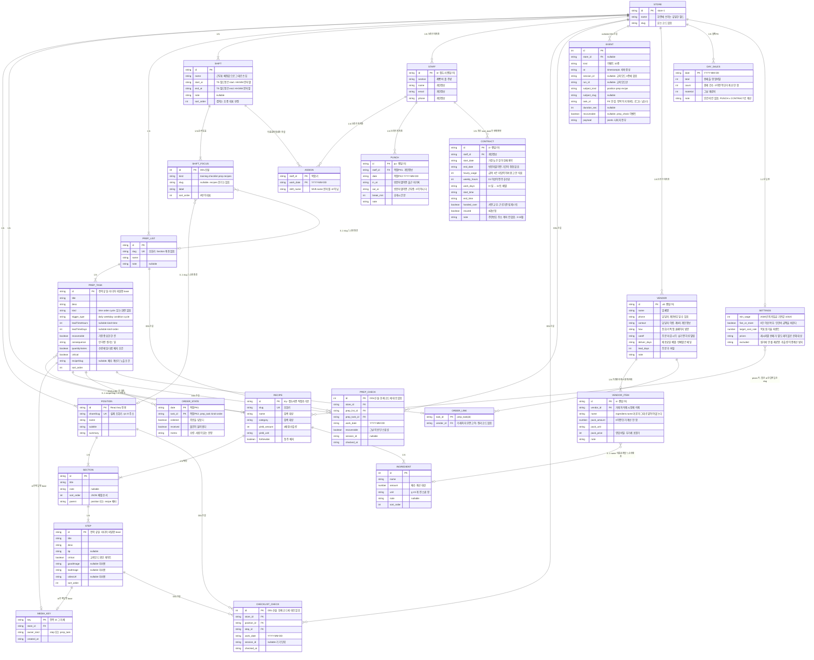

# 03. 데이터 모델 / ERD

> **2026-09-04 갱신** — 운영 기능 7종(원가·근태·출퇴근·매출·발주·거래처·근로계약서)이
> 추가되어 **localStorage 엔티티 9종이 늘었다.** → **3-A절** (3-14 ~ 3-22)
>
> 핵심은 **새 데이터를 거의 만들지 않았다**는 점이다. 원가는 `RECIPE × INGREDIENT ×
> VENDOR_ITEM`의 계산 결과이고 근태는 `ASSIGN × PUNCH × SHIFT`의 계산 결과라서,
> **둘 다 저장되지 않는다.** 그래서 엔티티 표에 없다.
>
> 새로 생긴 문제 둘:
> - **느슨한 참조가 하나 늘었다** — `VENDOR_ITEM.name` ↔ `INGREDIENT.name`.
>   기존 3건과 달리 **결과가 돈으로 나온다** (3-17절)
> - **저장소 키 8개가 늘었고 그중 6개에 삭제 경로가 없다** (6절)

| | |
|---|---|
| 작성일 | 2026-09-03 |
| 상태 | **초안** |
| 대상 | 매장수첩 |
| 기준 커밋 | `282c0a9` (master, HEAD) |
| 행 번호 기준 | 본문의 행 번호·인용은 **`4a9192d`에서 뽑았다.** 그 뒤 코드를 건드린 커밋은 `282c0a9`(*문서가 찾아낸 코드 버그 3건 수정*) 하나이고, 바뀐 파일은 `src/lib/types.ts` · `NowPanel.tsx` · `RecipeSearch.tsx` · `RosterView.tsx` · `ShootBoard.tsx` · `src/lib/copyText.ts`(신규) · `data/seed.json` **7개뿐**이다. 이 7개는 행 번호가 몇 줄 밀려 있고, 내용이 바뀐 서술(2절 `SHIFT_FOCUS` · 3-10절 · 5-2절 · 10-3절)은 갱신했다 |
| 근거 | `src/lib/types.ts`, `src/lib/repo.ts`, `src/lib/roster.ts`, `src/lib/localRecipes.ts`, `data/seed.json`, `src/app/api/log/route.ts`, `src/app/api/media/route.ts`, `src/lib/mediaProbe.ts`, `src/app/shoot/page.tsx`, `src/components/RecipeForm.tsx`, `src/components/NowPanel.tsx`, `src/components/RosterView.tsx`, `src/lib/copyText.ts`, ~~`public/app.html`~~ → `presentation/app.html` (V-05 조치로 `public/` 사본 삭제) |

이 문서는 **현재 코드가 실제로 다루는 데이터**를 그대로 옮긴 것이다. 설계 제안이 아니라 역설계 기록에 가깝다.

**코드에 없는 것이 섞여 있는 구간은 둘이다.** 8절 DDL은 통째로 신설 제안이고(절 제목에 표시), **2절 ERD는 그 DDL을 그린 것이다** — 2절 머리의 선언 참조. 현재 코드가 실제로 다루는 것만 보려면 **3절 속성 표**를 본다(신설 칸을 "DDL에서 신설"로 일일이 표시해 두었다). 다툼이 생기면 3절과 8절이 기준이다.

**기준 커밋 주의:** 초안이 한때 적어둔 `93307a4`는 틀린 값이었다. 그 커밋에는 `src/lib/mediaProbe.ts`·`src/app/api/media/route.ts`·`public/media/`가 아직 없고 PrepTask도 10개다(이 문서는 19개). 대조하려면 `282c0a9`를 받는다.

**제품명:** ✅ **2026-09-06에 `매장수첩`으로 확정.** 앱 title(`src/app/layout.tsx`)·문서·`presentation/` 파일명이 전부 같은 이름을 쓰고, `package.json` name은 `store-note`이다. "매장수첩"는 `presentation/` 폴더의 파일명·문서에만 쓰인다. ❓ 확인 필요 — 명칭 확정 여부.

---

## 1. 현재 구조 — RDB가 아니다

### 1-1. 실제 저장 위치

DB는 **`data/seed.json` 파일 하나**다. 접근은 전부 `src/lib/repo.ts`의 12개 함수를 통한다.

```ts
// src/lib/repo.ts:22-30
function load(): SeedData {
  // 개발 중에는 seed.json을 고칠 때마다 바로 반영되도록 캐시하지 않는다.
  if (cache && process.env.NODE_ENV === "production") return cache;
  const file = path.join(process.cwd(), "data", "seed.json");
  const parsed = JSON.parse(fs.readFileSync(file, "utf-8")) as SeedData;
  cache = parsed;
  return parsed;
}
```

| 데이터 종류 | 저장 위치 | 근거 |
|---|---|---|
| 매장·포지션·레시피·프렙·근무조 | `data/seed.json` (읽기 전용) | `src/lib/repo.ts:26` |
| 체크 상태 / 교육 진도 | 브라우저 localStorage / sessionStorage | 6절 |
| 직접 추가한 레시피 | 브라우저 localStorage `sop:recipes` | `src/lib/localRecipes.ts:14` |
| 직원 명단 · 근무 배정 | 브라우저 localStorage `sop:roster` | `src/lib/roster.ts:29` |
| 이벤트 로그 | `data/events.jsonl` (append) | `src/app/api/log/route.ts:27` |
| 사진·영상 | `public/media/` 파일명 규약 | `src/lib/mediaProbe.ts` |
| **발표용 단일 파일** | **`presentation/app.html`** · **`presentation/매장수첩.html`** — 시드 전체(매장·포지션·레시피·프렙·근무조)가 인라인된 단일 파일 HTML. ~~`public/app.html`~~ 은 **2026-09-04에 삭제**했다(V-05, `528a75b`) — `public/` 아래에 있어 배포하면 `/app.html`로 열렸다. `presentation/`은 웹으로 서빙되지 않는다 | `presentation/app.html`의 `const DATA = {`, `ls public/app.html` → No such file |

⚠️ **단일 파일 HTML은 `data/seed.json`의 두 번째 사본이고, 동기화되지 않는다.** 시드에 있는 `t-open-5`가 이 파일에는 없고, 프렙 업무 id도 시드는 `p-1`인데 이 파일은 `p1`이다. 저장 키도 다르다(6-4절). 즉 **같은 데이터의 두 판본이 서로 모르는 채로 저장소에 들어 있다.**

> ### ★ 2026-09-04에 이 갈라짐이 실제로 버그를 냈다
>
> 운영 기능 7종을 단일 파일로 이식할 때, Next 앱 코드를 그대로 옮겼더니 두 곳이 깨졌다.
>
> | 앱 | 단일 파일 | 결과 |
> |---|---|---|
> | `recipe.id` 있음 | **없음. `slug`만 있다** | `prices[r.id]` → `prices[undefined]`. **네 메뉴가 판매가 한 칸을 공유**하고, 하나를 펼치면 전부 펼쳐졌다 |
> | `PrepTask.kind` 있음 | **없음** (축약 스키마: `hours`/`days`/`conseq`/`varies`) | `t.kind === "order"` → **발주 목록이 통째로 비었다** |
>
> **이 표가 경고한 위험이 그대로 현실화된 사례다.** 서버 DB로 옮길 때 두 판본을 하나로 합치는 것이 이 문서의 가장 실질적인 권고다.

✅ ~~**Next는 `public/`을 사이트 루트로 서빙한다.** 배포하면 이 파일이 `/app.html`로 열린다~~ → **해소됨 (2026-09-04).** `public/app.html`을 삭제했고, 함께 `public/robots.txt`를 신설하고 `src/app/layout.tsx:10`에 전역 `noindex`를 넣었다. 상세: `06_보안설계.md` V-05 · `02_화면설계서.md` 2-1절.

### 1-2. 이 구조의 한계 — 실측된 것만

| # | 한계 | 근거 |
|---|---|---|
| 1 | **쓰기 경로가 없다.** `repo.ts`에 write 함수가 0개다. 내용 수정은 JSON 파일 직접 편집 | `src/lib/repo.ts` 전량 |
| 2 | **조회가 전부 선형 탐색.** `getPositionBySlug`·`getRecipeBySlug`·`getPrepListBySlug`가 `Array.find()` | `repo.ts:41,64,72` |
| 3 | **참조 무결성이 없다.** slug 문자열 매칭이고 검증 코드가 없다. 없는 slug를 써도 `undefined`로 조용히 넘어간다 | `PrepView.tsx:271` |
| 4 | **교대 인계가 안 된다.** 오픈조가 태블릿에서 체크한 오후 프렙을 마감조가 다른 기기로 열면 0/5다. 리드타임이 이 제품의 핵심 주장인데 "어제 콜드브루를 걸었나"를 기기 밖에서 확인할 방법이 없다 | 6절 |
| 5 | **주기 점검이 매일 리셋된다.** 저장 키에 날짜가 박혀 있어(`prep:{slug}:{YYYY-MM-DD}`) 120일 주기 정수 필터 체크가 매일 0으로 돌아간다. 마지막 수행일을 저장하는 곳이 없다 | `PrepView.tsx:133` |
| 6 | **사장님이 신입 진도를 볼 수 없다.** 체크는 신입 기기에만 쌓이고 돌아오지 않는다 | 6절 |
| 7 | **근무표 전체가 태블릿 한 대에 있다.** 직원 이름·이메일·전화번호가 `sop:roster` 하나에 들어 있어 기기 초기화 = 전부 유실 | `src/lib/roster.ts:29` |
| 8 | **저장 실패가 조용하다.** 6종 전부 try/catch로 삼킨다. 사파리 사생활 보호 모드에서 앱은 정상으로 보이는데 아무것도 저장되지 않는다 | `roster.ts:62`, `localRecipes.ts:31` 등 |
| 9 | **배포하면 이벤트가 0건이 된다.** `/api/log`가 서버 파일 append이고, 실패해도 `{ok:true}`를 반환한다 | `api/log/route.ts:27-32` (코드 주석이 직접 인정) |
| 10 | **단일 매장 전제가 타입에 박혀 있다.** `SeedData.store`가 배열이 아니라 객체 하나고 `getStore()`는 인자를 받지 않는다 | `types.ts:196`, `repo.ts:32` |
| 11 | `data/events.jsonl` 58줄은 **전부 개발 중 본인 조작 기록**이다. 교체 전 버거집 slug(`grill-day1` 등)가 섞여 있다 | `data/events.jsonl` |

### 1-3. 참고 — `README.md`의 SQL 초안은 근거로 쓸 수 없다

`README.md:86-100`의 스키마는 데이터 모델 v2(2026-08-31) **이전** 것이다.

| README 초안 | 현재 `types.ts` |
|---|---|
| `task.image_url text` 1개 | `goodImage` + `badImage` 2개 |
| 테이블 5개 (store/position/section/task/event) | 필요 엔티티 11개 이상 |
| — | `recipe`, `ingredient`, `prep_list`, `prep_task`, `shift`, `shift_focus`, `staff`, `assign` 8개가 빠져 있다 |
| `event(position_id, ...)` | 이벤트 10종. `prepSlug`·`recipeSlug`·`runId`·`taskId`를 담을 칸이 없다 |

이 문서의 8절 DDL이 그 초안을 대체한다.

---

## 2. 전체 ERD

> ### 이 그림은 무엇인가
> **현재 코드의 구조 + 8절 DDL이 신설하는 테이블 3종이다. 8절 DDL의 최종 스키마가 아니다.**
>
> **2026-09-07 갱신 — 운영 기능 8종을 그림에 넣었다.** 이전까지 `PUNCH`·`CONTRACT`·`VENDOR`·`VENDOR_ITEM`·`DAY_SALES`·`ORDER_STATE`·`ORDER_LINK`·`SETTINGS`는 **3-A절 표에만 있고 그림에는 없었다**(`00_진행표.md` 정합성 #3). 이제 그림 한 장이 전체를 덮는다.
>
> 한 문장으로: *"JSON 시드 · 브라우저 저장소 · 이벤트 파일에 흩어져 있는 지금의 데이터가 어떻게 물려 있는지"*를 한 장에 모으고, 거기에 **지금 대응물이 없어 8절 DDL이 새로 만드는 테이블 3종**(`MEDIA_KEY`·`CHECKLIST_CHECK`·`PREP_CHECK`)을 얹어 그린 것이다.
> 그래서 ⓐ 코드에 없는 **칸**이 일부 들어 있고 ⓑ 코드에 없는 **테이블**도 그려져 있다. 속성명은 **TS 타입·시드의 이름 그대로**다.
>
> **⚠️ 이 그림대로 테이블을 만들면 안 된다.** 8절 DDL은 여기서 **느슨한 문자열 참조 4건을 없앤다**(8-1절 #2·#3·#4·#5). 그림에는 그 **변경 전** 상태가 그려져 있다.
>
> | 그림 (현재 코드) | 8절 DDL | 8-1절 |
> |---|---|---|
> | `STEP.desc` | `descr` (`desc`가 SQL 예약어) | #2 |
> | `PREP_TASK.recipeSlug` 느슨한참조 | `recipe_id text references recipe(id)` | #3 |
> | `SHIFT_FOCUS.slug` 느슨한참조 | `position_id`/`prep_list_id` 두 FK | #4 |
> | `ASSIGN.shift_name` 이름문자열 | `shift_id text references shift(id)` | #5 |
| **`VENDOR_ITEM.name` 이름문자열** ↔ `INGREDIENT.name` | `ingredient_id`? **❓ 미결정 — 한 재료를 여러 거래처에서 사는 경우를 함께 정해야 한다** | **#6 (신설)** |
>
> **DDL이 만들 최종 스키마는 8절 본문이 유일한 기준이다.** 지금 코드가 실제로 다루는 칸은 3절 속성 표에서 본다.

점선 박스로 표시할 수 없으므로, 무엇이 코드에 있고 무엇이 DDL 신설인지 아래 표로 나눈다.

| 구분 | 엔티티 |
|---|---|
| `data/seed.json`에 있음 (서버 데이터) | `STORE` `POSITION` `SECTION` `STEP` `RECIPE` `INGREDIENT` `PREP_LIST` `PREP_TASK` `SHIFT` `SHIFT_FOCUS` |
| 브라우저 localStorage에만 있음 | `STAFF` `ASSIGN` (`sop:roster`. 3-11·3-12절) |
| **브라우저 localStorage에만 있음 (2026-09-04 추가)** | `PUNCH` `CONTRACT` `VENDOR` `VENDOR_ITEM` `DAY_SALES` `ORDER_STATE` `ORDER_LINK` `SETTINGS` — **8종 모두 그림에 있다 (2026-09-07 추가).** `OWNER_PIN`은 **일부러 뺐다** (엔티티가 아니고 서버로 안 옮긴다. 3-22절) |
| 파일에만 있음 | `EVENT` (`data/events.jsonl` 무스키마 append. 7절) |
| **코드에 대응물이 아예 없다 — DDL 신설** | `MEDIA_KEY` (지금은 파일명 규약이 대신한다. 3-13절) · **`CHECKLIST_CHECK`** · **`PREP_CHECK`** (지금은 localStorage 날짜 키뿐. **1-2절 한계 #4·#5·#6이 이 둘로 풀린다**) |

**칸 수준에서 코드에 없는 것:** `sort_order`(9개 테이블) · `SECTION.parent` · `INGREDIENT.id` · `SHIFT_FOCUS.id` · 전 테이블의 `store_id` · `RECIPE.origin` · `SHIFT.crosses_midnight` · `STAFF.deleted_at`. 이유는 8-1절에 하나씩 적었다.

`prep_task_last_done`(주기 점검의 마지막 수행일)은 **테이블이 아니라 뷰**라 그리지 않았다. `prep_check`를 집계한다 — 8절 DDL 참조.

**`OWNER_PIN`도 그리지 않았다 — 9종 중 이것 하나만 뺐다.** 엔티티가 아니라 브라우저 키 두 개(`sop:ownerPin`·`sop:ownerOpen`)이고, **서버로 옮기지 않기로 이미 정해져 있다** — 잠금은 Supabase RLS + 실제 인증으로 대체된다(3-22절). 그림은 8절 DDL로 가는 길을 그린 것이므로, 옮기지 않을 것을 그리면 DDL을 만들 때 잘못 옮긴다.



**`EVENT`는 지금 파일(`data/events.jsonl`)의 키 이름이 아니라 8절 DDL의 컬럼으로 그렸다.** 현재 JSONL은 스키마가 없고 `positionSlug`·`prepSlug`·`recipeSlug`·`confirmedCount`·`totalTasks`·`scale`·`askedSenior`·`mode`가 이벤트 종류마다 다르게 붙는다. **이 8개가 `subject_kind`+`subject_slug`와 `payload`(jsonb)로 접힌다** — 7-2절이 현재 필드 조합을, 7-5절이 접는 규칙을 적었다.

**`CHECKLIST_CHECK`·`PREP_CHECK`는 지금 코드에 없다.** 체크는 브라우저 localStorage의 날짜 키(`sop:{shareSlug}:{날짜}` / `prep:{slug}:{날짜}`)에만 쌓이고 기기 밖으로 나가지 않는다. 이 두 테이블이 생겨야 **교대 인계**(마감조가 오픈조의 체크를 본다)와 **점주의 진도 확인**이 성립한다. `PREP_CHECK.recoverable`은 그날의 판단을 스냅샷으로 남기는 칸이다 — 나중에 `prep_task.recoverable`을 고쳐도 과거 기록이 흔들리지 않는다. 8절 DDL·9절 단계 4·5 참조.

**`MEDIA_KEY`에는 파일 경로 칸이 없다.** `key`(= 항목 id) 하나로 `{id}-good.jpg` · `{id}-bad.jpg` · `{id}.mp4`를 **유도할 뿐 저장하지 않는다**(`mediaProbe.ts:23-29`, `47-53`). 파일명 3종은 파생값이다. 이 표는 8절 DDL의 `media_key` 테이블과 컬럼이 같다 — ERD만 보고 경로 컬럼을 만들면 안 된다. 3-13절 참조.

### 2-1. 실측 개수 (`data/seed.json`, Node 집계)

| 엔티티 | 개수 | 세부 |
|---|---|---|
| Store | 1 | `store-1` / `○○ 베이커리 카페` / `our-cafe` |
| Position | 3 | `cafe-open` / `cafe-close` / `bakery-morning` |
| Section | 19 | 포지션 9 + 레시피 10. id 전부 유일 (2026-09-10) |
| Step | 58 | **시드 기준 2026-09-10.** 포지션 26 + 레시피 32. 매장이 레시피를 직접 추가하면 **브라우저가 Section·Step을 런타임에 더 만든다** → 3-4절 |
| Recipe | 10 | `americano` `cafe-latte` `cold-brew` `shokupan` + 바 부재료 6(`levain` 계열·청·냉침차·밀크티·시럽·크림폼). **10개 모두 `forNewbie: true`** (숫자 정본: [21_화면명세.md §1-b](21_화면명세.md)) |
| Ingredient | 13 | 단위는 `g`, `ml` 두 종류만 |
| PrepList | 3 | `afternoon`(카드 5 + 옵션 6) / `evening`(3) / `cycle`(묶음 3 + 항목 13) |
| PrepTask | 30 | `recoverable: false` **8개** (숫자 정본: [21_화면명세.md §1-b](21_화면명세.md)) |
| Shift | 4 | 제빵 05:00–13:00 / 오픈조 07:30–15:30 / 미들 11:00–19:00 / 마감조 14:30–22:30 |
| ShiftFocus | 7 | **training 1 / checklist 2 / prep 2 / recipes 2** (`282c0a9`에서 `position` 3건이 `training` 1 + `checklist` 2로 갈렸다 — 5-2절) |
| Staff · Assign | 0 | 서버에 없다. 브라우저 저장 |
| ChecklistCheck · PrepCheck | **—** | **DDL 신설 테이블이라 현재 데이터가 없다.** 체크는 브라우저 날짜 키에만 있다 |
| 미디어 파일 | **0건** | ⚠️ **2026-09-04 `528a75b`(보안 조치)에서 투명 PNG 2개가 지워졌다.** 지금 `public/media/`에는 `촬영목록.md` 뿐이다 — **실사 0장** |

### 2-2. ERD를 읽을 때 반드시 알아야 하는 것 6가지

| # | 사실 | 근거 |
|---|---|---|
| 1 | **조회 키는 `id`가 아니라 `shareSlug`/`slug`다.** `Position.id`·`PrepList.id`·`Shift.id`는 React key로만 쓰인다 | `repo.ts:41,64,72` |
| 2 | **`PrepList`에는 `Section` 계층이 없다.** 포지션·레시피는 2단(Section→Step), 프렙은 1단(List→Task) | `types.ts:151-158` |
| 3 | **Step 58 + PrepTask 30 = 88개 id가 전역 유일해야 한다.** 소비처가 둘이다. ① 미디어 파일명이 `public/media/{id}-good.jpg`로 컨테이너 구분 없이 평면에 놓인다. ② `/shoot`의 `PRIORITY` 맵이 step id와 prep_task id를 **한 네임스페이스로 섞어 조회한다**(4절). 측정 확인(2026-09-10): 88개 전부 유일 (숫자 정본: [21_화면명세.md §1-b](21_화면명세.md)) | `mediaProbe.ts:53-59`, `shoot/page.tsx:14-19` |
| 4 | **`goodImage`/`badImage`/`videoUrl`은 필드로 존재하나 읽는 코드가 0개다.** grep 결과 출현은 `types.ts` 정의와 `RecipeForm.tsx:92-94`(항상 `null` 채움)뿐. 시드에 `goodImage` 3건이 `/photos/*.svg`를 가리키지만 화면에 안 나온다 | grep 확인 |
| 5 | **`Store.slug`와 `Store.id`는 어디서도 읽지 않는다.** 읽히는 건 `store.name`뿐이다 | grep 확인 |
| 6 | **`PrepTask.kind`(리드타임 3축)를 읽는 화면도 0개다.** 시드 19건에 빠짐없이 채워져 있지만(`time` 4 / `order` 2 / `cycle` 13) 화면의 실제 구분은 `recoverable`과 `leadTimeHours`/`leadTimeDays`의 유무로 이뤄진다. `src/` 전체에서 `kind`의 출현은 `types.ts` 정의뿐이고 `NowPanel.tsx:20`의 `f.kind`는 `ShiftFocus`다. **3축 개념 자체는 제품 논리로 유효하다** — 3-8절·11절 #1 | grep 확인 |

---

## 3. 엔티티별 속성 표

타입은 왼쪽이 현재 TypeScript, 오른쪽이 8절 DDL에서 쓸 PostgreSQL 타입이다.
개인정보 열: **●** = 개인정보, **△** = 의사 식별자(개인 특정은 안 되지만 기기·회차 추적), 빈칸 = 아님.

### 3-1. `store` — `src/lib/types.ts:189-193`

| 컬럼 | TS / PG 타입 | 널 | 기본값 | 설명 | 개인정보 |
|---|---|---|---|---|---|
| `id` | string / `text` | X | — | `store-1`. **읽는 코드 없음** | |
| `name` | string / `text` | X | — | 화면 상단 매장명. **실제로 쓰이는 유일한 필드** | |
| `slug` | string / `text` | X | — | `our-cafe`. **읽는 코드 없음** | |

### 3-2. `position` — `types.ts:46-54`

| 컬럼 | TS / PG 타입 | 널 | 기본값 | 설명 | 개인정보 |
|---|---|---|---|---|---|
| `id` | string / `text` | X | — | `pos-open` 등. React key 전용 | |
| `share_slug` | string / `text` | X | — | **실제 조회 키.** `/p/{slug}`, `/t/{slug}` 주소. localStorage 키의 일부 | |
| `name` | string / `text` | X | — | 오픈조 / 마감조 / 제빵 | |
| `subtitle` | string / `text` | X | — | 교육 모드 시작화면 부제 | |
| `summary` | string / `text` | X | — | 교육 모드 시작화면 안내문 | |
| `sort_order` | (배열 순서) / `int` | X | `0` | JSON 배열 순서. **DDL에서 신설** | |

### 3-3. `section` — `types.ts:35-40`

`Position`과 `Recipe`가 **같은 타입을 공유한다.** 부모가 둘이다.

| 컬럼 | TS / PG 타입 | 널 | 기본값 | 설명 | 개인정보 |
|---|---|---|---|---|---|
| `id` | string / `text` | X | — | React key | |
| `position_id` | (없음) / `text` | O | `null` | 부모가 포지션일 때. **DDL에서 신설** | |
| `recipe_id` | (없음) / `text` | O | `null` | 부모가 레시피일 때. **DDL에서 신설** | |
| `title` | string / `text` | X | — | 섹션 제목. 교육 모드에서 `sectionTitle`로 평탄화 (`TrainingMode.tsx:52-57`) | |
| `note` | string \| null / `text` | O | `null` | 체크리스트 헤더 안내문. 시드 13개 중 7개 채워짐 | |
| `sort_order` | (배열 순서) / `int` | X | `0` | **DDL에서 신설** | |

`position_id`와 `recipe_id`는 **정확히 하나만 non-null**이어야 한다 → CHECK 제약 (8절).

### 3-4. `step` — `types.ts:19-33`

| 컬럼 | TS / PG 타입 | 널 | 기본값 | 설명 | 개인정보 |
|---|---|---|---|---|---|
| `id` | string / `text` | X | — | `t-open-1` 등. **전역 유일 필수** (미디어 파일명 base). **시드만이 아니다 — 로컬 레시피의 step id는 브라우저가 발급한다** (아래) | |
| `section_id` | (계층) / `text` | X | — | 부모 섹션 | |
| `title` | string / `text` | X | — | 항목 제목 | |
| `desc` | string / `text` | X | — | 설명 | |
| `tip` | string \| null / `text` | O | `null` | "선배 한마디" | |
| `critical` | boolean / `boolean` | X | `false` | 위생·안전. 교육 모드 확인 게이트(`TrainingMode.tsx:111`), `꼭 지키기` 배지 | |
| `good_image` | string \| null / `text` | O | `null` | **미사용.** 읽는 코드 0개 | |
| `bad_image` | string \| null / `text` | O | `null` | **미사용** | |
| `video_url` | string \| null / `text` | O | `null` | **미사용.** `README.md:78`의 유튜브 안내는 현재 코드에서 동작하지 않는다 | |
| `sort_order` | (배열 순서) / `int` | X | `0` | **DDL에서 신설** | |

**⚠️ `step.id`는 시드에만 있는 것이 아니다 — 브라우저가 런타임에 발급한다.** 매장이 `/r/new`에서 레시피를 추가하면 `RecipeForm.tsx:68-99`가 이렇게 만든다.

| 만들어지는 것 | 값 | 근거 |
|---|---|---|
| `recipe.id` = `recipe.slug` | `my-` + 랜덤 8자 (`newLocalId()`) | `RecipeForm.tsx:68,72-73` |
| `section.id` | `` `${id}-sec` `` | `RecipeForm.tsx:83` |
| `step.id` | `` `${id}-s0` ``, `-s1`, … (`my-xxxxxxxx-s0`) | `RecipeForm.tsx:87` |

그리고 **그 step id가 그대로 미디어 조회 키가 된다** — `RecipeDetail.tsx:203`이 `<MediaSlot base={step.id} />`를 그리고, 로컬 레시피도 같은 `RecipeDetail`로 그려진다(`LocalRecipeView.tsx:43`). 즉 미디어 파일명 네임스페이스는 시드 88개로 닫혀 있지 않다. 8절 DDL이 `step`에 `(id, owner_kind) → media_key(key, owner_kind)` 복합 FK를 걸었으므로, **이관 시 로컬 레시피의 step 행을 넣기 전에 `owner_kind='step'`인 `media_key` 행을 먼저 넣어야 한다**(9절 단계 6).

### 3-5. `recipe` — `types.ts:69-82`

| 컬럼 | TS / PG 타입 | 널 | 기본값 | 설명 | 개인정보 |
|---|---|---|---|---|---|
| `id` | string / `text` | X | — | `rec-americano` 등. `my-` 접두사면 직접 추가분 (`localRecipes.ts:49`) | |
| `slug` | string / `text` | X | — | `/r/{slug}` 조회 키. `prep_task.recipe_slug`의 참조 대상 | |
| `name` | string / `text` | X | — | 메뉴명. 검색 대상 | |
| `category` | string / `text` | X | — | 음료 / 베이커리 / 브런치. 검색 대상 + 분류 칩 | |
| `yield_amount` | number / `numeric` | X | — | 1배합 산출량. 인라인 객체 `yield.amount`였다 | |
| `yield_unit` | string / `text` | X | — | `잔` `ml` `개` | |
| `for_newbie` | boolean / `boolean` | X | `false` | `첫 주` 배지. 시드 4개 모두 true | |
| `origin` | (없음) / `text` | X | `'seed'` | `seed` / `store`. 로컬 레시피 통합용. **DDL에서 신설** | |
| `sort_order` | (배열 순서) / `int` | X | `0` | **DDL에서 신설** | |

`sections`가 **빈 배열이어도 저장된다** (`RecipeForm.tsx:80,98` — 만드는 순서를 안 채워도 저장 가능).

### 3-6. `ingredient` — `types.ts:60-67`

| 컬럼 | TS / PG 타입 | 널 | 기본값 | 설명 | 개인정보 |
|---|---|---|---|---|---|
| `id` | (없음) / `bigserial` | X | 자동 | 현재 식별자가 없다. 배열 원소다 | |
| `recipe_id` | (계층) / `text` | X | — | 부모 레시피 | |
| `name` | string / `text` | X | — | 재료명 | |
| `amount` | number / `numeric` | X | — | **배수 계산 대상.** `scaled(amount, scale)` (`scale.ts:12`) | |
| `unit` | string / `text` | X | — | 폼의 단위 목록은 `g, ml, 개, 잔, 스쿱, 장` (`RecipeForm.tsx:23`). 시드 실측은 `g`, `ml` 둘뿐 | |
| `note` | string \| null / `text` | O | `null` | `60%`, `1:10` 등. 배수와 무관하게 그대로 표시. 13개 중 12개 채워짐 | |
| `sort_order` | (배열 순서) / `int` | X | `0` | **DDL에서 신설** | |

`amount`가 `number`라서 "적당히"를 넣을 수 없다 — `types.ts:62`에 의도된 제약으로 주석이 있다.

### 3-7. `prep_list` — `types.ts:151-158`

| 컬럼 | TS / PG 타입 | 널 | 기본값 | 설명 | 개인정보 |
|---|---|---|---|---|---|
| `id` | string / `text` | X | — | `prep-afternoon` 등 | |
| `slug` | string / `text` | X | — | `/prep/{slug}` 조회 키. localStorage 키의 일부. `shift_focus.slug` 참조 대상 | |
| `name` | string / `text` | X | — | 오후 프렙 / 주기 점검 | |
| `note` | string \| null / `text` | O | `null` | "14:00~15:30. 대부분 내일을 위한 일입니다." | |
| `sort_order` | (배열 순서) / `int` | X | `0` | **DDL에서 신설** | |

### 3-8. `prep_task` — `types.ts:114-149` (필드 15개, 이 모델의 중심)

| 컬럼 | TS / PG 타입 | 널 | 기본값 | 설명 | 개인정보 |
|---|---|---|---|---|---|
| `id` | string / `text` | X | — | `p-1` … `c-13`. **전역 유일 필수** | |
| `prep_list_id` | (계층) / `text` | X | — | 부모 목록 | |
| `title` | string / `text` | X | — | 업무명 | |
| `desc` | string / `text` | X | — | 설명 | |
| `kind` | LeadTimeKind / `text` | X | — | `time`(4) / `order`(2) / `cycle`(13). CHECK 제약. ⚠️ **읽는 화면이 0곳이다** — 아래 참조 | |
| `trigger_type` | Trigger.type / `text` | X | — | `daily`(3) / `weekday`(1) / `condition`(2) / `cycle`(13). 판별 컬럼 → 5절 | |
| `trigger_at` | string / `time` | O | `null` | `daily`·`weekday`만. `"14:00"` | |
| `trigger_days` | number[] / `smallint[]` | O | `null` | `weekday`만. 0=일 … 6=토 | |
| `trigger_when` | string / `text` | O | `null` | `condition`만. 사람이 읽는 문장 | |
| `trigger_every_days` | number / `int` | O | `null` | `cycle`만. 7~365 | |
| `lead_time_hours` | number \| null / `int` | O | `null` | `kind=time`. `readyAt()`이 "내일 07:43부터 사용 가능" 계산 (`PrepView.tsx:63`) | |
| `lead_time_days` | number \| null / `int` | O | `null` | `kind=order`. `arrivesIn()`이 토·일을 배송일로 세지 않는다 (`PrepView.tsx:87`) | |
| `recoverable` | boolean / `boolean` | X | `true` | **이 프로젝트에서 가장 중요한 한 칸** (`types.ts:127`). false = 돈으로 못 되돌린다. `irreversibleTasks()`가 이것만 필터 (`repo.ts:82`) | |
| `consequence` | string / `text` | X | — | 안 하면 생기는 일. 화면에 "안 하면 —"으로 그대로 출력 | |
| `quantity_varies` | boolean / `boolean` | X | `false` | **`수량 매일 다름` 배지 노출 조건.** 읽는 곳이 여기 하나뿐이고 배수 계산기와는 무관하다 (`PrepView.tsx:329`) | |
| `critical` | boolean / `boolean` | X | `false` | 위생·안전 | |
| `good_image` | string \| null / `text` | O | `null` | **미사용** | |
| `bad_image` | string \| null / `text` | O | `null` | **미사용** | |
| `video_url` | string \| null / `text` | O | `null` | **미사용** | |
| `recipe_slug` | string \| null / `text` | O | `null` | **배수 계산기 노출 조건.** 이 slug가 실존 레시피로 풀릴 때만 "오늘 몇 배?" 블록이 붙는다 (`PrepView.tsx:270-272` → `405`). 실측 2건 (`p-1`→`cold-brew`, `p-2`→`shokupan`) | |
| `sort_order` | (배열 순서) / `int` | X | `0` | **DDL에서 신설** | |

**⚠️ `quantity_varies`와 배수 계산기는 무관하다.** 화면을 다시 만들 때 가장 틀리기 쉬운 곳이다. 실측: `quantityVaries: true` 5건(`p-1` `p-2` `p-4` `p-5` `p-6`) 중 배수 버튼이 실제로 뜨는 것은 `recipeSlug`가 있는 `p-1`·`p-2` **2건뿐**이다. `p-4`·`p-5`·`p-6`은 배지만 뜨고 계산기는 없다.

**`PrepTask`는 `Step`을 상속하지 않고 필드를 중복 정의한다.** 겹치는 것 7개: `id`, `title`, `desc`, `critical`, `goodImage`, `badImage`, `videoUrl`.

**⚠️ `kind`는 죽은 필드다 — 읽는 화면이 하나도 없다.** `src/` 전체 grep에서 `kind`의 출현은 `types.ts:118`의 정의뿐이고, `NowPanel.tsx:20`의 `f.kind`는 `PrepTask`가 아니라 `ShiftFocus`다. **화면의 실제 구분은 두 칸이 대신한다** — 경고 세기는 `recoverable`, 리드타임 문장은 `lead_time_hours`/`lead_time_days`의 유무다(`PrepView.tsx:352`, `:368`). 즉 A축은 `hours`가 채워진 항목, B축은 `days`가 채워진 항목, C축은 둘 다 `null`인 항목으로 갈린다.
→ **3축 개념 자체는 유효하다.** 시드 19건에 빠짐없이 채워져 있고 제품 논리의 뼈대다(`01_MVP기획서.md` §5.2). 다만 **"화면이 `kind`로 갈라진다"고 쓰면 사실과 다르다.** 죽은 필드 목록은 2-2절 #6과 11절 #1.

**`kind`와 `trigger_type`은 직교하지도 않는다.** `cycle`이 양쪽에서 똑같이 13건이고, `kind:"cycle"` 항목이 전부 `trigger.type:"cycle"`이다. 현재 데이터에서는 중복 정보다. ❓ 확인 필요 — 두 칸을 유지할지, `kind`를 파생으로 볼지, 아예 지울지(8-2절 #1).

**`recoverable`과 `kind`도 1:1이 아니다.** `p-6`(원두 발주)은 `kind:order`인데 `recoverable:false`다. 거래 로스터리 원두는 쿠팡으로 대체할 수 없기 때문이다. 즉 **경고의 기준은 축이 아니라 `recoverable` 한 칸이다.** "A축=위험, B축=안전"으로 단순화하면 코드와 어긋난다.

### 3-9. `shift` — `types.ts:174-185`

| 컬럼 | TS / PG 타입 | 널 | 기본값 | 설명 | 개인정보 |
|---|---|---|---|---|---|
| `id` | string / `text` | X | — | `sh-bakery` 등 | |
| `name` | string / `text` | X | — | 제빵 / 오픈조 / 미들 / 마감조. **근무표 배정값으로 그대로 저장된다** (`RosterView.tsx:346-350`) | |
| `start_at` | string / `time` | X | — | `"05:00"`. `toMinutes()`가 `split(":")`으로 파싱 — 형식 검증 없음 (`NowPanel.tsx:15`) | |
| `end_at` | string / `time` | X | — | `"13:00"` | |
| `note` | string \| null / `text` | O | `null` | NowPanel 비고 | |
| `sort_order` | (배열 순서) / `int` | X | `0` | **JSON 배열 순서가 겹치는 조 중 대표를 정한다.** `shifts.filter()`가 순서를 보존하고(`NowPanel.tsx:48-50`) 그 결과의 `i === 0`만 주황 강조를 받는다(`NowPanel.tsx:116`). 근무 시간 밖 fallback도 배열 첫 원소다(`NowPanel.tsx:61` `?? shifts[0]`). **DDL에서 신설** | |

**⚠️ 시드 4개 조는 시간이 겹친다.** 측정 확인 — 제빵 05:00–13:00 ∩ 오픈조 07:30–15:30 ∩ 미들 11:00–19:00, 오픈조 ∩ 마감조 14:30–22:30, 미들 ∩ 마감조. 겹치는 5쌍이 나온다. 예컨대 11:00–13:00에는 제빵·오픈조·미들 3개가 동시에 `active`다. **그중 어느 카드가 대표(주황)인지는 배열 순서가 정한다.** 그래서 `shift`의 배열 순서는 표시 순서가 아니라 동작이다 — 8-1절 #1이 `sort_order`를 넣어야 하는 이유가 `shift_focus`뿐이 아니다.

**자정을 넘기는 조를 `toMinutes()` 비교가 처리하지 못한다.** 현재 시드 4개는 전부 같은 날 안에서 끝나므로 드러나지 않는다. ❓ 확인 필요 — 심야 조가 실제로 있는지.

### 3-10. `shift_focus` — `types.ts:169-172`

| 컬럼 | TS / PG 타입 | 널 | 기본값 | 설명 | 개인정보 |
|---|---|---|---|---|---|
| `id` | (없음) / `bigserial` | X | 자동 | 현재 인라인 배열 원소 | |
| `shift_id` | (계층) / `text` | X | — | 부모 조 | |
| `kind` | ShiftFocus.kind / `text` | X | — | `training`(1) / `checklist`(2) / `prep`(2) / `recipes`(2) | |
| `slug` | string / `text` | O | `null` | **`recipes` 분기에는 없다** — 이 유니온의 존재 이유 | |
| `label` | string / `text` | X | — | 버튼에 뜨는 글자 | |
| `sort_order` | (배열 순서) / `int` | X | `0` | **`0`번이 대표.** 단 조건이 `fi === 0`이 아니라 **`i === 0 && fi === 0`**이다(`NowPanel.tsx:116`) — **대표 조의 0번 focus 하나만** 주황이 된다. 겹치는 시간대의 2·3번째 조는 focus[0]도 회색이다 → **DDL에서 필수** | |

`focusHref()` 라우팅 (`NowPanel.tsx:19-30`): `training → /t/{slug}`(교육 모드) / `checklist → /p/{slug}`(체크리스트) / `prep → /prep/{slug}` / `recipes → /r` 고정.

✅ **해결됨 (`282c0a9`).** 이전 초안은 "오픈조 focus[0] 라벨이 `오픈 체크리스트`인데 목적지가 `/t/cafe-open`(교육 모드)이고, `/p/`로 보내는 `ShiftFocus`가 시드에 하나도 없다"를 결함으로 적었다. `kind`가 둘로 갈리면서 시드의 오픈조·마감조가 `checklist`로 바뀌어 **라벨과 목적지가 일치한다.**

### 3-11. `staff` — `src/lib/roster.ts:11-18` **(서버 데이터 아님. localStorage)**

**이 표가 유일한 개인정보 테이블이다.** 10절 참조.

| 컬럼 | TS / PG 타입 | 널 | 기본값 | 설명 | 개인정보 |
|---|---|---|---|---|---|
| `id` | string / `text` | X | — | `newStaffId()` = `"st-" + 랜덤7자` (`roster.ts:66`) | |
| `section` | string / `text` | X | `''` | 제빵 / 바 / 홀 / 주방. 빈 문자열이면 `bySection()`에서 "미지정"으로 모인다 | ● |
| `name` | string / `text` | X | — | 직원 이름. **추가 시 유일한 필수 입력** | ● |
| `email` | string / `text` | X | `''` | 빈 문자열이면 메일 발송 대상에서 제외 (`RosterView.tsx:97`) | ● |
| `phone` | string / `text` | X | `''` | 전화번호 | ● |

`loadRoster()`에 **하위 호환 코드가 있다** — 구버전의 `role` 필드를 `section`으로 읽는다 (`roster.ts:46`). 필드명이 `role` → `section`으로 바뀐 이력이 있다.

### 3-12. `assign` — `roster.ts:21` **(서버 데이터 아님. localStorage)**

현재 형태: `Record<staffId, Record<"YYYY-MM-DD", string>>`.

| 컬럼 | TS / PG 타입 | 널 | 기본값 | 설명 | 개인정보 |
|---|---|---|---|---|---|
| `staff_id` | (객체 키) / `text` | X | — | 복합 PK 1 | ● |
| `work_date` | (객체 키) / `date` | X | — | 복합 PK 2. `"YYYY-MM-DD"` | ● |
| `shift_name` | string / — | X | `''` | **현재는 `Shift.name` 문자열.** `""`(`OFF` 상수)가 휴무 | ● |
| `shift_id` | (없음) / `text` | X | — | **DDL에서 이것으로 교체.** 휴무는 행을 만들지 않는다 | ● |

**가장 명백한 정규화 대상이다.** 지금은 조 이름을 고치면 기존 배정이 전부 고아가 된다.

### 3-13. `media_key` — 필드가 아니라 파일명 규약 (`src/lib/mediaProbe.ts`)

ERD에서 가장 오해를 사기 쉬운 부분이다. 데이터에 경로를 적지 않기로 했고(`mediaProbe.ts:2-8`), **미디어의 조회 키는 `step.id` / `prep_task.id` 그 자체**다.

| 슬롯 | 파일명 | 허용 확장자 | 근거 |
|---|---|---|---|
| 좋은 예 | `{id}-good.{ext}` | jpg, jpeg, png, webp | `mediaProbe.ts:13,53` |
| 나쁜 예 | `{id}-bad.{ext}` | jpg, jpeg, png, webp | 동일 |
| 영상 | `{id}.{ext}` | mp4, mov, webm | `mediaProbe.ts:14` |

동작: `GET /api/media`가 `public/media/` 파일명 목록을 반환(dotfile·`.md` 제외) → `mediaProbe`가 프로세스당 **한 번만** 받아 `Set`에 담음(`manifest ??=`) → `MediaSlot base={id}`가 그 안에서 이름을 찾는다. 없으면 `hasAny()`가 막아 **아무것도 그리지 않는다** (`MediaSlot.tsx:31`).

**키 발급 주체가 둘이다.** 시드(`data/seed.json`)의 88개 id와, **브라우저가 로컬 레시피를 만들 때 발급하는 `my-xxxxxxxx-s0` 형태의 step id**(`RecipeForm.tsx:87`, 3-4절)다. 후자도 `MediaSlot base={step.id}`로 같은 네임스페이스를 쓴다(`RecipeDetail.tsx:203`). 즉 **이 레지스트리는 시드만 채워서는 완성되지 않는다.**

**현재 상태(2026-09-10):** `public/media/`에 **`촬영목록.md` 하나뿐이다.** 투명 픽셀 2개는 `528a75b`(2026-09-04 보안 조치)에서 지워졌다. 즉 **88개 항목 중 0개** — 배관은 완성돼 있고 **콘텐츠가 0건**이다. 이건 내가 못 메운다(사장님이 찍어야 한다).

`public/photos/`의 SVG 8개는 어느 화면에서도 쓰이지 않는다(버거집 시절 플레이스홀더).

---


---

## 3-A. 운영 기능 엔티티 (2026-09-04 추가) — 전부 localStorage

> ### ★ 이 9종의 공통점 — 새 데이터를 거의 만들지 않았다
>
> 화면은 7개가 늘었지만 **엔티티 사이의 새 관계는 대부분 기존 것에 붙었다.**
>
> | 새 엔티티 | 무엇에 붙는가 | 연결 방식 |
> |---|---|---|
> | `PUNCH` | `STAFF` + `ASSIGN`(계획) + `SHIFT`(시작 시각) | `staff_id` + `date` |
> | `CONTRACT` | `STAFF` | `staff_id` |
> | `VENDOR_ITEM` | `INGREDIENT` | ⚠️ **이름 문자열 일치** (느슨한 참조) |
> | `ORDER_STATE` | `PREP_TASK` (`kind = "order"`) | `task_id` |
> | `ORDER_LINK` | `PREP_TASK` ↔ `VENDOR` | `task_id` → `vendor_id` |
> | `SETTINGS.prices` | `RECIPE` | ⚠️ 앱은 `recipe.id` 키, 단일 파일은 `recipe.slug` 키 |
>
> **원가는 엔티티가 아니라 계산 결과다.** `RECIPE × INGREDIENT × VENDOR_ITEM`을 곱해서
> 나오며 저장되지 않는다 (`src/lib/cost.ts`). 근태도 마찬가지로
> `ASSIGN × PUNCH × SHIFT`의 계산 결과다 (`judgeDay()`). 그래서 이 둘은 표에 없다.

### 3-14. `punch` — `src/lib/attendance.ts:23-35` **(개인정보 · 근로기준법 보존 대상)**

현재 형태: `Record<staffId, Record<"YYYY-MM-DD", Punch>>` — `ASSIGN`과 **같은 모양으로 맞췄다.**

| 컬럼 | TS / PG 타입 | 널 | 기본값 | 설명 | 개인정보 |
|---|---|---|---|---|---|
| `id` | string / `text` | X | — | `"pu-" + 랜덤7자` | |
| `staff_id` | string / `text` | X | — | → `staff(id)`. 복합 PK 1 | ● |
| `date` | string / `date` | X | — | `"YYYY-MM-DD"`. 복합 PK 2 | ● |
| `in_at` | string / `time` | X | `''` | `"07:28"`. 빈 문자열이면 출근 미기록 | ● |
| `out_at` | string / `time` | X | `''` | 빈 문자열이면 **근무 중** (0이 아니다) | ● |
| `break_min` | number / `integer` | X | `0` | 휴게시간(분). 근로시간에서 뺀다 | ● |
| `note` | string / `text` | X | `''` | | ● |

> ⚠️ **`out_at`이 `in_at`보다 작을 수 있다.** 자정을 넘기는 마감조(23:00 → 01:00)다.
> `workedMinutes()`가 `b + 1440 - a`로 처리한다. **RDB로 옮길 때 `time` 두 칸으로 두면
> 같은 함정이 서버에도 생긴다** — `timestamptz` 두 칸으로 바꾸는 편이 안전하다.
> 테스트로 고정: `tests/attendance.test.ts` "자정을 넘겨도 음수가 나오지 않는다".

### 3-15. `contract` — `src/lib/contracts.ts:28-50` **(개인정보 · 급여 정보)**

현재 형태: `Contract[]`. 한 직원에게 여러 계약이 있을 수 있고,
**시작일이 가장 늦은 것이 현재 계약**이다 (`contractOf()`).

| 컬럼 | TS / PG 타입 | 널 | 기본값 | 설명 | 개인정보 |
|---|---|---|---|---|---|
| `id` | string / `text` | X | — | `"ct-" + 랜덤7자` | |
| `staff_id` | string / `text` | X | — | → `staff(id)` | ● |
| `start_date` | string / `date` | X | `''` | 계약 시작일 | ● |
| `end_date` | string / `date` | X | `''` | **빈 문자열 = 기간의 정함이 없는 근로계약** | ● |
| `hourly_wage` | number / `integer` | X | `0` | **시급(원).** `0`은 "미입력"이며 최저임금 경고를 띄우지 않는다 | ● **급여** |
| `weekly_hours` | number / `integer` | X | `0` | 1주 소정근로시간. **15 이상이면 주휴수당 발생** | ● |
| `work_days` | number[] / `smallint[]` | X | `[]` | 0=일 … 6=토 | ● |
| `start_time` | string / `time` | X | `''` | 소정 근로시간대 시작 | ● |
| `end_time` | string / `time` | X | `''` | | ● |
| `handed_over` | boolean / `boolean` | X | `false` | ★ **서면 교부 여부.** 근로기준법 제17조 | ● |
| `insured` | boolean / `boolean` | X | `false` | 4대보험 가입 | ● |
| `note` | string / `text` | X | `''` | 수습 기간·담당 업무 | ● |

> ### ★ 없는 칸이 중요하다
>
> **주민등록번호·주소·계좌번호 칸이 없다.** 개인정보보호법 제24조의2가 암호화 저장을
> 요구하는데 localStorage로는 못 맞춘다. 이유를 `contracts.ts:1-24`에 코드와 함께 남겼다.
> **RDB로 옮길 때도 이 결정을 그대로 유지할 것** — 서버에 올리면 암호화는 가능해지지만
> 그때는 "법령상 근거"를 먼저 확정해야 한다.
>
> ⚠️ **퇴사일 칸도 없다.** `end_date`는 계약 종료일이지 퇴사일이 아니다.
> 근로기준법 제42조의 3년 보존은 퇴사일부터 기산하므로 **보존 만기를 정확히 계산할 수 없다.**
> `keepUntil()`은 `end_date || start_date` + 3년으로 근사한다.

### 3-16. `vendor` — `src/lib/vendors.ts:16-36`

| 컬럼 | TS / PG 타입 | 널 | 기본값 | 설명 | 개인정보 |
|---|---|---|---|---|---|
| `id` | string / `text` | X | — | `"vd-" + 랜덤7자` | |
| `name` | string / `text` | X | `''` | 업체명 | |
| `phone` | string / `text` | X | `''` | ⚠️ 업체 대표번호일 수도, **담당자 개인 휴대번호**일 수도 있다 | ●? |
| `contact` | string / `text` | X | `''` | ⚠️ **담당자 이름** — 제3자의 개인정보다 | ● |
| `how` | string / `text` | X | `'전화'` | 전화 / 카톡 / 앱 / 홈페이지 / 방문 | |
| `cutoff` | string / `time` | X | `'15:00'` | **주문 마감 시각.** 넘기면 주문일이 하루 밀린다 | |
| `deliver_days` | number[] / `smallint[]` | X | `[1..6]` | 배송 요일. **빈 배열은 "매일"로 해석** (`arrivalOf()`) | |
| `lead_days` | number / `integer` | X | `1` | 주문 후 며칠 | |
| `note` | string / `text` | X | `''` | 최소 주문금액·계좌 | |

### 3-17. `vendor_item` — `src/lib/vendors.ts:45-56` **(영업비밀 — 매입 단가)**

| 컬럼 | TS / PG 타입 | 널 | 기본값 | 설명 |
|---|---|---|---|---|
| `id` | string / `text` | X | — | `"vi-" + 랜덤7자` |
| `vendor_id` | string / `text` | X | — | → `vendor(id)`. 거래처 삭제 시 **함께 삭제** (`removeVendor()`) |
| `name` | string / `text` | X | `''` | ⚠️ **`ingredient.name`과 글자 그대로 같아야** 원가가 붙는다 |
| `pack_amount` | number / `numeric` | X | `0` | 한 번에 사는 수량. **`0`이면 단가 계산을 하지 않는다** (0으로 나누기 방지) |
| `pack_unit` | string / `text` | X | `'g'` | 그 수량의 단위 |
| `pack_price` | number / `integer` | X | `0` | 그 한 팩의 값(원, 부가세 포함가) |
| `note` | string / `text` | X | `''` | |

> ### ⚠️ 느슨한 참조 — 8-1절 목록에 한 건 추가된다
>
> `vendor_item.name` ↔ `ingredient.name`이 **이름 문자열로 이어진다.**
> `PREP_TASK.recipeSlug`(#3)·`SHIFT_FOCUS.slug`(#4)·`ASSIGN.shift_name`(#5)과 같은 종류이고,
> **여기서는 결과가 돈으로 나온다.**
>
> - "우유"와 "멸균우유"를 자동으로 잇지 않는다 (일부러 그렇게 했다 — 이었으면 원가가 틀린다)
> - 재료명을 고치면 그 재료의 단가가 조용히 사라지고, 원가율이 **낮아진다**
> - `findItemByName()`은 `trim()`만 하고 그 외에는 정확히 일치해야 한다
>
> **DDL로 옮길 때:** `ingredient`에 안정적인 id를 주고 `vendor_item.ingredient_id`로
> 참조하는 것이 맞다. 다만 **한 재료를 여러 거래처에서 사는 경우**(원두를 두 곳에서)를
> 어떻게 다룰지 함께 정해야 한다 — 지금 `findItemByName()`은 **먼저 찾은 것 하나만** 쓴다.
> ❓ 미결정.

### 3-18. `day_sales` — `src/lib/sales.ts:18-27` **(영업비밀)**

현재 형태: `Record<"YYYY-MM-DD", DaySales>`.

| 컬럼 | TS / PG 타입 | 널 | 기본값 | 설명 |
|---|---|---|---|---|
| `date` | string / `date` | X | — | PK |
| `total` | number / `integer` | X | `0` | 총매출(원) |
| `count` | number / `integer` | X | `0` | 결제 건수. **`0`이면 객단가를 계산하지 않는다** |
| `material` | number / `integer` | X | `0` | 그날 재료비(보통 발주 금액) |
| `note` | string / `text` | X | `''` | 비·행사·기계 고장 — 나중에 왜 그랬는지 알려면 필요하다 |

> **인건비 칸이 없다.** 물어보지 않고 `PUNCH × CONTRACT`에서 계산한다 (`dayLaborCost()`).
> 마감 입력을 세 칸으로 유지하려는 결정이고, 그 이상 요구하면 안 쓴다는 판단이다.

### 3-19. `order_state` — `src/lib/orders.ts:19-26`

현재 형태: `Record<"YYYY-MM-DD", Record<taskId, OrderState>>`.

| 컬럼 | TS / PG 타입 | 널 | 기본값 | 설명 |
|---|---|---|---|---|
| `date` | string / `date` | X | — | 복합 PK 1 |
| `task_id` | string / `text` | X | — | 복합 PK 2. → `prep_task(id)` (`kind = "order"`인 것) |
| `ordered` | boolean / `boolean` | X | `false` | 주문을 넣었다 |
| `received` | boolean / `boolean` | X | `false` | 물건이 들어왔다 |
| `memo` | string / `text` | X | `''` | 수량 — 사람이 읽는 문장 ("우유 12팩") |

> ### ★ 왜 칸이 두 개인가
> 종이 체크리스트는 "주문함"까지만 적는다. 그런데 사고는 대개
> **주문은 했는데 안 들어온 것을 아침에 모르는 데서** 난다.
> `pendingFrom()`이 `ordered && !received`인 지난 7일치를 찾아 화면 맨 위에 띄운다.
> **이 한 칸이 종이가 못 하는 일이다.**

### 3-20. `order_link` — `src/lib/orders.ts:32`

`Record<taskId, vendorId>` — `PREP_TASK` ↔ `VENDOR`의 **다대일 연결**.
발주 문구를 거래처별로 모을 때 쓴다.

| 컬럼 | TS / PG 타입 | 널 | 설명 |
|---|---|---|---|
| `task_id` | string / `text` | X | PK. → `prep_task(id)` |
| `vendor_id` | string / `text` | X | → `vendor(id)`. ⚠️ 거래처를 지우면 **이 연결이 고아가 된다** (정리 코드 없음) |

### 3-21. `settings` — `src/lib/settings.ts:10-42` (단일 행)

| 컬럼 | TS / PG 타입 | 널 | 기본값 | 설명 |
|---|---|---|---|---|
| `min_wage` | number / `integer` | X | `10320` | 최저임금 시급. **2026년 적용액.** 코드에 박지 않고 기본값으로만 둔다 — 해마다 바뀐다 |
| `five_or_more` | boolean / `boolean` | X | **`false`** | ★ 상시 근로자 5인 이상 여부. **이 한 칸이 인건비 금액을 바꾼다** (근로기준법 제11조·제56조) |
| `target_cost_rate` | number / `numeric` | X | `30` | 목표 원가율(%) |
| `prices` | `Record<string,number>` / 별도 테이블 | X | `{}` | 레시피별 판매가. **키가 앱은 `recipe.id`, 단일 파일은 `recipe.slug`다** |
| `excluded` | string[] / 별도 테이블 | X | `[]` | ★ 원가에 세지 않을 재료 이름 |

> ### ★ `excluded`가 왜 필요한가 — 이 모델에서 가장 미묘한 칸
>
> 아메리카노 레시피에 **`원두 (도징) 18g`과 `추출량 36g`이 둘 다 있다.**
> 추출량은 사는 재료가 아니라 **원두 18g이 나온 결과**다. 그런데 원가 화면이
> "단가가 없는 재료"로 세어서 **"채우세요"라고 권했다.** 채우면 원두가 두 번 계산된다.
>
> 즉 이 칸은 **레시피 모델의 구조적 문제를 덮는 우회로다.**
> 근본 해법은 `ingredient`에 "구매 대상인가 / 계산 결과인가"를 구분하는 판별 칸을 두는 것이다
> (`PREP_TASK.kind`와 같은 방식).
> ❓ **미결정. `types.ts`의 `Ingredient`를 고치는 일이라 시드도 함께 바꿔야 한다.**
> 현재 동작은 테스트로 고정: `tests/cost.test.ts` "제외하지 않으면 원두가 두 번 계산된다".

### 3-22. `owner_pin` — `src/lib/ownerGate.ts:21-38 (키 상수 + digest())` **(가리개. 접근 통제가 아니다)**

| 키 | 저장소 | 값 | 설명 |
|---|---|---|---|
| `sop:ownerPin` | localStorage | `string` | FNV-1a 계열 단방향 요약값(36진수). **평문 아님.** 암호학적 해시도 아니다 |
| `sop:ownerOpen` | **sessionStorage** | `"1"` | 잠금 해제 상태. **브라우저를 닫으면 사라진다** |

> ⚠️ **RDB 이전 시 이 두 키는 옮기지 않는다.** 서버가 붙으면 잠금은
> **Supabase Row Level Security + 실제 인증**으로 대체되어야 한다.
> 지금 구조는 검사가 브라우저 안에서 돌고 데이터는 평문이므로 접근 통제가 아니다.
> `ownerGate.ts:1-19`에 같은 말을 코드 주석으로 남겼다.

---

## 4. 관계와 카디널리티 정리

| 관계 | 카디널리티 | 구현 방식 | FK 제약 | 실측 |
|---|---|---|---|---|
| Store → Position | 1:N | 배열 | 없음(단일 매장) | 1:3 |
| Store → Recipe | 1:N | 배열 | 없음 | 1:4 |
| Store → PrepList | 1:N | 배열 | 없음 | 1:2 |
| Store → Shift | 1:N | 배열 | 없음 | 1:4 |
| Position → Section | 1:N | 배열 | 계층 | 3:9 |
| Recipe → Section | 1:N | 배열 | 계층 | 4:4 |
| Section → Step | 1:N | 배열 | 계층 | 13:38 |
| Recipe → Ingredient | 1:N | 배열 | 계층 | 4:13 |
| PrepList → PrepTask | 1:N | 배열 | 계층 | 2:19 |
| Shift → ShiftFocus | 1:N | 배열(**순서 유의미**) | 계층 | 4:7 |
| **PrepTask → Recipe** | 0..1 : 1 | `recipeSlug` 문자열 | **없음** | 2건 |
| **ShiftFocus → Position** | 0..1 : 1 | `slug` 문자열 | **없음** | 3건 |
| **ShiftFocus → PrepList** | 0..1 : 1 | `slug` 문자열 | **없음** | 2건 |
| **Assign → Shift** | N:1 | `Shift.name` 문자열 | **없음** | 0건 |
| Staff → Assign | 1:N | 중첩 객체 | 없음 | 0건 |
| **PRIORITY → Step / PrepTask** | N:1 | **코드에 하드코딩된 id 문자열** | **없음** | 4건 |

**느슨한 참조 5곳 전부 검증 코드가 없다.** 넷은 `seed.json` 안에 있고, 다섯 번째는 **소스 코드 안에 있다.** 깨졌을 때의 결과:

| 참조 | 깨지면 | 근거 |
|---|---|---|
| `prep_task.recipe_slug` | `recipeBySlug.get()`이 `undefined` → 배수 계산기가 조용히 안 붙는다 | `PrepView.tsx:270-271` |
| `shift_focus.slug` (→ position) | 404 링크가 된다 | `NowPanel.tsx:19-28` |
| `shift_focus.slug` (→ prep_list) | 동일 | 동일 |
| `assign` 값 | 조 이름을 고치면 기존 배정이 전부 고아 | `roster.ts:21` |
| **`/shoot`의 `PRIORITY` 4건** | **`먼저` 배지가 조용히 사라진다.** `PRIORITY[st.id]`가 `undefined`가 될 뿐 에러가 없다 | `shoot/page.tsx:14-19`, 사용처 `32`·`43`·`53` |

**`PRIORITY`가 특이한 이유:** 이 맵은 **step id와 prep_task id를 한 네임스페이스로 섞어 조회한다.** 실측 — `t-open-5`(포지션 step), `s-lt-2`(레시피 step), `t-bake-1`(포지션 step), `p-1`(prep_task). 네 id 모두 시드에 실존한다(측정 확인). 2-2절 #3의 "88개 id 전역 유일"이 미디어 파일명 말고도 필요한 두 번째 이유가 여기다.

```ts
// src/app/shoot/page.tsx:14-19 — 시드가 아니라 코드에 박혀 있다
const PRIORITY: Record<string, string> = {
  "t-open-5": "추출 테스트 합격 기준",
  "s-lt-2": "스팀 밀크 온도·거품",
  "t-bake-1": "르방·발효 완료 판단",
  "p-1": "콜드브루 거는 장면",
};
```

**Section의 다중 부모가 이 모델의 가장 큰 설계 결정이다.** 선택지 셋:

| 안 | 방식 | 장 / 단 |
|---|---|---|
| (a) | `section(parent_type, parent_id)` 다형 참조 | 단순 / **FK 제약을 못 건다** |
| (b) | `position_section` / `recipe_section` 테이블 분리 | FK 명확 / `step`도 갈라져야 하거나 `step`이 다형이 된다 |
| **(c)** | `section(position_id nullable, recipe_id nullable)` + CHECK | **코드 변경이 가장 적다**(타입 하나 공유를 유지) / 컬럼 하나가 항상 비어 있다 |

현 코드가 `Section` 타입 하나를 양쪽에서 공유하므로 **(c)를 채택한다.** 8절 DDL이 (c)다.

---

## 5. 유니온 타입을 RDB로 — 판별 컬럼 + 널 허용 컬럼

유니온 3개(`Trigger`, `ShiftFocus`, `LeadTimeKind`) 중 페이로드가 갈리는 것은 앞의 둘이다.

### 5-1. `Trigger` — 4분기 (`types.ts:104-112`)

현재 형태:

```ts
export type Trigger =
  | { type: "daily";     at: string }
  | { type: "weekday";   days: number[]; at: string }
  | { type: "condition"; when: string }
  | { type: "cycle";     everyDays: number };
```

**설계: 판별 컬럼 `trigger_type` + 널 허용 컬럼 4개 + CHECK 제약.**

`jsonb` 한 칸으로 넣는 방법도 있으나 채택하지 않는다. 스케줄러가 "지금 떠야 할 업무"를 물을 것이므로 `trigger_at`에 인덱스가 필요하고, `jsonb`로는 그 질의가 어색해진다.

| `trigger_type` | `trigger_at` | `trigger_days` | `trigger_when` | `trigger_every_days` | 화면 라벨 (`PrepView.tsx:105-120`) | seed |
|---|---|---|---|---|---|---|
| `daily` | **필수** | null | null | null | `매일 {at}` | 3 |
| `weekday` | **필수** | **필수** | null | null | `월·화·수·목·금 {at}` | 1 |
| `condition` | null | null | **필수** | null | `when` 문장 그대로 | 2 |
| `cycle` | null | null | null | **필수** | ≥365 → `1년마다`, ≥30 → `N개월마다`, 그 외 `N일마다` | 13 |

CHECK 제약 (8절 DDL에 포함):

```sql
CONSTRAINT prep_task_trigger_shape CHECK (
  CASE trigger_type
    WHEN 'daily'     THEN trigger_at IS NOT NULL AND trigger_days IS NULL
                          AND trigger_when IS NULL AND trigger_every_days IS NULL
    WHEN 'weekday'   THEN trigger_at IS NOT NULL AND trigger_days IS NOT NULL
                          AND trigger_when IS NULL AND trigger_every_days IS NULL
    WHEN 'condition' THEN trigger_when IS NOT NULL AND trigger_at IS NULL
                          AND trigger_days IS NULL AND trigger_every_days IS NULL
    WHEN 'cycle'     THEN trigger_every_days IS NOT NULL AND trigger_at IS NULL
                          AND trigger_days IS NULL AND trigger_when IS NULL
    ELSE false
  END
)
```

`trigger_days`는 `smallint[]`로 두고 값 범위(0~6)를 별도 CHECK로 건다. 요일을 행으로 쪼개는 안(`prep_task_weekday` 테이블)도 가능하지만, 최대 7개 원소이고 순서가 무의미하며 요일별 조회 요구가 아직 없어 배열로 둔다. ❓ 확인 필요 — "금요일에 떠야 할 업무" 질의가 필요해지면 쪼개야 한다.

### 5-2. `ShiftFocus` — 4분기 (`types.ts:169-176`)

```ts
export type ShiftFocus =
  /** 교육 모드 — 신입 첫날. 한 장씩 넘기며 보고, 진도는 남기지 않는다 */
  | { kind: "training";  slug: string; label: string }
  /** 체크리스트 — 매일 쓰는 것. 체크가 그날 날짜로 저장된다 */
  | { kind: "checklist"; slug: string; label: string }
  | { kind: "prep";      slug: string; label: string }
  | { kind: "recipes";   label: string };
```

`recipes` 분기에 `slug`가 없다는 것이 이 유니온의 존재 이유다.

| `kind` | `slug` | 라우팅 | seed |
|---|---|---|---|
| `training` | **필수** → `position(share_slug)` | `/t/{slug}` | 1 (제빵) |
| `checklist` | **필수** → `position(share_slug)` | `/p/{slug}` | 2 (오픈조·마감조) |
| `prep` | **필수** → `prep_list(slug)` | `/prep/{slug}` | 2 |
| `recipes` | **null** | `/r` 고정 | 2 |

⚠️ **`training`과 `checklist`는 참조 대상이 같다** — 둘 다 `position`을 가리키고, 다른 것은 목적지 화면뿐이다. 그래서 DDL에서 컬럼을 늘릴 필요가 없고 CHECK 조건만 갈라진다.

**참조 대상 테이블이 둘이라 다형 참조가 된다.** FK를 직접 걸 수 없으므로 두 안이 있다.

| 안 | 방식 |
|---|---|
| (a) | `slug text` 한 칸 + `kind` 판별 + **트리거로 존재 검증** |
| **(b)** | `position_id` / `prep_list_id` 널 허용 2칸 + CHECK로 `kind`와 일치 강제 |

**(b)를 채택한다.** 진짜 FK를 걸 수 있어 "404 링크" 결함이 DB 단계에서 막힌다. 8절 DDL이 (b)다.

```sql
CONSTRAINT shift_focus_shape CHECK (
  CASE kind
    WHEN 'training'  THEN position_id IS NOT NULL AND prep_list_id IS NULL
    WHEN 'checklist' THEN position_id IS NOT NULL AND prep_list_id IS NULL
    WHEN 'prep'      THEN prep_list_id IS NOT NULL AND position_id IS NULL
    WHEN 'recipes'   THEN position_id IS NULL AND prep_list_id IS NULL
    ELSE false
  END
)
```

### 5-3. `LeadTimeKind` — 3분기, 페이로드 없음 (`types.ts:95`)

값만 갈리므로 판별 컬럼 하나로 끝난다. 단 리드타임 컬럼과의 정합은 CHECK로 건다.

| `kind` | `lead_time_hours` | `lead_time_days` | 뜻 | seed |
|---|---|---|---|---|
| `time` | 채워짐 | null | 시간이 흘러야 완성 (콜드브루·반죽·르방) | 4 |
| `order` | null | 채워짐 | 주문해야 들어옴 (우유·원두) | 2 |
| `cycle` | null | null | 주기적으로 갈아줘야 함 (정수 필터·보건증) | 13 |

❓ 확인 필요 — 실측 시드는 위 표대로 깔끔하나, `kind=cycle`에 리드타임을 넣고 싶은 항목이 생길 수 있다. 그때는 이 CHECK를 느슨하게 한다.

### 5-4. `step`과 `prep_task`의 필드 중복 7개

`id`, `title`, `desc`, `critical`, `good_image`, `bad_image`, `video_url`이 겹친다. 공통 `task` 상위 테이블 + 1:1 확장으로 쪼갤 수 있으나, **8절 DDL은 두 테이블을 유지한다.** 이유:

1. 현 코드가 두 타입을 별개로 다루므로 변경 폭이 작다
2. 상위 테이블을 만들어도 컬럼 7개가 줄고 조인 하나가 늘어 실익이 작다
3. **다만 `id`는 두 테이블에 걸쳐 전역 유일해야 한다** (미디어 파일명 제약) → 이것만 `media_key` 레지스트리 테이블로 강제한다

---

## 6. 브라우저 저장소 스키마 (현재 구현. 전수)

`grep -rn "localStorage\|sessionStorage" src/`로 전수 확인. **`src/`(Next 앱)의 키는 14종이다** (2026-09-04에 6 → 14로 늘었다). 단일 파일 HTML은 키가 대부분 다르다 → 6-4절. (~~`public/app.html`~~ 은 삭제되어 **같은 오리진에서 함께 서빙되는 사본은 이제 없다.**)

| # | 키 형식 | 저장소 | 값 구조 | 만료 / 초기화 규칙 | 정의 위치 |
|---|---|---|---|---|---|
| 1 | `sop:sid` | localStorage | 문자열. `Math.random().toString(36).slice(2) + Date.now().toString(36)` | **없음 (영구)** | `ChecklistView.tsx:21`, `PrepView.tsx:27`, `RecipeDetail.tsx:18` — 같은 코드 3중복 |
| 2 | `sop:{shareSlug}:{YYYY-MM-DD}` | localStorage | `string[]` — 체크한 `step.id` 배열 (`Set`을 스프레드) | **날짜가 바뀌면 새 키가 되어 자동 초기화.** 옛 키는 지워지지 않고 남는다 | `ChecklistView.tsx:62` |
| 3 | `prep:{prepSlug}:{YYYY-MM-DD}` | localStorage | `string[]` — 체크한 `prep_task.id` 배열 | 동일 | `PrepView.tsx:133` |
| 4 | `sop:run:{shareSlug}` | **sessionStorage** | `{ runId: string; idx: number; startedAt: number(epoch ms); confirmed: string[] }` | 교육 완료 시 `removeItem`(`TrainingMode.tsx:83`). **탭을 닫으면 소멸** | `TrainingMode.tsx:62` |
| 5 | `sop:recipes` | localStorage | `Recipe[]` — 직접 추가한 레시피 전체 배열 | **없음.** 개별 삭제만 (`removeLocalRecipe`) | `localRecipes.ts:14` |
| 6 | `sop:roster` | localStorage | `{ staff: Staff[]; assign: Assign }` | **없음** | `roster.ts:29` |
| 7 | ⚠️ `sop:punch` | localStorage | `Record<staffId, Record<"YYYY-MM-DD", Punch>>` | **없음.** 삭제 코드 0건 | `attendance.ts:40` |
| 8 | ⚠️ `sop:contracts` | localStorage | `Contract[]` | **없음.** 개별 삭제만 | `contracts.ts:52` |
| 9 | `sop:settings` | localStorage | `Settings` (단일 객체) | **없음.** 삭제 경로 없음 | `settings.ts:44` |
| 10 | `sop:vendors` | localStorage | `{ vendors: Vendor[]; items: VendorItem[] }` | **없음.** 개별 삭제만 | `vendors.ts:63` |
| 11 | `sop:sales` | localStorage | `Record<"YYYY-MM-DD", DaySales>` | **없음.** 삭제 코드 0건 | `sales.ts:32` |
| 12 | `sop:orderLog` | localStorage | `Record<"YYYY-MM-DD", Record<taskId, OrderState>>` | **없음.** 삭제 코드 0건 | `orders.ts:34` |
| 13 | `sop:orderLinks` | localStorage | `Record<taskId, vendorId>` | **없음.** 삭제 코드 0건 | `orders.ts:35` |
| 14 | `sop:ownerPin` | localStorage | `string` (단방향 요약값) | **없음.** 재설정 경로 없음 | `ownerGate.ts:21` |
| 15 | `sop:ownerOpen` | **sessionStorage** | `"1"` | **브라우저를 닫으면 소멸** | `ownerGate.ts:22` |

> ### ⚠️ 새 8키 중 6개에 삭제 경로가 없다
>
> `sop:punch`·`sop:sales`·`sop:orderLog`·`sop:orderLinks`·`sop:settings`·`sop:ownerPin`.
> 이 중 **`sop:punch`가 가장 문제다** — 직원별 근로시간이 무기한 누적되는데 화면에서
> 지울 방법이 없다. 개인정보 파기 요구에 대응할 수 없다.
>
> 다만 **단순히 삭제 버튼을 만드는 것이 답이 아니다.** 출퇴근·계약은 근로기준법이 3년
> 보존을 요구하는 정보이기도 하다. 두 의무가 부딪치는 문제이고,
> [10 개인정보처리방침](10_개인정보처리방침.md) **3-5절**에서 따로 다룬다.
>
> **6-1절의 "6종 중 4번만 sessionStorage"는 이제 "15종 중 4번과 15번"이다.**
> 그리고 두 번째 sessionStorage(`sop:ownerOpen`)를 고른 이유도 첫 번째와 같다 —
> **공용 태블릿이라 영구히 남으면 안 되기 때문이다.**

### 6-1. 6종 중 4번만 sessionStorage인 이유

`TrainingMode.tsx:8-15`에 명시돼 있다 — 공용 태블릿에서 localStorage에 진도를 남기면 **앞사람 체크가 다음 신입에게 그대로 보인다.** 그래서 교육 모드만 sessionStorage + `runId`(시작할 때마다 새로 발급)를 쓴다. `CLAUDE.md`가 "검증 완료"로 표시한 몇 안 되는 항목이다.

### 6-2. 실패 처리

6종 전부 `try/catch`로 감싸고 실패 시 무시한다. `getSessionId()`는 실패 시 **`"no-storage"` 리터럴**을 반환하고(`ChecklistView.tsx:29`), 이 값이 이벤트 로그의 `sessionId`로 그대로 들어간다.

실패를 화면에 알리는 곳은 레시피 추가 한 군데뿐이다(`RecipeForm.tsx:102`).

### 6-3. 날짜 키 생성이 3중복이다

`todayKey()`가 `ChecklistView.tsx:13-18`과 `PrepView.tsx:19-24`에 **동일한 코드로** 중복 정의돼 있고, `roster.ts:70-74`의 `ymd(d: Date)`가 같은 일을 한다. 셋 다 `YYYY-MM-DD`, **로컬 타임존 기준**이다.

### 6-4. 단일 파일 HTML — 키가 대부분 다르지만 프렙 키 하나가 충돌한다

발표용 단일 파일 HTML은 저장소에 **두 벌** 있다.

| 파일 | 크기 | 서빙 여부 |
|---|---|---|
| `presentation/매장수첩.html` | 76,749 B | 안 됨. `file://`로만 연다 |
| ~~**`public/app.html`**~~ | **삭제됨 (2026-09-04, `528a75b`)** | — |

키 비교:

| 용도 | Next 앱 | 단일 HTML (`presentation/app.html` = `presentation/매장수첩.html`) |
|---|---|---|
| 체크리스트 | `sop:{shareSlug}:{날짜}` | `list:{slug}:{날짜}` (단일 파일 `renderChecklist()`) |
| 프렙 | `prep:{slug}:{날짜}` | **`prep:{slug}:{날짜}` — 같다** (단일 파일 `renderPrep()`) |
| 교육 진도 | `sop:run:{slug}` (sessionStorage) | **저장 안 함** |
| 로컬 레시피 | `sop:recipes` | `recipes:mine` (단일 파일 `myRecipes()`) |
| 근무표 | `sop:roster` | `roster` + `roster:mode` (단일 파일 `renderRoster()`) |
| 세션 id | `sop:sid` | **없음** |

**결론을 정정한다.** `file://`로 열면 오리진이 달라 분리되지만, **배포된 `/app.html`은 Next 앱과 같은 오리진이므로 프렙 키가 실제로 충돌한다.** 프렙 목록 slug도 양쪽 다 `afternoon`·`cycle`로 같아서(측정 확인) `prep:afternoon:2026-09-04` 한 키를 두 앱이 함께 쓴다. 값은 체크한 id의 `string[]`인데 항목 id가 서로 다르므로(`p-1` vs `p1`) 체크가 섞여 보이진 않고, **나중에 쓴 쪽이 앞선 쪽의 배열을 통째로 덮는다.** 오픈조가 `/prep/afternoon`에서 체크한 것이 누군가 `/app.html`을 열어 체크하면 사라진다.

나머지 4종(체크리스트·로컬 레시피·근무표·세션 id)은 키가 달라 섞이지 않는다.

~~**이건 저장 키만의 문제가 아니다.**~~ → ✅ **해소됨 (2026-09-04).** `public/app.html`을 삭제해 `/app.html` 노출 경로가 없어졌다(`528a75b`). 단일 파일은 `presentation/`에만 있고 그 폴더는 서빙되지 않는다.

**남아 있는 문제는 저장 키가 다르다는 것 자체다.** 같은 매장이 앱과 단일 파일을 번갈아 쓰면 데이터가 두 곳에 나뉘어 쌓이고 서로 안 보인다. 서버 DB로 옮길 때 키를 통일해야 한다.

### 6-5. 서버 이전 시 각 키의 행선지

| 키 | 행선지 | 비고 |
|---|---|---|
| `sop:sid` | 유지 (기기 식별용) | 서버로 옮기면 개인 식별 위험이 커진다 |
| `sop:{slug}:{날짜}` | `checklist_check` 테이블 신설 | 이걸 옮기면 "사장님이 신입 진도를 본다"가 가능해진다 |
| `prep:{slug}:{날짜}` | `prep_check` 테이블 신설 | **이걸 옮기면 교대 인계 문제가 풀린다.** 1-2절 #4 |
| `sop:run:{slug}` | 유지 (sessionStorage) | 공용 태블릿 전제 때문에 서버로 옮기면 안 된다 |
| `sop:recipes` | `recipe(origin='store')`로 흡수 | `my-` 접두사 → `origin` 컬럼으로 대체 |
| `sop:roster` | `staff` + `assign` 테이블 | **개인정보가 서버로 넘어가는 유일한 경로.** 10절 |

---

## 7. 이벤트 로그 스키마

### 7-1. 현재 수집 방식

`POST /api/log` (`src/app/api/log/route.ts`). **검증이 없다** — 받은 body를 그대로 받아 `at`만 붙인다.

```ts
const record = { ...body, at: new Date().toISOString() };
await fs.appendFile(file, `${JSON.stringify(record)}\n`, "utf-8");
```

- 잘못된 JSON만 400. 스키마 검증 없음
- 파일 쓰기 실패는 `catch {}`로 삼키고 **응답은 실패해도 `{ok:true}`**
- 저장소는 `data/events.jsonl` (JSON Lines)

### 7-2. 이벤트 10종 — 필드 조합 실측 (`data/events.jsonl` 58줄)

공통 필드: `event`(클라이언트), `at`(ISO 8601, **서버 생성**).

| event | `sessionId` | `runId` | 고유 필드 | 발생 위치 | 실측 |
|---|---|---|---|---|---|
| `view` | ● | — | `positionSlug` | `ChecklistView.tsx:77` | 6 |
| `survey` | 화면에 따라 갈림 | — | `positionSlug`, `askedSenior`, `mode?` | `ChecklistView.tsx:267` / `TrainingMode.tsx:219` | 4 |
| `training_start` | **없음** | ● | `positionSlug`, `totalTasks` | `TrainingMode.tsx:101` | 5 |
| `critical_confirm` | **없음** | ● | `positionSlug`, `taskId` | `TrainingMode.tsx:117` | 13 |
| `training_complete` | **없음** | ● | `positionSlug`, `durationSec`, `confirmedCount` | `TrainingMode.tsx:132` | 3 |
| `prep_view` | ● | — | `prepSlug` | `PrepView.tsx:158` | 12 |
| `prep_check` | ● | — | `prepSlug`, `taskId`, **`recoverable`** | `PrepView.tsx:168` | 2 |
| `prep_scale` | ● | — | `prepSlug`, `taskId`, `scale` | `PrepView.tsx:188` | 9 |
| `recipe_view` | ● | — | `recipeSlug` | `RecipeDetail.tsx:54` | 3 |
| `recipe_scale` | ● | — | `recipeSlug`, `scale` | `RecipeDetail.tsx:90` | 1 |

값 도메인:

| 필드 | 값 |
|---|---|
| `askedSenior` | `"0번"`, `"1~2번"`, `"3~5번"`, `"6번 이상"` 4개 리터럴. 두 화면에 **각각 하드코딩** (`ChecklistView.tsx:260`, `TrainingMode.tsx:213`) |
| `scale` | `SCALES = [0.5, 1, 1.5, 2, 3]` (`scale.ts:8`) |
| `mode` | 교육 모드 survey에만 `"training"`. **없으면 체크리스트다** |
| `recoverable` | boolean. `prep_check`에만 실린다 |

### 7-3. ⚠️ 조인이 불가능한 구간 — DB 이전과 같이 고쳐야 한다

**`TrainingMode`의 `log()`에는 `getSessionId()` 호출이 없다.** 다른 3개 컴포넌트와 비교하면 그 한 줄만 빠져 있다.

```ts
// TrainingMode.tsx:35   ← sessionId 없음
body: JSON.stringify({ event, ...payload }),
// PrepView.tsx:45 / ChecklistView.tsx:39 / RecipeDetail.tsx:36
body: JSON.stringify({ event, sessionId: getSessionId(), ...payload }),
```

공용 태블릿에서 기기 단위 추적을 피하려는 의도일 수 있다. 다만 결과가 이렇다:

- 교육 모드 `survey`는 `sessionId`도 없고 `runId`도 안 싣는다 (`TrainingMode.tsx:219-223`은 `positionSlug`, `askedSenior`, `mode`만)
- 따라서 `training_complete.durationSec`와 `survey.askedSenior`를 잇는 키가 **`positionSlug` + 시각 근접성뿐**이다
- `CLAUDE.md`의 검증 대상 가설이 "`training_complete.durationSec` + `survey`를 붙여서 본다"인데, **지금 데이터로는 붙일 수 없다**

**조치:** `TrainingMode`의 survey에 `runId`를 실으면 해결된다. 컬럼 추가가 아니라 한 줄 추가다. DB 이전과 동시에 하는 것이 맞다.

### 7-4. 현재 데이터의 성격

58줄 = `view` 6 / `survey` 4 / `training_start` 5 / `critical_confirm` 13 / `training_complete` 3 / `prep_view` 12 / `prep_scale` 9 / `prep_check` 2 / `recipe_view` 3 / `recipe_scale` 1.

**전부 로컬 개발 중 본인 조작 기록이다.** 첫 행의 `positionSlug`가 `grill-day1`·`fryer-day1`(교체 전 버거집 시드)다. **실사용 데이터는 0건.** 집계할 때는 `at`(≥ 2026-08-31)이나 slug로 걸러야 한다.

### 7-5. `event` 테이블 설계 — 넓은 테이블 + jsonb 병용

이벤트 10종의 페이로드가 다르다. 자주 질의하는 것만 컬럼으로 올리고 나머지는 `payload jsonb`에 둔다.

| 컬럼으로 올릴 것 | 이유 |
|---|---|
| `kind`, `at`, `session_id`, `run_id` | 조인·기간 집계의 축 |
| `subject_kind`, `subject_slug` | `positionSlug`/`prepSlug`/`recipeSlug`를 한 쌍으로 통합. 셋 중 하나만 오므로 컬럼 3개를 둘 필요가 없다 |
| `task_id` | `critical_confirm`, `prep_check`, `prep_scale` |
| `duration_sec` | 가설의 1차 지표 |
| `recoverable` | **H7("리드타임 항목은 종이로 못 잡는다")의 직접 지표.** 되돌릴 수 없는 항목을 실제로 체크했는지 셀 수 있다 |
| `payload jsonb` | `totalTasks`, `confirmedCount`, `scale`, `askedSenior`, `mode` 등 |

`subject_kind` 매핑:

| 원본 필드 | `subject_kind` |
|---|---|
| `positionSlug` | `position` |
| `prepSlug` | `prep` |
| `recipeSlug` | `recipe` |

**⚠️ `subject_slug`에 FK를 걸면 안 된다.** 로컬 레시피는 `slug`가 `my-xxxxxxxx`(브라우저 발급, 3-4절)이고, `RecipeDetail`이 로컬 레시피에도 그대로 쓰이므로 **`recipe_view`·`recipe_scale`이 서버에 존재하지 않는 slug를 `recipeSlug`로 싣는다**(`RecipeDetail.tsx:54`, `90`). 9절 단계 6(레시피 통합)을 마치기 전까지는 매칭되지 않는 `subject_slug` 행이 정상적으로 쌓인다. `task_id`에 FK를 걸지 않은 것과 같은 이유다.

---

## 8. 향후 PostgreSQL DDL **(아직 코드에 없다. 신설 제안)**

`package.json` 의존성은 `next`, `react`, `react-dom` 3개뿐이고 **Supabase는 미설치**다(`.env.example`에 주석으로만 존재). 아래는 이전 대상 스키마다.

멀티테넌트를 처음부터 넣는다. 지금은 매장이 1곳이지만 `store_id`를 나중에 끼우려면 전 테이블과 `repo.ts` 12개 함수를 다 고쳐야 한다.

```sql
-- =====================================================================
--  매장수첩 스키마 v1
--  근거: src/lib/types.ts (데이터 모델 v2, 2026-08-31)
--        src/lib/roster.ts (staff / assign)
--  작성: 2026-09-03 · 상태: 초안
-- =====================================================================

create extension if not exists "pgcrypto";

-- ---------------------------------------------------------------------
-- 1. 매장
-- ---------------------------------------------------------------------
create table store (
  id          text primary key,
  name        text not null,
  slug        text not null unique,
  created_at  timestamptz not null default now()
);

-- ---------------------------------------------------------------------
-- 2. 미디어 키 레지스트리
--
--    step.id 와 prep_task.id 는 전역 유일해야 한다.
--    public/media/{id}-good.jpg 처럼 컨테이너 구분 없이 평면에 놓이므로
--    (src/lib/mediaProbe.ts:53) 컨테이너 안에서만 유일한 id로는 파일이
--    충돌한다. 두 테이블에 걸친 유일성을 이 테이블이 강제한다.
--
--    ⚠️ key 를 primary key 로 두고 step.id / prep_task.id 가 각각
--    references media_key(key) 를 거는 것만으로는 부족하다. 그러면 두
--    테이블이 같은 key 행을 함께 참조할 수 있어 동일 id 가 step 과
--    prep_task 에 동시에 존재한다 — 막으려던 파일명 충돌이 그대로 난다.
--    그래서 (key, owner_kind) 를 unique 로 잡고, 참조하는 두 테이블에
--    값이 고정된 owner_kind 컬럼을 둔 뒤 복합 FK 로 건다. 한 key 는
--    owner_kind 가 정한 한쪽 테이블에서만 쓰일 수 있다.
-- ---------------------------------------------------------------------
create table media_key (
  key         text primary key,
  store_id    text not null references store(id) on delete cascade,
  owner_kind  text not null check (owner_kind in ('step','prep_task')),
  created_at  timestamptz not null default now(),

  -- 복합 FK 의 대상. key 가 이미 PK 라 행 자체는 안 늘지만,
  -- 이 unique 가 없으면 아래 두 테이블의 복합 FK 를 걸 수 없다.
  constraint media_key_owner_uniq unique (key, owner_kind)
);

-- ---------------------------------------------------------------------
-- 3. 포지션 — 체크리스트 / 교육 모드
--    조회 키는 id 가 아니라 share_slug 다 (src/lib/repo.ts:41)
-- ---------------------------------------------------------------------
create table position (
  id          text primary key,
  store_id    text not null references store(id) on delete cascade,
  share_slug  text not null,
  name        text not null,
  subtitle    text not null default '',
  summary     text not null default '',
  sort_order  int  not null default 0,
  created_at  timestamptz not null default now(),
  updated_at  timestamptz not null default now(),
  constraint position_share_slug_uniq unique (store_id, share_slug)
);

-- ---------------------------------------------------------------------
-- 4. 레시피
-- ---------------------------------------------------------------------
create table recipe (
  id            text primary key,
  store_id      text not null references store(id) on delete cascade,
  slug          text not null,
  name          text not null,
  category      text not null,
  yield_amount  numeric(10,2) not null check (yield_amount > 0),
  yield_unit    text not null,
  for_newbie    boolean not null default false,
  -- 'seed'  = 시드 데이터
  -- 'store' = 매장이 직접 추가 (기존 localStorage sop:recipes + my- 접두사)
  origin        text not null default 'seed' check (origin in ('seed','store')),
  sort_order    int  not null default 0,
  created_at    timestamptz not null default now(),
  updated_at    timestamptz not null default now(),
  constraint recipe_slug_uniq unique (store_id, slug)
);

-- ---------------------------------------------------------------------
-- 5. 섹션 — 부모가 포지션 또는 레시피다 (types.ts 가 Section 타입을 공유)
--    4절 (c)안: 널 허용 2칸 + CHECK 로 정확히 하나만 non-null
-- ---------------------------------------------------------------------
create table section (
  id           text primary key,
  position_id  text references position(id) on delete cascade,
  recipe_id    text references recipe(id)   on delete cascade,
  title        text not null,
  note         text,
  sort_order   int  not null default 0,
  constraint section_one_parent check (
    (position_id is not null and recipe_id is null) or
    (position_id is null     and recipe_id is not null)
  )
);

-- ---------------------------------------------------------------------
-- 6. 단계 — 포지션·레시피가 공유하는 공통 단위
--    good_image / bad_image / video_url 은 types.ts 에 있으나
--    현재 읽는 코드가 없다. 컬럼은 남겨두되 미사용으로 표시한다.
-- ---------------------------------------------------------------------
create table step (
  id          text primary key,
  -- 값이 'step' 으로 고정된 컬럼. 아래 복합 FK 의 두 번째 열이다.
  owner_kind  text not null default 'step' check (owner_kind = 'step'),
  section_id  text not null references section(id) on delete cascade,
  title       text not null,
  descr       text not null default '',      -- TS 의 desc. SQL 예약어라 개칭
  tip         text,
  critical    boolean not null default false,
  good_image  text,                          -- 미사용 (2026-09-03 기준)
  bad_image   text,                          -- 미사용
  video_url   text,                          -- 미사용
  sort_order  int  not null default 0,

  -- 이 id 를 쓰려면 media_key 에 owner_kind='step' 인 행이 있어야 한다.
  -- prep_task 가 같은 key 를 가져가는 것이 여기서 막힌다.
  constraint step_media_key_fk
    foreign key (id, owner_kind) references media_key(key, owner_kind)
    on delete restrict
);

-- ---------------------------------------------------------------------
-- 7. 재료 — 배수 계산 대상
-- ---------------------------------------------------------------------
create table ingredient (
  id          bigserial primary key,
  recipe_id   text not null references recipe(id) on delete cascade,
  name        text not null,
  amount      numeric(10,2) not null,        -- "적당히"는 넣을 수 없다 (의도된 제약)
  unit        text not null,
  note        text,                           -- '60%', '1:10' 등. 배수와 무관
  sort_order  int  not null default 0
);

-- ---------------------------------------------------------------------
-- 8. 프렙 목록 — Section 계층이 없다. 포지션·레시피와 깊이가 다르다
-- ---------------------------------------------------------------------
create table prep_list (
  id          text primary key,
  store_id    text not null references store(id) on delete cascade,
  slug        text not null,
  name        text not null,
  note        text,
  sort_order  int  not null default 0,
  constraint prep_list_slug_uniq unique (store_id, slug)
);

-- ---------------------------------------------------------------------
-- 9. 프렙 업무 — 이 스키마의 중심
--    recoverable 한 칸이 경고 세기를 나눈다 (types.ts:127)
-- ---------------------------------------------------------------------
create table prep_task (
  id                text primary key,
  -- 값이 'prep_task' 로 고정된 컬럼. 아래 복합 FK 의 두 번째 열이다.
  owner_kind        text not null default 'prep_task'
                    check (owner_kind = 'prep_task'),
  prep_list_id      text not null references prep_list(id) on delete cascade,
  title             text not null,
  descr             text not null default '',
  kind              text not null check (kind in ('time','order','cycle')),

  -- 5-1절: 판별 컬럼 + 널 허용 컬럼 4개
  trigger_type      text not null
                    check (trigger_type in ('daily','weekday','condition','cycle')),
  trigger_at        time,
  trigger_days      smallint[],
  trigger_when      text,
  trigger_every_days int check (trigger_every_days > 0),

  lead_time_hours   int check (lead_time_hours > 0),
  lead_time_days    int check (lead_time_days   > 0),

  -- false = 어떤 방법으로도 못 되돌린다. 이 항목만 빨간 불이다
  recoverable       boolean not null default true,
  consequence       text not null default '',
  quantity_varies   boolean not null default false,
  critical          boolean not null default false,

  good_image        text,                     -- 미사용
  bad_image         text,                     -- 미사용
  video_url         text,                     -- 미사용

  -- 느슨한 slug 참조를 진짜 FK 로 바꾼다
  recipe_id         text references recipe(id) on delete set null,

  sort_order        int not null default 0,

  -- 이 id 를 쓰려면 media_key 에 owner_kind='prep_task' 인 행이 있어야 한다.
  -- step 이 같은 key 를 가져가는 것이 여기서 막힌다.
  constraint prep_task_media_key_fk
    foreign key (id, owner_kind) references media_key(key, owner_kind)
    on delete restrict,

  constraint prep_task_trigger_shape check (
    case trigger_type
      when 'daily'     then trigger_at is not null and trigger_days is null
                            and trigger_when is null and trigger_every_days is null
      when 'weekday'   then trigger_at is not null and trigger_days is not null
                            and trigger_when is null and trigger_every_days is null
      when 'condition' then trigger_when is not null and trigger_at is null
                            and trigger_days is null and trigger_every_days is null
      when 'cycle'     then trigger_every_days is not null and trigger_at is null
                            and trigger_days is null and trigger_when is null
      else false
    end
  ),
  constraint prep_task_weekday_range check (
    trigger_days is null or (
      array_length(trigger_days, 1) between 1 and 7
      and 0 <= all(trigger_days) and 7 > all(trigger_days)
    )
  ),
  -- 5-3절. 실측 시드는 이 형태다. 느슨하게 할 필요가 생기면 여기를 고친다
  constraint prep_task_lead_time_shape check (
    case kind
      when 'time'  then lead_time_hours is not null and lead_time_days is null
      when 'order' then lead_time_days  is not null and lead_time_hours is null
      when 'cycle' then lead_time_hours is null and lead_time_days is null
      else false
    end
  )
);

-- ---------------------------------------------------------------------
-- 10. 근무조 — 태블릿을 켰을 때 어떤 화면을 먼저 띄울지의 기준
-- ---------------------------------------------------------------------
create table shift (
  id          text primary key,
  store_id    text not null references store(id) on delete cascade,
  name        text not null,
  start_at    time not null,
  end_at      time not null,
  -- 자정을 넘기는 조가 있으면 true. 현재 시드 4개는 전부 false 다.
  -- NowPanel 의 toMinutes() 비교가 이 경우를 처리하지 못한다 (미구현)
  crosses_midnight boolean not null default false,
  note        text,
  sort_order  int not null default 0,
  constraint shift_name_uniq unique (store_id, name),
  constraint shift_time_order check (crosses_midnight or start_at < end_at)
);

-- ---------------------------------------------------------------------
-- 11. 근무조가 띄울 화면 — 5-2절 (b)안. sort_order 0 번이 대표
-- ---------------------------------------------------------------------
create table shift_focus (
  id            bigserial primary key,
  shift_id      text not null references shift(id) on delete cascade,
  kind          text not null check (kind in ('training','checklist','prep','recipes')),
  position_id   text references position(id)  on delete cascade,
  prep_list_id  text references prep_list(id) on delete cascade,
  label         text not null,
  sort_order    int not null default 0,
  constraint shift_focus_shape check (
    case kind
      when 'training'  then position_id is not null and prep_list_id is null
      when 'checklist' then position_id is not null and prep_list_id is null
      when 'prep'      then prep_list_id is not null and position_id is null
      when 'recipes'   then position_id is null and prep_list_id is null
      else false
    end
  ),
  constraint shift_focus_order_uniq unique (shift_id, sort_order)
);

-- =====================================================================
--  개인정보 구역 — 아래 두 테이블만 개인정보를 담는다 (10절)
--  현재는 브라우저 localStorage 'sop:roster' 에만 있고 서버에 없다
-- =====================================================================

create table staff (
  id          text primary key,              -- 'st-' + 랜덤7자 (roster.ts:66)
  store_id    text not null references store(id) on delete cascade,
  section     text not null default '',      -- 빈 값이면 화면에서 '미지정'
  name        text not null,                 -- ● 개인정보. 유일한 필수 입력
  email       text not null default '',      -- ● 개인정보. 빈 값이면 메일 대상 제외
  phone       text not null default '',      -- ● 개인정보
  created_at  timestamptz not null default now(),
  deleted_at  timestamptz                    -- 소프트 삭제. 파기 이력 보존용
);

-- 배정. 현재는 assign[staffId][date] = Shift.name 문자열이라
-- 조 이름을 고치면 전부 고아가 된다. shift_id FK 로 바꾼다.
-- 휴무('' = OFF 상수)는 행을 만들지 않는 것으로 대체한다.
create table assign (
  staff_id    text not null references staff(id) on delete cascade,
  work_date   date not null,
  shift_id    text not null references shift(id) on delete restrict,
  created_at  timestamptz not null default now(),
  primary key (staff_id, work_date)
);

-- =====================================================================
--  체크 기록 — 현재 코드에 대응하는 테이블이 없다 (localStorage 뿐)
--  이 두 테이블이 1-2절의 한계 #4·#5·#6 을 푼다
-- =====================================================================

-- 포지션 체크리스트. 지금은 sop:{shareSlug}:{날짜} 에만 있어
-- 사장님이 신입 진도를 볼 수 없다
create table checklist_check (
  id           bigserial primary key,
  store_id     text not null references store(id) on delete cascade,
  position_id  text not null references position(id) on delete cascade,
  step_id      text not null references step(id) on delete cascade,
  work_date    date not null,
  session_id   text,                          -- △ 기기 단위 의사 식별자
  checked_at   timestamptz not null default now(),
  constraint checklist_check_uniq unique (position_id, step_id, work_date, session_id)
);

-- 프렙 체크. 이걸 서버로 올리면 교대 인계가 성립한다 —
-- 오픈조가 체크한 것을 마감조가 다른 기기에서 본다
create table prep_check (
  id            bigserial primary key,
  store_id      text not null references store(id) on delete cascade,
  prep_list_id  text not null references prep_list(id) on delete cascade,
  prep_task_id  text not null references prep_task(id) on delete cascade,
  work_date     date not null,
  -- 실측 스냅샷. 나중에 prep_task.recoverable 이 바뀌어도 그날의 판단이 남는다
  recoverable   boolean not null,
  session_id    text,                         -- △
  checked_at    timestamptz not null default now(),
  constraint prep_check_uniq unique (prep_task_id, work_date)
);

-- 주기 점검의 마지막 수행일.
-- 현재는 저장 키에 날짜가 박혀 있어(prep:{slug}:{YYYY-MM-DD})
-- 120일 주기 정수 필터 체크가 매일 0으로 리셋된다. 이 뷰가 그걸 고친다.
create view prep_task_last_done as
select
  pt.id                as prep_task_id,
  pt.trigger_every_days,
  max(pc.work_date)    as last_done_on,
  max(pc.work_date) + (pt.trigger_every_days || ' days')::interval as due_on
from prep_task pt
left join prep_check pc on pc.prep_task_id = pt.id
where pt.trigger_type = 'cycle'
group by pt.id, pt.trigger_every_days;

-- =====================================================================
--  이벤트 로그 (7-5절)
-- =====================================================================
create table event (
  id            bigserial primary key,
  store_id      text references store(id) on delete set null,
  kind          text not null,               -- view / survey / training_* / prep_* / recipe_*
  at            timestamptz not null default now(),

  session_id    text,                        -- △ 교육 모드 4종에는 없다 (7-3절)
  run_id        text,                        -- 교육 모드 1회분

  -- positionSlug / prepSlug / recipeSlug 를 한 쌍으로 통합
  subject_kind  text check (subject_kind in ('position','prep','recipe')),
  subject_slug  text,

  task_id       text,                        -- FK 를 걸지 않는다: 항목이 삭제돼도 로그는 남아야 한다
  duration_sec  int,
  recoverable   boolean,                     -- prep_check 이벤트. H7 의 직접 지표
  payload       jsonb not null default '{}'::jsonb
);

-- =====================================================================
--  인덱스
-- =====================================================================

-- 조회 키 (repo.ts 의 Array.find() 를 대체)
create index position_slug_idx   on position (store_id, share_slug);
create index recipe_slug_idx     on recipe   (store_id, slug);
create index prep_list_slug_idx  on prep_list(store_id, slug);

-- 화면 렌더 순서 — 배열 순서가 의미를 가지므로 전부 sort_order 로 정렬한다
create index section_position_idx on section    (position_id, sort_order);
create index section_recipe_idx   on section    (recipe_id,   sort_order);
create index step_section_idx     on step       (section_id,  sort_order);
create index ingredient_recipe_idx on ingredient(recipe_id,   sort_order);
create index prep_task_list_idx   on prep_task  (prep_list_id, sort_order);
create index shift_focus_shift_idx on shift_focus(shift_id,    sort_order);

-- shift 는 인덱스가 둘 필요하다.
--   start_at : "지금 근무 중인 조" 조회용
--   sort_order: 겹치는 조 중 대표 판정 (NowPanel.tsx:116 의 i === 0).
--               start_at 순 정렬은 JSON 배열 순서를 재현하지 못한다.
create index shift_store_idx       on shift      (store_id,     start_at);
create index shift_store_order_idx on shift      (store_id,     sort_order);

-- 첫 화면의 "까먹지 말 것 N개" (repo.ts:82 irreversibleTasks)
create index prep_task_irreversible_idx
  on prep_task (prep_list_id) where recoverable = false;

-- 스케줄러: "지금 떠야 할 업무" (5-1절이 jsonb 를 안 쓴 이유)
create index prep_task_trigger_at_idx
  on prep_task (trigger_type, trigger_at) where trigger_at is not null;

-- 레시피 검색 (RecipeSearch: 이름 또는 분류 부분 일치, 대소문자 무시)
create index recipe_name_idx     on recipe (store_id, lower(name));
create index recipe_category_idx on recipe (store_id, category);

-- 체크 기록 조회
create index checklist_check_date_idx on checklist_check (position_id, work_date);
create index prep_check_date_idx      on prep_check      (prep_list_id, work_date);
create index assign_date_idx          on assign          (work_date);
create index staff_store_idx          on staff           (store_id) where deleted_at is null;

-- 이벤트 집계
create index event_at_idx      on event (at desc);
create index event_kind_at_idx on event (kind, at desc);
create index event_run_idx     on event (run_id) where run_id is not null;
create index event_session_idx on event (session_id) where session_id is not null;
create index event_subject_idx on event (subject_kind, subject_slug, at desc);
```

### 8-1. 이 DDL이 현재 코드와 다르게 한 것 (의도된 변경)

| # | 변경 | 이유 |
|---|---|---|
| 1 | `sort_order`를 **9개 테이블**에 신설 — `position`·`recipe`·`section`·`step`·`ingredient`·`prep_list`·`prep_task`·**`shift`**·`shift_focus` | JSON 배열 순서가 의미를 가지지만 SQL은 순서를 보장하지 않는다. **순서가 표시가 아니라 동작인 곳이 둘이다** — `shift_focus`는 0번이 대표 화면이고(`NowPanel.tsx:116`), **`shift`는 겹치는 조 중 어느 조가 대표 카드인지를 배열 순서가 정한다**(3-9절. 시드 4개 조가 실제로 겹친다) |
| 2 | `desc` → `descr` | `desc`가 SQL 예약어다 |
| 3 | `prep_task.recipe_slug` → `recipe_id` FK | 느슨한 문자열 참조를 없앤다 |
| 4 | `shift_focus.slug` → `position_id`/`prep_list_id` FK | "404 링크"를 DB에서 막는다 |
| 5 | `assign.shift_name` → `shift_id` FK | 조 이름을 고쳐도 배정이 안 깨진다. 휴무는 행을 안 만든다 |
| 6 | `store_id`를 전 테이블에 | 나중에 끼우면 `repo.ts` 12개 함수를 다 고쳐야 한다 |
| 7 | `recipe.origin` 신설 | `my-` 접두사 규약(`localRecipes.ts:49`)을 컬럼으로 대체. `/r/my?id=`를 `/r/{slug}`로 통합할 수 있게 된다 |
| 8 | `media_key` 레지스트리 + `step`·`prep_task`의 복합 FK | 88개 id의 전역 유일성을 DB가 강제. **`key` PK 하나로는 부족하다** — 두 테이블이 같은 key 행을 함께 참조할 수 있어 같은 id가 양쪽에 동시에 생긴다. `unique (key, owner_kind)` + 참조 쪽의 고정값 `owner_kind` 컬럼 + `(id, owner_kind)` 복합 FK로 한 key를 한쪽 테이블에 묶는다 |
| 9 | `shift.crosses_midnight` 신설 | 자정 넘김을 명시적으로 다룬다. **현재 `toMinutes()`는 이 경우를 처리하지 않는다(미구현)** |
| 10 | `checklist_check`·`prep_check`·`prep_task_last_done` 신설 | 1-2절의 한계 #4·#5·#6을 푼다. **현재 코드에 대응 없음** |
| 11 | `staff.deleted_at` 신설 | 소프트 삭제. 현재는 배열에서 즉시 제거된다 |
| 12 | `good_image`/`bad_image`/`video_url` 컬럼 유지 | 미사용이지만 타입에 있다. 지우는 것은 별도 결정 사항 |

### 8-2. ❓ 확인 필요 — DDL 확정 전에 답이 있어야 하는 것

| # | 질문 | 걸리는 곳 |
|---|---|---|
| 1 | `kind`와 `trigger_type`을 둘 다 유지할지 (현재 데이터에서 `cycle` 13건이 중복) | `prep_task` |
| 2 | 자정을 넘기는 근무조가 실제로 있는지 | `shift.crosses_midnight` |
| 3 | `prep_check`를 세션별로 볼지 매장 단위로 볼지 — 교대 인계가 목적이면 매장 단위여야 한다(현 제약이 그렇다) | `prep_check_uniq` |
| 4 | `shareSlug`의 유일 범위를 전역으로 할지 매장 단위로 할지 (현재 DDL은 매장 단위) | `position_share_slug_uniq` |
| 5 | 로컬 레시피와 시드 레시피의 **id 충돌 검사가 현재 없다** (`RecipeSearch.tsx:25`가 단순 concat). 이전 시 충돌 처리 규칙 | `recipe` |
| 6 | 거래처별 발주 요일·마감 시각·입고 소요일 — 현재 시드는 우유 1일·원두 4일로 넣어둔 **초안**이다 | `prep_task.lead_time_days` |
| 7 | 배포 대상 호스팅. Vercel이면 `/api/log`의 파일 append가 무동작이라 이벤트가 이 테이블로 들어오지 않는다 | `event` |
| 8 | **`public/app.html`을 배포에 포함할지.** 포함하면 ⓐ 레시피 전량이 `/app.html` 한 장으로 공개되고 ⓑ `prep:{slug}:{날짜}` 키가 Next 앱과 충돌하며 ⓒ `noindex`가 없어 색인 대상이 된다. **삭제하거나 `public/` 밖(예: `presentation/`)으로 옮기는 것이 기본안.** 발표 시연에 정적 URL이 필요하면 별도 호스팅으로 분리한다 | 6-4절 · 10-5절 |

---

## 9. 마이그레이션 경로 — JSON에서 DB로

`repo.ts`의 주석이 전제를 밝혀둔 것이 있다(`repo.ts:16-17`) — 함수 본문만 쿼리로 바꾸면 페이지·컴포넌트는 손댈 필요가 없다. 그 전제가 유지되는 순서로 짠다.

### 단계 순서

| # | 단계 | 하는 일 | 화면 영향 | 되돌리기 |
|---|---|---|---|---|
| **0** | 준비 | 8절 DDL 적용. 빈 DB | 없음 | 스키마 drop |
| **1** | 읽기 전용 이관 | `data/seed.json` → `store`·`position`·`section`·`step`·`recipe`·`ingredient`·`prep_list`·`prep_task`·`shift`·`shift_focus`·`media_key`. **`repo.ts` 12개 함수 본문만 쿼리로 교체.** 시그니처 유지 | 없음(같은 화면) | `repo.ts`를 파일 읽기로 되돌린다 |
| **2** | 이벤트 | `/api/log`를 insert로 교체. `data/events.jsonl` 58줄은 **이관하지 않는다** — 전부 개발 중 본인 조작이고 버거집 slug가 섞여 있다 | 없음 | 파일 append 병행 |
| **3** | 로그 조인 결함 수정 | `TrainingMode`의 survey에 `runId` 추가 (7-3절). 한 줄 | 없음 | 되돌릴 이유 없음 |
| **4** | 프렙 체크 서버화 | `prep_check` 쓰기. localStorage는 오프라인 캐시로 남긴다 | **교대 인계가 성립한다.** 주기 점검 매일 리셋도 이때 풀린다 | localStorage 단독으로 복귀 |
| **5** | 체크리스트 서버화 | `checklist_check` 쓰기 | **사장님이 신입 진도를 본다** | 동일 |
| **6** | 레시피 통합 | `sop:recipes` → **`media_key` + `recipe(origin='store')` + `section` + `step` + `ingredient` 5개 테이블.** 로컬 레시피 1건이 5개 테이블에 흩어진다. `/r/my?id=`를 `/r/{slug}`로 통합 | 기기 밖에서도 보인다 | 로컬 배열 유지 |
| **7** | 근무표 이관 | `sop:roster` → `staff` + `assign`(`shift_id` FK). **⚠️ 개인정보가 서버로 넘어가는 유일한 단계.** 10절 조치를 이 단계 전에 마쳐야 한다 | 기기 교체에도 안 날아간다 | localStorage 단독 |
| **8** | 편집 화면 | `repo.ts`에 write 함수. 사장님이 JSON을 안 고쳐도 되게 | 신규 화면 | — |
| **9** | PIN 잠금 | 레시피·근무표 접근 제어 | 신규 | — |

⚠️ **단계 9(PIN)는 이 표의 순서를 기다리지 않는다.** PIN은 **배포 전 필수**이고(10-5절 #1 · `01_MVP기획서.md` §10.3 (나) 11번), DB 이관과 무관하게 붙일 수 있다. 이 표에서 9번에 있는 것은 *DB 이관 관점의 난이도 순서*일 뿐이다. **배포가 먼저 오면 PIN이 1번이 된다.**

### 단계별로 지켜야 할 것

**단계 1 — 시드 이관 스크립트가 검사할 것 6가지.** 지금 검증 코드가 없어서 조용히 넘어가는 것들이다.

| # | 검사 | 실측 상태 |
|---|---|---|
| 1 | Step 58 + PrepTask 30 = 88개 id가 전역 유일한가 | 통과 (재확인 2026-09-10) |
| 2 | `prep_task.recipe_slug` 2건이 실존 레시피를 가리키는가 | 통과 (`cold-brew`, `shokupan`) |
| 3 | `shift_focus.slug` 5건이 실존 포지션·프렙을 가리키는가 | 통과 (training 1, checklist 2, prep 2) |
| 4 | `trigger` 4분기의 키 조합이 유니온과 일치하는가 | 통과 |
| 5 | `kind`와 리드타임 컬럼이 일치하는가 (`time`↔hours, `order`↔days, `cycle`↔둘 다 null) | 통과 |
| **6** | **`shoot/page.tsx:14-19`의 `PRIORITY` 4건이 실존 id를 가리키는가** (`t-open-5`·`s-lt-2`·`t-bake-1`·`p-1`). 시드가 아니라 **코드**에 박혀 있어 id를 고치면 아무 경고 없이 `먼저` 배지만 사라진다 | 통과 (step 3 + prep_task 1) |

**단계 1에서 이관하지 않는 것:** `step.good_image` 3건(`/photos/handwash.svg`, `/photos/fridge-temp.svg` ×2). 버거집 시절 SVG 플레이스홀더를 가리키고 읽는 코드도 없다. 컬럼은 만들되 값은 비운다.

**단계 2 주의:** `/api/log`가 파일 append인 채로 배포하면 이벤트가 0건이 된다. 실패해도 `{ok:true}`를 반환하므로 **클라이언트는 성공으로 안다.** 순서를 뒤집으면 안 되는 이유가 이것이다.

**단계 4의 되돌리기 경계:** 교육 모드의 `sop:run:{shareSlug}`는 **서버로 옮기지 않는다.** 공용 태블릿에서 앞사람 진도가 다음 신입에게 보이면 안 되고, 그게 sessionStorage를 쓴 이유다(`TrainingMode.tsx:8-15`).

**단계 6의 순서 제약 — `media_key`가 먼저다.** 로컬 레시피는 `Recipe` 한 덩어리로 보이지만 브라우저가 만든 하위 id를 달고 있다(3-4절): `recipe.id = recipe.slug = my-xxxxxxxx`, `section.id = my-xxxxxxxx-sec`, `step.id = my-xxxxxxxx-s0…`. 8절 DDL의 `step`이 `foreign key (id, owner_kind) references media_key(key, owner_kind)`이므로 **`owner_kind='step'`인 `media_key` 행을 먼저 넣지 않으면 step insert가 FK로 막힌다.** 넣는 순서는 `media_key` → `recipe` → `section` → `step` → `ingredient`다. `sections`가 빈 배열인 레시피도 저장되므로(`RecipeForm.tsx:80,98`) section·step이 0건인 경우를 정상으로 처리해야 한다. 그리고 이 단계를 마치기 전까지 `event.subject_slug`에는 서버에 없는 `my-…` slug가 들어 있다(7-5절) — 이관 후 매칭할지 버릴지 정해야 한다.

**단계 7 전에 반드시:** 10절의 조치 3가지(메일 본문에서 이메일·전화 제거 / 보관 기간 / 접근 제어)를 마친다. 지금은 개인정보가 기기 안에만 있어서 위험 범위가 좁다. 서버로 올리는 순간 수집·처리 주체가 된다.

### 되돌리기 안전망

단계 1~2는 `repo.ts` 한 파일과 `api/log` 한 파일만 바뀌므로 되돌리기가 파일 교체다. 단계 4 이후는 데이터가 서버에 쌓이기 시작하므로, **각 단계마다 localStorage 쓰기를 한동안 병행**해서 서버 쪽을 언제든 버릴 수 있게 한다.

---

## 10. 개인정보 보관 항목 **(개인정보처리방침 작성용)**

이 절은 그대로 옮겨 쓸 수 있게 정리했다.

### 10-1. 수집·보관 항목 전량

| 항목 | 유형 | 필수/선택 | 수집 시점 | 현재 저장 위치 | 기기 밖으로 나가는 경로 | 서버 이전 후 | 보관 기간 |
|---|---|---|---|---|---|---|---|
| 직원 이름 | 개인정보 | **필수** | 근무표에 직원 추가 | 브라우저 localStorage `sop:roster` | **① 메일 본문 ② 클립보드 → 단톡방** (10-3절) | `staff.name` | ❓ 확인 필요 |
| 직원 이메일 | 개인정보 | 선택 (없으면 메일 발송 제외) | 동일 | 동일 | **① 메일 본문 + bcc ② 클립보드 → 단톡방** | `staff.email` | ❓ 확인 필요 |
| 직원 전화번호 | 개인정보 | 선택 | 동일 | 동일 | **① 메일 본문 ② 클립보드 → 단톡방** | `staff.phone` | ❓ 확인 필요 |
| 직원 소속 섹션 | 개인정보 | 선택 (빈 값이면 '미지정') | 동일 | 동일 | **① 메일 본문 ② 클립보드 → 단톡방** | `staff.section` | ❓ 확인 필요 |
| 근무 배정 이력 (누가 언제 일했는지) | 개인정보 | 필수 | 근무표 칸 선택 | 동일 | **① 메일 본문 ② 클립보드 → 단톡방** | `assign` | ❓ 확인 필요 |
| 기기 세션 식별자 `sop:sid` | 의사 식별자 | 자동 | 체크리스트·프렙·레시피 화면 첫 방문 | localStorage, **영구** | `/api/log` → `data/events.jsonl` | `event.session_id` | ❓ 확인 필요 |
| 교육 회차 식별자 `runId` | 의사 식별자 | 자동 | 교육 모드 시작 | sessionStorage, 1회성 | 동일 | `event.run_id` | ❓ 확인 필요 |
| 선배 질문 횟수 응답 `askedSenior` | 설문 응답 | 선택 | 교육·체크리스트 완료 후 | `data/events.jsonl`, **영구** | 동일 | `event.payload` | ❓ 확인 필요 |

**기기 밖으로 나가는 경로는 둘 다 `buildEmailBody()` 한 함수를 쓴다** (`roster.ts:125`). 메일은 `sendMail()`(`RosterView.tsx:99-109`), 클립보드는 `copyForChat()`(`RosterView.tsx:112-119`. `282c0a9`에서 `copyText()`에서 이름이 바뀌었고, 복사 자체는 공용 `src/lib/copyText.ts`로 빠졌다)이다. 두 경로가 내보내는 내용은 **완전히 같다.**

**법정 근거·보유 기간은 이 문서가 정할 수 없다.** ❓ 확인 필요 — 노무 기록으로서의 근무표 보관 의무 기간과 이 앱의 보관 기간을 맞출지.

### 10-2. 개인정보를 담는 곳은 두 테이블뿐이다

8절 DDL 전체에서 개인정보 컬럼은 `staff`(name, email, phone, section)와 `assign`(누가 언제)뿐이다. **접근 제어는 이 두 테이블에 걸면 된다.** 나머지 테이블(포지션·레시피·프렙·근무조)에는 개인정보가 없다.

`event` 테이블은 개인정보가 아니지만 **의사 식별자**를 담는다. `session_id`는 랜덤 문자열이고 이름·이메일과 이어 붙이는 코드가 없다(grep 확인). 다만 영구 보관되므로 기기 단위 추적은 가능하다.

### 10-3. ⚠️ 현재 구현의 개인정보 결함 — 유출 경로 2건, 원인 1곳

**전 직원의 이름·이메일·전화번호가 평문 블록으로 나간다.** 그 블록을 만드는 코드는 하나다.

```
// src/lib/roster.ts:136-148 (buildEmailBody)
out.push("[ 직원 명단 ]");
out.push(pad("섹션", 8) + pad("이름", 12) + pad("이메일", 26) + "전화번호");
out.push("-".repeat(64));
for (const s of data.staff) {
  out.push(pad(s.section || "-", 8) + pad(s.name, 12) + pad(s.email || "-", 26) + (s.phone || "-"));
}
```

이 결과물이 **두 경로로 나간다.**

| # | 경로 | 코드 | 나가는 곳 | bcc 보호 |
|---|---|---|---|---|
| 1 | **메일 본문** | `sendMail()` — `mailto:...&body=` (`RosterView.tsx:99-109`) | 수신자 전원의 메일함 | 수신자 주소만. **본문은 안 가려진다** |
| 2 | **클립보드 → 단톡방** | `copyForChat()` — 공용 `copyText()`가 `navigator.clipboard.writeText(body)` (`RosterView.tsx:112-119`, `src/lib/copyText.ts`) | 붙여넣는 곳 아무 데나 | **없음.** bcc가 애초에 개입하지 않는다 |

경로 1의 문제: 수신자는 **숨은참조(bcc)**로 넣는다 — "직원끼리 서로의 주소가 노출되지 않게"라는 의도가 `RosterView.tsx:103-107`에 적혀 있다. 그런데 **bcc로 가린 것이 본문에서 다시 드러난다.** 직원 A가 받은 메일에 직원 B·C의 이메일과 전화번호가 전부 있다.

경로 2의 문제: 성공하면 **"근무표를 복사했습니다. 단톡방에 붙여넣으세요."**라고 안내한다. 즉 전 직원의 연락처를 단체 대화방에 붙이도록 **화면이 유도한다.** 실패하면 `window.prompt`로 본문 전체를 화면에 펼친다. 이쪽에는 bcc 같은 완화 장치가 없다.

개인정보 처리에 관한 지적이 나온다면 여기가 첫 대상이다.

⚠️ **`282c0a9`에서 화면에 경고문이 붙었지만 데이터는 그대로 나간다.** 보내기 버튼 아래 amber 블록이 "받는 사람은 숨은참조로 넣지만, 메일 본문의 명단에는 전 직원의 이메일과 전화번호가 그대로 들어갑니다"라고 말하고, bcc를 근거로 안심시키던 이전 문구는 지워졌다. **경고가 조치를 대신하지는 않는다** — 아래 조치는 여전히 미착수다.

**조치:** `[ 직원 명단 ]` 블록에서 이메일·전화 열을 빼고, 명단은 관리자 화면에서만 본다. **코드 변경은 `roster.ts:136-148` 한 곳이고, 두 경로가 이 함수를 공유하므로 한 번 고치면 둘 다 막힌다.** 경로가 둘인 것이 조치를 어렵게 만들지 않는다 — 오히려 한 곳에 모여 있다는 것이 근거다. 추가로 `copyForChat()`의 안내 문구("단톡방에 붙여넣으세요")도 같이 손봐야 한다. → `01_MVP기획서.md` §10.3 (나) 12번.

### 10-4. 설계상 이미 되어 있는 완화 장치 (실측 확인)

| 장치 | 내용 | 근거 |
|---|---|---|
| 발송을 대행하지 않는다 | `mailto:`로 사용자의 메일 앱을 열 뿐이다. **서버에 개인정보가 남지 않는다** | `RosterView.tsx:108` |
| 수신자는 bcc — **⚠️ 메일 경로에 한함** | 직원끼리 주소가 안 보인다. 단 ⓐ 본문에서 다시 드러나고 ⓑ **클립보드 경로(`copyForChat()`)에는 이 장치가 아예 없다.** 10-3절 | `RosterView.tsx:103-107` |
| 화면이 위험을 직접 말한다 (`282c0a9`) | 보내기 버튼 아래 amber 경고 — "메일 본문의 명단에는 전 직원의 이메일과 전화번호가 그대로 들어갑니다". **완화가 아니라 고지다.** 데이터는 그대로 나간다 | `RosterView.tsx` 보내기 섹션 |
| 세션 식별자와 개인 식별자를 잇지 않는다 | `sop:sid`를 이름·이메일과 붙이는 코드가 없다 | grep 확인 |
| 서버 저장이 없다 | 현재 개인정보는 기기 안에만 있다. 위험 범위가 좁다 | `roster.ts:29` |
| 일부 화면 `noindex` | `/r`, `/r/[slug]`, `/r/new`, `/r/my`, `/roster`, `/shoot`. **`/app.html`은 해당 없음** — 정적 파일이라 Next의 `metadata.robots`가 적용될 수 없다 | 각 `page.tsx`의 `robots: { index: false, follow: false }` |

### 10-5. 미구현 — 데이터·개인정보 관점

> **배포 전 조치의 정본은 [`01_MVP기획서.md` §10.3](01_MVP기획서.md)이다.** 조치·비용·순서는 거기에 있다.
> 이 표는 *데이터와 개인정보 관점에서 무엇이 없는가*만 적고, 해당하는 항목은 오른쪽 칸에서 정본의 번호를 가리킨다. 화면 관점의 같은 목록은 `02_화면설계서.md` 11절이다.

| # | 항목 | 현재 | 배포 전 조치 |
|---|---|---|---|
| 1 | **매장 PIN 잠금** | **미구현.** src 전체에 인증 코드 0건. `/roster`는 주소를 아는 누구나 열 수 있고, 그 화면이 이 앱의 **유일한 개인정보 화면**이다(10-2절). `/r`은 "매장 PIN 잠금은 배포 전에 붙입니다"라고 **약속만 해둔 상태**다(`src/app/r/page.tsx:38-40`) | **§10.3 (나) 11** |
| 2 | `robots.txt` | **없다.** `public/robots.txt`도 `src/app/robots.ts`도 존재하지 않는다 | §10.3 (나) 10 |
| 3 | `/`, `/t/[slug]`, `/p/[slug]`, `/prep/[slug]`, **`/app.html`**의 noindex | **없다.** 지금 배포하면 홈·교육·체크리스트·프렙 목록, 그리고 **`/app.html`**이 색인 대상. 아래 참조 | §10.3 (나) 8·9 |
| 4 | 삭제 요청 처리 | **미구현.** 직원 삭제는 배열에서 즉시 제거(confirm 1회)이고 이력이 남지 않는다. DDL의 `staff.deleted_at`이 이걸 위한 칸이다 | §10.3 (나) 14 |
| 5 | 사용자 인증·로그인 | **없다.** 코드 0건. PIN(#1)과는 다른 층위다 — 이건 LATER다 | — |
| 6 | 보관 기간에 따른 자동 파기 | **미구현.** 기간 자체가 ❓ 미정이다(10-1절) | §10.3 (나) 14 |
| 7 | ~~**`public/app.html`을 `public/` 밖으로 빼기**~~ | ✅ **조치 완료 (2026-09-04, `528a75b`).** 빼는 대신 **삭제**했다 — `src/` 어디서도 참조하지 않아 아무것도 깨지지 않았다. 함께 `public/robots.txt` 신설 + `layout.tsx:10` 전역 `noindex` | `06_보안설계.md` V-05 |
| 8 | **메일 본문에서 이메일·전화 열 제거** | **미조치.** `282c0a9`에서 화면 경고문만 붙었다. 데이터는 그대로 나간다(10-3절) | §10.3 (나) 12 |

**~~#3 목록에서 `/app.html`이 가장 큰 이유~~ — 왜 그랬고, 어떻게 끝났는가 (기록).** `public/app.html`은 git에 추적돼 있었고 Next가 `public/`을 사이트 루트로 서빙한다. 한 장 안에 **레시피 전량(영업비밀)·근무표 화면·시드 전체**가 인라인돼 있는데 `noindex` 메타가 0건이었다. 그리고 **정적 파일이라 Next의 `metadata.robots`를 붙일 방법이 없다** — 다른 라우트처럼 `page.tsx`에 한 줄 넣어서 막을 수 없다.

→ ✅ **2026-09-04에 파일을 삭제했다** (`528a75b`). `robots.txt`도 함께 신설했다(#2 해소). **교훈: 정적 파일은 애플리케이션 레벨 통제가 안 닿는다.** `public/`에 무엇을 두는지가 그대로 공개 범위가 된다.

---

## 11. 이 문서를 근거로 쓸 때 주의할 것

| # | |
|---|---|
| 1 | **죽은 필드가 셋이다.** `goodImage`·`badImage`·`videoUrl`(읽는 코드 0개. 미디어의 실제 조회 키는 항목 id + 파일명 규약 — 3-13절). ⚠️ **`PrepTask.kind` 는 2026-09-10 기준 살아 있다** — `OrderView.tsx:40` 이 `t.kind === "order"` 로 발주 항목을 고르고, `routine` 이 더해지면서 리드타임이 없는 일을 구분하는 칸이 됐다. 이 줄이 넷이라고 적어둔 것은 낡은 기록이다 |
| 2 | **사진·영상 콘텐츠가 0건이다.** 배관은 완성됐고 88개 항목 중 **하나도 없다** (2026-09-07 에 투명 픽셀 2개마저 지워졌다) |
| 3 | **`Staff`/`Assign`은 서버 데이터가 아니다.** `SeedData`에 `staff` 필드가 없다. `types.ts`에서 유도할 수 없고 `roster.ts`에서 가져온 것이다 |
| 4 | **8~9절은 아직 코드에 없다.** Supabase 미설치, 배포 안 됨. (git remote 는 2026-09-07 에 생겼다 — `origin` = `github.com/JJ0829/store-note` (**비공개**)) |
| 5 | **`data/events.jsonl` 58줄은 실사용 데이터가 아니다.** 전부 개발 중 본인 조작이고 버거집 slug가 섞여 있다. "수집된 지표"로 제시하면 안 된다 |
| 6 | **`README.md:86-100`의 SQL 초안은 낡았다.** 이 문서의 8절이 그것을 대체한다 |
| 7 | **주기 점검을 "관리된다"고 쓰면 안 된다.** 라벨은 뜨지만 마지막 수행일 저장이 없어 매일 리셋된다. 8절의 `prep_check` + `prep_task_last_done` 뷰가 그걸 고치는 제안이고, 아직 구현이 아니다 |
| 8 | **2절 ERD는 현재 코드 구조 + 신설 테이블 3종이지, 8절 DDL의 최종 스키마가 아니다.** 코드에 없는 칸(`sort_order` 9곳, `SECTION.parent`, `INGREDIENT.id`, `SHIFT_FOCUS.id`, `store_id`, `RECIPE.origin`, `SHIFT.crosses_midnight`, `STAFF.deleted_at`)과 코드에 없는 테이블(`MEDIA_KEY`·`CHECKLIST_CHECK`·`PREP_CHECK`)이 함께 그려져 있고, **속성명은 TS·시드 이름 그대로다.** 그림에는 8-1절 #2·#3·#4·#5가 없애는 느슨한 문자열 참조 4건이 **변경 전 상태로** 남아 있다(`desc`, `recipeSlug`, `SHIFT_FOCUS.slug`, `ASSIGN.shift_name`). **그림대로 테이블을 만들면 안 된다 — 스키마의 정본은 8절 DDL이고, 지금 코드의 칸은 3절 속성 표다** |
| 9 | **배포 전 조치를 이 문서에서 인용하지 말 것.** 10-5절은 데이터·개인정보 관점의 상태만 적는다. **정본은 `01_MVP기획서.md` §10.3이다** |
| 10 | **`data/seed.json`의 사본이 하나 더 있다.** `presentation/app.html`(= `매장수첩.html`)에 시드 전체가 인라인돼 있고 **동기화되지 않는다.** 개수·id를 인용할 때는 `seed.json`만 근거로 쓴다. ~~배포 시 `/app.html`로 공개된다~~는 문제는 해소됐다(파일 삭제). **다만 스키마가 갈라져 2026-09-04에 실제 버그를 냈다** — 6-4절의 ★ 박스 |

---

## 갱신 이력

| 날짜 | 내용 |
|---|---|
| 2026-09-04 (2차) | **검증 지적 3건 반영.** (1) **2절 다이어그램의 성격을 정정** — "8절 DDL이 만들 목표 스키마"라는 선언을 철회하고 **"현재 코드 + 신설 테이블 3종"**으로 다시 썼다. 그림에 남아 있는 느슨한 문자열 참조 4건(`desc`·`recipeSlug`·`SHIFT_FOCUS.slug`·`ASSIGN.shift_name`)이 8-1절 #2·#3·#4·#5의 **변경 전** 상태임을 표로 명시. 11절 #8도 같이 정정 (2) **`media_key`가 전역 유일성을 실제로 강제하도록 DDL 수정** — `key text primary key` 하나로는 `step`과 `prep_task`가 같은 key 행을 함께 참조할 수 있어 막으려던 파일명 충돌이 그대로 났다. `unique (key, owner_kind)` + 참조 쪽 고정값 `owner_kind` 컬럼 + `(id, owner_kind)` 복합 FK로 교체. 8-1절 #8, 3-4절·9절 단계 6 서술도 갱신 (3) **3-8절의 `PrepView.tsx:293`·`:309` → `:352`·`:368`** — 인용한 두 줄이 리드타임과 무관했다(HEAD `282c0a9` 기준 `:293`=체크박스 `<span`, `:309`=SVG `strokeLinecap`). 실제 분기는 `:352`/`:368` |
| 2026-09-03 | 초안 작성. `types.ts` 전수 + `data/seed.json` 실측 기준. 엔티티 13종, DDL 16테이블 + 뷰 1개 |
| **2026-09-07** | **정합성 #3 해소 — 2절 다이어그램에 운영 기능 8종을 그렸다.** `PUNCH`·`CONTRACT`·`VENDOR`·`VENDOR_ITEM`·`DAY_SALES`·`ORDER_STATE`·`ORDER_LINK`·`SETTINGS` — 지금까지 3-A절 표에만 있고 **그림에는 없어서 「심사에서 볼 그림 한 장」이 전체를 못 덮었다.** 속성은 3-14~3-21절에서 그대로 옮겼고, 느슨한 참조(`VENDOR_ITEM.name` ↔ `INGREDIENT.name`)와 고아 가능성(`ORDER_LINK` ↔ `VENDOR`)도 관계선의 라벨로 표시했다. **`OWNER_PIN`은 9종 중 유일하게 뺐다** — 엔티티가 아니라 브라우저 키 두 개이고 서버로 안 옮기기로 이미 정해져 있어(3-22절), 그리면 DDL을 잘못 만들게 된다. 뺀 이유를 2절 본문에 명시했다. **원가·근태는 계산 결과라 원래대로 안 그린다**(3-A절 머리). ✅ **`@mermaid-js/mermaid-cli@10.9.1`로 실제 렌더 확인 — 엔티티 24개 전부 그려진다** |
| 2026-09-04 | **세 문서(01·02·03) 모순 5건 정리.** (1) **2절 머리에 "이 그림은 8절 DDL의 목표 스키마다"를 선언**하고, 코드에 있는 것/DDL 신설인 것을 표로 분리. 빠져 있던 **`CHECKLIST_CHECK`·`PREP_CHECK` 두 테이블을 다이어그램에 추가**(뷰인 `prep_task_last_done`은 제외 이유를 명시) (2) **`PrepTask.kind`를 죽은 필드로 등재** — 2-2절 #6, 3-8절, 11절 #1. 3축 개념 자체는 유지 (3) **PIN 등급 통일** — 10-5절 #1을 배포 전 필수로 명시하고, 9절 단계 9가 그 순서를 기다리지 않는다는 단서 추가 (4) **10-5절을 데이터·개인정보 관점으로 좁히고 배포 전 조치의 정본을 `01_MVP기획서.md` §10.3으로 넘김**(11절 #9) (5) 기준 커밋을 **`282c0a9`**로, 행 번호 기준(`4a9192d`)은 별도 행으로 분리. 이에 따라 `ShiftFocus`를 **4분기**(`training`/`checklist`/`prep`/`recipes`)로 갱신 — 2절 다이어그램·2-1절·3-10절·5-2절·8절 DDL CHECK·9절 검사표, 그리고 10-3·10-4절의 `copyForChat()` 개명과 화면 경고문 반영 |
