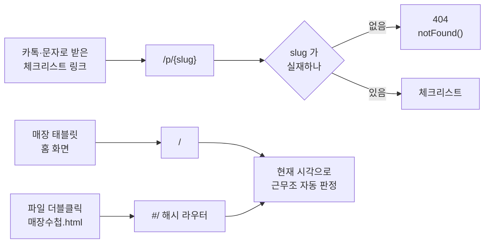
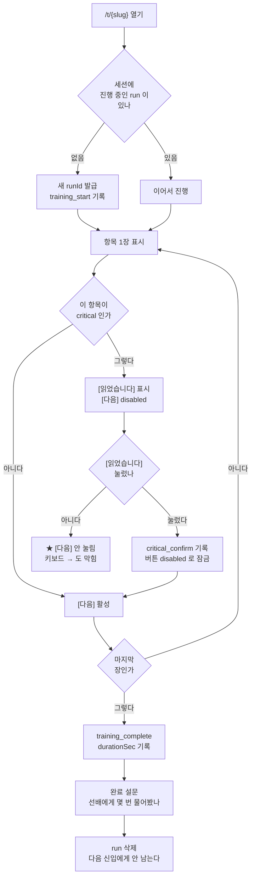
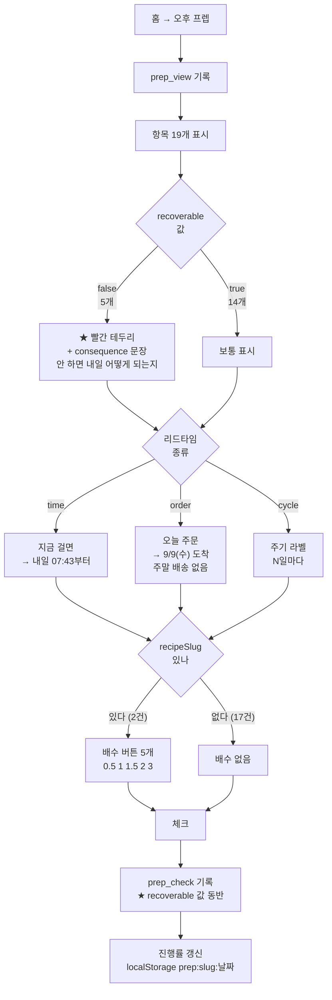
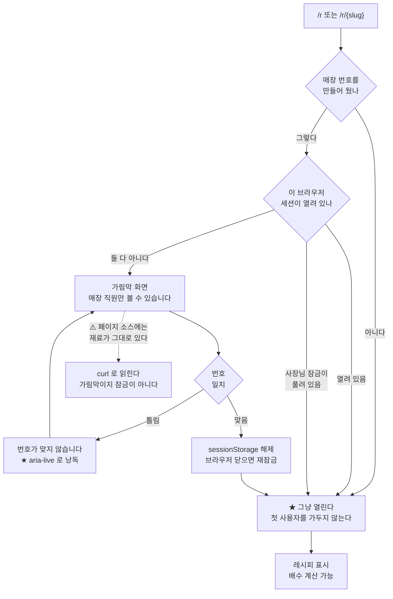
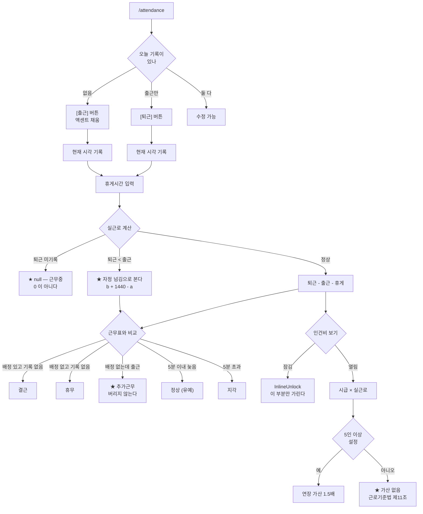
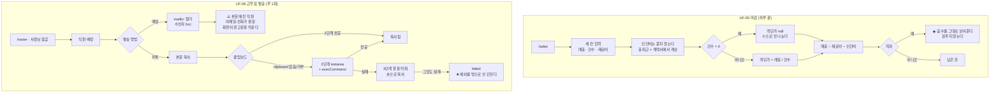
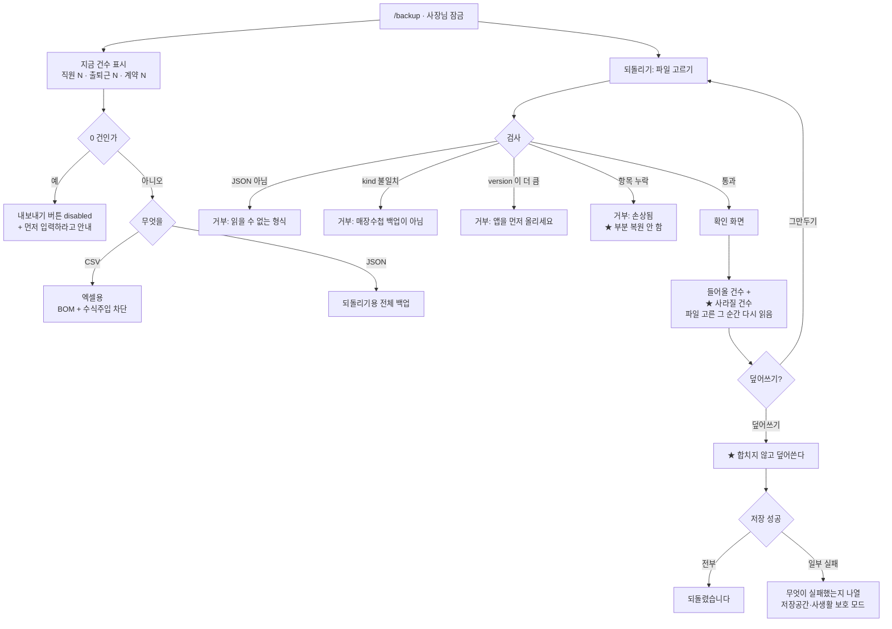

# 14. 사용자 흐름도 (User Flow) — 매장수첩

| | |
|---|---|
| 작성일 | **2026-09-08** |
| 기준 커밋 | `290021c` |
| 작성 방식 | ⚠️ **코드의 실제 분기에서 뽑았다.** 이상적인 흐름이 아니라 지금 코드가 가는 길이다 |
| 근거 | `src/app/**/page.tsx` 의 `notFound()` 4건 · 각 View 컴포넌트의 조건 분기 · 테스트 218개 |
| 자매 문서 | 기능 단위는 `13_기능명세서.md`, 화면 레이아웃은 `02_화면설계서.md` |

> ### 이 문서가 채우려는 빈칸
>
> `13_기능명세서.md` 를 쓰면서 나온 지적 — **예외 경로가 문서에 0건이었다.**
> `/backup` 을 만들 때도 "잘못된 파일을 넣으면?"을 코드에서 즉흥으로 정했다.
> 그래서 이 문서는 **정상 경로를 짧게, 예외를 길게** 쓴다.
>
> **가입·결제 흐름은 없다.** 회원가입을 만들지 않았고(원래 MVP 전제),
> 결제는 ⛔ B4 미해결로 가격이 없다. → `13_기능명세서.md` §9

---

## 0. 진입 방식 — 세 가지뿐이다

| 사실 | 근거 |
|---|---|
| 진입점에 **로그인이 없다** | 회원가입 미구현. 링크를 아는 사람은 체크리스트를 본다 |
| slug 오류는 **404** 로 끝난다 | `p/[slug]/page.tsx:50` · `t/[slug]:30` · `prep/[slug]:18` · `r/[slug]:34` |
| ✅ **404 화면이 있다** (2026-09-08) | `not-found.tsx`. 무슨 일인지 + 무엇을 하면 되는지 + 첫 화면 버튼 |
| 홈은 시각으로 근무조를 잡는다 | `NowPanel.tsx`, 60초 갱신 |

---

## 1. UF-01 신입 첫 출근 → 교육 완료

**목표:** 처음 온 사람이 선배를 붙잡지 않고 한 바퀴 돈다.

### 예외 · 경계

| 상황 | 지금 동작 | 근거 | 판정 |
|---|---|---|---|
| **필수 항목을 안 읽고 넘기려 함** | `[다음]` 이 `disabled`. 키보드 →도 막힌다 | `TrainingMode.tsx:310,348` | ✅ 의도됨 |
| **같은 항목의 확인을 두 번 누름** | 두 번째는 무시 (`if (run.confirmed.includes) return`) | `:115` | ✅ |
| **공용 태블릿에 앞사람 진도가 남음** | `sessionStorage` + `runId` — 브라우저 닫으면 사라진다 | `CLAUDE.md` 확정 결정 | ✅ 의도됨 |
| **중간에 창을 닫음** | 진도는 남지만 세션이 끝나면 사라진다. `training_complete` 가 안 남는다 | | ⚠️ **중도 이탈이 지표에서 안 보인다** |
| **중도 이탈자의 설문** | ⚠️ **발생하지 않는다.** 설문은 전 항목 완주 조건에서만 렌더 | `ChecklistView.tsx:107,255` | ⚠️ `askedSenior` 표본이 완주자로 치우친다 (`01` §8.4 #5) |
| **뒤로 가기** | 1장에서는 `disabled` | `:333` | ✅ |
| ⚠️ **교육 모드에 테스트가 0건** | 위 게이트는 브라우저 확인만 됐다 | `tests/` 실측 | ⚠️ §7 #2 |

---

## 2. UF-02 매일 아침 프렙 — 이 제품의 주 흐름

**목표:** 오늘 걸어야 할 것을 빠뜨리지 않는다. 특히 **돈으로 되돌릴 수 없는 것**.

### 예외 · 경계

| 상황 | 지금 동작 | 근거 | 판정 |
|---|---|---|---|
| **날짜가 바뀜** | 저장 키가 `prep:{slug}:{날짜}` 라 어제 체크가 안 보인다 | `PrepView.tsx` | ✅ 의도됨 |
| **자정을 넘기는 리드타임** | "내일"로 표시. 월말·연말·윤년 다 통과 | `readyAt()` | ✅ 테스트 10건 |
| **금요일 발주** | 토·일을 배송일로 세지 않고 월요일로 | `arrivesIn()` | ✅ 테스트 9건 |
| **음수 리드타임이 시드에 들어옴** | 과거 날짜를 만들지 않는다 | 같음 | ✅ 테스트 |
| **`recoverable:false` 인데 `consequence` 가 비어 있음** | 시드 단계에서 막는다 | `seed.test.ts` | ✅ 테스트 |
| **배수를 걸어둔 채 다른 항목으로 이동** | 배수는 항목별(`scales{}`)로 따로 산다 | `PrepView.tsx:124` | ✅ |
| **주기 점검을 어제 했는지** | ⚠️ **모른다.** 마지막 수행일을 저장하지 않고 매일 리셋 | `01` §5.6 | ⚠️ **"주기 관리"라고 말하면 안 된다** |
| **화면을 열어둔 채 시간이 흐름** | ⚠️ "지금 걸면" 시각이 갱신되지 않는다 | `01` §5.7 | ⚠️ |
| **19개 중 2건 외의 항목에서 배수를 찾음** | 없다. 없는 기능처럼 보인다 | `seed.json` 실측 | ⚠️ 시연 시 주의 |

---

## 3. UF-03 레시피 열기 — 잠금이 걸린 유일한 일상 흐름

### 예외 · 경계

| 상황 | 지금 동작 | 근거 | 판정 |
|---|---|---|---|
| **번호를 안 만든 매장** | 잠기지 않는다 | `storeGate.needsPin()` | ✅ 테스트 |
| **사장님 번호로 레시피 열기** | 열린다 (번호 두 개를 외우게 하지 않는다) | `storeGate.isUnlocked()` | ✅ 테스트 |
| **매장 번호로 매출 열기** | ❌ 안 열린다 | `ownerGate` 별개 | ✅ 테스트 |
| **4자리 미만 번호 설정** | 거부 | `setPin()` | ✅ 테스트 |
| **브라우저 닫고 다시 열기** | 재잠금 | `sessionStorage` | ✅ 테스트 |
| **번호를 잊음** | ⚠️ **복구 경로가 없다.** 되돌릴 수 없다 | 화면 문구에 그렇게 적혀 있음 | ⚠️ §7 #3 |
| **링크를 받은 매장 밖 사람** | 화면은 막히지만 **소스를 보면 재료가 보인다** | 실측 `curl .../r/shokupan \| grep 강력분` | ⚠️ **서버 전까지 링크 관리가 유일한 방어** |
| **잠긴 상태에서 검색엔진** | `robots noindex` 전역 + `robots.txt` | `layout.tsx:10` | ✅ |

---

## 4. UF-04 출퇴근 → 근태 → 인건비

### 예외 · 경계

| 상황 | 지금 동작 | 근거 | 판정 |
|---|---|---|---|
| **마감조 23:00 → 01:00** | 자정 넘김으로 계산. −22시간이 안 나온다 | `workedMinutes()` | ✅ 테스트 |
| **퇴근을 안 찍고 퇴근함** | `null` 로 남는다. 합계가 깨지지 않는다 | 같음 | ✅ 테스트 2건 |
| **휴게가 근무보다 김** | 음수가 안 나온다 | 같음 | ✅ 테스트 |
| **시급을 안 넣음** | `0` = "미입력". 최저임금 경고를 띄우지 않는다 | `contracts.ts` | ✅ 테스트 |
| **계약서에 소정근로시간이 없음** | 실근로시간으로 대신 | `estimatePay()` | ✅ 테스트 |
| **출퇴근 화면 자체를 잠글 수 있나** | ❌ 안 된다. 직원이 직접 찍어야 한다. **인건비 부분만** 가린다 | `InlineUnlock` | ✅ 의도됨 |
| **인건비를 급여로 쓰려 함** | ⚠️ 화면이 "추정"이라고 말한다. 4대보험·소득세·수습감액 없음 | `attendance.ts:1-20` | ⚠️ **경고에 의존** |
| **퇴사자 기록** | 명단에서 지워도 출퇴근 기록은 남는다 | `punchRows()` | ✅ 테스트 (3년 보존) |

---

## 5. UF-05 마감 → 남은 돈 / UF-06 근무표 발송

| 상황 | 지금 동작 | 근거 | 판정 |
|---|---|---|---|
| **클립보드가 막힌 브라우저** | 3단 폴백. 마지막까지 실패해도 화면이 안 죽는다 | `copyText.ts` | ✅ 테스트 8건 |
| **근무표 메일 본문의 개인정보** | ⚠️ bcc 로 수신자를 가려도 **본문 명단에 이메일·전화가 평문**으로 들어가고 전원에게 간다. 화면에 경고문은 붙었지만 **데이터는 그대로 나간다** | `roster.ts:129-147` · `02` §950 | ⚠️ **배포 전 필수** (`01` §10.3 (나) 12) |
| **연락처 포함 기본값** | **끄는 쪽이 기본**이다 | `buildEmailBody` | ✅ 테스트 |
| **배정이 없는 날** | "휴무"로 적는다 | 같음 | ✅ 테스트 |
| **직원이 0명** | 죽지 않는다 | 같음 | ✅ 테스트 |
| **구버전 `role` 필드가 남아 있음** | `section` 으로 살려낸다 | `loadRoster()` | ✅ 테스트 |
| **깨진 JSON 이 저장돼 있음** | 빈 근무표로 물러난다 | 같음 | ✅ 테스트 |

---

## 6. UF-07 백업 → 되돌리기 — 유일하게 되돌릴 수 없는 흐름

| 상황 | 지금 동작 | 근거 | 판정 |
|---|---|---|---|
| **CSV 를 되돌리기에 넣음** | 거부. **이유까지 말한다** | `checkRestore()` | ✅ 테스트 |
| **다른 앱의 JSON** | `kind` 확인 후 거부 | 같음 | ✅ 테스트 |
| **일부만 든 백업** | 부분 복원하지 않고 거부 | 같음 | ✅ 테스트 |
| **0건 매장의 백업** | 거부하지 않는다 | 같음 | ✅ 테스트 |
| **덮어쓰기 전에 잃는 양** | 파일 고른 **그 순간** 다시 읽는다 (화면 열 때 값 아님) | `BackupView.tsx` | ✅ 브라우저 확인 |
| **저장 실패** | 무엇이 실패했는지 나열 | `applyRestore()` | ✅ |
| **덮어쓰기 자체** | ⚠️ 테스트로 안 박혀 있다 | | ⚠️ §7 #4 |
| **백업 파일의 개인정보** | ⚠️ 이름·연락처·시급이 평문. 화면이 경고하지만 파일 관리는 사람 몫 | | ⚠️ |

---

## 7. 이 흐름도가 드러낸 구멍

| # | 무엇 | 왜 문제인가 | 크기 |
|---|---|---|---|
| ~~**1**~~ | ~~404 화면이 없다~~ | ✅ **해소 2026-09-08.** `src/app/not-found.tsx` — "선배나 사장님께 링크를 다시 받아주세요" + 첫 화면 버튼. 슬러그 목록은 일부러 안 적었다(시드가 바뀌면 화면이 먼저 낡고, 매장 밖 사람에게 링크를 알려주는 셈) | 해소 |
| **2** | **교육 모드·체크리스트에 테스트 0건** | `critical` 게이트가 이 제품의 안전장치인데 브라우저 확인만 됐다. 리팩터링하면 조용히 깨진다 | 중간 |
| **3** | **PIN 분실 복구 경로가 없다** | 사장님이 번호를 잊으면 매출·계약서에 영구히 못 들어간다. 서버가 없어 재설정 메일도 불가 | ⚠️ **정책 결정 필요** |
| **4** | **되돌리기 덮어쓰기가 테스트 없음** | 3년 보존 대상을 지우는 동작이다 | 작음 |
| **5** | **중도 이탈이 지표에 안 남는다** | 교육을 절반만 하고 닫으면 아무 기록이 없다. 완주자만 설문에 잡혀 `askedSenior` 가 편향된다 | 중간 — 가설 검증에 직접 걸린다 |
| **6** | **근무표 메일 본문의 평문 개인정보** | 경고문은 붙었지만 데이터는 그대로 나간다 | ⚠️ **배포 전 필수** |

→ 1·4는 바로 닫을 수 있다. 2·5는 다음 항목(**인수 기준**)과 함께 다룬다.
**3은 내가 정할 수 없다** — 복구를 아예 두지 않을지, 백업 JSON 으로 우회할지 결정이 필요하다.

---

## 갱신 이력

| 날짜 | 내용 |
|---|---|
| 2026-09-08 | 최초 작성. 흐름 7개(UF-01~07) + 진입 방식. 예외·경계 60여 건을 코드 분기와 테스트에 연결. §7 구멍 6건 |
