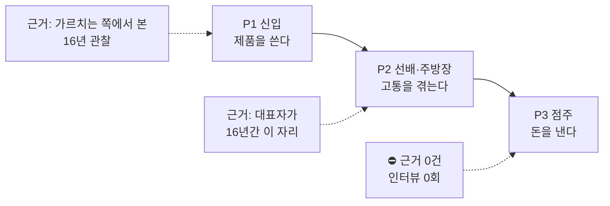

# 18. 사용자 페르소나 — 매장수첩

| | |
|---|---|
| 작성일 | **2026-09-08** |
| 근거 | `docs/01_문제정의.md` 1절 · `01_MVP기획서.md` §3 · D-006 · 코드 실측 |
| 자매 문서 | 목표별 경로는 `14_사용자흐름도.md`, 화면 접근 권한은 `16_정보구조도.md` §2 |

> ## ⚠️ 이 문서에서 하지 않은 것 — 먼저 읽을 것
>
> **점주 페르소나를 만들지 않았다.** 이름·나이·하루 일과를 지어낼 수는 있지만
> 그건 페르소나가 아니라 **소설**이다. 점주를 인터뷰한 적이 **0회**이고,
> "월 얼마면 쓰시겠습니까"를 물어본 적도 **0회**다 (⛔ B4).
>
> 이 프로젝트는 문서 여섯 곳에서 같은 경고를 반복해 왔다 —
> **대표자의 16년 경력은 점주 칸을 조금도 메우지 않는다. 주방장은 예산 집행자가 아니다.**
> 페르소나 문서에서 그 칸을 그럴듯하게 채우면, 그동안 지켜온 구분이 한 번에 무너진다.
>
> **대신 §4 에 "점주에 대해 실제로 아는 것 / 모르는 것"을 나눠 적었다.**
> 그게 지금 정직하게 쓸 수 있는 최대치다.

---

## 1. 세 자리가 서로 다른 사람이다 — 이 제품의 핵심 비대칭

| | 누구 | 근거 강도 | 결제권 |
|---|---|---|---|
| **P1** | 주방 신입 (첫 출근 ~ 첫 2주) | 🔬 PROVISIONAL | 없음 |
| **P2** | 신입을 가르치면서 자기 일도 하는 선배·주방장 | 🔬 PROVISIONAL — **근거 가장 강함** | 보통 없음 |
| **P3** | 점주 또는 매니저 | ⛔ **OPEN — 근거 0** | **있음** |
| **P4** | 홀 직원 | ⚠️ **표에 없었다** → §3.4 |

> **대표자는 가운데 칸(P2)에 16년 있었다. 오른쪽 칸(P3)에는 없었다.**
> 문제 관찰은 강하고 지불 의사 근거는 0이다. 이 둘을 섞으면 안 된다.

---

## 2. P1 — 주방 신입

### 2.1 특성

| | |
|---|---|
| **언제** | 첫 출근 ~ 첫 2주 |
| **어디서** | 매장 공용 태블릿. 개인폰은 젖은 손·위생 규정으로 불리 |
| **기술 수준** | ⛔ **모른다.** 확인한 적 없다. 앱 설치는 안 할 것으로 보고 링크로 설계했다 |
| **재직 기간** | ⚠️ 짧을 수 있다 — 이직률이 높다는 것이 이 문제를 치명적으로 만든 전제 |

### 2.2 목표

1. **오늘 뭘 해야 하는지 알고 싶다** — 순서대로
2. **틀리지 않고 싶다** — 특히 위생·안전
3. **선배에게 같은 걸 두 번 묻고 싶지 않다**

### 2.3 불편 (관찰된 것)

| 불편 | 근거 강도 |
|---|---|
| 순서와 기준값(온도·시간)을 반복해 잊는다 | 🔬 H2 |
| 선배가 바쁠 때 물어보기 어렵다 | 🔬 H1 |
| **오늘 안 하면 내일 아침에 터지는 것을 스스로 알 방법이 없다** | 🔬 H7 — **현재 제품 논리의 핵심** |
| 사람마다 기준을 다르게 말한다 | 🔬 — 각자 머릿속 시연이 달라서 |

### 2.4 제품이 실제로 하는 것

| 불편 | 대응 | 상태 |
|---|---|---|
| 순서를 잊는다 | 교육 모드가 한 장씩 (`/t/{slug}`) | ✅ FR-06 |
| 위생·안전을 빠뜨린다 | **필수 항목 확인 게이트** — 안 읽으면 못 넘어간다 | ✅ FR-07 |
| 내일 터지는 것을 모른다 | 프렙이 리드타임을 시각으로 계산 | ✅ FR-02 |
| 첫 화면에서 뭘 고를지 모른다 | 현재 시각으로 근무조를 자동 판정 | ✅ FR-01 |
| 기준이 사람마다 다르다 | 사진·영상으로 시연을 박제 | ⚠️ **배관만. 촬영본 0건** |

### 2.5 ⚠️ 신입에 대해 확인 안 된 것

- **태블릿을 실제로 여는지.** 벽에 붙은 종이를 더 볼 수도 있다 (H5 — ❓ OPEN, **여기서 지면 제품이 성립하지 않는다**)
- 교육 모드를 끝까지 하는지 (중도 이탈이 기록에 안 남는다 — `14` §7 #5)
- 기술 수준·연령대·한국어 읽기 수준

---

## 3. P2 — 선배 · 주방장 (근거가 가장 강한 자리)

### 3.1 특성

| | |
|---|---|
| **근거** | **대표자가 16년간 바로 이 자리에 있었다** — 베이커리·브런치 카페·레스토랑에서 셰프·주방장(헤드). 오픈 멤버 5곳 (D-006) |
| **하는 일** | 자기 업무 + 신입 교육 + 기준 유지 |
| 결제권 | 보통 없음 |

### 3.2 목표

1. **내 일이 밀리지 않게 하고 싶다**
2. 신입이 같은 걸 다시 묻지 않게 하고 싶다
3. **내가 쉬어도 주방이 흔들리지 않게 하고 싶다** ← 상위 문제 정의와 직결

### 3.3 불편

| 불편 | 근거 |
|---|---|
| 가르치는 동안 자기 업무가 밀린다 | 🔬 16년 관찰 |
| **지켜보는 시간이 가르치는 시간보다 길다** | 🔬 — `CLAUDE.md` 가 덧붙인 단서. 가설 측정에 직접 걸린다 |
| 프렙 양·발주 수량이 자기 머릿속에만 있어 쉬기 어렵다 | 🔬 — 문제 정의 (A) 그 자체 |

> ### ★ 여기가 제품의 약한 지점이다
>
> P2 의 가장 큰 불편은 **"지켜보는 시간"**인데, 지금 제품은 그것을 줄이지 않는다.
> 그걸 직접 공격하는 것은 **"신입이 따라 한 걸 찍어 올리고 선배가 나중에 확인"** 하는
> 비동기 구조이고, **미구현**이다. (`/shoot` 은 점주가 무엇을 더 찍을지 보는 보드이지
> 신입이 결과물을 올리는 화면이 아니다.)
>
> 즉 **근거가 가장 강한 자리의 핵심 불편이 아직 안 풀렸다.**

---

## 4. P3 — 점주 · 매니저 ⛔ 페르소나를 만들지 않는다

### 4.1 실제로 아는 것

| 아는 것 | 근거 |
|---|---|
| **결제 결정권이 있다** | 자명 |
| 원가율·인건비율·객단가를 본다 | 🔬 16년 관찰 (같은 매장에 있었으므로) |
| 점주가 여는 화면이 9개다 | 코드 실측 — `01` §3.4 |
| **점주들이 "주방 기준을 세워줄 사람"에게 돈을 낸 이력이 있다** | 대표자가 인맥 요청으로 이직·오픈 멤버 5곳 |

### 4.2 그런데 위 마지막 줄을 근거로 등재하지 않는다

D-006 의 판단을 그대로 지킨다.

1. 그 지불은 **인건비**였고 "기준 수립분"만 분리해 계산할 수 없다
2. **인건비 지불 의사 ≠ 소프트웨어 구독 지불 의사**

→ **발표 서사(왜 당신이 이걸 만드는가)로는 쓴다. 근거 표에는 넣지 않는다.**

### 4.3 모르는 것 — 이게 목록의 본체다

| 모르는 것 | 왜 중요한가 |
|---|---|
| **월 얼마면 쓸 것인가** | ⛔ 가격·과금 단위·구독 여부를 아무것도 못 정한다 |
| 지금 무엇으로 이 일을 하고 있는가 | 대체재가 종이인지, 엑셀인지, 아예 안 하는지 |
| 무엇이 가장 아픈가 | 신입 교육인지, 원가인지, 인건비인지 |
| 직원에게 새 도구를 쓰게 할 힘이 있는가 | 있어도 안 쓸 수 있다 |
| 태블릿 기종·브라우저 버전 | NFR-11~14 의 최저선을 넘는지 (발표 전 확인 필요) |

### 4.4 ★ 함정 — 화면을 만든 것과 근거를 얻은 것은 다르다

2026-09-04 에 운영 기능 7종이 붙어 **원가율·인건비율·오늘 남은 돈이 화면에 올라왔다.**
점주가 결정할 때 보는 숫자들이다.

> **그런데 그건 화면을 만든 것이지 지불 의사의 근거가 아니다.**
> 오히려 화면이 그럴듯한 숫자를 보여주니 **"점주가 좋아할 것"이라는 확신이
> 근거 없이 커진다.** 이게 이 문서가 페르소나를 안 쓰는 이유와 같은 종류다.

### 4.5 이 칸을 채우는 유일한 방법

**점주 5명에게 화면을 보여주고 직접 금액을 묻는다.** 다른 경로가 없다. (`01` §9 B4)
그때 이 절을 실제 페르소나로 다시 쓴다.

---

## 5. P4 — 홀 직원 ⚠️ 표에 없었다

### 5.1 왜 새로 넣는가

기존 문서 세 곳(`01_문제정의.md` 1절 · `01_MVP기획서.md` §3.1 · D-006)의 사용자 표는
**신입 / 선배 / 점주 세 자리뿐**이다. 그런데 코드는 홀 직원을 사용자로 취급하고 있다.

| 근거 | 실측 |
|---|---|
| `CLAUDE.md` 가 제품명을 '주방'이 아니라 '매장'으로 바꾼 이유로 명시 | *"홀 직원도 출퇴근을 찍고"* |
| 섹션 목록에 `홀` 이 있다 | `roster.ts` `SECTIONS = ["제빵","바","홀","주방"]` |
| **출퇴근 화면은 잠기지 않는다** — 직원이 직접 찍어야 하므로 | `16` §2 · `AttendanceView` 의 `InlineUnlock` |

### 5.2 특성 · 목표

| | |
|---|---|
| 쓰는 화면 | **`/attendance` 하나** (출퇴근 찍기). 인건비 부분은 가려진다 |
| 목표 | 출퇴근을 빠르게 찍고 끝내고 싶다 |
| 빈도 | **하루 2번** — 매일 열리는 화면 4개 중 하나 |
| 안 쓰는 것 | 프렙·레시피·체크리스트는 주방 것이다 |

### 5.3 이게 IA 에 주는 의미

홀 직원은 **홈을 거쳐 `/attendance` 로 간다.** 전역 탭바가 없으므로(`16` §1.1)
매번 홈 → 출퇴근을 왕복한다. **하루 2번 × 직원 수**만큼 발생한다.

→ `16_정보구조도.md` §4.3 이 "탭바가 맞다"고 판단한 근거에 이 사례를 더한다.

---

## 6. 세 자리를 한 표로 — 제품이 각자에게 무엇인가

| | P1 신입 | P2 선배·주방장 | P3 점주 | P4 홀 직원 |
|---|---|---|---|---|
| **여는 화면** | 교육·체크리스트·프렙 | 프렙·레시피·발주 | 운영 9개 | 출퇴근 |
| **빈도** | 첫 2주 집중 | 매일 | 마감·주 단위 | 하루 2번 |
| **잠금** | 공개 링크 | 🔐 매장(레시피) | 🔒 사장님 | 공개 |
| **제품이 주는 것** | 순서·기준·경고 | 기준을 머리 밖에 둠 | 원가율·인건비율·남은 돈 | 출퇴근 기록 |
| **근거 강도** | 🔬 관찰 | 🔬 **가장 강함** | ⛔ **0** | 🔬 코드 실측 |
| **결제권** | 없음 | 보통 없음 | **있음** | 없음 |

**★ 마지막 두 줄이 이 제품의 전부다. 근거가 가장 강한 자리와 돈이 나오는 자리가 다르다.**

---

## 7. 이 문서가 드러낸 것

| # | 무엇 | 크기 |
|---|---|---|
| **1** | **홀 직원(P4)이 사용자 표에 없었다** — 코드는 사용자로 취급하는데 문서 세 곳이 빠뜨렸다 | 작음 — 이 문서로 해소 |
| **2** | **P2 의 핵심 불편("지켜보는 시간")을 제품이 안 줄인다** | ⚠️ **큼.** 비동기 확인 구조가 미구현이고, 근거가 가장 강한 자리의 문제다 |
| **3** | 신입의 기술 수준·연령대를 확인한 적이 없다 | 실증 시 확인 |
| **4** | ⛔ 점주 페르소나를 쓸 수 없다 | **B4 그 자체.** 점주 5명 인터뷰 전까지 |

**2번이 이 문서에서 가장 무거운 발견이다.** 기능은 신입 쪽(P1)에 촘촘한데,
근거가 가장 강한 P2 의 가장 큰 불편은 아직 손대지 않았다.

---

## 갱신 이력

| 날짜 | 내용 |
|---|---|
| 2026-09-08 | 최초 작성. P1·P2·P4 페르소나. **P3(점주)는 일부러 만들지 않고 §4 에 "아는 것/모르는 것"으로 나눠 적었다.** P4(홀 직원)를 사용자 표에 새로 등재. §7 #2 로 P2 의 미해결 불편을 지적 |
