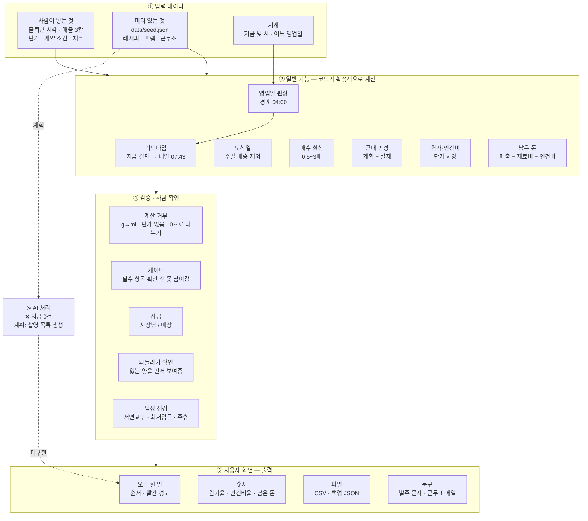

# 20. 기능 흐름도 (입력 → 처리 → 출력) + `day-flow.md` 검수

| | |
|---|---|
| 작성일 | **2026-09-09** |
| 기준 커밋 | `b0aeef9` |
| 두 부분 | **1부** `day-flow.md` 검수 · **2부** 기능 흐름도 |
| 자매 문서 | 기능 단위는 `13_기능명세서.md`, 목표별 경로는 `14_사용자흐름도.md`, 계층은 `16_정보구조도.md` |

---

# 1부 — `docs/day-flow.md` 검수

> ### 제가 판정할 수 있는 것과 없는 것
>
> **판정 가능:** 문서 안의 모순 · 시드·코드와의 불일치 · 이미 확정된 사실과 어긋나는 곳.
> **판정 불가:** *실제 매장이 정말 그런가.* 그건 사장님만 압니다.
> 아래는 **전자만** 적었고, 후자는 §1.4 에 질문으로 모아뒀습니다.

## 1.1 ⚠️ 철회 — 여기 있던 "깨진 곳 4건" 은 제 오해였습니다

**2026-09-09 오후 정정.** 이 절에는 원래 *"마감이 새벽 1시라서 day-flow 뒷부분이 4군데 깨졌다"* 고
적혀 있었습니다. **틀렸습니다. 원래 시간표가 맞았습니다.**

### 무슨 일이 있었나

| 시점 | 무슨 일 |
|---|---|
| 사장님 | *"마감조에 22:00에 30분만에 끝내라 이런말은 왜하는데… 마감 새벽1시까지 설정해놨잖아"* |
| 제가 물음 | "시드는 22:30 인데 새벽 1시가 맞습니까?" |
| 사장님 | *"마감은 새벽 1시 맞아"* |
| **제 판단** | ⛔ **영업 자체가 새벽 1시까지라고 단정하고** 시드를 `17:00~01:00` 으로 바꿈 |
| 사장님 정정 | *"19시부터 마감준비 시작하고, 마감작업은 22시 영업끝나고 30분정도. **1시 퇴근은 특별경우를 대비**"* |

**"1시"는 영업 종료가 아니라 예외적인 퇴근 시각이었습니다.**
저는 "마감 = 영업 종료"로 읽었고, 되물을 때도 그 전제를 확인하지 않았습니다.
그리고 그 잘못된 전제 위에서 문서 4곳을 "깨졌다"고 판정하고 시드까지 고쳤습니다.

### 확정된 사실 (2026-09-09)

| | |
|---|---|
| 영업 | 08:00 ~ **22:00** |
| 마감 준비 | **19:00 부터** — 영업하면서 시작 |
| 마감 작업 | 22:00 영업 종료 후 **30분** → 22:30 |
| 마감조 | **14:30 ~ 22:30** (원래 시드값) |
| 01:00 퇴근 | **특별한 경우 대비.** 평상시가 아니다 |

### 그래서 `day-flow.md` 는 어땠나

| 원래 지적 | 실제 |
|---|---|
| ~~`15:30~19:00` 의 "마감조 인수인계" 가 불가능~~ | ✅ **맞았다.** 마감조는 14:30 출근이라 15:30 에 이미 근무 중 |
| ~~인수인계가 두 번이 된다~~ | ✅ **맞았다.** 한 번이 맞다 |
| ~~`19:00~22:00` 이 실제로는 19:00~01:00~~ | ✅ **맞았다.** 19:00 마감 준비 시작이 사장님 확인으로 재확인됨 |
| ~~`22:00~22:30 마감` 이 틀렸다~~ | ✅ **맞았다.** 영업 종료 후 30분이 정확하다 |
| ~~결론 표에 19:00~01:00 이 비어 있다~~ | 🟠 **표 자체는 22:00 행이 맞다.** 다만 **19:00~22:00(마감 준비) 행이 없는 것**은 여전히 사실 |

**즉 이 절에서 살아남는 지적은 마지막 하나뿐입니다.**

### 유일하게 남는 지적 — 결론 표에 마감 준비 구간이 없다

`§결론 4. 시간대별로 여는 화면` 표:

| 시간 | 누가 | 문서 |
|---|---|---|
| 05:00 | 제빵 | 레시피 + 리드타임 프렙 |
| 07:30 | 오픈조 | 오픈 체크리스트 |
| 08:00~14:00 | 전원 | 레시피 |
| 14:00 | 오픈조 | 프렙 리스트(내일용) + 발주 |
| **19:00~22:00** | **마감조** | ❌ **없음 — 마감 준비 구간** |
| 22:00 | 마감조 | 마감 체크리스트 ✅ |

**19:00 에 마감 준비를 시작하는데 그때 무슨 화면을 여는지가 정의돼 있지 않습니다.**
마감 체크리스트를 그때 열어서 미리 찍어나가는 건지, 22:00 에 한 번에 여는 건지 —
이건 화면 설계에 직접 걸리는 질문입니다(§1.4 B).

### 남긴 것과 되돌린 것

| | |
|---|---|
| **되돌림** | 시드 마감조 `17:00~01:00` → **`14:30~22:30`** (양쪽 앱) |
| **남김** | 자정 넘김 지원(`shiftClock`) — **01:00 퇴근 예외에 필요하다.** 그날 근무조를 `14:30~01:00` 으로 잡으면 옛 코드에서는 홈에서 통째로 사라졌다 |
| **남김** | 영업일 경계 04:00(`businessDay`) — 예외인 날 자정을 넘겨도 체크가 유지된다 |
| **남김** | 마감조 문구의 시간 압박 제거 — **사장님의 원래 지적은 톤이었고, 그건 그대로 유효하다** |

> ### 이 일에서 배운 것 — 기록으로 남긴다
>
> **"마감"이라는 낱말이 두 가지를 가리켰습니다** — *영업 종료*와 *마감 작업 완료·퇴근*.
> 되물을 때 "22:30 이냐 01:00 이냐"를 물었는데, **물어야 했던 것은
> "무엇의 시각이냐"** 였습니다. 시각을 확인하기 전에 **낱말의 뜻**을 확인해야 했습니다.

## 1.2 문서 안에서 서로 어긋나는 곳 — 2건

| # | 무엇 | 상세 |
|---|---|---|
| **5** | **"아직 못 받은 답" 목록이 낡았다** | `- [ ] 추출 테스트 발동 조건이 위 4개가 맞는지` 가 열려 있는데, `§78` 절 제목에는 이미 **"✅ (사용자 확인)"** 이 붙어 있다. 다만 그 절 본문도 *"발동 조건 (초안 — 맞는지 확인 필요)"* 이라 **절 제목과 본문이 서로 다르다** |
| ~~6~~ | ~~"실제 교대 시간·인원" 미확인~~ | 🟠 **부분 해소 2026-09-09.** **출근 시각·인원 확정** — 제빵 05:00/1명 · 오픈조 07:30/2명 · 미들 11:00/2명 · 마감조 17:00~01:00. **남은 것: 앞 3조의 퇴근 시각(8시간 가정)과 마감조 인원** |

## 1.3 ★ 새로 생긴 문제 — 영업일 경계가 제빵조 출근 시각과 정확히 겹칩니다

제가 어제 넣은 것에서 나온 부작용입니다. **먼저 말씀드립니다.**

| 사실 | 값 |
|---|---|
| 영업일 경계 (당시) | **05:00** |
| 제빵조 출근 | **05:00** |
| 마감조 퇴근 | 22:30 (예외 시 01:00) |

제빵조가 **04:50 에 도착해서 체크리스트를 열면 "어제" 키**를 씁니다.
05:00 을 넘겨 새로고침하면 오늘 키로 바뀌고, **그 사이에 찍은 체크가 사라져 보입니다.**
마감조에서 고친 것과 똑같은 증상이 제빵조에서 재현됩니다.

### 왜 이렇게 됐나

경계를 정할 때 근거로 "제빵조가 05:00 시작이라 마감조(01:00 종료)와 겹치지 않는 구간"이라고 적었는데,
**겹치지 않는 것과 경계로 삼기 좋은 것은 다릅니다.** 경계는 아무도 없는 구간의 **한가운데**여야 안전합니다.

```
22:30 마감조 퇴근 (예외 01:00) ──── 아무도 없음 ──── 05:00 제빵조 출근
                    ↑                      ↑
                 04:00 이 안전            05:00 은 경계에 걸침
```

### ✅ 해소 (2026-09-09) — 경계를 **04:00** 으로 내렸다

제빵조 출근이 **05:00 정각**으로 확정되면서 겹침이 확정됐고, 아래대로 옮겼다.
브라우저 실측: `04:50 도착`과 `05:00 출근`이 같은 영업일(`2026-09-10`), 마감조 `23:50 ↔ 00:10` 도 유지.

| 경계 | 마감조(01:00 퇴근) 여유 | 제빵조(05:00 출근) 여유 |
|---|---|---|
| ~~05:00~~ | 4시간 (예외 퇴근 기준) | **0분** ⚠️ 겹침 |
| **04:00 (적용됨)** | **3시간** | **1시간** |
| 03:00 | 2시간 | 2시간 |

⚠️ **제빵조 출근이 더 당겨지면(예: 03:30) 다시 걸립니다.** 그때는 03:00 으로 내려야 합니다.
마감이 더 늦어져도(예: 02:00 퇴근) 마찬가지로 재검토가 필요합니다.

## 1.4 사장님께 여쭐 것 — 검수의 본체

문서를 고치려면 아래가 필요합니다. **제가 추측으로 채우면 지난번 "22:00 마감"과 같은 일이 반복됩니다.**

| # | 질문 | 왜 필요한가 |
|---|---|---|
| ~~A~~ | ~~제빵·오픈조·미들의 실제 시각·인원~~ | 🟠 **출근 시각·인원 확정 (2026-09-09).** 남은 것은 **퇴근 시각 3개와 마감조 인원** |
| 🟠 **B** | ~~19:00~01:00 에 마감조가 무엇을 하는가~~ → **19:00 부터 마감 준비 (사장님 확인)**. **남은 질문: 그때 어떤 화면을 여는가** — 마감 체크리스트를 미리 열어 찍어나가는지, 22:00 에 한 번에 여는지 |
| ~~C~~ | ~~마감 작업을 언제부터 시작하는가~~ | ✅ **해소** — 준비 19:00, 작업 22:00~22:30 |
| ~~D~~ | ~~오픈조 15:30 퇴근 시 미들에게 인수인계하는가~~ | ✅ **해소** — 마감조가 14:30 출근이라 15:30 에 이미 근무 중. 원래 문서대로 마감조에게 넘긴다 |
| **E** | 거래처별 **발주 요일 + 마감 시각 + 입고 소요일** | 문서가 원래부터 "리드타임 기능의 핵심 입력값"으로 표시해둔 것. **아직 0건** |

**남은 것은 B의 후반부(마감 준비 시간대의 화면)와 E, 그리고 §1.6 의 5인 이상 여부입니다.**

## 1.5 검수 결과 — 맞는 것

틀린 것만 적으면 오해가 생기니 **확인된 것도 적습니다.**

| 항목 | 판정 |
|---|---|
| 리드타임 3축 (시간/입고/주기) | ✅ 코드와 일치 — 시드의 `kind` 가 `time 4 · order 2 · cycle 13` |
| `recoverable` 로 갈린다는 결론 | ✅ 시드에 `recoverable:false` 가 **5건**. 화면이 그것만 빨간 테두리 |
| 추출 테스트가 조건 기반이라는 것 | ✅ 시드에 `trigger: condition` 으로 반영됨 |
| 금요일에 주말치를 몰아서 발주 | ✅ 사용자 확인 (2026-08-30) |
| 쿠팡이 결론을 절반 무너뜨린다 | ✅ 이 문서 전체에서 가장 중요한 통찰. 제품 논리가 여기서 나왔다 |
| 교대 인수인계가 단일 실패 지점 | ✅ 다만 **제품이 아직 못 푼다** — 기기별 저장이라 인계가 안 된다 |
## 1.6 ★ 인원 확정에서 나온 것 — 5인 이상일 수 있습니다

조별 인원을 받고 보니 **합이 6~7명**입니다.

| 조 | 인원 |
|---|---|
| 제빵 | 1 |
| 오픈조 | 2 |
| 미들 | 2 |
| 마감조 | 1~2 (미확인) |
| **합** | **6~7** |

### 왜 문제인가

`settings.fiveOrMore` 의 **기본값이 `false`(5인 미만)** 입니다.
그 한 칸이 **연장 가산수당 적용 여부**를 가르고(근로기준법 제56조), 인건비 금액이 바뀝니다.

```
attendance.ts:282   const overtimePay = input.fiveOrMore ? (overtimeMin / 60) * wage * 0.5 : 0;
```

**5인 이상인데 설정이 5인 미만이면 인건비가 실제보다 적게 나옵니다.**
그 숫자가 "오늘 남은 돈"으로 이어지므로 **점주가 보는 값이 낙관적으로 틀립니다.**

### ⛔ 확인이 필요합니다 — 제가 판단할 수 없는 것

**조별 인원 합 ≠ 상시 근로자 수**입니다.

- 같은 사람이 여러 조에 들어갈 수 있습니다 (사장님이 제빵 겸임 — 문서에도 "사장님 겸임 흔함")
- 근로기준법상 상시 근로자 수는 **1개월 연인원 ÷ 가동일수**로 셉니다
- 사업주 본인은 근로자 수에 안 들어갑니다

→ **실제 상시 근로자가 5인 이상인지 확인 후 `설정`에서 켜야 합니다.**
지금 기본값 그대로면 5인 미만으로 계산됩니다.


---

# 2부 — 기능 흐름도 (입력 → 처리 → 출력)

> ### ⚠️ 먼저 — **AI 처리는 지금 0건입니다**
>
> 요청하신 5개 층 중 **"AI 처리" 층이 비어 있습니다.**
> 런타임 의존성이 `next`·`react`·`react-dom` **3개뿐**이고 AI SDK 는 설치돼 있지 않습니다.
> 계획된 AI 의 역할은 *텍스트 초안*이 아니라 **촬영 목록 생성**입니다(`CLAUDE.md` 확정).
> 아래 표의 AI 칸은 **"지금 없음 / 계획"** 으로 정직하게 비워뒀습니다.
> 채워 넣으면 발표에서 "AI 기반"이라고 말하게 되고 그건 거짓이 됩니다.

## 2.1 전체 흐름



## 2.2 층별 정리 — 요청하신 5개 질문에 대한 답

### ① 사용자 화면 — 무엇을 보고 누르는가

| 누가 | 무엇을 보나 | 무엇을 누르나 |
|---|---|---|
| **신입** | 오늘 할 일 · 순서 · 빨간 경고 | 체크 · `[읽었습니다]` · `[다음]` |
| **선배·주방장** | 프렙 리드타임 · 레시피 배수 | 체크 · 배수 버튼 5개 |
| **점주** | 원가율 · 인건비율 · **오늘 남은 돈** | 매출 3칸 입력 · 단가 입력 · 내보내기 |
| **홀 직원** | 출퇴근 화면 | 출근 · 퇴근 버튼 |

**입력 칸은 의도적으로 적습니다.** 매출은 세 칸(매출·건수·재료비)만 받고
인건비는 안 묻습니다 — 출퇴근 × 계약서에서 나오기 때문입니다.

### ② 입력 데이터 — 어떤 자료가 들어오는가

| 출처 | 내용 | 어디에 저장되나 |
|---|---|---|
| **시드 파일** | 레시피 4 · 프렙 19 · 포지션 3 · 근무조 4 | `data/seed.json` (읽기 전용) |
| **사람 입력** | 출퇴근 · 계약 조건 · 거래처 단가 · 매출 3칸 · 체크 | 브라우저 `localStorage` |
| **시계** | 현재 시각 → **영업일**(경계 04:00) | 저장 안 함 |
| **파일** | 되돌리기용 백업 JSON | 검증 후 덮어씀 |
| ❌ **없는 것** | 서버 · 외부 API · POS 연동 · 이미지 인식 | — |

### ③ AI 처리 — ❌ 지금 0건

| | |
|---|---|
| **지금** | **없습니다.** AI SDK 미설치. 런타임 의존성 3개 |
| **계획** | **촬영 목록 생성** — 포지션명을 넣으면 "이 18개를 찍으세요"가 나오고 폰 들고 한 바퀴 |
| **일부러 안 하는 것** | **텍스트 초안 생성.** D-002 로 보류 — 주방 교육은 읽기가 아니라 시연·모방이라, 더 좋은 문서를 만드는 게 답이 아니라고 정했다 |
| 발표에서 | **"AI 기반"이라고 말하면 거짓이 됩니다.** Q&A 대비 필요 |

### ④ 일반 기능 — 코드가 확정적으로 처리하는 것

**전부 테스트로 고정돼 있습니다 (345개).**

| 계산 | 무엇을 | 테스트 |
|---|---|---|
| 리드타임 | "지금 걸면 → 내일 07:43부터" | `leadTime` 25 |
| 도착일 | 주말·마감시각·배송요일 반영 | `vendors` 12 |
| 배수 | 0.5~3배, g 단위까지 | `scale` 8 |
| 근태 | 계획(근무표) − 실제(출퇴근) | `attendance` 23 |
| 원가 | 단가 × 양, 단위 계열 확인 | `cost` 14 · `units` 9 |
| 남은 돈 | 매출 − 재료비 − 인건비 | `sales` 15 |
| **영업일** | 경계 **04:00**, 자정 넘김 | `businessDay` 30 |
| **근무조 판정** | 자정 넘는 조 포함 | `shiftClock` 19 |
| 발주 상태 | 주문함 / 들어옴 2단계 | `orders` 19 |
| 내보내기 | CSV(BOM·수식차단) · 복원 검증 | `backup` 30 |

### ⑤ 검증 · 사람 확인 — 어디서 오류와 위험을 잡는가

**이 층이 이 제품의 성격을 가장 잘 보여줍니다 — 계산을 거부하는 자리들입니다.**

| 자리 | 무엇을 막나 | 왜 |
|---|---|---|
| **단위 계열** | g ↔ ml 환산 **거부** | 밀도를 모른다. 바꾸면 원가가 **조용히** 틀린다 |
| **단가 없음** | 0원으로 안 셈, `missing` 으로 표시 | 원가율이 낮게 나오고 **사장님이 그 숫자로 가격을 정한다** |
| **추출량 제외** | 원두 이중 계산 방지 | 화면이 "채우세요"라고 권하던 길이었다 |
| **0으로 나누기** | 객단가·원가율에서 `null` | `Infinity` 를 화면에 띄우지 않는다 |
| **필수 항목 게이트** | 확인 전 `[다음]` `disabled` | 위생·안전 항목 |
| **잠금 2종** | 직원↔매출 / 매장 밖↔레시피 | ⚠️ 가리개다. 접근 통제가 아니다 |
| **되돌리기 확인** | **잃는 양을 그 순간 다시 읽어** 보여줌 | 3년 보존 대상을 덮어쓴다 |
| **백업 파일 검증** | CSV·타 앱 JSON·손상본 **거부** | 부분 복원을 하지 않는다 |
| **법정 점검** | 서면교부·최저임금·주휴·5인미만 | 과태료가 나오는 항목 |
| **사람이 확인해야만 하는 것** | 레시피 수치 · 실명·시급이 뜬 시연기기 · 실증 데이터 | ⛔ 코드가 못 한다 |

## 2.3 이 흐름도가 드러낸 것

| # | 무엇 | 크기 |
|---|---|---|
| **1** | **⑤ 검증 층이 두껍고 ③ AI 층이 비었다** — 제품의 실제 성격은 "AI 도구"가 아니라 **"틀린 계산을 거부하는 계산기"**다. 발표 서사도 그쪽이 정직하다 | — |
| **2** | **입력이 전부 사람 손이다.** POS·외부 연동이 0건이라 **단가·시급을 안 넣으면 화면이 빈다.** 이게 실증 매장의 첫 병목이 될 가능성이 높다 | ⚠️ 중간 |
| **3** | ④ 계산은 테스트 345개로 덮였는데 **①·⑤ 의 화면 쪽은 자동 테스트가 0건**이다 | `15` §2.2 |

---

## 갱신 이력

| 날짜 | 내용 |
|---|---|
| 2026-09-09 | 최초 작성. **1부** `day-flow.md` 검수 — 마감 1시 확정으로 깨진 4건 + 문서 내부 모순 2건 + **영업일 경계가 제빵조 출근과 겹치는 문제** 발견, 사장님 질문 5건. **2부** 5개 층 기능 흐름도 — **AI 층은 0건으로 비워뒀다** |
