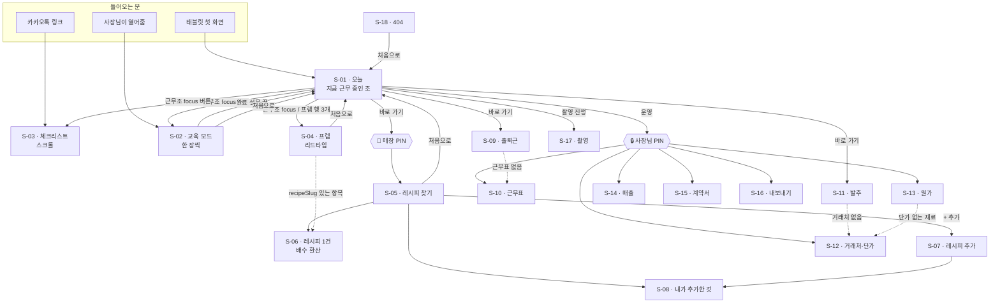

# 22. 클릭 흐름 — 어디서 눌러 어디로 가는가

> 2026-09-09. [21_화면명세.md](21_화면명세.md)가 **화면 하나하나**를 정했다면
> 이 문서는 **화면 사이**를 정한다. 화면 번호(S-01…)는 21 과 같다.
>
> ⚠️ **아래는 코드에서 읽어낸 실제 이동이다.** 없는 길은 ⛔ 로 표시했다 —
> 그건 명세이지 현황이 아니다.

---

## 1. 들어오는 문이 세 개다

이게 이 제품의 이동을 이해하는 출발점이다. **사람마다 다른 문으로 들어온다.**

| 문 | 누가 | 어디로 떨어지나 | 특징 |
|---|---|---|---|
| **A. 태블릿 첫 화면** | 매장 전원 | `S-01 /` | 가장 흔하다. 여기가 허브 |
| **B. 카카오톡 링크** | 신입·직원 (개인 폰) | `S-03 /p/[slug]` 로 **바로** | ⚠️ **S-01 을 안 거친다.** 뒤로 갈 곳이 없다 |
| **C. 사장님이 열어줌** | 신입 첫날 | `S-02 /t/[slug]` | 선배가 옆에 있다 |

> **B 때문에 모든 화면에 `‹ 뒤로` 가 필요하다.** 링크로 바로 들어오면
> `history.length === 1` 이라 뒤로 갈 곳이 없고, 그때 `/` 로 보낸다
> (`BackButton.tsx` 의 `fallback`). **없으면 갇힌다** — 매장 태블릿은
> 전체화면 키오스크라 주소창이 없는 경우가 많다.

---

## 2. 전체 흐름



**실선 = 사람이 누르는 길. 점선 = 데이터가 없어서 안내로 보내는 길.**

---

## 3. 이동 표 — 어디서 · 무엇을 눌러 · 어디로

### S-01 `/` 오늘

| 무엇을 누르면 | 어디로 | 조건 |
|---|---|---|
| 근무조 카드의 `focus` 버튼 | `/t/…` · `/p/…` · `/prep/…` · `/r` | 그 시각에 근무 중인 조만 카드가 뜬다 |
| 프렙 행 (3개) | `/prep/afternoon` · `/prep/evening` · `/prep/cycle` | 항상 |
| 레시피 찾기 | `/r` | **🔑 매장 PIN 을 지나야 한다** |
| 출퇴근 · 근태 | `/attendance` | 항상 |
| 발주 | `/order` | 항상 |
| 운영 (원가·매출·거래처·계약서) | 각 화면 | **🔒 사장님 PIN 을 지나야 한다** |
| 포지션 카드 `교육 모드` | `/t/{shareSlug}` | |
| 포지션 카드 `체크리스트` | `/p/{shareSlug}` | |

### S-02 `/t/[slug]` 교육 모드 — **한 방향이다**

| 무엇 | 어디로 | ★ |
|---|---|---|
| `다음 ›` | 다음 장 | **필수 항목이면 `확인했습니다` 를 먼저 눌러야 열린다** |
| `‹ 이전` | 이전 장 | |
| 마지막 장 → | 완료 설문 | `training_complete` 기록 (`durationSec` 포함) |
| 설문 답 → | `S-01` | `survey` 기록. **`runId` 를 지운다** |
| `‹ 나가기` | 이전 화면 | 진도는 `sessionStorage` 에 남지만 `runId` 가 달라지면 못 읽는다 |

> **왜 게이트가 여기만 있나:** 체크리스트(S-03)는 매일 쓰는 것이라 게이트가 방해다.
> 교육 모드는 **신입이 안 보고 넘기는 걸 막는 유일한 장치**다.

### S-04 `/prep/[slug]` 프렙

| 무엇 | 어디로 / 무슨 일 |
|---|---|
| 항목 카드 | **이동 없음.** 그 자리에서 체크가 켜지고 `prep:{slug}:{영업일}` 에 저장 |
| 배수 버튼 (0.5~3배) | **이동 없음.** 재료 수치가 그 자리에서 다시 계산된다 |
| 레시피 이름 | `S-06 /r/[slug]` — 🔑 매장 PIN |
| `처음으로` | `S-01` |

### S-11 `/order` 발주

| 무엇 | 어디로 / 무슨 일 |
|---|---|
| `들어왔음` (안 들어온 것) | 그 자리에서 `received: true` |
| `전화` | `tel:` — **앱을 떠난다** |
| `발주서` | **이동 없음.** 발주 문구를 클립보드에 복사 + 알림 |
| `주문함` / `들어옴` | 그 자리에서 상태 두 칸 |
| 거래처 선택 ▾ | 그 자리에서 `sop:orderLinks` 에 연결 |

> `발주서` 가 화면 이동이 아니라 **복사**인 이유: 거래처마다 주문 방법이 다르다
> (전화·카톡·앱·홈페이지). 앱이 대신 보낼 수 없으므로 **문구를 만들어 주는 데서 멈춘다.**

### 잠금 화면 (G)

| 무엇 | 결과 |
|---|---|
| PIN 맞음 | **그 화면이 그 자리에서 열린다** (이동 아님). `sessionStorage` 에 열림 표시 |
| PIN 틀림 | 같은 자리, `role="alert"` 로 "번호가 다릅니다" |
| PIN 이 아직 없음 | **4자리 이상이면 처음 넣은 번호가 그대로 등록되고 곧바로 열린다** (`setPin`) ⚠️ §6-③ |

---

## 4. 대표 동선 4개 — 실제로 이렇게 흘러간다

### ① 신입 첫날 (문 C)

```
사장님이 열어줌 → S-02 교육 모드
  → 한 장씩 9장 (필수 4장은 "확인했습니다" 게이트)
  → 완료 설문 "선배에게 몇 번 물어봤나"
  → S-01
```
지표 `training_start` → `critical_confirm` ×4 → `training_complete` → `survey`
**이 넷이 가설을 검증하는 자료 전부다.**

### ② 오픈조 아침 (문 A) — 매일

```
S-01 (07:35, 오픈조 카드가 맨 위)
  → S-03 /p/cafe-open  체크리스트 9개
  → S-11 /order        ① 안 들어온 것 ② 마감 임박 ③ 주문할 것
  → S-09 /attendance   출근 찍기
```
⚠️ **실제로는 출근을 먼저 찍는다.** 화면 순서와 몸이 움직이는 순서가 다르다 —
S-01 에서 출퇴근이 `바로 가기` 아래쪽에 있는 게 맞는지 **재검토 대상**(§6-①).

### ③ 마감조 오후~밤 (문 A) — 매일. **19:00 구간이 2026-09-09 에 생겼다**

```
S-01 (14:35, 마감조 카드)
  → S-04 /prep/afternoon   내일 것 걸기 (콜드브루·반죽·르방 — 되돌릴 수 없음)
  → (19:00) S-04 /prep/evening   재료 준비·홀 정리·화장실 청소   ← 신설
  → (22:00) S-03 /p/cafe-close   마감 체크리스트 9개
  → S-14 /sales 🔒            오늘 남은 돈
  → S-09 /attendance          퇴근 찍기
```
⚠️ 그날 01:00 퇴근이면 **자정을 넘는다.** 체크 키는 `businessDay()`(새벽 4시)라
그대로 유지되고, 근무조 판정은 `shiftClock.isOnDuty()` 가 두 구간으로 나눠 본다.

### ④ 사장님 주 1회 (문 A)

```
S-01 → 🔒 → S-10 /roster    다음 주 근무표 짜서 복사
            S-12 /vendors   단가 갱신
            S-13 /cost      원가율 확인
            S-16 /backup    CSV 내려받기 (근로기준법 제42조 3년 보존)
```

---

## 5. 돌아 나오는 길

| 화면 | `‹ 뒤로` | `처음으로` | 하단 탭바 |
|---|---|---|---|
| S-03 · S-04 · S-09 · S-11 · S-12 … (`Screen` 쓰는 전부) | ✅ | S-04 만 ✅ | ⛔ **없음** |
| S-05 `/r` | ✅ | ✅ | ⛔ |
| S-02 교육 모드 | ✅ (`나가기`) | ✅ | ⛔ |
| S-18 404 | — | ✅ | ⛔ |

**`‹ 뒤로` 의 규칙 (`BackButton.tsx`)**

```ts
if (window.history.length > 1) router.back();
else router.push("/");        // 링크로 바로 들어온 경우
```

⚠️ **오늘 정한 기준: 하단 탭바를 표준으로 삼는다.**
단일 파일(`presentation/app.html`)은 이미 `오늘 · 프렙 · 레시피 · 근무표 · 교육 · 운영`
6칸을 쓰고 있고 **Next 앱에는 없다.** 두 앱의 이동이 갈려 있는 유일한 지점이다.
전체화면 키오스크에서는 주소창이 없어서 깊이 들어가면 나오는 데 여러 번 눌러야 한다.
**구현은 오늘 안 한다** — 오늘은 기준만 정한다.

---

## 6. 아직 안 정한 이동 — 추측으로 채우지 않았다

| # | 무엇 | 지금 | 왜 미뤘나 |
|---|---|---|---|
| ① | **출퇴근이 S-01 어디에 있어야 하나** | `바로 가기` 중간 | 실제로 매장에서 가장 먼저 누르는 것일 가능성이 높다. **관찰 없이 못 정한다** |
| ② | **하단 탭바 6칸의 내용** | 단일 파일 기준 | 위 5개(매일 열리는 것)와 안 맞는다 — `근무표`·`교육`은 매일이 아니다 |
| ③ | **PIN 이 없을 때 처음 넣은 번호가 그대로 등록된다** (4자리 이상이면 통과) | 그대로 | 사장님보다 먼저 만진 사람이 등록해 버릴 수 있다. 그리고 **잊으면 되돌릴 길이 없다** — 단방향 요약값만 저장한다. **사장님이 정할 정책** |
| ④ | **`/order` 에서 오늘 주문 안 하는 거래처를 숨길 것인가** | 다 보여준다 | **E(거래처 6칸)** 를 받아야 정한다 → [21 §6](21_화면명세.md) |
| ⑤ | **`/shoot` 촬영 진행에서 어디로 나가나** | S-01 | 실사가 0장이라 흐름이 안 돌아봤다 |

---

## 관련 문서

- 화면 하나하나: [21_화면명세.md](21_화면명세.md)
- 그림: [../wireframes/와이어프레임.html](../wireframes/와이어프레임.html)
- 기능 흐름: [20_기능흐름도.md](20_기능흐름도.md)
- 사용자 흐름: [14_사용자흐름도.md](14_사용자흐름도.md)
- 하루 흐름: [../day-flow.md](../day-flow.md)
